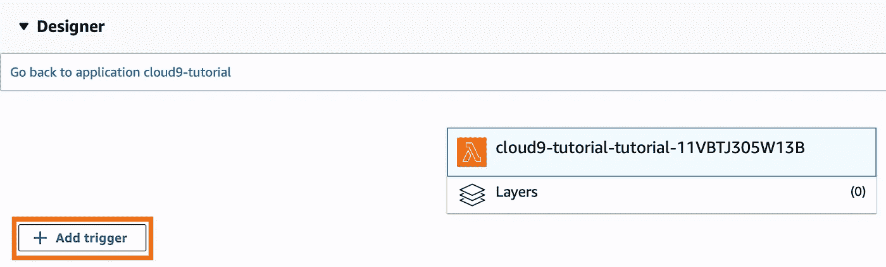

# 如何在 Cloud9 中创建 AWS Lambda 函数

> 原文：<https://medium.com/analytics-vidhya/how-to-create-an-aws-lambda-function-in-cloud9-86255e456747?source=collection_archive---------2----------------------->

## 初学者指南帮助您入门


Gian D. 在 [Unsplash](https://unsplash.com?utm_source=medium&utm_medium=referral) 上拍摄的照片

[**AWS Cloud9**](https://docs.aws.amazon.com/cloud9/latest/user-guide/welcome.html) **是一款** [**IDE**](https://en.wikipedia.org/wiki/Integrated_development_environment) ，支持多种编程语言，运行时调试器，内置终端。它包含一组工具，您可以使用这些工具来编码、构建和帮助您将软件发布到云中。

您可以从 Cloud9 创建一个 **Lambda 函数，并部署到 [AWS Lambda](https://docs.aws.amazon.com/lambda/latest/dg/welcome.html) 。 **AWS Lambda** 是一项计算服务，它让你无需供应或管理服务器就能运行代码。它只在需要的时候执行你的代码，并且自动伸缩，从每天几个请求到每秒几千个请求。您只需为您消耗的计算时间付费，当您的代码不运行时，则不收费。**

如果您刚刚开始使用所有 AWS 服务，希望您会发现这很有帮助！在本文的大部分时间里，我将介绍 AWS 上的 Cloud9 设置，然后简要概述 AWS Lambda。

**这篇文章涵盖了什么:**

*   如何创建 Cloud9 环境
*   如何从 Cloud9 创建 Lambda 函数
*   云的基础知识 9
*   使用 AWS Lambda 中的 Lambda 函数
*   什么是事件触发器以及如何使用它

## 创建云 9 环境

进入[主页](https://aws.amazon.com/cloud9/)点击橙色框**创建环境**。


现在，您需要为您的环境提供一个名称和描述。然后点击**下一步**。


在**环境设置中**保持一切不变，除了**平台**。改成 **Ubuntu Server 18.04 LTS** 。然后点击**下一步**。


检查您的环境名称和设置。如果设置正确，点击**创建环境**。


您必须等到您的环境创建完毕。当环境准备好时，我们将创建一个 Lambda 函数。

## 在 Cloud9 中创建 Lambda 函数

当您的环境创建完成后，一个**欢迎标签**将会打开。点击**创建 Lambda 函数…** 继续。


您也可以通过点击右侧的 **AWS 资源**选项卡来创建一个 Lambda 函数。然后点击**λ+符号**创建函数。您可以创建任意多个，您将在**本地功能**下看到它们的列表。


给你的函数起个名字，然后点击**下一步**。
**注** : **应用名称**自动填充您输入的**功能名称**。


**选择运行时**到 **Python 3.6** 点击**空-python** 。点击下一个的**。**


不要改变**功能触发**，点击**下一个**。
**注意**:如果你知道自己在做什么，你可以改变这一点。


不要改变这里的任何设置，点击**下一步**。
**注**:对于**内存(MB)** ，选择该功能将使用的内存量，以兆字节为单位。为了获得更多的计算能力，增加**内存(MB)** 。🤑


查看你的 Lambda 函数设置，点击**完成**。


现在你已经在 **AWS Cloud9** 中创建了一个 Lambda 函数。我们将继续学习 **Cloud9** 的基础知识。

## 云 9 基础知识

接下来的部分将向您展示如何在您的环境中导航和测试一个功能。
在您的 Cloud9 环境的左侧，您可以查看文件夹结构。`Tutorial`文件夹是你的 Cloud9 环境文件夹。`tutorial`文件夹是 lambda 函数文件所在的位置。如果你点击`lambda_function.py`，它会打开，你可以编辑你的功能。在[虚拟](https://docs.python.org/3/library/venv.html)环境中`pip install`时，`venv`文件夹是存储依赖项的地方。


让我们`pip install numpy`在我们的 Lambda 函数环境中。右击`tutorial`，点击`Open Terminal Here`。
**注意**:这只是一个演示，不会在函数中用到。


它将在`lambda_function.py`旁边打开一个新标签。
**注意**:如果`(venv)`在生产线前面，您正在使用您的虚拟环境。👍🏼

```
# to enable our virtual env
source vent/bin/activate# checking dependencies installed already
pip freeze# installing numpy in venv environment 
pip install numpy# checking if numpy version installed correctly
pip freeze
```


现在您知道了如何在您的虚拟环境中安装包。
**注意**:注意包装的尺寸。Lambda 函数部署大小限制为 250MB。

下面的代码是我们将要使用的 lambda 函数。复制并粘贴到你的`lambda_function.py`中。

```
import numpy as npdef math(a, b):
    add = a + b
    sub = a - b
    mul = a * b
    div = a / b
    return print("add:", add, "\nsub:", sub, "\nmul:", mul, "\ndiv:", div)def lambda_handler(event, context):
    math(3,2)
    return 'You did it! :)'
```

**保存文件(** cmd+s **)** 并按页面顶部中间的**运行**。然后右边会出现一个侧窗。点击**运行**测试您的功能。


点击**运行**后，等待并检查您的结果。你应该得到同样的结果。重要的是要看**所用的最大内存**和**时间**。
**注意**:运行 lambda 函数时的一些失败可能是超时问题。要修复它，您需要右键单击右边的函数，然后单击**编辑配置**。(最多 15 分钟)你不应该遇到上述代码的问题。


我们有一个有效的 Lambda 函数，我们应该部署它。在右侧打开 **AWS 资源选项卡**。右击你的 lambda 函数`tutorial`，点击**部署**。现在，等待加载符号消失，以了解它已成功完成部署。如果部署失败，将会出现一个弹出窗口。


现在我们可以继续在 **AWS Lambda** 上测试功能了。

## 在 AWS Lambda 中使用函数

从控制台转到 **AWS Lambda** 。在右侧点击**功能**，您会看到一个功能列表。找到以`cloud9-yourfunctionname-yourfunctionname-letters&numbers`开头的函数名并点击它。


您所在页面是特定的 Lambda 函数仪表板。向右上方点击**选择一个测试事件**，然后点击**配置测试事件。**


我们将通过创建一个测试事件来测试 lambda 函数。点击**创建新的测试事件**并将**事件名称**更改为您想要的任何名称。在代码块中，我们只需要一个开和闭的花括号。然后点击**创建**。


选择您的**测试事件**并点击**测试**。


如果你做的一切都正确，你应该得到同样的绿色结果。否则，请阅读您的错误并尝试调试。您也可以重新开始本教程。:)


重要的是要看**持续时间**来检查执行你的函数需要多长时间。**账单时长**为账单信息。**日志输出**查看您的结果或错误信息。

我们能够从 AWS Lambda 测试您的 Cloud9 Lambda 功能。:)

## 事件触发器

要执行 lambda 函数，必须发生一个事件。您可以设置一个按时间间隔执行触发器。这就是我要展示的例子。

在你的 lambda 函数仪表盘中，点击 **+添加触发器**，选择 **CloudWatch Events** 。



对于**规则**，选择**创建新规则。给你的规则起一个你喜欢的名字。给你的规则一个简短的描述。为**规则类型**选择**调度表达式**。在**时间表表达式*** 字段中输入**速率(5 分钟)**，这将每 5 分钟触发一次功能。勾选**启用触发器**，然后点击**添加**按钮。**

**注**:这里是进度[表达式](https://docs.aws.amazon.com/AmazonCloudWatch/latest/events/ScheduledEvents.html)的列表。


您已经创建了一个触发器，现在您可以单击触发器`CloudWatch Events`来查看更多详细信息。 **CloudWatch 事件**将在下方显示规则名称，您可以启用/禁用触发器。您也可以删除触发器。


现在您知道了如何创建一个简单触发器，该触发器在特定的时间间隔执行。🕒

教程结束！现在，您可以在 cloud9 环境中创建一个 Lambda 函数，并设置一个简单的时间事件触发器。确保删除您的环境和 lambda 函数，以免增加您的账单。希望这篇介绍性文章能让使用 AWS 服务变得更容易，并且您可以继续学习 AWS。如有任何问题或错误，请联系我们解决。😉

这篇文章最终将成为我和我的团队在从事一个名为 Cryptolytic 的项目时所学到的经验的系列文章的一部分(文章将很快写出来并链接到这里)。这是我们在进行项目时希望拥有的指南。


**包含本文中使用的所有代码的笔记本可以在这里**[](https://github.com/Cryptolytic-app/cryptolytic/tree/master/medium_articles)****找到，这是我们的密码破解项目的回购文件中的内容——所以如果你很好奇，可以去看看！****

****在 Twitter [@malexmad](https://twitter.com/malexmad) ， [Github](https://github.com/malexmad) 上找我，或者在 [LinkedIn](https://www.linkedin.com/in/marvin-davila/) 上联系我！****

****来源:****

****[](https://docs.aws.amazon.com/cloud9/latest/user-guide/welcome.html) [## 什么是 AWS Cloud9？

### AWS Cloud9 是一个集成开发环境，简称 IDE。AWS Cloud9 IDE 提供了丰富的代码编辑体验…

docs.aws.amazon.com](https://docs.aws.amazon.com/cloud9/latest/user-guide/welcome.html) [](https://docs.aws.amazon.com/lambda/latest/dg/welcome.html) [## 什么是 AWS Lambda？

### AWS Lambda 是一项计算服务，使您可以轻松构建应用程序，快速响应新的…

docs.aws.amazon.com](https://docs.aws.amazon.com/lambda/latest/dg/welcome.html) [](https://github.com/Cryptolytic-app/cryptolytics) [## 密码破解-app/密码破解

### 你可以在 Cryptolytic 找到这个项目。Trello 板产品 Canvas Cryptolytic 是一个为初学者修修补补的平台…

github.com](https://github.com/Cryptolytic-app/cryptolytics) [](https://en.wikipedia.org/wiki/Integrated_development_environment) [## 集成开发环境

### 集成开发环境(IDE)是一个软件应用程序，它提供了全面的工具来…

en.wikipedia.org](https://en.wikipedia.org/wiki/Integrated_development_environment)****