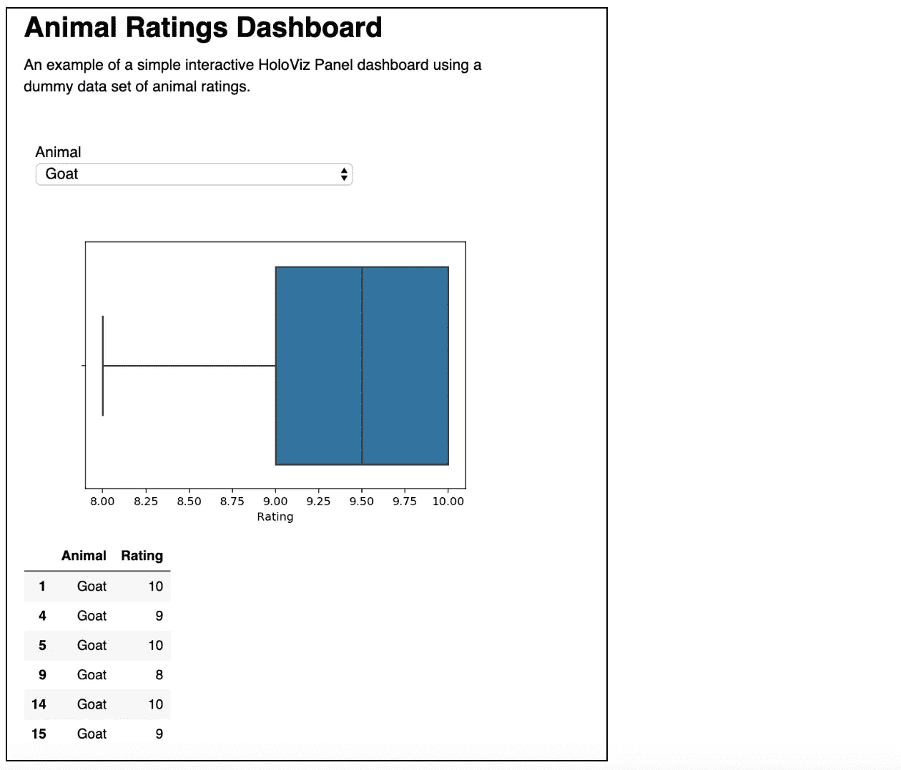
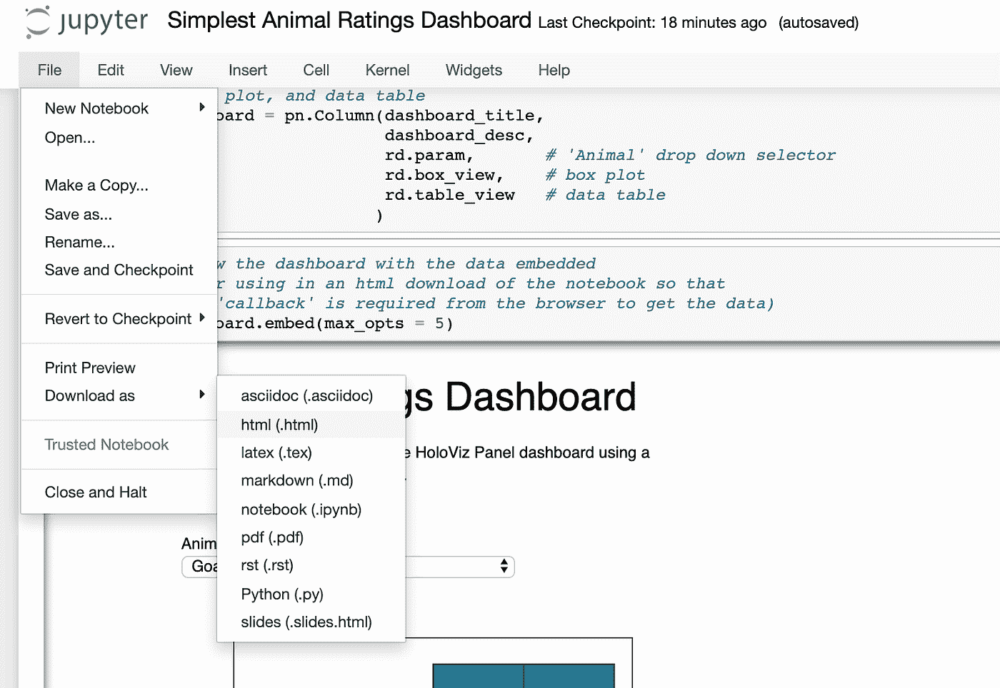

# 如何使用 HoloViz 面板在 Python 中创建交互式仪表板

> 原文：<https://medium.com/analytics-vidhya/how-to-create-an-interactive-dashboard-in-python-using-holoviz-panel-2de350b6d8df?source=collection_archive---------2----------------------->

多亏了来自 [HoloViz](https://holoviz.org/index.html) (以前的 PyViz)的[面板](https://panel.pyviz.org/)库，现在用 Python 创建一个绘图的交互式仪表板相对简单，类似于一个 R [闪亮的](https://shiny.rstudio.com/)应用。这是一个简短的示例教程，带你浏览一个在 [Jupyter 笔记本](https://jupyter.org/)中创建的非常基本的仪表板。

使用动物评级数据的小型虚拟数据集，[交互式仪表板](https://foxnic.github.io/simple_dashboard.html)将允许用户选择一种动物，并查看该动物评级的方框图&数据表。



我不打算花太多时间解释单独的代码行或强调机制，因为我的意图是提供一个非常快速和简单的端到端可部署的示例，可以通过复制粘贴来帮助您开始，而不是在您可能还不感兴趣的抽象细节中陷入困境和困惑。然后，您可以通过使用这个示例代码并使用 HoloViz 文档和其他教程对其进行改进来积累您的知识。

# **库和设置**


许多 python 用户将习惯于使用 pandas、matplotlib 和 seaborn，但是交互式仪表盘的新元素是:

`import param`

`import panel`

`pn.extension()`

如果你以前没有使用过，你可能需要安装它们。

# **数据**


上面的代码创建了一个简单的 2 列(动物和评级)熊猫数据框，包含 5 种动物(猪、山羊、绵羊、青蛙、章鱼)的 23 个评级。

# **仪表板元素的类别**

创建仪表板的第一步是创建一个包含将出现在仪表板中的数据元素的类。在这种情况下，元素是:

*   “动物”下拉菜单允许用户选择动物
*   包含所选动物评级的数据子集
*   所选动物评级的 seaborn 箱线图(使用数据子集)
*   所选动物的数据表输出(使用数据子集)

这个类你喜欢叫什么都可以。我把它叫做*评级仪表板*。一个更有意义的名字如 *DashboardDataElements* 可能更有代表性，但这是一个相当长的名字。仪表板将包含该类中定义的 4 个以上的内容，但其他内容不是特定于数据的(例如仪表板标题和描述)，因此稍后将在该类之外定义。

需要注意的是，任何图在返回之前都应该关闭。例如:

`plt.close()`

如果您忘记了这一步，那么当用户在下拉菜单中选择不同的动物时，情节可能不会更新。

此外，应该返回绘图的图形(不是轴)。例如:

`return ax.figure`正确

显示仪表板时,`return ax`不会显示绘图。(我经历了惨痛的教训，不得不[在 StackOverflow](https://stackoverflow.com/questions/59610517/why-is-holoviz-panel-showing-text-instead-of-seaborn-plot) 上发帖解决这个问题。)


# **创建类实例**

下一步是创建类的实例。我把它叫做' ***rd*** '。这将在下一步中用于在定义仪表板布局时访问类中与数据相关的元素。


# **定义仪表板布局&内容**


**pn。列**只是这样做的一种方式。如果你想探索更多的布局，还有 **pn。排**， **pn。标签**等。我想在这个初学者教程中保持简单，所以选择了一个单独的列，这也有一个额外的好处，即仪表板在移动设备上更可读。

# **在笔记本中显示仪表盘**

显示此仪表板的最简单方法是键入其名称，就像您对数据框或其他变量所做的那样:

`dashboard`

如果您只是为自己和/或其他 Jupyter 笔记本用户创建仪表板，那么您可以就此打住。这将允许您查看仪表板并与之交互，以检查它是否在工作。但是，如果您想与他人共享仪表板，也许是通过 html 页面，那么将数据嵌入仪表板是实现这一点的一种方法…

# 显示嵌入数据的仪表板

使用仪表板**。embed()** 将数据嵌入仪表板。我是这样使用的:


这将在笔记本中显示仪表板，就像调用“仪表板”变量一样。但是，这样做的好处是，当您下载 html 格式的笔记本并查看 html 文件中的仪表板时，从下拉列表中选择另一种动物将会更新情节，并且不需要调用任何“后端”来获取情节数据。

使用`max_opts = 5`,以便所有 5 种动物在下拉小部件中都可用。如果没有定义这个参数，并且括号是空的，那么将使用默认值 3，并且只有 3 种动物可以从下拉列表中选择。由于数据是嵌入的，因此默认值可能是低的，这是出于性能原因。有关此功能及其参数的更多信息，请参见用户指南的“[部署和导出”](https://panel.pyviz.org/user_guide/Deploy_and_Export.html)部分。

# **以 HTML 格式下载**

要将仪表板下载到 html 文件，请转到 ***文件*** > ***下载为***>***html***



保存 html 文件，并通过在浏览器中打开 html 文件来查看仪表板。我将仪表板的 html 版本添加到我的网站上的“[项目](https://foxnic.github.io/projects.html)”页面，使其公开可用，该网站在 GitHub 上免费托管，但这当然不是唯一的选择。

# **添加显示代码/隐藏代码按钮**

当您共享笔记本的 html 版本时，它将显示代码和仪表板。如果你想在默认情况下隐藏代码，但是让用户可以查看代码，那么你可以添加一个带有 JavaScript 的**显示代码/隐藏代码**按钮。


要添加此按钮并在默认情况下隐藏代码，请在笔记本中创建两个新单元格，一个在顶部(第一个单元格)，一个在底部(最后一个单元格)，并将两个单元格的类型都设置为' **Raw NBConvert** ':


在顶部单元格中，复制粘贴以下代码:

```
<!–– Hide code cells and show a button to allow user to show/hide code cells ––!>
<script>
  function code_toggle() {
    if (code_shown){
      $('div.input').hide('500');
      $('#toggleButton').val('Show Code')
    } else {
      $('div.input').show('500');
      $('#toggleButton').val('Hide Code')
    }
    code_shown = !code_shown
  } 

  $( document ).ready(function(){
    code_shown=false; 
    $('div.input').hide()
  });
</script>
<form action="javascript:code_toggle()"><input type="submit" id="toggleButton" value="Show Code"></form>
```

在底部单元格中，复制粘贴以下内容:

```
<!–– Hide JupyterNotebook cell numbers etc ––!>
<script>
  $(document).ready(function(){
    $('div.prompt').hide();
    $('div.back-to-top').hide();
    $('nav#menubar').hide();
    $('.breadcrumb').hide();
    $('.hidden-print').hide();
  });
</script><footer id="attribution" style="float:right; color:#999; background:#fff;">
Attribution: Created with Jupyter. Code toggle possible thanks to github.com/csaid.
</footer>
```

这包括创建这段代码的人(Chris Said)的 GitHub 账户。

就是这样！这就是创建交互式仪表板并将其部署为 html 所需的全部内容！如果你想添加另一个情节，你只需要:

*   以与现有图相同的方式将其添加到**类**
*   添加到 ***dashboard = pn 中。列(…)*** 代码在你希望它显示的位置

…只要情节使用基于所选动物的代码子集，每当您选择新动物时，新情节也会与原始情节一起更新。

# **完整的代码和仪表板**

完整的代码和仪表盘可以在 https://foxnic.github.io/simple_dashboard.html[的](https://foxnic.github.io/simple_dashboard.html)查看

我创建的其他 python(和 R)代码示例在我的[项目](https://foxnic.github.io/projects.html)页面上。

# 更多示例和教程

HoloViz Panel 网站包含一个带有代码的示例库，以及一个[入门指南](https://panel.pyviz.org/getting_started/index.html)和[用户指南](https://panel.pyviz.org/user_guide/index.html)，其中包括一个关于如何[定制](https://panel.pyviz.org/user_guide/Customization.html)仪表盘风格的部分。

我是通过以下 YouTube 视频发现这一功能的:

*   [将任何笔记本电脑变成可部署的仪表板](https://youtu.be/L91rd1D6XTA)(詹姆斯·贝德纳尔的约 30 分钟 SciPy 2019 演讲)
*   [轻松可视化任何数据，从笔记本到仪表盘](https://youtu.be/7deGS4IPAQ0)(约 3 小时的 ScipPy 2019 教程，由 James Bednar 编写)