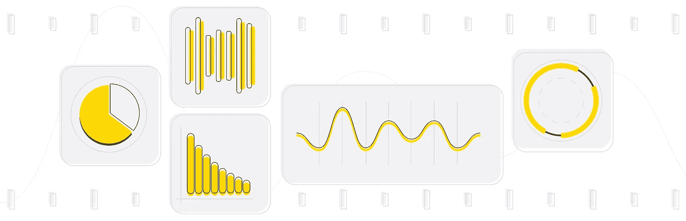
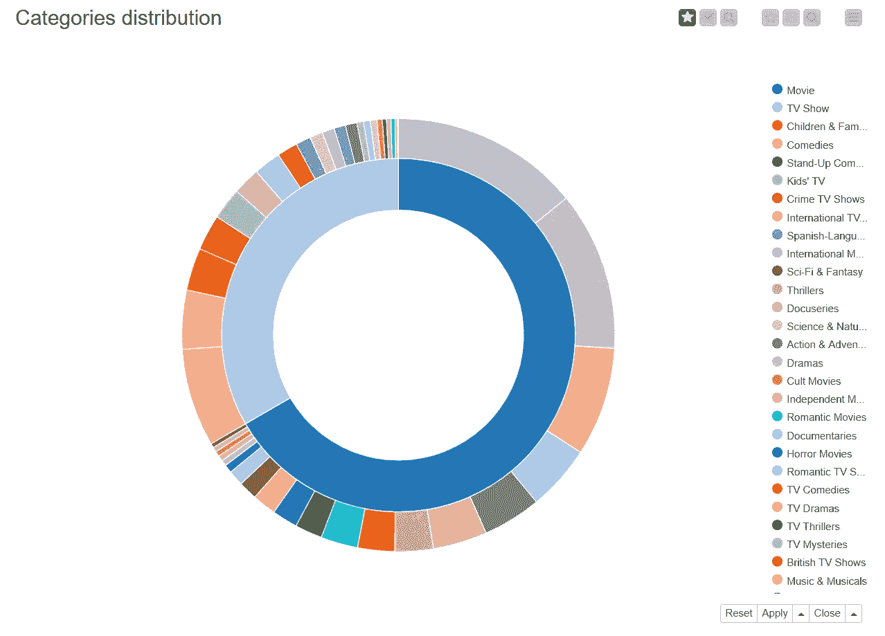
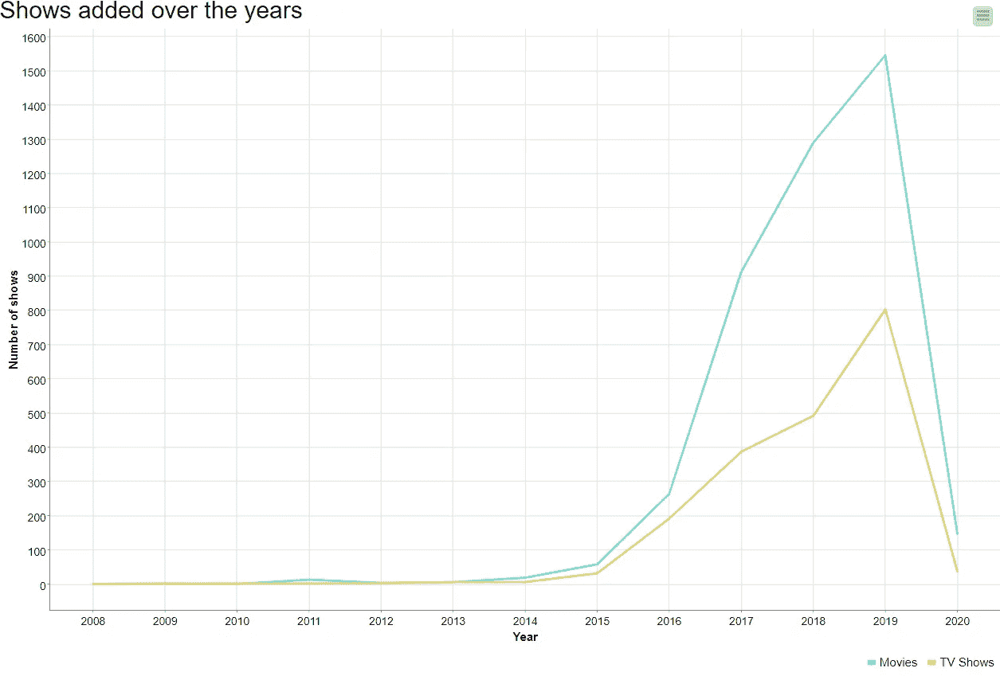
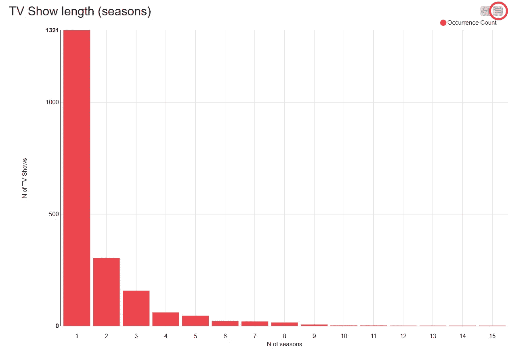
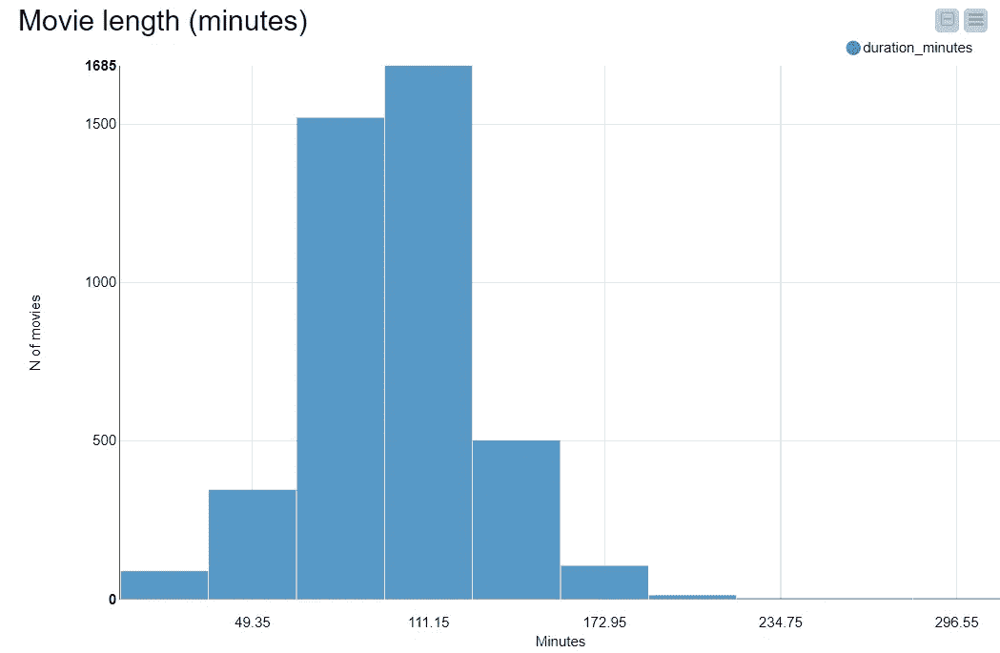
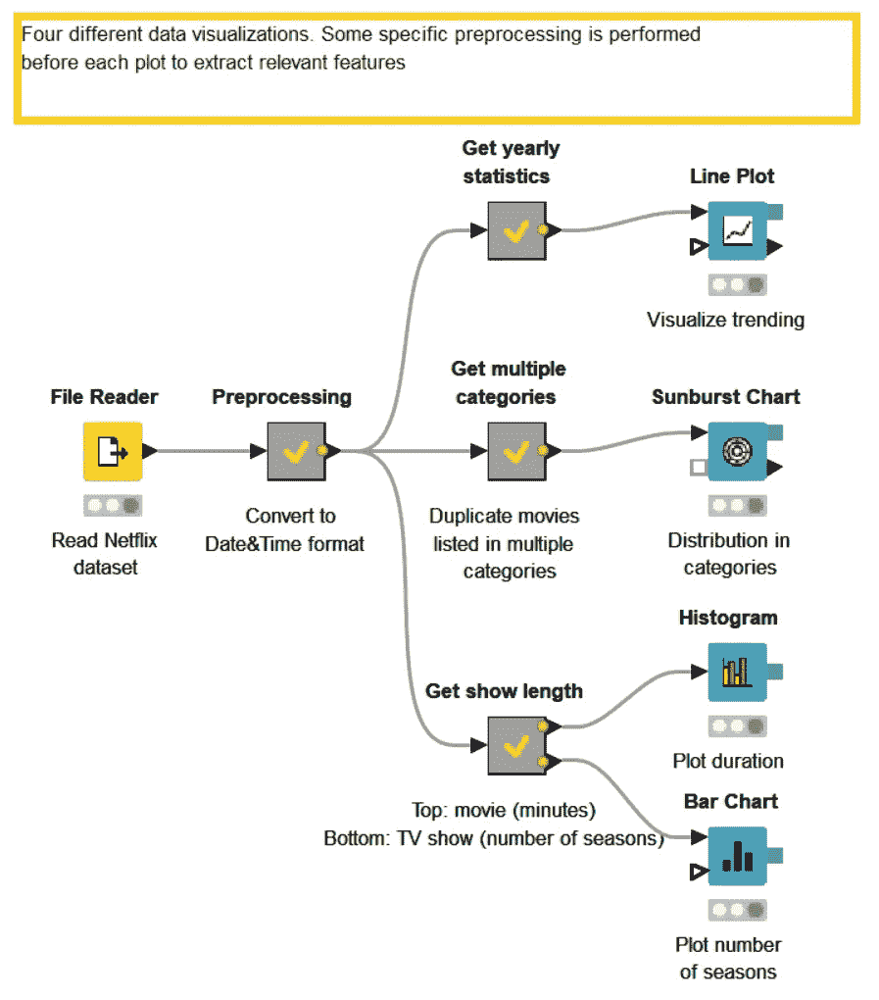
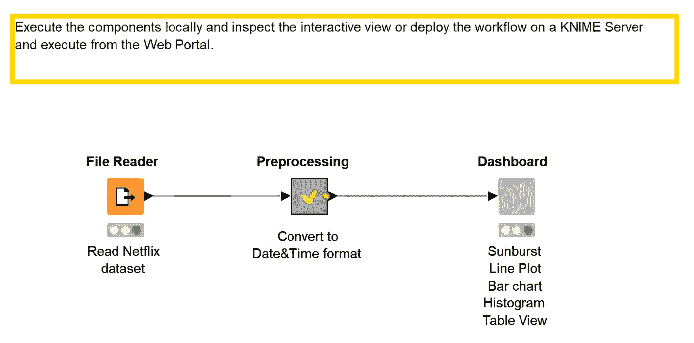
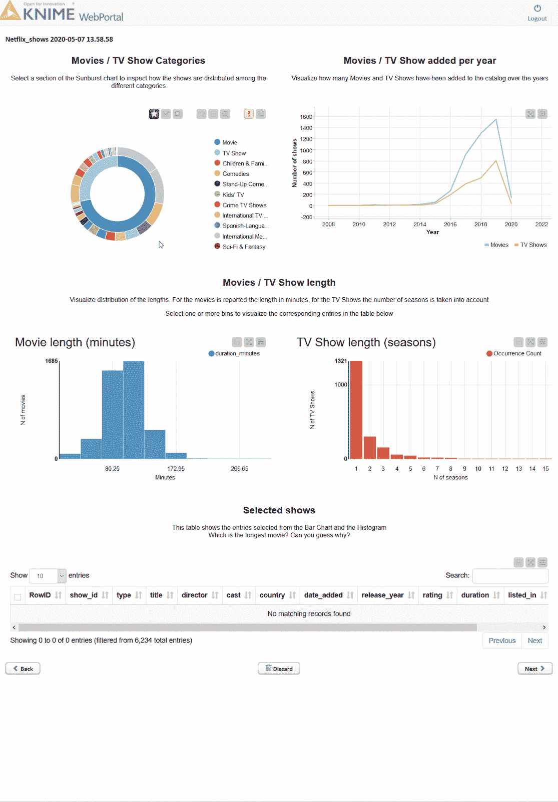
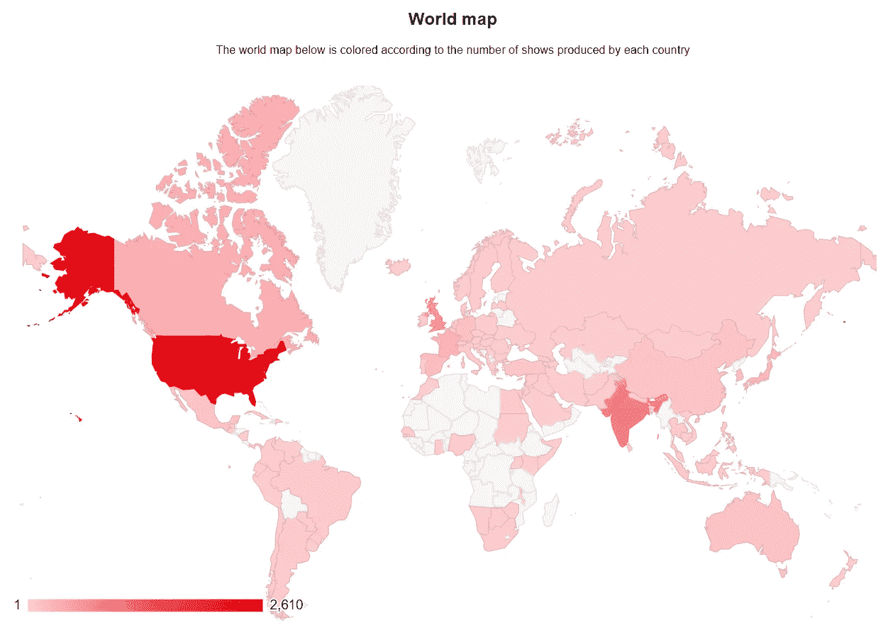
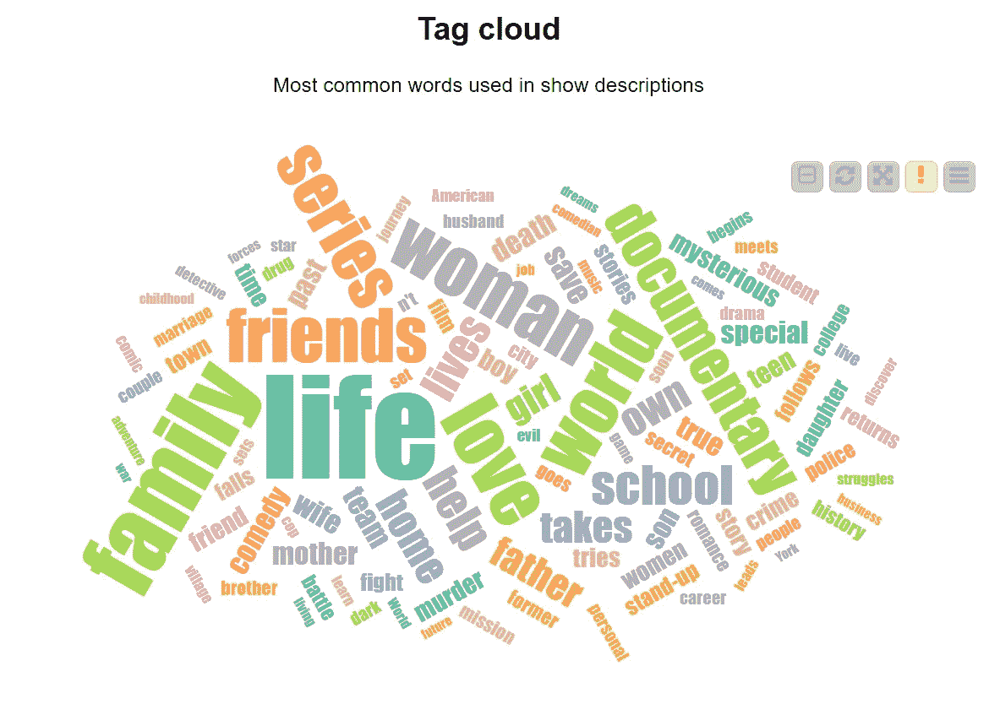

# 使用 KNIME 分析平台，通过三个步骤创建交互式仪表板

> 原文：<https://medium.com/analytics-vidhya/how-to-create-an-interactive-dashboard-in-three-steps-with-knime-analytics-platform-caa4785b5aac?source=collection_archive---------10----------------------->

*作者:***(KNIME)**

**转自 KNIME 博客:*[*https://www . KNIME . com/Blog/how-to-create-an-interactive-dashboard-in-three-steps-with-KNIME*](https://www.knime.com/blog/how-to-create-an-interactive-dashboard-in-three-steps-with-knime)*

**

*每个人都喜欢图表、图形…可视化！它们整洁、快速、简单。即使是杂乱无章的数据，良好的可视化也是展示难以在原始表格上指出的见解和特征的关键。在这篇博文中，我将向你展示如何用三个简单的步骤构建一个简单、有用且美观的仪表板来展示你的数据！*

*   *第一步:创建一些漂亮的图表*
*   *第二步:将它们包装成一个组件*
*   *步骤 3:将交互式视图部署为网页*

# *数据集*

*在这篇博文中，我们将深入研究 Kaggle 上免费提供的[网飞电影和电视节目数据集](https://www.kaggle.com/shivamb/netflix-shows)。它包含截至 2020 年 1 月流媒体平台在美国提供的所有节目。每个条目都带有节目的标题，无论是电影还是电视节目，导演和演员，国家和生产年份，添加到目录的日期，持续时间和类别以及简短描述。足够的信息拉出一些有趣的可视化！*

# *步骤 0:导入和预处理数据*

*您可以直接从 [Kaggle 页面](https://www.kaggle.com/shivamb/netflix-shows)下载数据集。在您的机器上，通过拖放将数据导入到新的工作流程中。正如经常发生的那样，需要进行一些预处理。检查原始数据，我们可以看到 *date_added* 列有一个冗长的格式，很难处理。因此，我将它转换为 Date &时间格式，并将预处理元节点中的所有步骤分组。为这篇博文开发的工作流程可以在 KNIME Hub 上找到，也可以在这里下载，[分三步创建一个交互式仪表盘:网飞数据集](https://kni.me/w/yK3enSZA775rBPCw)。将它导入到 KNIME Analytics 平台后，您可以更详细地查看 metanode“预处理”的内容。*

# *第一步:创建一些漂亮的图表*

*有两种人:看网飞的人和说谎的人。但是我们也可以把人群分成两个不同的类别:电影人和电视剧人！*

*另外，我们知道有多少电影和电视剧是关于网飞的吗？哪一个是最受欢迎的类别？最长的电影有多长？有了正确的图表，这是很快说。*

*例如，一张**旭日图**(图 1)可以很容易地指出节目在类别中的分布情况。将 Sunburst 图表节点附加到预处理元节点，将其配置为首先按类型(电影或电视节目)分组，然后按类别分组，并执行它。现在，右键单击旭日图节点，选择“交互视图:旭日图”。将弹出图 1 所示的视图:我们可以看到电影比电视节目多一倍，最常见的类别是国际、戏剧和喜剧。你知道吗？*

**

*图一。旭日图:提供的电影数量是电视剧的两倍。将鼠标悬停在图表的一部分上以显示百分比。*

*我们可以探索的另一个方面是这些年来目录的演变:我按照*年增加的*列对节目进行分组，并在**线图**上显示结果(图 2)。很明显，增加的作品数量每年都在增加:在 2020 年的第一个月，网飞已经增加了比 2015 年全年还多的节目！*

**

*图二。显示多年来添加到网飞目录中的电影和电视剧数量的折线图。*

*然后我构建了一个**条形图**(图 3)来可视化电视节目制作的季数，以及一个**直方图**(图 4)来按时长对电影进行分组。你预料到这么多电视剧只剩下一季了吗？你知道有超过 4 小时的电影吗？*

**

*图 3。显示电视节目季数的条形图。*

**

*图 4。根据影片持续时间对影片进行分组的直方图。*

*在 KNIME Analytics 平台中有很多数据可视化的机会。您可以在 Node Repository > Views-> Javascript 中找到专用节点，甚至可以使用[通用 Javascript 视图](https://kni.me/n/YQOLY5hCc4m9Opmd)节点构建自己的可视化。*

*如果你的想象力不够，那么 [EXAMPLES Server](https://hub.knime.com/knime/spaces/Examples/latest/03_Visualization/02_JavaScript/) 上有一个完整的工作流选择，充满了有用的可视化，你可以很容易地重新适应你的需求。*

*图表也可以自定义！请看图 3 中的条形图，我将默认的蓝色改为了官方的网飞红色。*

**

*图 5。这是执行这些可视化的工作流的屏幕截图。与每个可视化相关的预处理被分组到元节点中。*

*从 KNIME Hub 下载并亲自尝试这个名为“[分三步创建一个交互式仪表盘:网飞展示”的工作流程。](https://kni.me/w/yK3enSZA775rBPCw)*

*所有制作的图表和绘图都是交互式的。您可以通过点击右上角的设置图标(在图 3 中用红色圈出),直接从交互视图中更改可视化数据、绘图属性、所选点等。要进行更深入的定制，请查看指南，该指南展示了[如何集成 CSS 代码](https://docs.knime.com/latest/analytics_platform_css_guide/index.html)以使您的 JavaScript 可视化效果大放异彩。*

# *第二步:将它们包装成一个组件*

*如果一块地很好…两块地更好！让我们在一个完整的仪表板中组织所有精彩的图形。选择用于可视化的所有四个节点，并右键单击-->“创建组件…”。这创建了一个新的灰色节点:[组件](https://www.knime.com/blog/knime-analytics-platform-40-components-are-for-sharing)。*

**

*图 6。最终的工作流程。所有可视化节点都已被分组到一个组件中。*

*这种集合可视化也可以被丰富和定制。CTRL +双击组件将其打开。添加一个文本输出小部件节点，然后输入要添加到可视化效果中的描述。*

*我们可以使仪表板更具交互性，例如添加一个供选择的表视图节点。我将它设置为只显示在直方图和条形图中选择的节目。*

*这是检查不同箱子内容的好方法。*

*例如，你知道哪部关于网飞的电影最长吗？打开组件的交互视图，选择最后一个直方图仓(只包含一部电影),并查看表格视图。如果你听说过那部电影，你很容易想象为什么它会持续这么久！*

*现在是时候整理我们的仪表板了，让它更整洁，更容易理解。在组件内部，单击工具栏的最后一个图标(参见图 7 中的屏幕截图),打开节点使用和布局窗口。您可以在这里排列图表、设置位置、尺寸和创建组。如果您已经创建了嵌套组件，它将作为一个分组的可视化来处理。*

**

*图 7。打开“节点使用和布局”窗口来组织您的仪表板。*

# *步骤 3:将交互式视图部署为网页*

*您还可以在 web 浏览器中以网页的形式检查组件的交互视图。要执行这个操作，您需要使用一键部署将工作流部署到一个 KNIME 服务器实例。为此，请转到 KNIME Explorer 面板，右键单击您的工作流并选择“部署到服务器…”。现在选择所需的目的地，然后单击确定。*

*要显示仪表板，请右键单击上传的工作流，然后选择“打开”->“在 Web 门户中”。您的浏览器将允许您执行工作流并可视化由组件构建的仪表板(图 8)。*

# *摘要*

*在这篇博文中，我们发现在 KNIME Analytics Platform 中为您的数据创建一个交互式仪表板是多么简单。设置您的图表，将节点打包成一个组件，并根据需要进行定制，在本地或在 KNIME WebPortal 上执行，并使用您的可视化。易如反掌！*

**

*图 8。这是显示在 KNIME 门户网站上的仪表板可视化。*

*想要更多的可视化？这里有一些你可以轻松实现的更高级的想法。你会在 KNIME Hub 上的示例工作流的更高级版本中找到这些可视化:[https://kni.me/w/grHmwo1F0xiQPdO7](https://kni.me/w/grHmwo1F0xiQPdO7)*

**

*图 9。显示每个国家制作的电影的世界地图。*

**

*图 10。显示节目描述中使用最多的词语的标签云。*

# *资源*

*本文中展示的工作流都可以下载并在 KNIME Hub 上试用:*

*   *[分三步创建交互式仪表盘:网飞展示](https://kni.me/w/yK3enSZA775rBPCw)*
*   *[分三步创建交互式仪表盘:网飞秀(高级)](https://kni.me/w/grHmwo1F0xiQPdO7)*