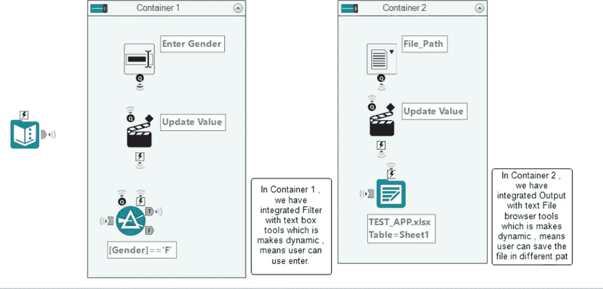
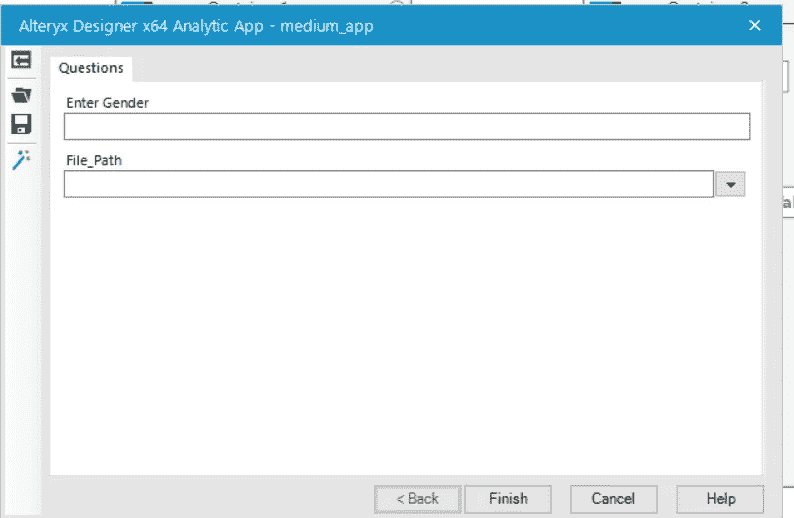

# 如何在 Alteryx 中创建分析应用程序

> 原文：<https://medium.com/analytics-vidhya/how-to-create-analytics-app-in-alteryx-1bcc7beb1d6a?source=collection_archive---------7----------------------->

创建应用程序的简单工作流程。

沙哈达特·拉赫曼在 [Unsplash](https://unsplash.com?utm_source=medium&utm_medium=referral) 上拍摄的照片

分析应用程序使我们能够执行您自己的数据和参数的工作流，而无需从头开始创建工作流。分析应用程序有一个扩展名为. yxwz 的文件，该文件将在 alteryx 设计器中运行，或者将其上传到公共的 Alteryx 分析图库或私人图库，然后运行它。

# 构建应用程序

应用程序由工作流组成，工作流带有使用界面工具创建的用户界面。构建工作流，添加界面工具，在界面设计器中设计界面。创建应用程序时，您正在创建应用程序用户将使用的工作流和界面。参见 [**界面工具**](https://help.alteryx.com/current/designer/understanding-interface-tools) 和 [**界面设计器窗口**](https://help.alteryx.com/current/designer/interface-designer-window) 。

您可以根据新的或现有的工作流创建应用程序。打开新的或现有的工作流，选择画布以查看工作流配置窗口。选择**工作流程、**并选择**分析应用**。

当工作流保存为 app 或 [**宏**](/analytics-vidhya/how-to-create-macros-in-alteryx-4c78c8e1d6f8) 时，工作流中工具的锚点变为闪电图标。只有接口工具可以连接到这些锚点。该锚点指示存在更新工作流工具的界面元素和操作。

# 我们开始吧

该应用程序的目标是获取基于性别的数据，用户可以输入性别 M 或 F 来获取所需的数据。

我已经使用文本输入创建了学生数据:

在工作流程中应用过滤器并使其动态化，我使用界面工具中的文本框。

现在，我们将根据用户的选择保存输出，这意味着用户可以用不同的格式和不同的路径保存文件。

完整的工作流程:

以下是输出:

在应用程序窗口中，你可以输入 M 或 F，甚至给出文件路径。

输出

# 结论

Alteryx 可以优化在 Excel 中手动编辑数据所花费的时间，并且可以将其转化为更好的分析水平。您可以创建宏和应用程序来优化这些步骤。

我希望这篇文章能帮助你并节省大量的时间。如果你有任何建议，请告诉我。

快乐学习。

***Prabhat Pathak****(*[*Linkedin 简介*](https://www.linkedin.com/in/prabhat-pathak-029b6466/) *)是助理分析师。*

照片由 [Aaron Burden](https://unsplash.com/@aaronburden?utm_source=medium&utm_medium=referral) 在 [Unsplash](https://unsplash.com?utm_source=medium&utm_medium=referral) 上拍摄