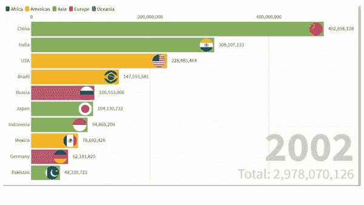

# 如何使用 Python 中的 Matplotlib 和使用 fluorescent Studio 创建条形图 Race？

> 原文：<https://medium.com/analytics-vidhya/how-to-create-bar-chart-race-using-matplotlib-in-python-and-using-flourish-studio-46e7bd986d5?source=collection_archive---------11----------------------->

Matplotlib 是一个开源库


彼得罗·马蒂亚在 [Unsplash](https://unsplash.com?utm_source=medium&utm_medium=referral) 上拍摄的照片

## 条形图比赛现在是趋势可视化的趋势之一，通过使用 Matplotlib 我们可以创建这个图表，对于非程序繁荣工作室发布的[比赛图表](https://app.flourish.studio/@flourish/bar-chart-race)，我将在后面简要介绍。


**条形图竞赛**

可从此[链接](https://drive.google.com/drive/folders/1Yy-b6ZbGnBnL_S_zOQ5xmPL9BdepxJ5D)导入的各州商品及服务税收入数据

我想知道使用 Matplotlib 在 python 中创建一个条形图会有多难，但事实证明一点也不难。

# 让我们编码

请在您的系统中安装所有相关的库

```
import matplotlib.ticker as tickerimport matplotlib.animation as animationfrom IPython.display import HTMLimport matplotlib.pyplot as pltimport pandas as pd
```

## 导入商品及服务税数据。

```
df=pd.read_excel(‘xxxxx.xlsx’,sheet_name=’xxxx’)df.head()
```


# 数据转换

```
current_year = 2019dff = (df[df[‘year’].eq(current_year)].sort_values(by=’value’, ascending=True))dff
```


# 创建基本图表

```
fig, ax = plt.subplots(figsize=(15, 8))ax.barh(dff[‘name’], dff[‘value’],color=’brown’)
```


```
fig, ax = plt.subplots(figsize=(15, 8))dff = dff[::-1] # flip values from top to bottom# pass colors values to ‘color=’ax.barh(dff[‘name’],dff[‘value’],color=’brown’)# iterate over the values to plot labels and valuesfor i, (value, name) in enumerate(zip(dff[‘value’], dff[‘name’])):ax.text(value, i, name, ha=’right’)# Add year right middle portion of canvasax.text(1, 0.4, current_year, transform=ax.transAxes, size=40, ha=’right’)
```


现在，我们只剩下图表的美化部分。

# 我们将美化以下事物:

*   更新字体大小和颜色
*   添加标题
*   格式:逗号分隔的值和轴标记
*   网格:在横条后添加线条

```
fig, ax = plt.subplots(figsize=(15, 8))def draw_barchart(year):dff = df[df[‘year’].eq(year)].sort_values(by=’value’, ascending=True)ax.clear()ax.barh(dff[‘name’], dff[‘value’],color=’brown’)dx = dff[‘value’].max() / 200for i, (value, name) in enumerate(zip(dff[‘value’], dff[‘name’])):ax.text(value-dx, i, name, size=14, weight=600, ha=’right’, va=’bottom’)# … polished stylesax.text(1, 0.4, year, transform=ax.transAxes, color=’red’, size=46, ha=’right’, weight=800)ax.text(0, 1.06, ‘revenue (cr)’, transform=ax.transAxes, size=12, color=’green’)ax.xaxis.set_major_formatter(ticker.StrMethodFormatter(‘{x:,.0f}’))ax.xaxis.set_ticks_position(‘top’)ax.tick_params(axis=’x’, colors=’red’, labelsize=12)ax.set_yticks([])ax.margins(0, 0.01)ax.grid(which=’major’, axis=’x’, linestyle=’-’)ax.set_axisbelow(True)ax.text(0, 1.12, ‘Total GST revenue state wise’,transform=ax.transAxes, size=24, weight=600, ha=’left’)ax.text(1, 0, ‘by [@prabhat](http://twitter.com/prabhat)’, transform=ax.transAxes, ha=’right’,color=’blue’, bbox=dict(facecolor=’white’, alpha=0.8, edgecolor=’red’))plt.box(False)draw_barchart(2018)
```


# 动画片

Matplotlib 的动画基类处理动画部分。它提供了一个构建动画功能的框架。有两个主要接口可以实现这一点:

[FuncAnimation](https://matplotlib.org/api/_as_gen/matplotlib.animation.FuncAnimation.html#matplotlib.animation.FuncAnimation) 通过反复调用函数 *func* 制作动画。

[ArtistAnimation](https://matplotlib.org/api/_as_gen/matplotlib.animation.ArtistAnimation.html#matplotlib.animation.ArtistAnimation) :使用一组固定艺术家对象的动画。

然而，在这两者中， **FuncAnimation** 是最方便使用的一个。你可以在[文档](http://matplotlib.sourceforge.net/api/animation_api.html)中读到更多关于它们的内容，因为我们将只关注 FuncAnimation 工具。

```
fig, ax = plt.subplots(figsize=(15, 8))animator = animation.FuncAnimation(fig, draw_barchart, frames=range(2017, 2020))HTML(animator.to_jshtml())
```

这是期望的输出。


# 条形图比赛可以创建使用蓬勃发展，以及，这基本上是为非程序员。


Anthony DELANOIX 在 [Unsplash](https://unsplash.com?utm_source=medium&utm_medium=referral) 上拍摄的照片

# 为什么要用花枝招展？

有很多专用软件可用，fluore 带有六个预装模板，用于制作交互式地图可视化。您可以在现有模板上上传数据，并轻松创建图表。

# 丰富的酒吧比赛特色

*   设置字体和颜色
*   图像:圆形或矩形
*   交互式过滤器
*   按最大或最小条形排序
*   显示累加器
*   完全移动友好



**结论**

Python 是一种非常强大的编程语言，因为它有很多库，其中之一就是可视化的 Matplotlib。尽管创建一个更加定制化的图表会非常耗时和复杂，但是在 python 中一切皆有可能。另一方面，Flourish 是一个用户友好的数据可视化平台，用于创建强大的交互式数据故事。

我希望这篇文章能帮助你并节省大量的时间。

快乐编码。


照片由[米 PHAM](https://unsplash.com/@phammi?utm_source=medium&utm_medium=referral) 在 [Unsplash](https://unsplash.com?utm_source=medium&utm_medium=referral)