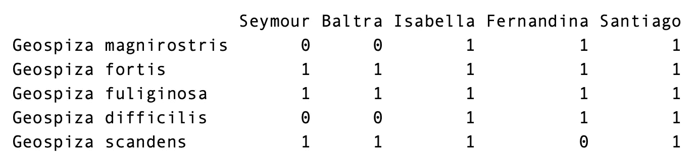

# 如何使用 R 包“cooccur”和“visNetwork”创建共现网络

> 原文：<https://medium.com/analytics-vidhya/how-to-create-co-occurrence-networks-with-the-r-packages-cooccur-and-visnetwork-f6e1ceb1c523?source=collection_archive---------2----------------------->

## 使用 R 软件包“cooccur”和“visNetwork”

共现网络是变量一起出现的频率的图形表示。它们通常用于生态学和文本挖掘，其中共现分别衡量两个物种在一个采样点出现的频率或两个单词在一个文档中出现的频率。同现网络允许我们同时检查几对同现变量。为了构建共现网络，每个变量由一个节点或点来表示。连接两个节点的边或链接表示这两个变量之间的同现。

在这里，我们将看看如何使用“cooccur”和“visNetwork”包在 R 中构建共现网络。在本例中，一条边将仅表示比使用概率模型(Veech，2013 年)偶然预期的更高或更低的同现。我们将从“共现”开始，计算统计上显著的成对共现。然后，我们将把这些结果输入“visNetwork ”,实现物种共生的网络可视化。准备好了吗弗雷迪？


Unsplash 上 rawpixel 的照片

# Finches 数据集

共现始于存在-不存在数据。换句话说，对于每个样本，每个变量是否存在？在本教程中，我们将使用“cooccur”包中的 finches 数据集。雀类数据集记录了 17 个不同采样点的 13 种雀类，其中一个物种在一个采样点的存在用 1 表示，不存在用 0 表示。我们将打印前 5 行和前 5 列，以了解它的样子。

```
library(cooccur)
library(visNetwork)# Load finches data set.
data(finches)
finches[1:5, 1:5]
```



# 共现分析

使用共现的概率模型(Veech，2013 年)， **cooccur()** 函数将计算与成对共现相关的 p 值，并返回一个“cooccur”类列表。打印这个类只返回有意义的交互。我们将存储重要的交互，以创建我们的 visNetwork 边缘列表。

```
# Find significant pairwise co-occurrences.
co <- print(cooccur(finches, spp_names = TRUE))
```


cooccur()的重要相互作用。

# 了解 cooccur 的输出

查看我们的结果，我们可以看到每一行都指定了一个重要的交互。在第一列 sp1 中，我们看到与每个相互作用的第一个物种(物种 1)相关联的数字标签。该数字标签与数据框中的物种顺序一致。例如，因为 finches 数据集中的第一行是“Geospiza magnirostris”，所以它的数字标签是 1。在第二列 sp2 中，我们找到了与物种 2 相关的数字标签。

我们可以通过两种方式将数字标签与物种名称进行匹配:1)使用数字标签和 **rownames()** 从 finches 数据框中选择相应的物种，例如 rownames(finches)[co$sp1]，或者 2)在 cooccur 函数中使用 spp_names = T。这为我们提供了两个额外的列，sp1_name 和 sp2_name，其中包含 sp1 和 sp2 的物种名称。为了再次检查这些是否给出了相同的输出，我们可以使用:

```
# Check sp1_name matches numeric label for species.
co[, ‘sp1_name’] == rownames(finches)[co$sp1]
co[, ‘sp2_name’] == rownames(finches)[co$sp2]
```

如果 sp1_name 返回您的站点名称而不是您的物种，您需要转置您的数据框并重新运行 **cooccur()** 。

p_lt 和 p_gt 列给出了我们的 p 值。如果 p_lt < 0.05, then the species pair co-occurs at a frequency *比我们预期的要低*偶然发现。如果 p_gt <为 0.05，那么这一对的同现率*比我们预期的偶然发现率*要高。因为我们只存储了重要的交互作用，所以每行的 p_lt 或 p_gt 将小于 0.05。

# **网络可视化**

现在是有趣的事情！我们将使用“visNetwork”来绘制我们的共现网络“visNetwork”在 r 中创建交互式网络可视化。 **visNetwork()** 函数有两个参数:1)描述网络中节点的数据帧，以及 2)描述网络中边的数据帧。

# 节点

我们将从节点数据框开始。至少，节点数据框需要一个 id 列来标识每个节点。我们将设置我们的 id 来匹配用 cooccur(1–13)返回的数字标签。此外，我们将通过物种名称来标记我们的节点，指定一种颜色，并添加一些深度的阴影。

```
# Create a data frame of the nodes in the network. 
nodes <- data.frame(id = 1:nrow(finches),
                    label = rownames(finches),
                    color = “#606482”,
                    shadow = TRUE) 
```


节点数据框。

# 优势

边数据框至少需要两列，“从”和“到”，这两列应与节点数据框中的 id 相对应。因为我们使用了 cooccur 的数字标签作为 id，所以我们可以使用 sp1 作为“from”列，使用“sp2”作为“to”列。(由于我们的网络不是定向的，我们可以反转这些，这没关系。)然后，我们将添加一些颜色，使我们的边与我们的节点相匹配，这样，我们将为以低于预期的频率出现的同现使用较浅的颜色，为以较高频率出现的同现使用较深的颜色。为了使“更高”和“更低”之间的区别更加明显，我们还将指定低于预期的同现用虚线表示。

```
# Create an edges dataframe from the significant pairwise co-occurrences.
edges <- data.frame(from = co$sp1, to = co$sp2,
      color = ifelse(co$p_lt <= 0.05, “#B0B2C1”, “#3C3F51”),
      dashes = ifelse(co$p_lt <= 0.05, TRUE, FALSE))
```


边缘数据框。

# 把所有的放在一起

最后，我们将使用“igraph”包中的布局来绘制网络。你不需要加载“igraph”来访问这些布局，但你可以在这里看到选项。具体来说，我们将使用 Kamada-Kawai 布局算法，但我鼓励您尝试一下这些布局，看看您最喜欢哪个。

```
# Plot.
visNetwork(nodes = nodes, edges = edges) %>%
    visIgraphLayout(layout = “layout_with_kk”)
```


雀类物种共现网络。

哦啦啦！这是一个不错的同现网络。😏你可以使用 GitHub 上的代码来生成你自己的共生网络。作为奖励，你将直接体验网络的互动性！

# 参考

阿尔曼德，B.V .，伯努瓦·蒂厄梅尔，伯努瓦&蒂托安·罗伯特(2019)。
visNetwork:使用‘vis . js’库的网络可视化。r 包
版本 2.0.8。【https://CRAN.R-project.org/package=visNetwork 

丹尼尔·m·格里菲斯、维奇、约瑟夫·a .、查尔斯·j·马什(2016)。统计软件期刊
中的概率物种共现分析，69(2)，1–17。doi:10.18637/jss.v069.c02

Veech，Joseph A. (2013)分析物种共现的概率模型。全球生态学和生物地理学，22，252–260 页。[https://doi.org/10.1111/j.1466-8238.2012.00789.x](https://doi.org/10.1111/j.1466-8238.2012.00789.x)