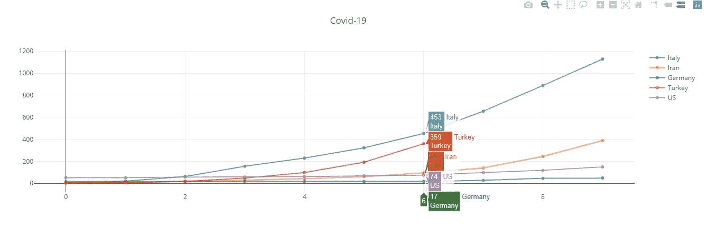
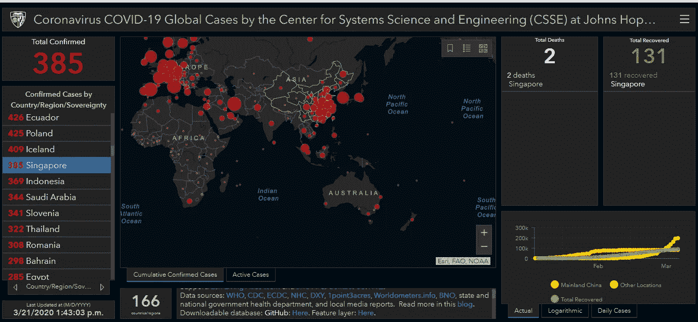
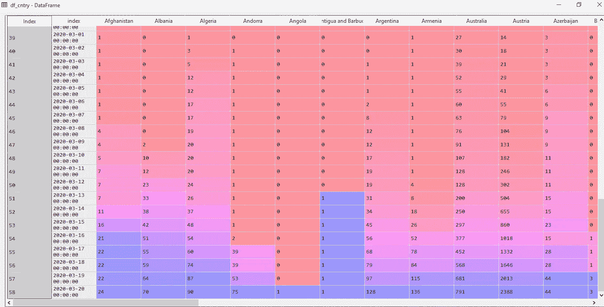
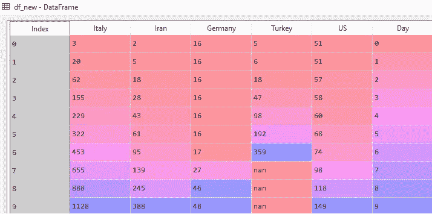
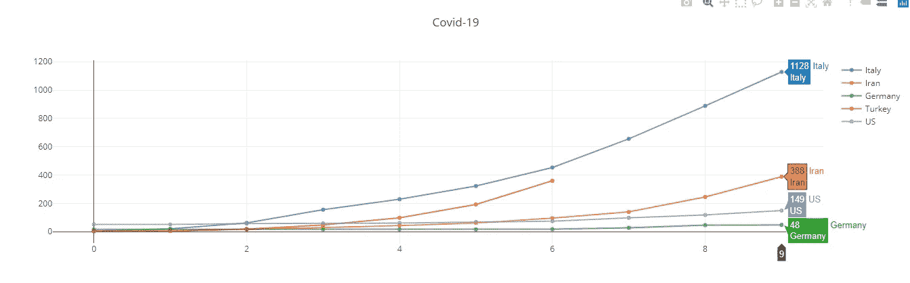

# 如何用 Python 和 Dash 创建冠状病毒 Dashboard？

> 原文：<https://medium.com/analytics-vidhya/how-to-create-coronavirus-dashboard-with-python-and-dash-cbbfe95ce5d5?source=collection_archive---------18----------------------->



案例数量与天数

冠状病毒传播是现在每个人都在谈论的话题。第一个病例出现在中国，现在它已经传播到全世界 186 个国家。不同国家的病例增长率不同。虽然像新加坡这样的国家很好地抗击了这种病毒，并保持了较低的病例数，但在像意大利这样的一些国家，病例数呈指数增长。为了比较每个国家如何对抗病毒，我用 python 创建了一个使用 pandas 和 dash 库的仪表板。在这个故事中，我将告诉你我是如何做到的。



约翰·霍普斯金大学创建的仪表板

我将使用约翰霍普金斯大学 github repo 的数据。他们每天都在更新病例和死亡人数。

现在让我们做一些编码。

首先，我们需要导入库来获取数据和绘制仪表板。

```
import dash
import dash_core_components as dcc
import dash_html_components as html
import plotly.graph_objs as go
import pandas as pd
```

您可以通过提供熊猫数据帧的 url 来读取数据，如下所示:

```
**url=”**[**https://raw.githubusercontent.com/CSSEGISandData/COVID-19/master/csse_covid_19_data/csse_covid_19_time_series/time_series_19-covid-Confirmed.csv**](https://raw.githubusercontent.com/CSSEGISandData/COVID-19/master/csse_covid_19_data/csse_covid_19_time_series/time_series_19-covid-Confirmed.csv)**"****df = pd.read_csv(url)**
```

此后，我们可以在以后很长一段时间内去掉列，因为我们的工作不需要它们。此外，我们将按国家对我们的数据进行分组。之后，我们将转置数据，使每个国家将是一列，日期将行。

```
**df = pd.read_csv(url)
df_cntry=df.groupby(“Country/Region”).sum()
df_cntry = df_cntry.drop([‘Lat’,’Long’], 1)
df_cntry=df_cntry.T 
df_cntry.reset_index(inplace=True)
df_cntry[‘index’]=df_cntry[‘index’].apply(pd.to_datetime)**
```



删除 last、long 并转置数据帧后，数据帧如下所示。

现在我们需要检查发现病例的第一天。

新冠肺炎病例首次在以下国家出现的日期如下:

意大利:2010 年 1 月 31 日，伊朗:2010 年 2 月 18 日，德国:2010 年 1 月 26 日，土耳其:2010 年 3 月 13 日，美国:2010 年 2 月 23 日

我们将在字典中定义这些日期:

```
**firstday_cntry={‘Italy’:”2/19/20",’Iran’:”2/18/20",’Germany’:”2/18/20",’Turkey’:”3/13/20",’US’:”2/23/20"}
cntry_names=firstday_cntry.keys()**
```

现在我们将得到一个国家第一次约会后的病例数。为此，我们将在下面创建一个名为“df_new”的新数据帧。

```
**numbers=[]****for i in range(45):
    numbers.append(i)****new_numbers=[]****for k,v in firstday_cntry.items():
    new_numbers.append(df_cntry[df_cntry[‘index’]>v][k].tolist())****df_new = pd.DataFrame(new_numbers)
df_new = df_new.T
df_new.columns = cntry_names
df_new[‘Day’] = pd.Series(numbers)**
```



这些数字显示了自第一例病例以来每个国家的病例数。例如，土耳其在 7 天前发现了第一例，因此第 7 行后的值将为“nan”。

现在是时候创建 dashbord 了。为了创建 dashboard，我们将使用 for 循环创建两个名为 labels 和 traces 的字典。

```
**external_stylesheets = [‘**[**https://codepen.io/chriddyp/pen/bWLwgP.css'**](https://codepen.io/chriddyp/pen/bWLwgP.css')**]****app = dash.Dash(__name__, external_stylesheets=external_stylesheets)****traces = []
labels=[]****for i in cntry_names:
    traces.append(dict(
    x = df_new[‘Day’],
    y = df_new[i],
    text = i,
    opacity=0.7,
    name=i
 ))

 labels.append(dict({ ‘label’ : i, ‘value’ : i} ))**
```

我们准备启动我们的仪表板。使用下面的代码，我们可以启动它。在您的浏览器上进入“ [http://127.0.0.1:8050/](http://127.0.0.1:8050/) ”，您将看到仪表盘。

```
**app.layout = html.Div([
 html.Div(****dcc.Graph(id=”barplot”,**
 **figure={
 “data”: traces,
 “layout”: go.Layout(
 title=”Covid-19",
)}
)),
html.Div(
dcc.Dropdown(
 options=labels
)
)])****if __name__ == “__main__”:
 app.run_server()**
```


最终仪表板

我们可以看到，第 6 天的病例数如下:

意大利:453 人，土耳其:359 人，伊朗:95 人，美国:74 人，德国:17 人

作为结论，如果不采取其它预防措施，到第 9 天，土耳其将有超过 1000 个病例。我们可以看到，与其他国家相比，我国抗击冠状病毒的能力有多强。



第九天