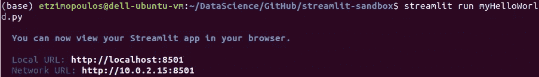
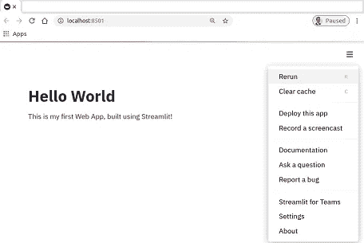
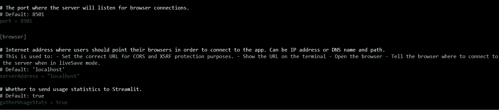
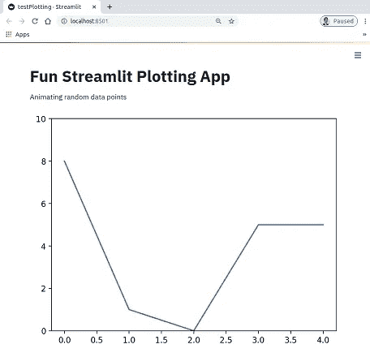

# 如何使用 Streamlit 在 Python 中创建数据应用程序

> 原文：<https://medium.com/analytics-vidhya/how-to-create-data-apps-in-python-using-streamlit-part-i-b2558365c258?source=collection_archive---------15----------------------->


## Streamlit 系列—第一部分— Hello World！

## 介绍

我刚刚面试失败了！我被一个似乎是数据科学、分析和咨询的完美结合的角色拒绝了，相当令人失望！但是我决定这不会让我退步，而是把它作为一个学习的步骤。因此，我在寻找下一个项目，以培养我的技能，并向 case 展示一些新的、不同的东西。当我看到 Streamlit 时，我开始研究它，因为我很感兴趣:

> 创建数据应用的最快方式

在那之前，我从未创建过应用程序，通过进一步阅读，我很快发现我可以随时创建一个 Web 应用程序。我想“太好了！”这将是一个完美的项目，让我更上一层楼！然后我想…“等等，我该怎么部署它？”我总是喜欢做好准备，合理地计划事情，这让我开始思考。当时，还没有 Streamlit 托管[功能](https://blog.streamlit.io/introducing-streamlit-sharing/)，但这并没有阻止我:有了强大的谷歌搜索，我发现我可以使用 Docker 来封装我的应用程序，并使用 Azure Cloud 或 GCP Cloud 来部署它(更多内容将在第二系列文章中介绍——“*如何使用 Docker 封装你的应用程序并部署在 Azure Cloud 上*”)！

我非常兴奋:我有了一个好的项目想法和一个完整的路线图来实现它。他们说，首先你必须设想它，然后让它发生，从这个意义上说，这是我建立我的网络应用程序的第一步！

## 关于细流

Streamlit 是一个开源的 Python 库，可以轻松地为机器学习和数据科学项目构建和部署 Web 应用程序。而且我可以确认，肯定是这样的。它还有一个很棒的社区，会一直支持你，如果你遇到困难，这是一个交流想法和解决问题的好地方。

该公司最近(2020 年 6 月)宣布了 2100 万美元的首轮融资！经过一些研究，我发现截至 2019 年底，该社区开发了超过 200，000 个应用程序，这些应用程序看到了无需成为应用程序开发人员即可部署模型和可视化数据的潜力和优势！

所以我来了，向你们展示我是如何做到的。因为如果我能，你也能！

## 先决条件和库

在我们开始之前，让我们确保我们有我们需要的。

我们**不会**在本文中讨论的内容，并且假设您已经在系统中进行了设置:

*   Python 3。x 环境(我用的是 3.7)
*   熟悉 Linux 命令行(尽管使用 Windows Powershell 应该非常相似)

## 简化程序库

要安装 Streamlit 库，只需使用 Linux CLI 键入以下命令:

`pip install streamlit`

## 目录

为您的所有文件创建一个目录，包括主应用 Python 脚本、任何其他支持脚本文件或图像/文件，例如

```
/myApp/
.../images/
.../files/
...myApp.py
```

请注意，对于“Hello Streamlit World”应用程序，您可能不需要这样做，但是对于真正的机器学习应用程序，您肯定需要这样做！

## 你好世界

Streamlit 应用程序基本上是一个 Python 脚本文件，您可以通过在运行目录中键入以下命令来运行它:`streamlit run [app_name]`

从 Streamlit 开始，让我们使用以下步骤创建一个 Hello World 应用程序:

1.  打开你最喜欢的 IDE。我的应用程序使用了 Spider。
2.  创建新的 Python 脚本文件，并添加以下内容:

```
# My first Streamlit App"

# Load Streamlit library
import streamlit as st

# Hello World
st.title('Hello World')
st.write("\nThis is my first Web App, built using Streamlit!")
```

如果您将文件保存为`myHelloWorld.py`,并在命令行中键入`streamlit run myHelloWorld.py`来运行它，您将得到如下结果:



很快你的浏览器就会弹出你的第一个闪亮的网络应用程序！



如您所见，该应用程序使用`localhost:8501`端口在您的浏览器中自动打开。

要查看完整的配置文件，你可以输入`streamlit config show`，一个很长的配置文件将出现在你的屏幕上，显示应用程序的默认设置。除此之外，您还会看到以下内容:



## 动画片

现在我们已经具备了基本条件，让我们更进一步。让我们尝试绘图，为什么要保持简单，让我们做动画！

下面，我使用了一个简单的脚本，通过使用 matplotlib 库绘制随机生成的数据点来测试动画:

```
import matplotlib.pyplot as plt
import numpy as np
import streamlit as st
import time

st.title('Fun Streamlit Plotting App')

st.write('Animating random data points')
fig, ax = plt.subplots()
max_x = 5
max_rand = 10

x = np.arange(0, max_x)
ax.set_ylim(0, max_rand)
line, = ax.plot(x, np.random.randint(0, max_rand, max_x))
my_plot = st.pyplot(plt)

def init():  # create an empty plot
    line.set_ydata([np.nan] * len(x))

def animate(i):  # calculate and update values on the y axis
    line.set_ydata(np.random.randint(0, max_rand, max_x))
    my_plot.pyplot(plt)

init()
for i in range(50):
    animate(i)
    time.sleep(0.1)
```

然后，通过将文件保存为`testPlotting.py`并运行它，您将在浏览器中弹出以下内容:



为了看到完整的动画，我在这里部署了这个应用程序作为现场演示:[https://share . streamlit . io/etzimopoulos/streamlit-sandbox/test plotting . py](https://share.streamlit.io/etzimopoulos/streamlit-sandbox/testPlotting.py)

## 其他简化应用

有如此多的应用程序可以使用 Streamlit，而且这个社区非常有创意。在这里你可以找到一些和你一样的人提交的应用程序(很快，是的，你就有了！)和我:[https://discuss.streamlit.io/c/streamlit-examples/9](https://discuss.streamlit.io/c/streamlit-examples/9)

感谢您阅读到目前为止。希望你现在已经在考虑如何开始使用你自己的应用了！

欢迎在 https://www.linkedin.com/in/etzimopoulos/[联系](https://www.linkedin.com/in/etzimopoulos/)询问任何问题，或者只是打个招呼！

## 关于我


我是一名自由职业的首席管理顾问和应用数据科学家，在为金融服务和政府部门的供应商和全球银行实施数据分析解决方案、数字化转型和技术变革方面拥有丰富的经验。

来自机器人工程的坚实学术背景，像数学、统计学和编程(幸运的是)这样的技能对我来说是多余的，再加上工程师真正好奇、分析和好奇的思维。

这种技术技能和行业经验的独特结合使我能够与广泛的客户合作，帮助他们弥合业务和技术团队之间的差距，并带来关键项目，从而为他们的组织带来巨大的价值。