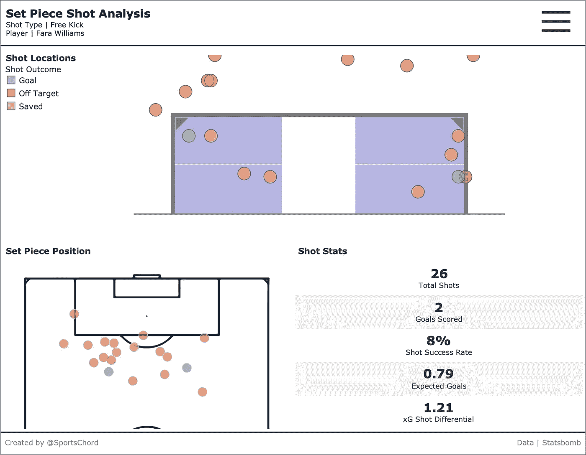

# 如何在 Tableau 中创建足球场/球门作为背景

> 原文：<https://medium.com/analytics-vidhya/how-to-create-football-pitches-goals-as-backgrounds-in-tableau-7b1a7800ae1c?source=collection_archive---------3----------------------->

分析足球数据提供了一个极好的机会来使用视觉线索，如足球场和球门框轮廓，以帮助交流视觉分析。2D 足球场作为一种可视化战术、传球网络、进球和阵容的方法，已经在媒体文化中流行开来。这些包括报纸和在线新闻，视频游戏，如足球经理和…