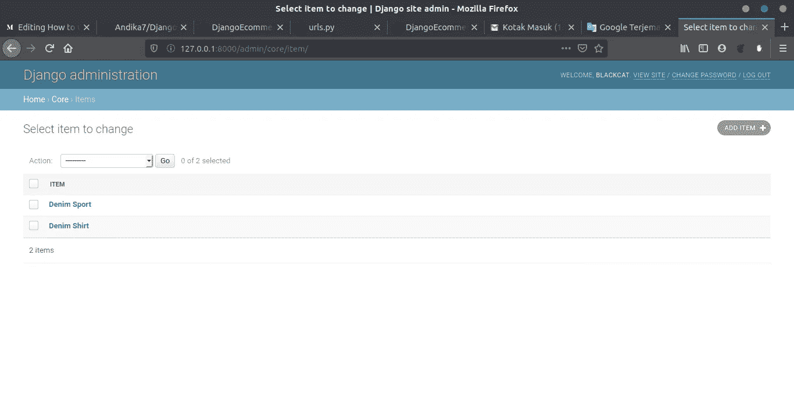
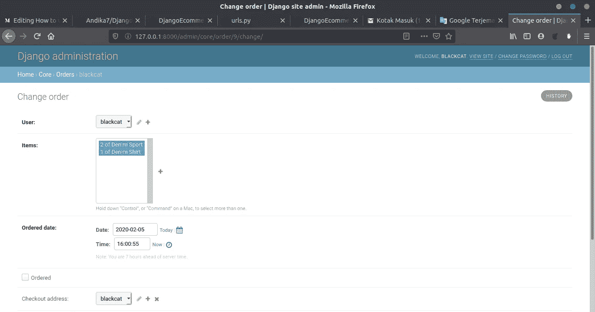

# 如何用 Django 创建一个功能齐全的电子商务网站

> 原文：<https://medium.com/analytics-vidhya/how-to-create-fully-functional-e-commerce-website-with-django-c95b46973b0?source=collection_archive---------1----------------------->

## 第 2 步，共 5 步:订购


[https://www . shuup . com/WP-content/uploads/2017/12/python-plus-django-1 . jpg](https://www.shuup.com/wp-content/uploads/2017/12/python-plus-django-1.jpg)

# 先决条件

*   Django 最新版本
*   Anaconda(可选)创建虚拟环境
*   Visual Studio 代码(可选)广告代码编辑器

在开始本教程之前，不要忘记激活您的虚拟环境，以及我们在上一个教程中创建的项目。如果你没有，你可以在这里下载:

[](https://github.com/Andika7/DjangoEcommerce/tree/dd22c575aaad4c859b02bc098de93a5264d3dcc8) [## 安集卡 7/DjangoEcommerce

### 在 GitHub 上创建一个帐户，为 Andika7/DjangoEcommerce 的发展做出贡献。

github.com](https://github.com/Andika7/DjangoEcommerce/tree/dd22c575aaad4c859b02bc098de93a5264d3dcc8) 

# A.在模型中创建数据库

在我们开始点菜之前。首先要做的是创建一个存储订单数据的数据库

首先，我们将制作 3 个数据表，即:
- **条目**将存储产品数据
- **订单条目**将存储您想要订购的产品数据
- **订单**将存储订单信息

为了在 Django 框架中创建一个数据库，我们将使用核心目录中的 ***models.py*** 文件，用您的代码编辑器打开该文件并继续本教程。

1.  导入

```
from django.conf import settings
from django.db import models
from django.shortcuts import reverse
```

2.添加项目模型

在项目模型中，您会看到有 3 个额外的功能，这些功能包括:

*   **get_absolute_url** 将从产品返回 url
*   **get_add_to_cart_url** 将返回 url 到我们将创建的 views.py 文件中的函数 add item to cart
*   **get _ remove _ from _ cart _ url**将返回 URL，以便在我们将要创建的 views.py 文件中执行从购物车中删除商品的功能

3.添加订单项模型

OrderItem 存储您想要订购的产品的数据以及产品的数量

4.添加订单模型

**订单**模型将存储所下订单的详细信息，但在本教程的这一部分，我们不会显示完整的订单信息，我们将在下一部分添加另一个字段。

5.向管理员注册数据库

使用代码编辑器打开 core/admin.py 文件，并填入以下代码:

```
from django.contrib import admin
from .models import Item, OrderItem, Order admin.site.register(Item)
admin.site.register(OrderItem)
admin.site.register(Order)
```

这将在管理页面上注册您的数据库。你可以稍后在管理页面查看

6 .迁移模型数据库

使用以下命令迁移您的模型数据库:

```
$ python manage.py migrate
$ python manage.py makemigrations
```

完整的 models.py 代码可以在以下链接中看到:

[](https://github.com/Andika7/DjangoEcommerce/blob/88aecdce1341d871acdfb4b19add1b497170c634/core/models.py) [## 安集卡 7/DjangoEcommerce

### 在 GitHub 上创建一个帐户，为 Andika7/DjangoEcommerce 的发展做出贡献。

github.com](https://github.com/Andika7/DjangoEcommerce/blob/88aecdce1341d871acdfb4b19add1b497170c634/core/models.py) 

# B.管理视图

我们已经创建了一个数据库，现在轮到我们来管理和管理我们的视图。我们将创建两个视图，即 **HomeView** 和 **ProductView** 以及两个函数，即 **add_to_cart()** 和 **remove_from_cart()** 。要继续，请打开 core/views.py 并继续以下教程

1.  导入

```
from django.contrib import messages                       
from django.shortcuts import render, get_object_or_404, redirect                      
from django.views.generic import ListView, DetailView                      
from django.utils import timezone                       
from .models import (                           
    Item,
    Order,
    OrderItem
)
```

将我们之前创建的所有模型类导入 views.py

2.添加主页视图

在前一篇教程文章中，我们创建了一个 home 函数来显示一个视图。删除 home 函数并将其更改为 Class View this:

```
class HomeView(ListView):
    model = Item
    template_name = "home.html
```

我们使用项目模型作为家庭模型，home.html 作为模板视图。home.html 可以在模板目录中找到

3.添加产品视图

```
class ProductView(DetailView):
    model = Item
    template_name = "product.html"
```

我们使用项目模型作为家庭模型，product.html 作为模板视图。product.html 可以在模板目录中找到

4.**添加购物车()**函数

此功能将把您的产品添加到 orderItem 数据库，并将详细订单添加到 Order 数据库

5. **remove_from_cart()** 函数

此功能将从 OrderItem 数据库中删除您的所有产品，并从订单数据库中删除详细订单

6.更新您的模板目录

在模板目录中，我们做了一些修改。因此，请从以下链接更新您的模板目录:

[](https://github.com/Andika7/DjangoEcommerce/tree/88aecdce1341d871acdfb4b19add1b497170c634/templates) [## 安集卡 7/DjangoEcommerce

### 此时您不能执行该操作。您已使用另一个标签页或窗口登录。您已在另一个选项卡中注销，或者…

github.com](https://github.com/Andika7/DjangoEcommerce/tree/88aecdce1341d871acdfb4b19add1b497170c634/templates) 

# C.管理 URL

视图完成后，url 将被管理，视图将在浏览器中显示。打开您的 core/urls.py 文件，并用下面的代码填充:

导入所有视图类和函数，并为每个视图添加 url。

# D.演示应用程序

1.  使用以下命令运行您的服务器:

```
$ python manage.py runserver
```

2.打开 [http://127.0.0.1:8000/](http://127.0.0.1:8000/) 选择一个产品，如果没有产品可以在管理页面添加



项目数据库

3.单击产品页面中的添加到购物车按钮，您将看到产品将添加到您的订单项和订单数据库中



订单数据库

4.单击“从购物车中删除”按钮删除您当前的订单。它将从数据库 order 和 order item 中删除订单项

为此，已经实现了创建订单的功能

# 完成源代码这一部分:

[](https://github.com/Andika7/DjangoEcommerce/tree/88aecdce1341d871acdfb4b19add1b497170c634) [## 安集卡 7/DjangoEcommerce

### 在 GitHub 上创建一个帐户，为 Andika7/DjangoEcommerce 的发展做出贡献。

github.com](https://github.com/Andika7/DjangoEcommerce/tree/88aecdce1341d871acdfb4b19add1b497170c634) 

# 进行下一部分！

我希望本教程的第二部分对你有所帮助。在下一节课中，我们将在购物车中进行订单汇总。