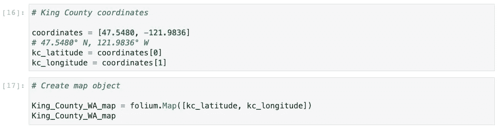
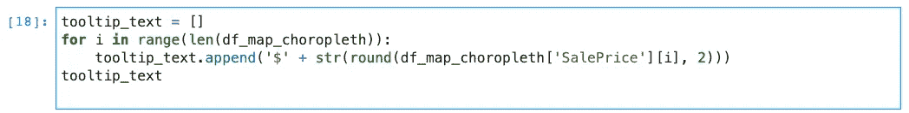
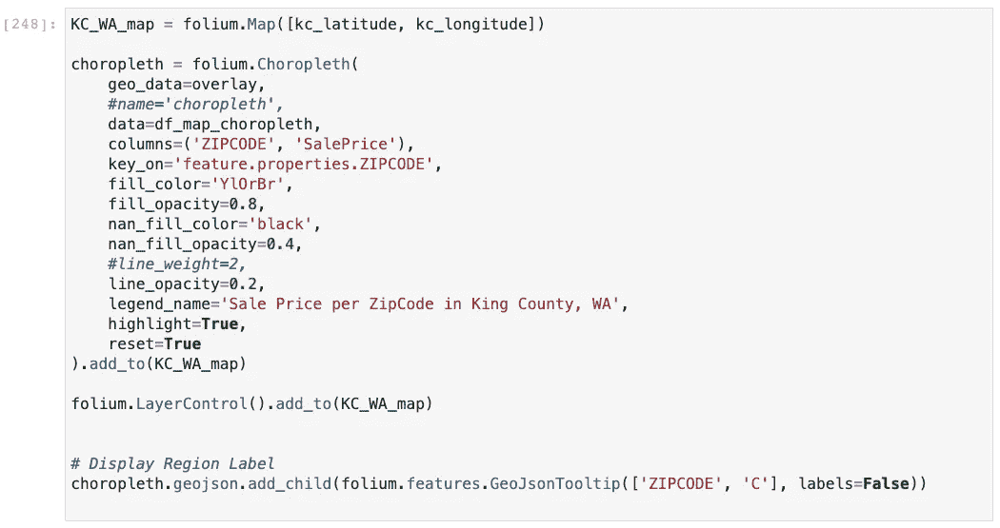

# 如何使用 Geopandas 和 leav 创建交互式 Choropleth 地图

> 原文：<https://medium.com/analytics-vidhya/how-to-create-interactive-choropleth-map-using-geopandas-and-folium-69e05ae1f931?source=collection_archive---------4----------------------->

在这篇博文中，我们将讨论如何使用 geopandas 和 leav 创建交互式 choropleth 地图。地图是可视化地理区域统计数据的非常有用的工具。这种地图格式便于确定某些关键区域的位置。当数据科学家需要以简洁的格式向非技术人员展示大量数据时，这种方法尤其有用。

要创建 choropleth，我们需要以下内容:

必需的库—leav 和 geopandas

要绘制的数据-要在地图上显示的值

在. geoJSON 文件中描述地理特征的几何图形

**所需的 Python 库**

第一步是导入所需的库。

在用 Python 处理过数据之后，leav([http://python-visualization.github.io/folium/](http://python-visualization.github.io/folium/))库使得在交互式传单地图上可视化数据变得很容易。此外，绘制 choropleth 地图并创建自己的标记也是可行的。

geo pandas(【http://geopandas.org/】T4)是一个开源项目，它使得用 Python 处理地理空间数据变得更加容易。GeoPandas 扩展了 Pandas 使用的数据类型，允许对几何类型进行空间操作。几何运算由 Shapely 执行。GeoPandas 进一步依赖 Fiona 进行文件访问，笛卡尔和 Matplotlib 进行绘图。

这两个库都可以使用 pip 或 conda 安装。

# 数据和几何

**要绘制的数据**

对于这篇博文，我将使用国王郡房屋销售数据集。原始数据集(CSV 文件)和数据描述(DOC 文件)可以在[这里](https://info.kingcounty.gov/assessor/DataDownload/default.aspx)下载。使用的特殊表格有:不动产销售、住宅建筑和宗地。但是，我使用的是存储在[这里](https://github.com/angelicacodes/phase_2_project_chicago-sf-seattle-ds-082420/blob/master/data/clean/KingCountyHousingData.csv)的预处理干净数据。

**几何图形**

一旦我们导入了库并准备好了要绘制的数据，我们就需要几何图形作为感兴趣区域的 shapefile。我正在根据邮政编码处理华盛顿州金县的数据。我能够在西雅图开放数据门户中找到每个邮政编码的 shapefile 几何图形，并且我将在这个项目中使用它。King County geometry 的 shapefile 可通过以下链接找到:[西雅图地理数据](https://data-seattlecitygis.opendata.arcgis.com/datasets/83fc2e72903343aabff6de8cb445b81c_2)。

您需要将 zip 文件下载到本地文件夹中，并使用 GeoPandas 将 zip 文件作为地理数据框架读取。我将只使用属于国王县的邮政编码几何。

# **创建地图**

我们想根据邮政编码绘制每个地区的平均房屋销售价格。因此，我们需要将销售价格数据与几何合并为地理数据框。

使用叶我们将创建一个地图对象。需要金县坐标来定位地图上的位置:北纬 47.5480，西经 121.9836。

下一步是创建带有文本的自定义工具提示。

这一小段代码格式化了我们的数据，使其对观众更具可读性。Saleprice 前面会有一个美元符号($)，四舍五入到小数点后两位。当你将鼠标悬停在地图上时，它会显示邮政编码和平均房屋销售价格。通过自定义的工具提示，你可以创建任何你想要的文本。

选定感兴趣的区域并准备好自定义工具提示后，我们可以从地理数据框创建一个. geojson 文件。

以下是最终的求解步骤:

下一步也是最后一步，是将 choropleth 贴图覆盖在 map 对象上。

这是最终结果，一个交互式 choropleth 地图，显示了华盛顿州金县每个邮政编码区的平均房屋销售价格。

我希望这篇博客会对你有用，并为你未来的项目节省一些时间。