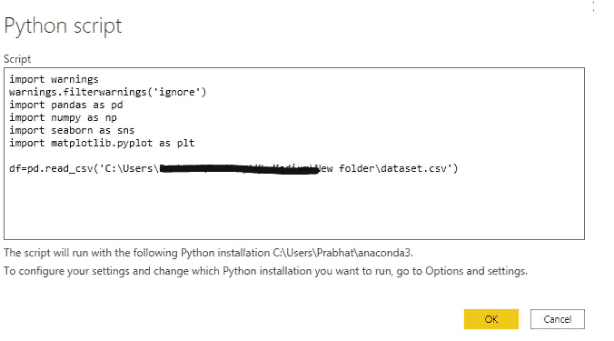
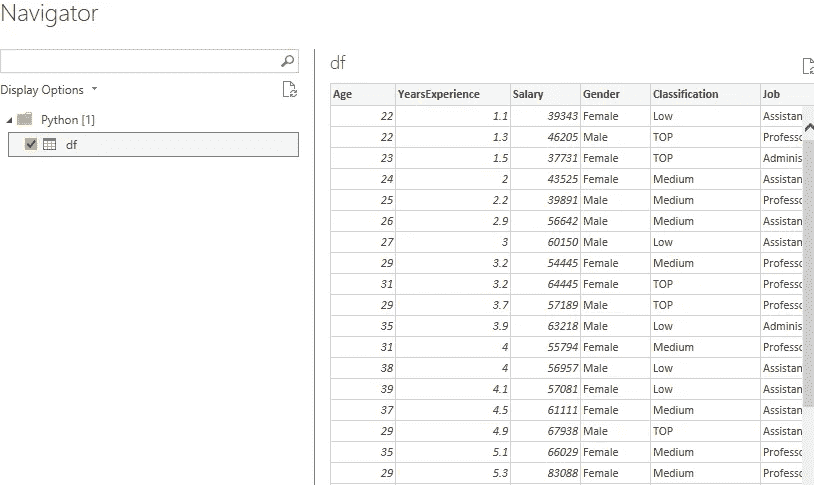
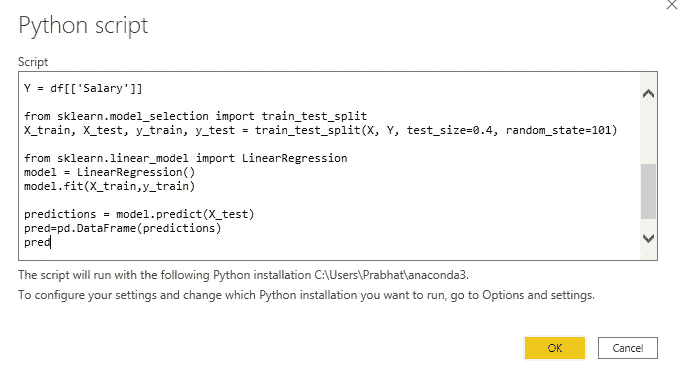
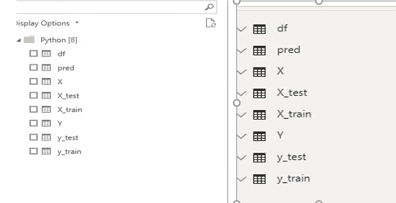

# 如何使用 Python 在 Power BI 中创建机器学习模型

> 原文：<https://medium.com/analytics-vidhya/how-to-create-machine-learning-models-in-power-bi-using-python-6301a16a382b?source=collection_archive---------1----------------------->

在这里，权力与目的相遇


卢克·切瑟在 [Unsplash](https://unsplash.com?utm_source=medium&utm_medium=referral) 上的照片

# 介绍

Power BI Desktop 借助内置和定制的可视化功能，帮助解决复杂的问题陈述。

# 背景

第一个问题是，为什么要将 Python 与 Power BI 一起使用？Power BI 提供了大量数据可视化和数据混合功能。Python 的数据工程特性和框架扩展了 Power BI 功能，还提供了 Power BI 中没有的功能。挑战很多，但机遇也很多。 **Python** 是 **Power BI** 家族的一大补充。我们将看到如何使用 Python 在 Power BI 中创建机器学习模型。

# 配置

要开始，您需要安装一个 anaconda 发行版，并安装您希望使用的软件包。打开 Power BI 预览功能下的 Python 支持(文件->选项和设置->选项->预览功能-> Python 支持)。

关于配置，请关注这个[博客](/analytics-vidhya/power-bi-desktop-and-python-amazing-capabilities-9e66f645b4e)，我已经一步一步地提到了如何使用 Python 脚本的 Power BI 配置 Anaconda 发行版。

# 加载数据

将数据导入 Power BI 相当简单。在 Power BI 中，选择主页->获取数据->其他-> Python 脚本。Python 脚本窗口打开，您可以输入代码。我将导入曾经流行的 iris 数据集，格式为带标题的 CSV 文件。



运行上述脚本后，将加载 dateset。如果想熟悉数据集，可以参考这个[库](https://github.com/techpathak/Salary-prediction---Linear-regression-with-Categorical-variable)。



我们将运行的最终代码:

```
import warnings
warnings.filterwarnings('ignore')
import pandas as pd
import numpy as np
import seaborn as sns
import matplotlib.pyplot as pltdf=pd.read_csv('C:\\Users\\xxxxxxxxx\\Desktop\\xxxxxx\\New folder\\dataset.csv')
dfX = df[['Age', 'YearsExperience', 'Gender', 'Classification', 'Job']]
X = pd.get_dummies(data=X, drop_first=True)Y = df[['Salary']]from sklearn.model_selection import train_test_split
X_train, X_test, y_train, y_test = train_test_split(X, Y, test_size=0.4, random_state=101)from sklearn.linear_model import LinearRegression
model = LinearRegression()
model.fit(X_train,y_train)predictions = model.predict(X_test)
predictionspred=pd.DataFrame(predictions)
```



运行以上脚本后，您将得到以下输出:



如果你想更好地理解线性回归，请参考我以前的博客。

1.  [https://medium . com/analytics-vid hya/implementing-linear-regression-using-sk learn-76264 a3c 073 c](/analytics-vidhya/implementing-linear-regression-using-sklearn-76264a3c073c)
2.  [https://medium . com/analytics-vid hya/a-beginners-guide-to-linear-regression-in-python-with-scikit-learn-6b 0 Fe 70 b 32d 7](/analytics-vidhya/a-beginners-guide-to-linear-regression-in-python-with-scikit-learn-6b0fe70b32d7)

# 结论

既然您已经知道如何在 Power BI 中使用 Python 集成，那么做事情的可能性是无穷的。从 ETL 开始，到创建机器学习模块。如果您想知道为什么我们应该在 Power BI 中运行 ML 代码，答案是您可以轻松地创建许多令人惊叹的可视化效果，以获得更好的数据探索技术，并且可以提高模型的准确性。

我希望这篇文章能帮助你并节省大量的时间。如果你有任何建议，请告诉我。

快乐编码。

***Prabhat Pathak****(*[*Linkedin 简介*](https://www.linkedin.com/in/prabhat-pathak-029b6466/) *)高级分析师。*


照片由 [Aaron Burden](https://unsplash.com/@aaronburden?utm_source=medium&utm_medium=referral) 在 [Unsplash](https://unsplash.com?utm_source=medium&utm_medium=referral) 上拍摄