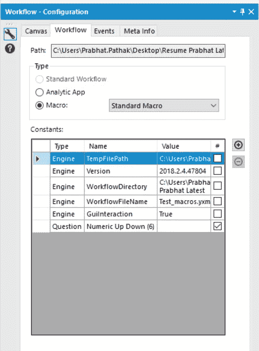
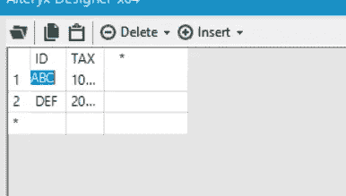
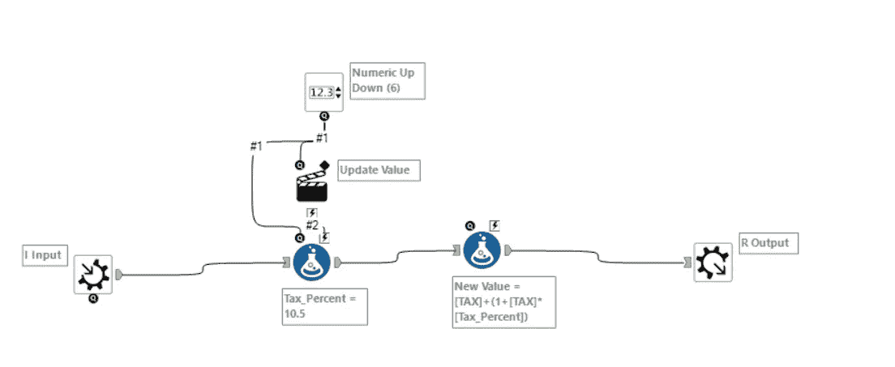
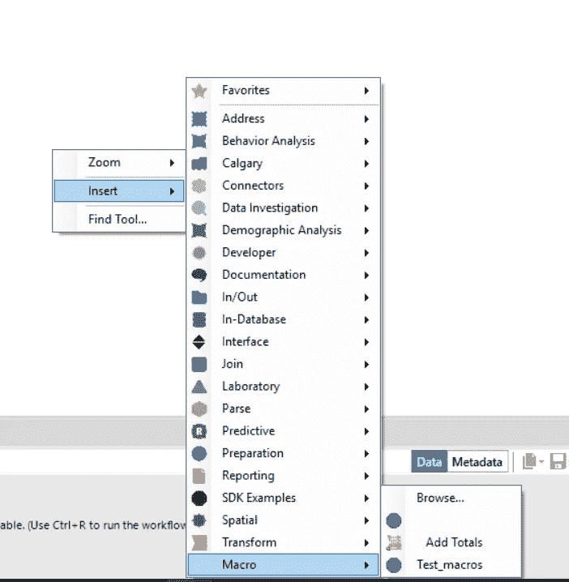
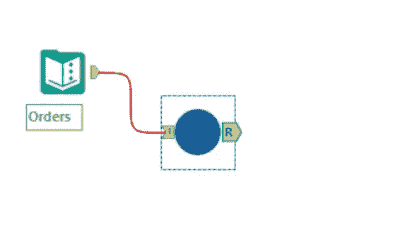
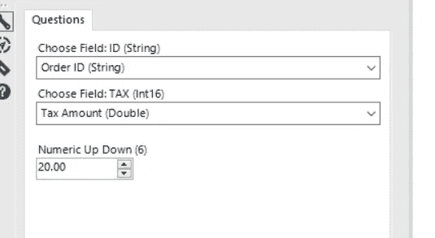
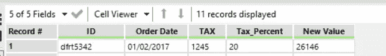

# 如何在 Alteryx 中创建宏

> 原文：<https://medium.com/analytics-vidhya/how-to-create-macros-in-alteryx-4c78c8e1d6f8?source=collection_archive---------16----------------------->

创建宏的简单步骤

丹·卡尔森在 [Unsplash](https://unsplash.com?utm_source=medium&utm_medium=referral) 上的照片

**宏**对于你按顺序重复同一组步骤的任何情况都很有价值。

# **宏**

宏是一个工作流或一组内置于单个工具中的工具，可以插入到另一个工作流中。创建宏来保存您重复执行的分析过程。在工作流中使用宏，而不必每次都重新创建分析过程。

将宏保存为. yxmc 文件，以便在 Designer 中使用或上传到 Alteryx Analytics 图库或私人图库中共享。

## **宏的类型**

*   **标准宏**:该宏用于将工作流中的流程打包成一个可以插入工作流的工具。
*   **批处理宏**:该宏在一个工作流程中运行多次，每次运行后创建一个输出。该宏对数据中的每条记录或选定的一组记录运行一次。宏需要一个控制参数工具作为输入。参见[批处理宏](https://help.alteryx.com/2018.2/BatchMacro.htm)。
*   **迭代宏**:该宏在工作流程中运行配置中设定的次数，或者连续运行，直到满足条件。参见[迭代宏](https://help.alteryx.com/2018.2/IterativeMacro.htm)。
*   **位置优化宏**:该宏是一个迭代宏，可用于网络分析，以确定一个或多个最佳位置。参见[位置优化器宏](https://help.alteryx.com/2018.2/LocationOptimizerMacro.htm)。

在本教程中，我将创建标准宏

首先，打开 Alteryx 设计器并在配置窗格中选择宏选项。

选择上述选项后，转到接口选项

首先，选择宏输入，这里我们可以手动或从文件中给出输入值，我手动插入数据:

宏输入

完成宏工作流

在此工作流程中，我使用了以下工具:

1.  宏输入
2.  公式
3.  数字上下移动
4.  宏输出

一旦你创建了这个宏，然后将其保存在。yxmc 格式。

照片由[李中清](https://unsplash.com/@picsbyjameslee?utm_source=medium&utm_medium=referral)在 [Unsplash](https://unsplash.com?utm_source=medium&utm_medium=referral) 上拍摄

现在，如果我们必须遵循类似的步骤和操作，我们可以在其他数据集上重用该宏:

使用宏的步骤:

我们将插入保存在您本地系统中的宏。

选择 Test_macros 并将其插入到工作流中，映射后运行工作流，你会看到想要的结果。

在工作流中使用宏

您可以在配置窗格的帮助下映射字段，甚至可以在这里选择税率，我们已经选择了 20，您可以根据您的要求在(1 到 100)之间进行更新。

这是最终的输出。

# 结论

Alteryx 可以优化在 Excel 中手动编辑数据所花费的时间，并且可以将其转化为更好的分析水平。在 Alteryx 中可以做很多事情，包括预测建模、创建可视化、提取报告和创建分析应用程序。

我希望这篇文章能帮助你并节省大量的时间。如果你有任何建议，请告诉我。

快乐学习。

***Prabhat Pathak****(*[*Linkedin 简介*](https://www.linkedin.com/in/prabhat-pathak-029b6466/) *)是助理分析师。*

[绿色变色龙](https://unsplash.com/@craftedbygc?utm_source=medium&utm_medium=referral)在 [Unsplash](https://unsplash.com?utm_source=medium&utm_medium=referral) 上拍摄的照片