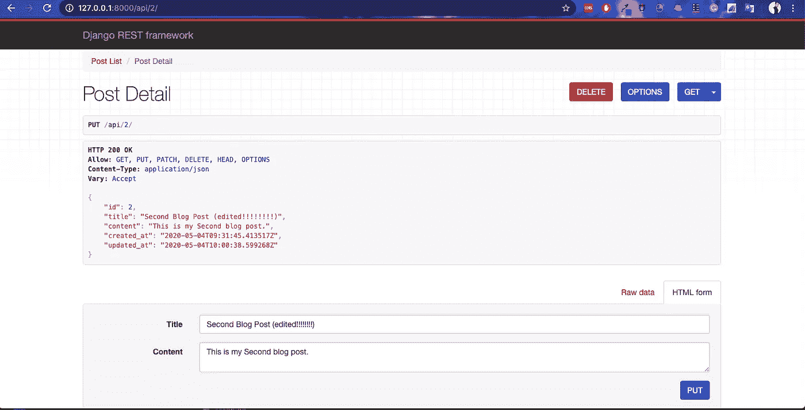

# 如何使用 Django REST 框架——一个博客应用程序创建 REST API

> 原文：<https://medium.com/analytics-vidhya/how-to-create-rest-api-using-django-rest-framework-a-blog-app-15a175884979?source=collection_archive---------5----------------------->

在本教程中，我们将使用 [Django Rest 框架](http://www.django-rest-framework.org/)为具有 CRUD(创建-读取-更新-删除)功能的*博客应用*构建 API。

有与[姜戈](https://www.djangoproject.com/)合作的经验是有帮助的，但不是必须的。

完整的源代码可以在 [Github](https://github.com/ayushgemini/django-blog-app) 上找到。


# 简易高碘酸染色法

现代 web 应用程序越来越多地被构建为单页面应用程序(SPAs ),它们具有不同的前端和后端。与 Django 本身的传统整体方法(以及 Ruby on Rails 等其他 web 框架)相反，spa 需要一个后端 API，然后可以根据需要由多个前端使用。当公司需要多个前端应用程序(移动网络、iOS、Android)在同一个数据库上运行时，这种方法非常有效。也可以说它更“适应未来”,因为前端可以更改为任何流行的 JavaScript 框架，但后端始终保持稳定。

缺点是为项目创建单独的前端/后端需要更多的时间和代码。

# RESTful APIs

API(应用程序编程接口)为开发人员提供了与应用程序数据库交互的接口。API 并不只是授予某人对数据库的完全访问权，而是为各种功能设置规则、权限和端点:登录、注销、阅读博客列表、个人博客详细信息等等。

构建 web API 的传统方式是通过 REST(表述性状态转移)，这是一种完善的网站间通信架构。由于计算机通过 web 进行通信，这意味着使用 HTTP 协议，该协议支持几种常见的“方法”(也称为“动词”)，如 GET、PUT、POST 和 DELETE。

还有许多相关的访问代码，用于指示请求是成功的(200)、重定向的(301)、丢失的(404)还是更糟的(500)。

# JSON

值得注意的是，由于 API 正在与另一台计算机通信，因此共享的信息**不是标准网页发送的信息**。例如，当您的浏览器请求 Google 主页时，它发送 HTTP 请求并接收包含 HTML、CSS、JavaScript、图像等的 HTTP 响应。

API 是不同的。通常我们只对数据库中的数据感兴趣。这些数据通常被转换成 JSON 格式，以便有效地传输。该 API 还将有一系列定义良好的规则，用于前端客户端如何通过 REST 架构与它进行交互。为了注册一个新用户，前端框架需要访问一个 API 端点，例如“/api/register/”。这个 API 端点包含一个特定的 URL 路由和它自己的权限集。

# 设置

我们将从在 Django 中构建博客应用程序的模型开始本教程。然后我们可以添加 Django Rest 框架，将其转换成 RESTful API。

首先，在您的计算机上为我们的代码创建一个新目录。我会把它放在桌面上一个名为“django-blog-app”的文件夹中，但是你可以把它放在任何地方。然后配置我们的项目。

```
$ cd ~/Desktop
$ mkdir blogapi && cd blogapi
$ pipenv install django==3.0
$ pipenv shell
(blogapi) $ django-admin startproject blog_project .
(blogapi) $ cd blog_project
(blogapi) $ python manage.py startapp posts
```

我们使用`Pipenv`来安装 Django 并激活一个本地环境。然后我们创建了一个名为`blogapi`的新 Django 项目以及我们的第一个应用`posts`。

因为我们已经添加了一个新的应用程序，所以我们需要告诉 Django。所以请确保将`posts`添加到`settings.py`文件中的`INSTALLED_APPS`列表中。

```
*# blog_project/settings.py*INSTALLED_APPS **=** [
    'django.contrib.admin',
    'django.contrib.auth',
    'django.contrib.contenttypes',
    'django.contrib.sessions',
    'django.contrib.messages',
    'django.contrib.staticfiles','posts',
]
```

我们的数据库模型将会非常简单。让我们创建四个字段:标题、内容、创建时间和更新时间。

```
*# posts/models.py* from django.db import models**class** **Post**(models**.**Model):
    title **=** models**.**CharField(max_length**=**50)
    content **=** models**.**TextField()
    created_at **=** models**.**DateTimeField(auto_now_add**=**True)
    updated_at **=** models**.**DateTimeField(auto_now**=**True)**def** **__str__**(self):
        **return** self**.**title
```

注意，我们还定义了模型的`__str__`表示应该是什么，这是 Django 的最佳实践。

现在更新我们的数据库，首先创建一个新的迁移文件，然后应用它。

```
(blogapi) $ python manage.py makemigrations
(blogapi) $ python manage.py migrate
```

很好！我们想在 Django 出色的内置管理应用程序中查看我们的数据，所以让我们添加`Post`到它，如下所示。

```
*# posts/admin.py* from django.contrib import admin
**from** **.** models import Postadmin**.**site**.**register(Post)
```

然后创建一个超级用户帐户，这样我们就可以登录。在下面键入命令并输入所有提示。

```
(blogapi) $ python manage.py createsuperuser
```

现在我们可以启动本地 web 服务器了。

```
(blogapi) $ python manage.py runserver
```


点击`Posts`旁边的“+ Add”按钮，输入一些新内容。


我已经创建了三个新的博客帖子，你可以在这里看到。


姜戈的部分已经结束了！因为我们正在创建一个 API，所以我们不需要创建模板和视图。相反，是时候添加 Django Rest 框架来将我们的模型数据转换成 API 了。

# Django Rest 框架

DRF 负责将我们的数据库模型转换成 RESTful API。这个过程有两个主要步骤:首先，用一个`serializer`将数据转换成 JSON，这样就可以通过互联网发送，然后用一个`View`定义发送什么数据。

让我们看看它的实际效果。首先，用`Control+c`停止本地服务器，用`Pipenv`安装 Django Rest 框架。

```
(blogapi) $ pipenv install djangorestframework==3.10
```

然后将它添加到我们的`settings.py`文件的`INSTALLED_APPS`部分。

```
*# blog_project/settings.py* INSTALLED_APPS **=** [
    'django.contrib.admin',
    'django.contrib.auth',
    'django.contrib.contenttypes',
    'django.contrib.sessions',
    'django.contrib.messages',
    'django.contrib.staticfiles','rest_framework','posts',
]
```

我喜欢在像`rest_framework`这样的第三方应用和我的像`posts`这样的应用之间加一个空格。

现在在我们的`posts`应用中创建一个新的`serializers.py`文件。

```
(blogapi) $ touch posts/serializers.py
```

请记住，序列化程序用于将我们的数据转换成 JSON 格式。就是这样。这是它的样子。

```
*# posts/serializers.py* from rest_framework import serializers
from . import models**class** **PostSerializer**(serializers**.**ModelSerializer):**class** **Meta**:
        fields **=** ('id', 'title', 'content', 'created_at', 'updated_at',)
        model **=** models**.**Post
```

在上面的两个文件中，我们从 DRF 进口了`serializers`和我们的模型。接下来，我们创建一个序列化器类，并在其中创建一个`Meta`类。`fields`控制哪些数据库属性可用。在本例中，我们公开了所有字段，包括 Django 自动添加到所有数据库记录中的主键`id`。

接下来，我们需要创建我们的视图。正如 Django 有基于类的通用视图一样，DRF 也有我们可以使用的通用视图。让我们添加一个列出所有博客文章的视图和一个特定文章的详细视图。

如下更新`posts`中的`views.py`文件。

```
*# posts/views.py* from rest_framework import genericsfrom .models import Post
from .serializers import PostSerializer**class** **PostList**(generics**.**ListAPIView):
    queryset **=** Post**.**objects**.**all()
    serializer_class **=** PostSerializer**class** **PostDetail**(generics**.**RetrieveAPIView):
    queryset **=** Post**.**objects**.**all()
    serializer_class **=** PostSerializer
```

在顶部，我们从 DRF 导入`generics`以及我们的模型和序列化程序文件。然后我们创建两个视图:`PostList`和`PostDetail`。两者都只是针对`GET` s，而`RetrieveAPIView`是针对一个模型的**单实例**。通用视图的完整列表在 DRF 网站上。

最后一部分是 URL。我们需要创建 URL 路由——在 API 中称为**端点**——在那里数据是可用的。

从项目级`urls.py`文件开始。

```
*# blog_project/urls.py*from django.contrib import admin
from django.urls import include, pathurlpatterns **=** [
    path('admin/', admin**.**site**.**urls),
    path('api/', include('posts.urls')),
]
```

我们已经将`include`添加到第二行导入中，然后为我们的`posts`应用程序创建了一个名为`api/`的路径。

接下来，创建我们的`posts`应用程序`urls.py`文件。

```
(blogapi) $ touch posts/urls.py
```

然后包含下面的代码。

```
*# posts/urls.py* from django.urls import pathfrom . import viewsurlpatterns **=** [
    path('', views**.**PostList**.**as_view()),
    path('<int:pk>/', views**.**PostDetail**.**as_view()),
]
```

所有的博客路径都在`api/`处，所以我们的`PostList`有空字符串`''`将在`api/`处，`postDetail`在`api/#`处，其中`#`代表条目的主键。例如，第一篇博文的主 id 为 1，因此它将位于路由`api/1`，第二篇博文位于`api/2`，依此类推。

# 可浏览 API

是时候看看我们的作品，看看 DRF 杀手的特写了。启动服务器。

```
(blogapi) $ python manage.py runserver
```

然后去[http://127 . 0 . 0 . 1:8000/API/](http://127.0.0.1:8000/api/)。


看看这个。端点以 JSON 格式显示了我的三篇博客文章。它还在标题中显示只允许使用`GET, HEAD, OPTIONS`。没有`POST`数据。

现在转到[http://127 . 0 . 0 . 1:8000/API/1/](http://127.0.0.1:8000/api/1/)，您将只看到第一个条目的数据。


# 实施 CRUD

我在文章开始时承诺，本教程将不仅涵盖读取/获取内容，而且涵盖完整的 CRUD 语法。看看 DRF 是如何轻松地将我们的 API 转换成支持 CRUD 的 API 的！

打开`posts/views.py`文件，将`class PostDetail(generics.RetrieveAPIView)`改为`class PostDetail(generics.RetrieveUpdateDestroyAPIView)`。

```
*# posts/views.py* **...**
**class** **PostDetail**(generics**.**RetrieveUpdateDestroyAPIView):
    queryset **=** models**.**Post**.**objects**.**all()
    serializer_class **=** serializers**.**PostSerializer
```

现在刷新页面，您可以在我们的图形用户界面中看到更新。


您可以使用“Delete”按钮删除内容，“Put”按钮更新内容，而“Get”按钮像以前一样检索内容。例如，导航到我们第二篇文章的 URL 端点:[http://127 . 0 . 0 . 1:8000/API/2/](http://127.0.0.1:8000/api/3/)。

然后使用页面底部的图形界面来更新条目。


您可以在更改后获得它:



快乐编码。

下一个故事再见。敬请期待！

**可以在**[**LinkedIn**](https://www.linkedin.com/in/ayush-gemini/)**&**[**Github**](https://github.com/ayushgemini)**上和我联系。**