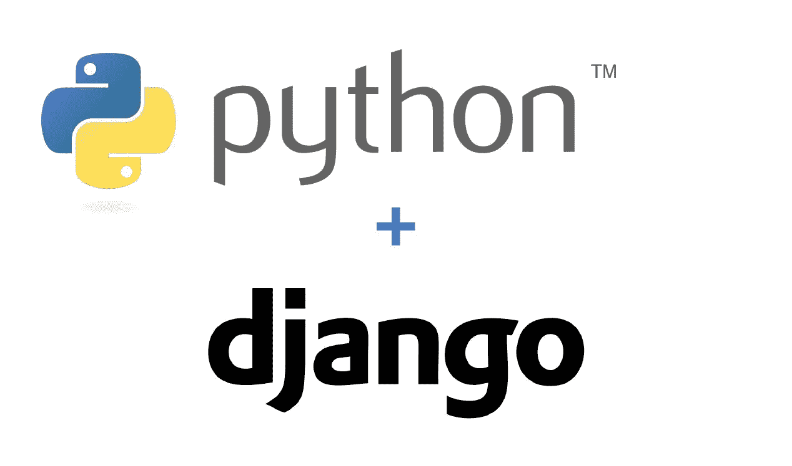

# 如何用 Django 创建功能齐全的电子商务网站

> 原文：<https://medium.com/analytics-vidhya/how-to-create-simple-e-commerce-website-with-django-step-1-of-5-42c6cca414c2?source=collection_archive---------0----------------------->

## 第 1 步，共 5 步:设置和配置



[https://www . shuup . com/WP-content/uploads/2017/12/python-plus-django-1 . jpg](https://www.shuup.com/wp-content/uploads/2017/12/python-plus-django-1.jpg)

> **注意:要学习本教程，你至少要理解 Django 以及 MVT(模型视图模板)的概念是如何在 Django 中工作的**

# **姜戈是什么？**

来自 Django:

> Django 是一个高级 Python Web 框架，它鼓励快速开发和干净、实用的设计。由经验丰富的开发人员构建，它解决了 Web 开发的许多麻烦，因此您可以专注于编写应用程序，而无需重新发明轮子。它是免费和开源的

# **什么是电子商务？**

来自 Shopify:

> 电子商务，也称为电子商务或互联网商务，是指使用互联网购买和销售商品或服务，以及转移资金和数据以执行这些交易。电子商务通常用来指网上销售实物产品，但它也可以描述通过互联网促进的任何类型的商业交易。


ERD 简单电子商务

# **先决条件**

*   Django 最新版本
*   Anaconda(可选)创建虚拟环境
*   软件包管理器 PIP
*   Visual Studio 代码(可选)广告代码编辑器
*   Mdb 模板电子商务(你可以在这里下载)

# **A .创建虚拟环境**

在我们在你的设备上安装 Django 框架之前，我们将创建一个虚拟环境。在本教程中，我将使用 Anaconda 创建一个虚拟环境:

```
$ conda create -name <my_env>
```

要激活虚拟环境，请使用以下命令:

```
$ conda activate <my_env>
```

要停用虚拟环境，请使用以下命令:

```
$ conda deactivate <my_env>
```

如果您没有安装 anaconda，我相信有很多教程可以帮助您创建一个。如果你不关心虚拟环境的东西，你可以跳到安装 Django

# B.安装 Django

在安装 Django 框架之前，确保你的虚拟环境已经激活。激活虚拟环境后，您可以继续学习本教程。

1.  运行这个命令来安装 Django(如果您不在虚拟环境中这样做，可以考虑运行 sudo)

```
$ pip install django
```

2.通过运行以下命令验证安装的 Django 版本:

```
$ django-admin --version
```

如果 django 的一个版本可见，则 django 安装正确

# C.创建项目

安装 django 框架后，您可以继续学习本教程。

1.  使用下面的命令创建一个项目:

```
$ django-admin startproject <project_name>
```

2.使用以下命令进入项目目录:

```
$ cd <project_name>
```

3.使用以下命令迁移管理数据库:

```
$ python manage.py migrate
$ python manage.py makemigrations
```

4.使用以下命令为管理员用户创建一个超级用户登录:

```
$ python manage.py createsuperuser
```

请随意填写您的用户名和密码

5.使用以下命令创建核心项目:

```
$ python manage.py startapp core
```

这个命令会给你一个名为 **core** 的目录。在这个**核心**目录中，我们将管理我们网站的核心

6.运行开发服务器:

```
python manage.py runserver
```

它会给你一个端口号，为你 django 应用服务。默认端口是 8000，因此它会给出 [http://localhost:8000/](http://localhost:8000/) ，最后在浏览器上导航到 [http://localhost:8000/](http://localhost:8000/) 。

# D.管理 Url 和模板

要管理应用程序的 URL，请遵循本教程:

1.  在名为 urls.py 的核心目录中创建名为的 python 文件

```
$ code core/urls.p
```

2.用命名模板和静态创建两个目录:

```
$ mkdir templates$ mkdir staic
```

*   对于**模板**目录，可以用这个文件填充目录:
    [https://github . com/andika 7/django ecommerce/tree/dd22 c 575 aaad4 c 859 b 02 BC 098 de 93 a 5264 D3 DC c8/templates](https://github.com/Andika7/DjangoEcommerce/tree/dd22c575aaad4c859b02bc098de93a5264d3dcc8/templates)，这是 mdb 模板的模板修改
*   对于**静态**目录，我们将用 mdb 模板中的资产填充该目录，或者只使用该文件:[https://github . com/andika 7/django ecommerce/tree/master/static](https://github.com/Andika7/DjangoEcommerce/tree/master/static)

3.对家的看法

打开核心目录中的 views.py 文件，并用以下脚本代码填充视图:

4.确保你的 <project_name>/settings.py 有这个脚本:</project_name>

然后运行下面的命令，它将收集静态文件成为资产文件，所以我们的模板可以使用 mdb 模板的样式:

```
$ python manage.py collectstatic
```

5.在我们刚才做的 core/urls.py 里面。填写此代码:

```
from django.urls import path
from . import views app_name = 'core' urlpatterns = [
    path('', views.home, name='home')
]
```

并且在 <project_name>/urls.py 中确保添加这一行代码:</project_name>

```
from django.contrib import admin
from django.urls import path, include urlpatterns = [
    path('', include('core.urls', namespace='core')), 
    path('admin/', admin.site.urls),
    path('accounts/', include('django.contrib.auth.urls'))
]
```

6.最后不要忘记运行你的服务器和刷新你的浏览器。它将显示电子商务网站的主页:


主页视图

# 此部分的源代码:

[https://github . com/andika 7/django ecommerce/commit/DD 22 c 575 aaad 4c 859 b 02 BC 098 de 93 a 5264 D3 DCC 8](https://github.com/Andika7/DjangoEcommerce/commit/dd22c575aaad4c859b02bc098de93a5264d3dcc8)

# 进行下一部分！

我希望本教程的第一部分对你有所帮助。在下一节课中，我们将创建一个数据库并将订单添加到购物车中