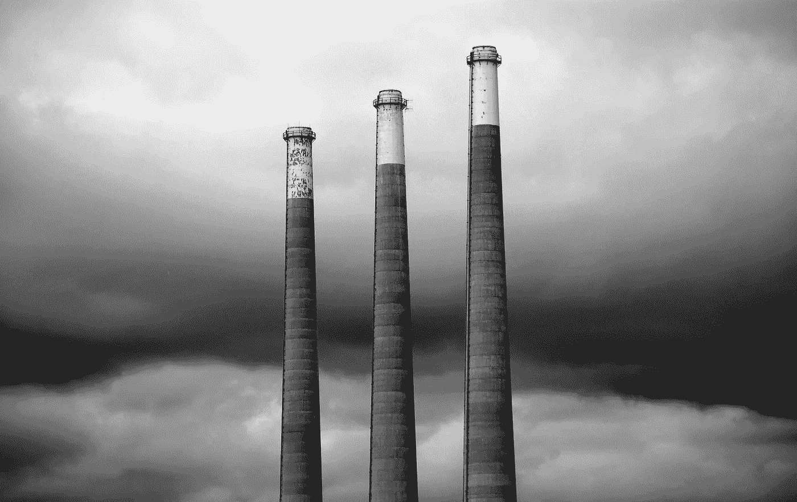
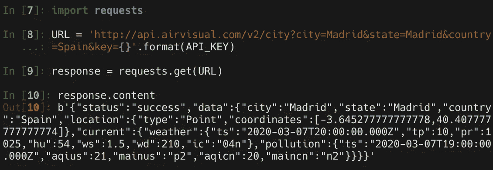
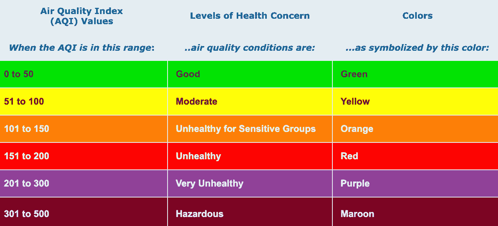
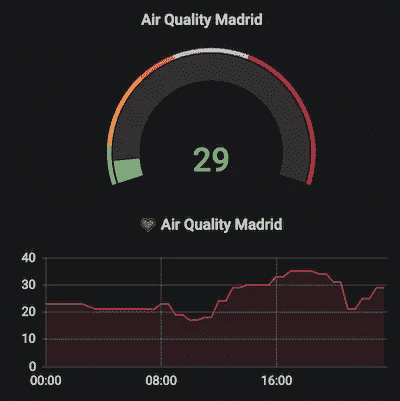
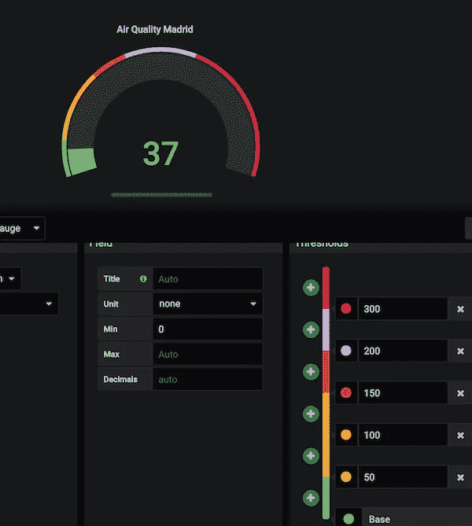
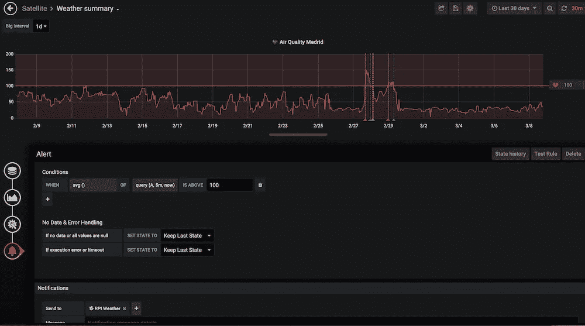
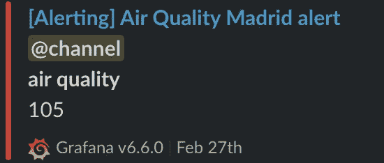

# 如何创建你的空气污染警报

> 原文：<https://medium.com/analytics-vidhya/how-to-create-your-air-pollution-alert-fe8ecb6b0cd6?source=collection_archive---------14----------------------->



马特·阿特兹在 [Unsplash](https://unsplash.com/s/photos/polution?utm_source=unsplash&utm_medium=referral&utm_content=creditCopyText) 上的照片

大家好，如今污染是一个热门话题。我住在马德里，空气污染是世界城市的大问题之一。为此，我决定创建自己的空气污染警报，我使用我的 [Grafana](https://grafana.com/) 服务器(托管在我的 **raspberry pi** 中)来创建警报，使用 *Python 脚本*来获取污染数据。

空气污染是每个试图解决它的人都头疼的问题。在我现在所在的城市马德里，政府正试图通过限制车辆在市中心的使用来控制这个问题。但在我看来，这还不够。我不确定在最短的时间内解决这个问题的最佳选择是什么。我认为为了达到更好的结果，人们需要被意识到。

我的小小贡献，除了不使用汽车，除非绝对必要，是创造一个小的 *Python 脚本*来检测高水平的污染。

首先，您需要在 [AirVisual](https://www.airvisual.com/) 中创建一个新帐户，以获得您的 **API 密钥**，这是必要的，因为这项服务将为我们提供污染水平。

```
API_KEY = 'YOUR_AIRVISUAL_API_KEY'
```

下一步非常简单，您只需要对 API 执行一个请求。

```
import requestsURL = 'http://api.airvisual.com/v2/city?city=**Madrid**&state=**Madrid**&country=**Spain**&key={}'.format(API_KEY)response = requests.get(URL)
```

我使用`/city`端点来获取特定城市的信息。如果你需要关于那个端点或其他端点的更多细节，请看官方的 API 文档。



太好了，现在我感兴趣的值是`aqius`

```
aqius = response.json()['data']['current']['pollution']['**aqius**']
```

基于美国环保局的 AQI 值是一个标准的[空气质量值](https://airnow.gov/index.cfm?action=aqibasics.aqi)，在下面的表格中你可以看到不同的等级。用这个 API 你可以得到其他空气质量标准值，比如 AQI CN。选择你想要的。在这篇文章中，我与美国环保署合作。



```
import requestsAPI_KEY = 'YOUR_AIRVISUAL_API_KEY'
city = 'Madrid'
state = 'Madrid'
country = 'Spain'
URL = 'http://api.airvisual.com/v2/city?city={}&state={}&country={}&key={}'.format(city, state, country, API_KEY)def get_aqius(response):
    return response['data']['current']['pollution']['aqius']aqius_level = get_aqius(requests.get(URL).json())
```

通过这个`aqius_level`，我们将发送到我们的 Grafana 服务器并配置我们的警报。很抱歉省略了其余的步骤，但是 Grafana 有太多的表单，无法向服务器发送信息。我更愿意把这一部分留给以后的另一篇文章。



为什么是格拉夫纳？我喜欢它，因为它功能多样，适合各种需求。但是在您的脚本中，您可以发送任何您想要的警报。

例如，这是我的仪表配置。我为每个不同的级别设置了阈值



我用一个图表来定义我的污染警报。当污染在 100 以上时，服务会向我的 **Slack** 发送消息。



下面是来自 **Slack** 的一个示例消息。



仅此而已。我邀请你用另一种服务创建你自己的提醒，例如电子邮件。

```
import smtplib, ssldef send_email(message):
    context = ssl.create_default_context()
    with smtplib.SMTP_SSL(smtp_server, port, context=context) as server:
        server.login(sender_email, password)
        server.sendmail(sender_email, receiver_email, message)
```

我经常使用 Grafana 板，将来我会创建更多关于不同信息来源的帖子，放在你们不同的板上。

感谢阅读，回头见。