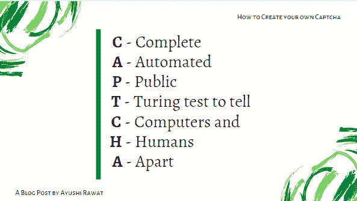

# 如何用 python 创建自己的验证码

> 原文：<https://medium.com/analytics-vidhya/how-to-create-your-own-captcha-with-python-3c04e55a5d3f?source=collection_archive---------3----------------------->

我们在互联网上进行日常活动。你一定经常在网上遇到验证码和验证码测试。任何希望限制机器人使用的网站都会使用验证码。你想知道如何创建一个吗？


您也可以跟随视频教程，以便更好地理解！

[https://www.youtube.com/watch?v=fAFIY_3OaO4](https://www.youtube.com/watch?v=fAFIY_3OaO4)

让我们看看这篇博客将会涵盖哪些内容:

# 内容:

*   什么是验证码
*   如何创建一个图像验证码
*   如何创建音频验证码

# 先决条件:

```
1\. Basic knowledge about Python
2\. Basic knowledge about CAPTCHA 
3\. CAPTCHA module
```

# 什么是验证码

CAPTCHA 代表:



它的主要动机是确定用户是真实的人类还是垃圾邮件机器人。验证码是单向转换的一个例子，也是一种在计算中用于确定用户是否是人类的挑战-响应测试。

最常见的形式是图像验证码。你会看到一个图像，如果你是一个真实的人，那么你需要在一个单独的字段中输入它的文本。

既然您已经了解了基础知识，我们可以开始了。

# 该编码了！

你可以在我的 [GitHub 库](https://github.com/ayushi7rawat/Youtube-Projects/tree/master/Create%20and%20Decode%20captcha/Create%20Image%20and%20Audio%20CAPTCHA)找到代码。一定要跟着走！

注意:我在这里使用了`Juyptr Notebook`,所以图像和音频验证码将在我的 python 文件所在的同一个文件夹中创建。

# 图像验证码

验证码以异化的方式呈现字符，需要解释。异化包括缩放、旋转、扭曲角色。它也可能涉及到字符与图形元素(如颜色、背景噪声、线条、弧线或点)的重叠。这种异化提供了针对文本识别算法不足的机器人的保护，但也可能难以为人类解释。


因此，第一步，我们需要验证码包，所以打开您的命令提示符，并运行以下命令。

```
pip install captcha
```

一旦完成，我们现在可以使用下面的命令`import the CAPTCHA`打包。

```
from captcha.image import ImageCaptcha
```

如果运行成功，您就可以开始了。接下来，我们将把它存储在一个变量中，并将其命名为`image`。我们还可以指定图像的尺寸，比如它的`height`或`width`。

```
image = ImageCaptcha(width = 280, height = 90)
```

接下来，让我们生成将在验证码中显示的字符或数字。我们将使用`generate method`来做同样的事情。

我们将在我们的`image`上调用 generate 方法，并将它存储在`data`中。我在这里使用`hello17world`作为我们的文本。您可以在这里使用自己的文本。

```
data = image.generate('hello17world')
```

最后，让我们用下面的命令把它写到一个文件中。我把它命名为`demo`。它将以`png`格式创建。

```
image.write('hello17world', 'demo.png')
```

我们完事了。很简单，不是吗？

让我们看看我们最终的结果会是什么样子。


现在，让我们看看如何创建一个**音频验证码*

# 音频验证码

音频验证码是作为一种替代方案开发的，它为视力受损的用户提供了辅助功能。这些验证码通常与基于文本或图像的验证码结合使用。音频验证码是用户输入的一系列字母或数字的音频记录。

这些验证码依赖于机器人无法从背景噪音中区分相关字符。像基于文本的验证码一样，这些工具对于人类和机器人来说都很难理解。

你可以在我的 [GitHub 库](https://github.com/ayushi7rawat/Youtube-Projects/tree/master/Create%20and%20Decode%20captcha/Create%20Image%20and%20Audio%20CAPTCHA)找到代码。


我们将使用下面的命令对`import the CAPTCHA`进行打包。

```
from captcha.audio import AudioCaptcha
```

如果运行成功，您就可以开始了。接下来，我们将存储它，并将其命名为`audio`。

```
audio = AudioCaptcha()
```

接下来，让我们生成将在音频验证码中使用的数字。我们将使用`generate method`做同样的事情。

我们将在`audio`上调用 generate 方法，并将它存储在`data`中。

```
data = audio.generate('789')
```

最后，让我们用下面的命令把它写到一个文件中。我把它命名为`demo2`。它将以`wav`格式创建。

```
audiofile.write('789','demo2.wav')
```

就是这样！你可以走了！

你可以在我的 [GitHub 库](https://github.com/ayushi7rawat/Youtube-Projects/tree/master/Create%20and%20Decode%20captcha/Create%20Image%20and%20Audio%20CAPTCHA)找到代码。

你可以在推特上和我联系。

我希望这有助于你理解如何创建自己的图像和音频验证码。如果你有任何疑问或建议，请在下面的评论区联系我。

你也会喜欢我的其他博客:

*   [Python 3.9:你需要知道的一切](https://ayushirawat.com/python-39-all-you-need-to-know)
*   [GitHub CLI 1.0:你需要知道的一切](https://ayushirawat.com/github-cli-10-all-you-need-to-know)
*   [如何用 Python 制作 insta gram Bot](https://ayushirawat.com/how-to-make-an-instagram-bot-with-python)
*   [网页抓取冠状病毒数据到 MS Excel](https://ayushirawat.com/web-scraping-coronavirus-data-into-ms-excel)
*   [如何制作自己的谷歌 Chrome 扩展](https://ayushirawat.com/how-to-make-your-own-google-chrome-extension-1)

下一篇文章再见！保重！