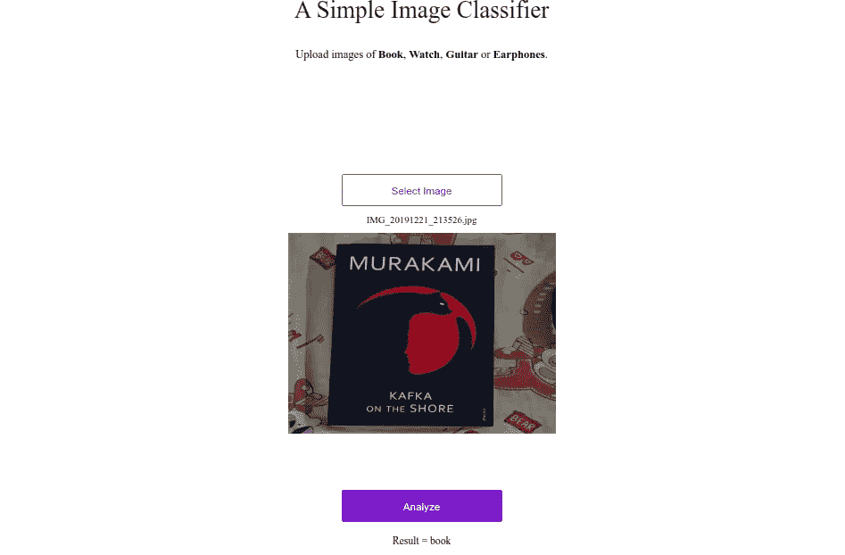

# 如何创建您自己的自定义图像分类器并将其部署到生产中

> 原文：<https://medium.com/analytics-vidhya/how-to-create-your-own-custom-image-classifier-and-deploy-it-to-production-5506bb26a74b?source=collection_archive---------2----------------------->



在本文中，我们将制作自己的自定义图像分类器。我们将使用 [fast.ai](https://docs.fast.ai/) 库来训练我们的深度学习模型。它是在 PyTorch 上构建的高级库，允许我们只使用几行代码来构建模型。

我们将在[谷歌实验室上训练我们的模型。](https://colab.research.google.com/)

可以查一下 [fast.ai](https://www.fast.ai/) 课程。真的很棒。

**需要的步骤是:**

1.  下载图像数据集
2.  加载并查看您的数据
3.  创建和训练模型
4.  解释结果
5.  用它做一个小的网络应用

# 下载图像数据

FastAI 库提供下载图像的功能，给定一个包含这些图像的 URL 的文件。

为了获得网址，你必须先去[谷歌图片](https://images.google.com/)，你需要搜索你选择的类别。确保广告拦截器被关闭，或者你可以尝试在隐姓埋名的模式。

我将选择我自己的类别，即书籍、手表、耳机和吉他。您可以搜索您的选择。所以你现在要做的就是，一个一个的搜索你的类别。搜索一个并向下滚动，直到加载了足够多的图像，然后从开发人员控制台执行以下 javascript 代码。

点击 *Ctrl+Shift+J* 打开你的开发者控制台。

[https://gist . github . com/TheCaffeineDev/5e 6 d0ff 9409344 f 88248 BD 8066226 f 68](https://gist.github.com/TheCaffeineDev/5e6d0ff9409344f88248bd8066226f68)


首先复制这些行并粘贴到您的控制台中，然后按 enter 键。图像文件的链接将作为名为 *download* 的文件下载。然后你需要把文件重命名为 *book.txt* 或者根据自己的喜好命名。然后对更多的课程重复以上步骤。

# 加载并查看您的数据

打开我的[谷歌实验室](https://colab.research.google.com/drive/1k7ZlyU1Ad84x_KxiJZj_hLKdpcU8gy8n)笔记本，我们进一步的步骤。打开笔记本后。运行前两个单元。


笔记本中的上述代码用于指定路径并创建相应的文件夹。

在笔记本中执行完上面的后，需要在笔记本中运行下面的单元格，并上传相应的。txt 文件。

```
from google.colab import files
book = files.upload()
```

你需要上传。txt 文件也适用于其他类。

现在上传完所有文件后，需要逐个执行其他单元格。


这段代码要做的是，它将读取文本文件中的 URL，并将图像下载到 Colab 中。

下载完这些图片后，我们需要删除无法打开的图片。

上面的代码将为我们做这件事。这个 *verify_images* 函数会查找图像，看看它是否有问题，然后 *delete =True* 会帮你删除它。因此，这是清理数据的一个非常好且简单的方法。

[https://gist . github . com/TheCaffeineDev/66 C2 fdbb 4669 da 4540 FBA 144604884 cc](https://gist.github.com/TheCaffeineDev/66c2fdbb4669da4540fba144604884cc)

fast.ai 库拥有名为 *databunch* es 的特定数据对象。它有助于在适当的文件夹结构中读取我们的数据集，这有助于随机创建验证数据。你可以在他们的文件中读到更多关于 https://docs.fast.ai/的内容。


我们有一大堆数据。所以你可以看看`data.classes`里面，你会看到这些是我们创建的文件夹。所以它知道类别(我们所说的类别是指所有可能的标签)是书、手表、耳机&吉他。

然后你需要在笔记本中运行下面的一些代码。我对代码进行了注释，以便人们更容易了解和理解。

# 创建模型和初始培训

fastai 库允许您用几行代码创建模型，并通过他们提供的[*create _ l*](https://docs.fast.ai/vision.learner.html#create_cnn)*carrier*方法训练 CNN 模型。

```
learn = cnn_learner(data, models.resnet34, metrics=error_rate)
```

这个 cnn_learner 方法需要两个参数，数据和架构，它还支持许多其他参数。

创建的模型使用 [resnet34 架构，](https://arxiv.org/pdf/1512.03385.pdf)在 [imagenet 数据集](http://www.image-net.org/)上预训练权重。


训练模型的是 *fit_one_cycle* 方法。它使用一种叫做 [**1 周期策略**，](https://sgugger.github.io/the-1cycle-policy.html)的东西，这种策略基本上是随着时间的推移改变学习速率，以达到更好的结果。

然后我们保存模型。训练模型不会超过 5 分钟。

# 解释

最后，我们可以使用 FastAIs*ClassificationInterpretation*类来解释我们的结果。


在运行所有单元和训练模型之后。模型文件将被导出，您可以下载重量文件并将其用于推理和生产。


您可以通过进入侧边菜单并浏览文件夹来下载重量文件。点击下载后，它会在几分钟内下载。

# 为我们的图像分类器制作一个小的网络应用程序

首先克隆我的 Github 库

```
git clone [https://github.com/TheCaffeineDev/Custom-Image-Classifier](https://github.com/TheCaffeineDev/Custom-Image-Classifier)
```

克隆后，通过以下方式进入文件夹

```
cd Custom-Image-Classifier
```

然后通过以下方式安装所有依赖项

```
pip3 install -r requirements.txt
```

之后，里面会有一个名为 models 的文件夹，你需要把你的 *export.pkl* 文件放在那里。这是文件夹的路径。

```
Custom-Image-Classifier/app/models/ 
```

复制文件后，您可以通过以下方式运行服务器

```
# In Custom-Image-Classifier folder runpython3 app/server.py serve 
```

几秒钟后，它将在您的本地服务器上运行。


以下是我的模型的一些推论结果


-

如果你正确地遵循了上述步骤，你将能够很容易地创建你的图像分类模型。

本文涵盖的代码可以从 [Github 资源库获得。](https://github.com/TheCaffeineDev/Custom-Image-Classifier)

如果你有任何问题、建议或批评，可以通过[推特](https://twitter.com/thecaffeinedev)或我的[邮件](mailto:prabhat1015@gmail.com)联系我。请随时联系我。

## 参考资料:

1.  [https://course.fast.ai/](https://course.fast.ai/)
2.  [https://course.fast.ai/deployment_google_app_engine.html](https://course.fast.ai/deployment_google_app_engine.html)