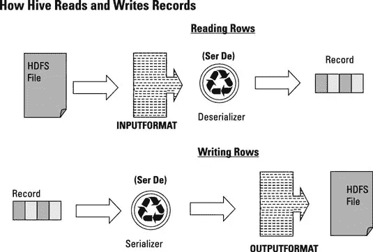

# 如何创建自己的 Hive SerDe — Hive 自定义数据序列化-反序列化机制

> 原文：<https://medium.com/analytics-vidhya/how-to-create-your-own-hive-serde-871fe675635?source=collection_archive---------12----------------------->

正如我之前的博客文章[中提到的， **SerDe** **是 hive 用来** **反序列化**(从表的 hdfs 位置读取数据，然后将其转换为 java 对象)和**序列化数据**(使用 ObjectInspector 将表示每个数据记录的 Java Objec **t** 转换为可写格式，该格式可以写入 hdfs 位置)。](/@galeguy02/limitation-of-hive-data-validation-1eec015e5ca6)



一张图展示了 hive 如何使用 SerDe 读写记录。引用自[*http://www . dummies . com/programming/big-data/Hadoop/defining-table-record-formats-in-hive/*](http://www.dummies.com/programming/big-data/hadoop/defining-table-record-formats-in-hive/)

# SerDe 的类型

默认情况下，hive 使用一个名为 LazySimpleSerDe 的 SerDe:

```
 **org.apache.hadoop.hive.serde2.LazySimpleSerDe** 
```

当您在表格创建过程中指定了一个"**文本文件"**格式作为"**存储为"**属性的一部分时。然而，还有其他类型 SerDe，包括 OpenCSV SerDe。

```
**org.apache.hadoop.*hive*.serde2.OpenCSVSerde**
```

在这种情况下，当您必须将表格存储为 csv 格式时，可以使用它。如果您使用 cloudera，它会附带一些名为 JSONSerDe 的自定义 SerDe。

```
**com.cloudera.hive.serde.JSONSerDe**
```

它们能够使用 JSON 格式读写您的数据。

然而，如果您能够创建自己的 SerDe，您将获得更大的灵活性。当您想将它用于特殊的用例时，这可以被证明是有用的。

> 所以这篇文章的目的是帮助你开发你自己的定制服务器。

# 如何实现自定义 SerDe

为了创建一个自定义的 SerDe，你必须首先实例化一个实现 SerDe 接口的类。

然后实例化如下所示的变量:

正如您在这里看到的，每个变量都有自己的用途:

1.  **separatorChar:** 代表字段分隔符的变量。当您在 Hive 表位置存储一个文本文件时，Hive 需要知道应该使用哪个字段分隔符来正确地分隔字段。如果未设置此参数，默认分隔符将设置为 tab。
2.  **row TypeInfo:**It**存储一个类型为 StructTypeInfo 的对象，其中包含每个字段的信息，包括名称和类型(type info)。**
3.  ****rowOI:** 它存储 ObjectInspector 类型的对象，该对象用作表示每一行的占位符。**
4.  ****colNames:** 它存储一个列名列表。**
5.  ****row:** 它存储一个 java 对象的列表，该列表包含一行中每个字段的值。**

**SerDe 接口还要求你实现一些必要的方法，如下所示，以确保它在执行时能够正常工作。**

# **SerDe 要求的方法**

**您可以看到，为了让您的自定义 SerDe 类工作，您必须首先实现一些必需的方法。让我们一个一个地过一遍。**

****初始化****

**该方法用于实例化所有重要的属性，例如列名列表、列类型列表和 ObjectInspector 对象，该对象是用于存储行和列信息的占位符。**

****解串****

**需要将一个**可写的**字节数组格式转换成一个 java 对象。**

****parseField****

****这个方法在这里是最重要的，因为 Hive 使用它来获取和验证每个数据字段中的数据类型。**因此，这个方法让您能够自定义自己的数据验证规则。**

****连载****

**这个方法对于将 java 对象转换为可写字节数组格式很重要。**

****getObjectInspector****

**顾名思义，该方法用于获取表示每个数据记录的 ObjectInspector 对象。**

**您可以在下面找到完整的代码。**

**最后，您必须将 java 类编译成 jar 文件，然后在创建表时将其附加到 hive 查询中。**

# **结论**

**所以这就是你实现你自己的 SerDe 所需要的。希望这篇文章能帮助你创建你自己的自定义 SerDe，并在你需要的时候做一些数据验证。您可以使用它做任何事情，包括实现 json 文件读写机制，正如您在互联网上的其他文章中看到的那样。**