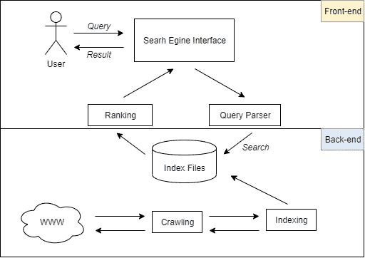

# 如何用 Python 语言和 Laravel 框架创建自己的搜索引擎第 1 步，共 4 步

> 原文：<https://medium.com/analytics-vidhya/how-to-create-your-own-search-engine-with-python-language-and-laravel-framework-step-1-of-4-f25e5ba1ab92?source=collection_archive---------9----------------------->


[https://99 firms . com/WP-content/uploads/2019/10/99 firms-Search-Engine-Statistics-2019 . jpg](https://99firms.com/wp-content/uploads/2019/10/99firms-Search-Engine-Statistics-2019.jpg)

# 步骤 1:通用搜索引擎应用程序架构

# 什么是搜索引擎？

搜索引擎基本上是设计用来在数据库中搜索与用户给定的查询相匹配的项目的程序。



搜索引擎应用程序的图表结构

在上面的图表结构中，可以看到搜索引擎应用程序有两个方面**后端**和**前端。**

**后端**端收集**数据**集并索引**数据**集，而**前端**端管理搜索引擎接口并向后端提供查询用于**排序**

**后端** ***爬取*** *通常指处理大型* ***数据****——将自己开发的爬虫(或僵尸程序)设置在哪个***爬取网页的最深处。****索引*** *被定义为一种数据结构技术，它允许你从数据库文件*中快速检索记录*

***前端** ****查询*** *是指用户使用一个关键字从* ***数据*** *集合中找到一个用户想要的数据。在* ***标引*** *过程中每一个* ***数据****-集合对每一个词都有一个分数查询，这个分数计算的结果将决定* ***的排名*** *的每一个数据集合***

# **建立**

**我们将在以下环境中开发它:**

*   **Python 3.x.x
    我们将使用 Python 语言作为后端编程**
*   **Scrapy 1.8.0
    Scrapy 将用于从另一个网页收集数据集，并使它们成为我们的数据集**
*   **Laravel 6.0
    这个基于网络的搜索引擎应用将使用 Laravel 作为它的框架**

# **安装要求**

1.  ****安装 Python 和 Scrapy****

**你可以在官方网站[python.org](https://www.python.org/)下载最新的 python。
通过键入以下命令检查 Python 3 的安装版本:**

```
**python3 -V//Output
Python 3.7.2** 
```

**要管理 Python 的软件包，安装 **pip** ，这是一个工具，它将安装和管理在您的项目中使用的库或模块。**

```
**sudo apt install -y python3-pip**
```

**可以通过键入以下命令来安装 Python 包:**

```
**pip install package_name**
```

**在这里，`package_name`可以指任何 Python 包或库。所以如果你想安装 Scrapy，你可以用命令`pip install scrapy`来完成。**

****2** 。**安装拉韦勒框架****

**Laravel 利用 [Composer](https://getcomposer.org/) 来管理它的依赖关系。因此，在使用 Laravel 之前，请确保您的机器上安装了 Composer。**

**您可以在终端中发出 Composer `create-project`命令来安装 Laravel:**

```
**composer create-project --prefer-dist laravel/laravel SearchEngine**
```

# **进行下一部分！**

**我希望本教程的第一部分对你有所帮助。我们学习了什么是搜索引擎以及它是如何工作的。**

**在下一部分中，我们将使用 Python Scrapy 从另一个网页收集数据集，并让我们的搜索引擎开始工作！**

****第二部分**:[https://medium . com/analytics-vid hya/how-to-create-your-own-search-engine-with-python-language-and-laravel-framework-step-2-of-4-1e 356 E0 efb 90](/analytics-vidhya/how-to-create-your-own-search-engine-with-python-language-and-laravel-framework-step-2-of-4-1e356e0efb90)**

****第三部分**:[https://builtin . com/machine-learning/index-based-search-engine-python](https://builtin.com/machine-learning/index-based-search-engine-python)**

****第四部分**:[https://medium . com/analytics-vid hya/how-to-create-your-own-search-engine-with-python-language-and-laravel-framework-step-4-of-4-4e 91 cf 2557d 6](/analytics-vidhya/how-to-create-your-own-search-engine-with-python-language-and-laravel-framework-step-4-of-4-4e91cf2557d6)**