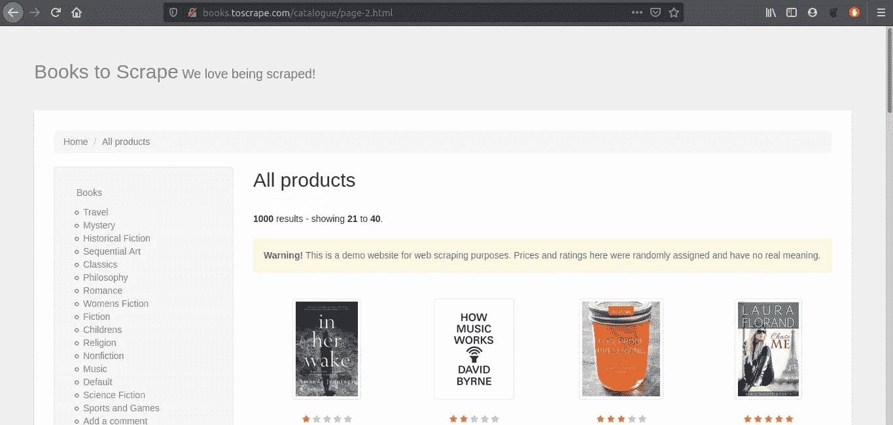

# 如何用 Python 语言和 Laravel 框架创建自己的搜索引擎第 2 步，共 4 步

> 原文：<https://medium.com/analytics-vidhya/how-to-create-your-own-search-engine-with-python-language-and-laravel-framework-step-2-of-4-1e356e0efb90?source=collection_archive---------8----------------------->

步骤 2:使用 Python Scrapy 进行数据爬行


[https://i.ytimg.com/vi/ve_0h4Y8nuI/maxresdefault.jpg](https://i.ytimg.com/vi/ve_0h4Y8nuI/maxresdefault.jpg)

在这一部分，我将编写一个网络爬虫，它将从[书籍中抓取数据来抓取](http://books.toscrape.com/index.html)网站。但是在我开始写代码之前，先简单介绍一下 Scrapy 本身。

# 什么是 Scrapy？

来自[维基百科](https://en.wikipedia.org/wiki/Scrapy):

> Scrapy(发音为 skray-pee)是一个免费的开源网络爬行框架，用 Python 编写。最初是为 web 抓取而设计的，它也可以用于使用 API 提取数据，或者作为通用的 web 爬虫。它目前由 Scrapinghub Ltd .维护，这是一家网络抓取开发和服务公司。

# 先决条件

因此，与上一部分一样，在本部分教程中，您应该具备:

*   python 3.x.x
*   软件包管理器 PIP
*   代码编辑器(在本教程中，我将使用 Visual Studio 代码，可选)

# 安装刮刀

现在，在我们开始我们的第一个 Scrapy 项目之前，我们需要安装 Scrapy，所以打开您的终端并键入:

```
pip install scrapy
```

# 开始你的第一个项目

在您的终端中键入:

```
scrapy startproject <project_name>
```

其中 *< project_name >* 是项目名称，想怎么叫就怎么叫。但是在本教程中，我将使用“web_scrap”

# 杂乱的项目结构

在我们开始刮削过程之前，我们最好知道 scrapy 项目的结构


Scrapy 项目的结构

如运行 ***startproject*** 命令后所见，scrapy 将自动创建项目。但是在新创建的项目中，你不会看到文件**"*book _ list . py*"**，因为它是手动创建的用于抓取的文件。而 **" *book.json* "** 这是不是一个刺儿头过程的结果。

# 制作杂乱的脚本

和前面项目的结构一样，我们将在***【蜘蛛】*** 目录下为 scrapy 创建一个脚本。在本教程中，我创建了一个名为“ **book_list.py** ”的剪贴簿脚本。如果您有 VS 代码，只需键入:

```
code <project_name>/spiders/book_list.py
```

用这个脚本填充你的空白脚本:

book_list.py

# 介绍剧本

```
import scrapy
import jsonfilename = "book.json"  # To save store data
```

在这一行中，代码是声明废料和确定输出文件的地方。在本教程中，我将输出文件导出到 JSON 格式文件。

```
*class* IntroSpider(*scrapy*.*Spider*):
    name = "book_spider"     # Name of the scraper
```

“ ***名称*** ”属性描述了要创建的蜘蛛废料的名称。您可以使用其他名称来代替。**名称**类属性，基本上我们用来从命令行调用或启动蜘蛛记住在 Scrapy 中每个蜘蛛都应该有一个唯一的名称。

```
urls = ['http://books.toscrape.com/catalogue/page-{x}.html'.format(x=x) for x in range(1, 50) ]
```

URL 列表，我们用它来指定我们想要抓取的网站/页面。

另一个是负责解析 DOM 的 **parse** 方法，我们在这里编写 CSS 选择器表达式来提取数据。

```
book_list = response.css('article.product_pod > h3 > a::attr(title)').extract()  # accessing the titleslink_list = response.css('article.product_pod > h3 > a::attr(href)').extract()  # accessing the title linksprice_list = response.css('article.product_pod > div.product_price > p.price_color::text').extract() # accessing the priceimage_link = response.css('article.product_pod > div.image_container > a > img::attr(src)').extract()  # accessing the image links
```

要得到你所需要的 CSS 选择器，你只需要访问网站并做这些事情。

*   打开网站



[http://books.toscrape.com/catalogue/page-2.html](http://books.toscrape.com/catalogue/page-2.html)

*   按下键盘上的“***”CTRL+Shift+I***”，或者你可以点击鼠标右键，在浏览器上选择“检查元素”


*   最后右键点击你想抓取的代码行，复制 CSS 选择器。然后你得到 CSS 选择器路径，或者你可以复制 CSS 路径，然后自己修改成 CSS 选择器

最后，我们希望用下面的代码将输出写入 JSON 文件:

```
i=0;
for book_title in book_list:
  data={
       'book_title' : book_title,
       'price' : price_list[i],
       'image-url' : image_link[i],
       'url' : link_list[i]
   }
  i+=1
  list_data.append(data)with open(filename, 'a+') as f:   # Writing data in the file
   for data in list_data :
   app_json = json.dumps(data)
   f.write(app_json+"\n")
```

这一行代码的 JSON 格式的结果是:

```
{ "book_title": "the title", "price": "the price", "image-url": "the image url", "url" : "the title url" }
```

# 执行 Scrapy

在执行你的 scrapy 之前，你必须在项目目录中，所以从命令行或你的终端导航到你的项目文件夹

```
cd <project_name>
```

现在，在命令行中，您可以使用以下命令启动蜘蛛

```
scrapy crawl <spider_name> 
```

<spider_name>是从" ***name*** "属性中早先得到的，所以在我的例子中我将运行:</spider_name>

```
scrapy crawl book_spider
```

# 输出


book.json

如果成功，您将得到名为“ **book.json** 的输出结果，其中包含我们创建搜索引擎所需的数据集

# 参考:

代号:[https://github.com/Andika7/searchbook](https://github.com/Andika7/searchbook)

# 进行下一部分！

我希望本教程的第二部分对你有所帮助。我们学习了用 Python Scrapy 收集数据集

在下一部分，我们将使用 Python 编程语言制作索引器和查询脚本

请参考该部分的链接:

**第一部分**:[https://medium . com/analytics-vid hya/how-to-create-your-own-search-engine-with-python-language-and-laravel-framework-step-1-of-4-f 25 e 5 ba 1 ab 92](/analytics-vidhya/how-to-create-your-own-search-engine-with-python-language-and-laravel-framework-step-1-of-4-f25e5ba1ab92)

**第三部分**:[https://builtin . com/machine-learning/index-based-search-engine-python](https://builtin.com/machine-learning/index-based-search-engine-python)

第四部分:[https://medium . com/analytics-vid hya/how-to-create-your-own-search-engine-with-python-language-and-laravel-framework-step-4-of-4 e 91 cf 2557d 6](/analytics-vidhya/how-to-create-your-own-search-engine-with-python-language-and-laravel-framework-step-4-of-4-4e91cf2557d6)