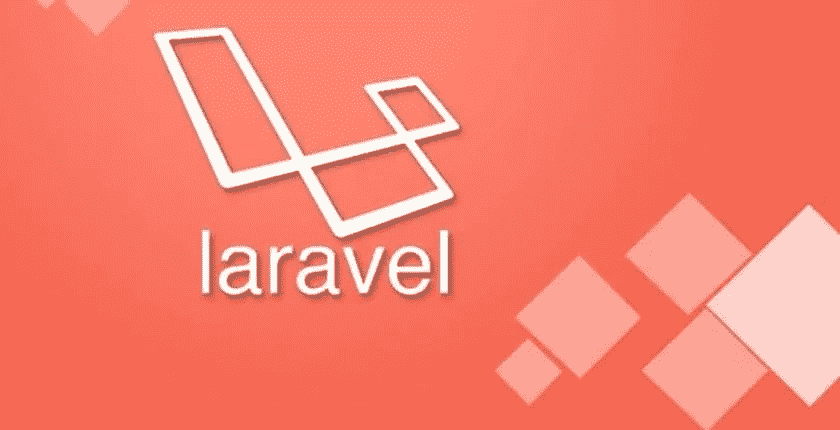
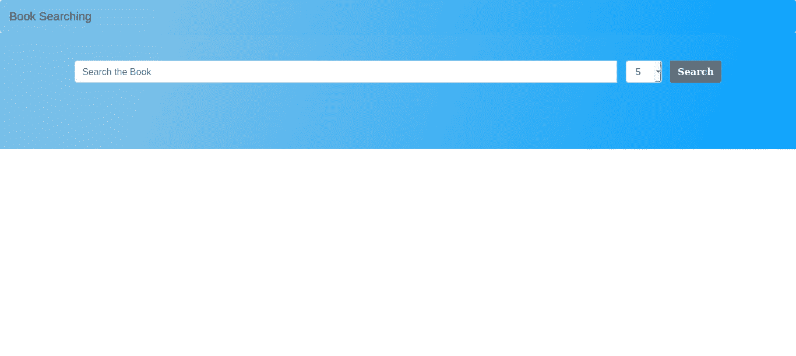
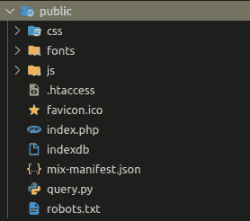
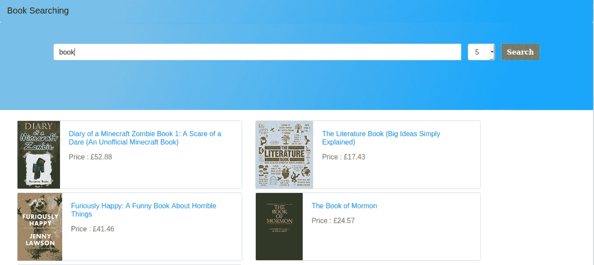

# 如何用 Python 语言和 Laravel 框架创建自己的搜索引擎

> 原文：<https://medium.com/analytics-vidhya/how-to-create-your-own-search-engine-with-python-language-and-laravel-framework-step-4-of-4-4e91cf2557d6?source=collection_archive---------4----------------------->

## 第 4 步，共 4 步

步骤 4:实现从 Python 语言到 Laravel 框架的索引和查询



[https://belajarphp . net/WP-content/uploads/2019/03/upload-file-laravel-840 x430 . jpg](https://belajarphp.net/wp-content/uploads/2019/03/upload-file-laravel-840x430.jpg)

# 什么是 Laravel？

来自维基百科:

> **Laravel** 是一个[免费](https://en.wikipedia.org/wiki/Free_software)、开源的 [PHP](https://en.wikipedia.org/wiki/PHP) [web 框架](https://en.wikipedia.org/wiki/Web_framework)，由 Taylor Otwell 创建，旨在开发遵循[模型-视图-控制器](https://en.wikipedia.org/wiki/Model%E2%80%93view%E2%80%93controller) (MVC) [架构模式](https://en.wikipedia.org/wiki/Architectural_pattern)并基于 [Symfony](https://en.wikipedia.org/wiki/Symfony) 的 web 应用。

所以基本上 laravel 是开源的 PHP web 框架，带有 MVC 的概念。MVC 或**模型视图控制器**是一种基于组件分离应用程序的软件方法。

*   模型:数据结构的模型表示
*   视图:是控制向用户显示的部分
*   控制器:控制器是模型和视图之间的桥梁。但是基本上我们使用控制器作为后端

在本教程中，我们不会使用控制器作为桥梁，因为我们不会在我们的应用程序中实现模型。为什么不实现模型？你知道像数据库这样的数据结构的模型表示，但是在我们的例子中，我们使用 python 语言创建了我们自己的数据结构。

# 先决条件

因此，与上一部分一样，在本部分教程中，您应该具备:

*   设计者
*   Laravel 6.x.x
*   NPM 和 Node.js
*   JQuery(我们将使用 JQuery 中的 ajax)
*   上一教程中的查询脚本和索引文件
*   代码编辑器(在本教程中，我将使用 Visual Studio 代码，可选)

# 安装 Laravel

Laravel 利用 [Composer](https://getcomposer.org/) 来管理它的依赖项。因此，在使用 Laravel 之前，请确保您的机器上安装了 Composer。

您可以通过在终端中发出 Composer `create-project`命令来安装 Laravel:

```
$ composer create-project --prefer-dist laravel/laravel SearchBook
```

“ **SearchBook** ”是我做的一个项目名，你可以用自己的改。

如果安装成功，您将看到以您的项目名称命名的目录。用代码编辑器打开您的项目

> **注意:如果您的机器中安装了 Npm 和节点 Js，您可以直接跳到“Npm 设置”**

# 安装 Npm 和节点 Js

在安装 npm 和 Node js 之前，通过打印它们的版本来验证 Node.js 和 Npm 是否已安装在您的计算机中:

```
$ npm -v$ node -v
```

如果您没有 npm 和节点 js，您可以按照以下步骤操作:

1.  以拥有 sudo 权限的[用户身份运行下面的](https://linuxize.com/post/how-to-create-a-sudo-user-on-ubuntu/)`[curl](https://linuxize.com/post/curl-command-examples/)`来启用节点源存储库:

```
$ curl -sL https://deb.nodesource.com/setup_10.x | sudo -E bash -
```

该命令会将 NodeSource 签名密钥添加到您的系统中，创建一个 apt 源存储库文件，安装所有必需的包并刷新 apt 缓存。

如果您需要安装另一个版本，例如 12.x，只需将`setup_10.x`更改为`setup_12.x`

2.启用节点源存储库后，通过键入以下命令安装 Node.js 和 npm:

```
$ sudo apt install nodejs
```

nodejs 包包含了`node`和`npm`二进制文件。

3.通过打印 Node.js 和 npm 的版本，验证它们是否已成功安装

# Npm 设置

确保您在您的项目目录中，如果没有运行此命令

```
$ cd <project_name>
```

使用以下命令在项目中设置 npm

```
$ npm install
```

请稍等片刻，安装完成后运行以下命令:

```
$ npm run dev
```

此命令用于加载项目中安装的 npm 模块

# 使用 Npm 安装 Bootrap 4

要安装 bootrao，只需在终端项目中键入以下命令:

```
$ npm install bootstrap
```

并用以下代码填充目录“resource/sass/app.scss”中的 app.scss:

```
// bootsrap
@import "node_modules/bootstrap/scss/bootstrap";
```

用 run dev 命令加载你的模块

```
$ npm run dev
```

# 开始你的旅行

要在项目目录终端中启动您的 laravel，请运行以下命令:

```
$ php artisan serve//Output
Laravel development server started: [http://127.0.0.1:8000](http://127.0.0.1:8000)
```

只需在浏览器中打开已启动的服务器" [http://127.0.0.1:8000](http://127.0.0.1:8000) "

# 在 Laravel 中创建视图搜索页面

要让 view 在您的目录“resources/views/landing.blade.php”中添加一个名为“landing . blade . PHP”的文件。确保在你的名字中添加刀片

用此代码填充视图 landing.blade.php

landing.blade.php

并将文件“routes/web.php”中的默认路由更改为以下代码:

```
*Route*::get('/', *function* () {
    return view('landing');
});
```

如果在浏览器中刷新项目，您将看到:



搜索引擎界面

我们将使用 ajax 在不刷新页面的情况下实时显示数据，所以您只需在“lading.blade.php”视图中添加以下代码:

编写 ajax 搜索书脚本

# 在 Laravel 中进行控制器搜索

所以在 ajax 代码中你会看到，我们运行“/search？q=**&rank=** "在我们的 ajax if 搜索按钮上点击。因此，在您的路由文件中添加以下代码:

```
*Route*::get('search', [
   'as' => 'search', 'uses' => 'LandingController@search'
]);
```

这段代码创建了一个到控制器“**着陆控制器**”中的函数“**搜索**”的获取路径。所以我们将制作一个名为“ **LandingController** 的控制器，只需运行这个命令:

```
$ php artisan make:controller LandingController
```

它将在您的项目中创建一个控制器文件，并在“app/Http/Controllers/landing controller . PHP”中打开文件控制器。用以下代码填充控制器:

LandingController.php

在代码中你会看到一个“**搜索**功能代码，当用户按下搜索按钮时，这个代码将由 ajax 执行

```
$query = $request->input('q');
$rank = $request->input('rank');
```

从您的视图代码中获取您的**查询**和**排名**值的代码

为了在 php 中运行 python 代码，我们将使用以下代码:

```
$process = new *Process*("
    python3 query.py indexdb {$rank} \"{$query}\"
");$process->run();
```

它将在我们的公共目录中执行 query.py。所以在我忘记之前，将您的**查询**脚本和**索引**文件复制到您的 laravel 项目的公共目录中



查询脚本和索引数据库文件

你会得到输出过程:

```
$list_data = array_filter(explode("\n",$process->getOutput()));
```

该代码将在终端中获得您的进程输出，并将其更改为列表数组数据。列出数据。数据列表将是 json 格式的，所以你必须先解码它，要编码我用这个代码:

```
$dataj =  json_decode($book, true);
```

所以你只需用 php 代码填充一个$data 变量，它就会用你从查询中得到的数据显示在你的视图中。最后用以下代码从 ajax 发送数组变量:

```
echo json_encode($data);
```

在您的 ajax 视图 landing.blade.php 中，您可以看到以下代码:

```
$.ajax({
   url:'/search?q='+cari+'&rank='+rank,
   dataType : "json",
   success: *function*(*data*){
       $('#content').html(data);
   },
   error: *function*(*data*){
       alert("Please insert your command");
   }
});
```

在您可以看到的代码中，我只是将 id " **#content** "页面 html 更改为我们的数据，它将从 **LandingController** 中的**搜索**函数中获取

所以你的搜索引擎应用程序现在基本上可以使用了

# **截屏演示流程**



截屏测试搜索流程

# 参考:

代号:[https://github.com/Andika7/searchbook](https://github.com/Andika7/searchbook)

# 结束语！

我希望本教程的最后一部分对你有所帮助。我们学习如何用 laravel 框架和 python 语言制作自己的搜索引擎

所以到了这一部分，教程“如何用 Python 语言和 Laravel 框架创建自己的搜索引擎”也就结束了。谢谢你看完

另一部分请参考此链接。

**第一部分:**[https://medium . com/analytics-vid hya/how-to-create-your-own-search-engine-with-python-language-and-laravel-framework-step-1-of-4-f 25 e 5 ba 1 ab 92](/analytics-vidhya/how-to-create-your-own-search-engine-with-python-language-and-laravel-framework-step-1-of-4-f25e5ba1ab92)

第二部分:[https://medium . com/analytics-vid hya/how-to-create-your-own-search-engine-with-python-language-and-laravel-framework-step-2-of-4-1e 356 E0 efb 90](/analytics-vidhya/how-to-create-your-own-search-engine-with-python-language-and-laravel-framework-step-2-of-4-1e356e0efb90)

**第三部分**:[https://builtin . com/machine-learning/index-based-search-engine-python](https://builtin.com/machine-learning/index-based-search-engine-python)