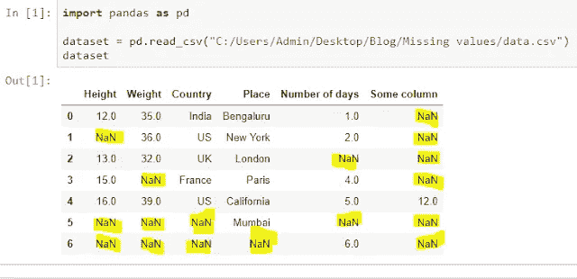
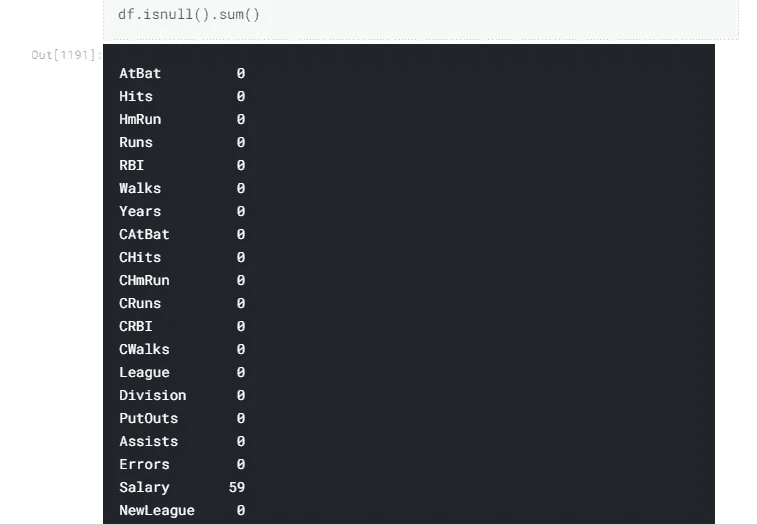
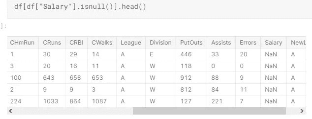
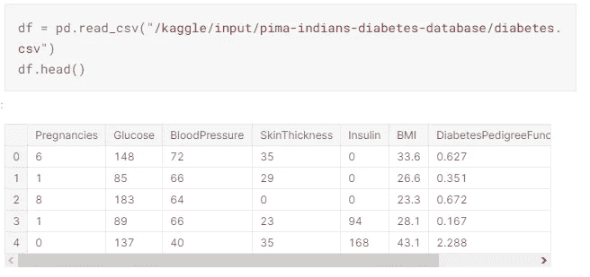
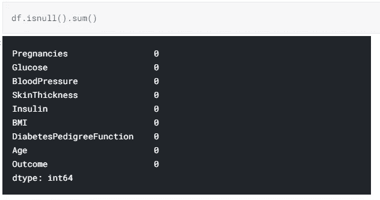
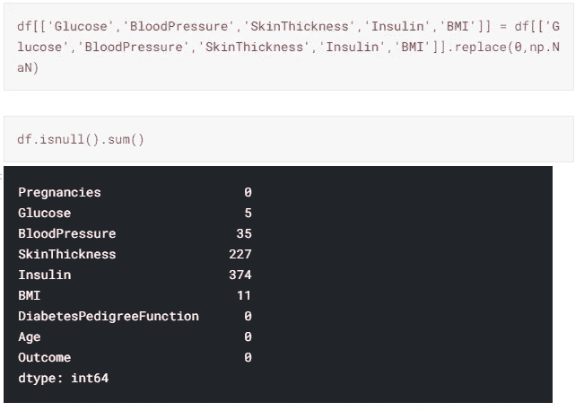

# 如何处理数据集中的缺失值

> 原文：<https://medium.com/analytics-vidhya/how-to-deal-with-missing-values-in-your-dataset-4bb7b7df5764?source=collection_archive---------18----------------------->

处理缺失数据是数据管理过程的重要组成部分，是所有数据科学项目不可或缺的一部分。不完整的观察会对机器学习算法的操作产生不利影响，因此数据科学家必须制定适当的程序来正确管理这种情况。数据插补就是这样一种程序，它是根据其他数据填补缺失值的过程。

在本文中，让我们看看以下处理缺失数据的方法。

# **1-如何识别缺失值？**

我们可以使用 pandas 函数检查数据集中的空值，如下所示:

但是，有时，识别丢失的值可能没有这么简单。人们需要使用领域知识并查看数据描述来理解变量。例如，在下面的数据集中，isnull()不显示任何空值。

在此示例中，有些列的最小值为零。在某些列中，零值没有意义，表示值无效或缺失。

仔细分析特征后，以下各列具有无效的零最小值:

1.  血浆葡萄糖浓度
2.  舒张压
3.  三头肌皮褶厚度
4.  2 小时血清胰岛素
5.  体重指数

我们需要用代表缺失数据的 Nan 值替换上面的 0 值，然后有必要单独检查。

# **2-缺失数据类型**

有三种类型的缺失数据:

**1-缺失不是随机的- MNAR:** 当数据为 MNAR 时，数据缺失的事实是与未观察到的数据系统相关的，即缺失与研究者未测量到的事件或因素相关。

**2-随机缺失- MAR:** 当数据被 MAR 时，数据缺失的事实与观察到的数据系统相关，而与未观察到的数据无关。

**3-完全随机缺失- MCAR:** 当数据为 MCAR 时，数据缺失的事实与观测数据和未观测数据无关。

# **3-如何处理缺失值？**

**1-删除缺失值**

在这种方法中，所有缺失的数据都从数据集中删除。但是，如果数据集中有足够的数据来解释因变量，则推荐使用这种方法。否则擦除后我们拥有的数据可能不够我们用。

**2-删除变量**

*   如果数据是 MCAR 或马尔，并且要素中缺失值的数量非常多，则该要素应排除在分析之外。如果某个特征或样本的缺失数据超过 5%,那么您可能应该忽略该特征或样本。
*   如果案例或观察结果缺少目标变量的值，建议删除因变量，以避免人为增加与自变量的关系。

**3-平均值/众数/中位数插补**

这种插补方法单独处理每个变量，忽略与其他变量的任何相互关系，有利于简单的线性模型和神经网络。这种方法可能不适合基于树的算法，并且这是一种近似，会给数据集增加方差。与移除行和列相比，这种方法可以消除数据丢失，从而产生更好的结果。

**4-K-最近邻插补(KNN)**

该方法使用 k-最近邻算法来估计和替换缺失数据。使用某种距离度量来选择 k 个邻居，并且将它们的平均值用作插补估计。这可用于估计定性属性(k 个最近邻居中最频繁的值)和定量属性(k 个最近邻居的平均值)。

在本文中，我试图告诉您丢失的数据是如何被检测到的，如何处理它们以及如何修复缺陷。希望你有用，喜欢:)

你可以在下面的 Kaggle 链接中查看我的笔记本，以便更好地了解如何修复应用程序的缺陷。

 [## 皮马印第安人糖尿病 Pred。0.9078 acc。

### 使用 Kaggle 笔记本探索和运行机器学习代码|使用来自皮马印第安人糖尿病数据库的数据

www.kaggle.com](https://www.kaggle.com/ibrahimyildiz/pima-indians-diabetes-pred-0-9078-acc)  [## 用 LR、Ridge、Lasso 和 ENET 区域预测薪资。

### 使用 Kaggle 笔记本探索和运行机器学习代码|使用来自 Hitters 的数据

www.kaggle.com](https://www.kaggle.com/ibrahimyildiz/salary-predict-with-lr-ridge-lasso-enet-reg) 

# **参考文献**

[https://www . datasciencesmachinelearning . com/2018/11/handling-missing-values-in-python . html](https://www.datasciencesmachinelearning.com/2018/11/handling-missing-values-in-python.html)

[https://inside bigdata . com/2014/10/29/ask-data-scientist-handling-missing-data/](https://insidebigdata.com/2014/10/29/ask-data-scientist-handling-missing-data/)

[https://www . kdnugges . com/2020/06/missing-values-dataset . html](https://www.kdnuggets.com/2020/06/missing-values-dataset.html)

[https://medium . com/wids-mysore/handling-missing-values-82ce 096 c 0 cef](/wids-mysore/handling-missing-values-82ce096c0cef)