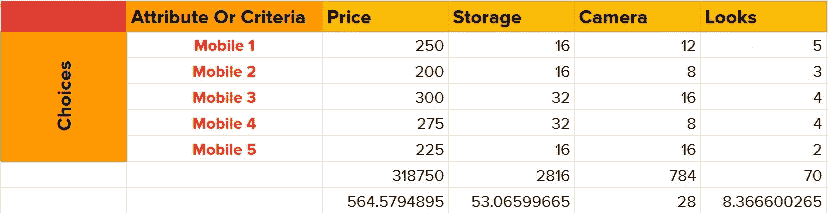
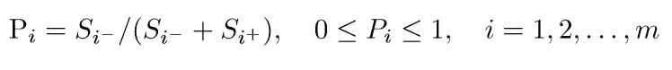

# 如何在多个同样好的东西之间做决定？简单，用数学！

> 原文：<https://medium.com/analytics-vidhya/how-to-decide-between-multiple-equally-good-things-simple-use-math-7e517f1422d5?source=collection_archive---------9----------------------->

## **了解 TOPSIS for** 多标准决策+ Python 代码

你最近去市场买东西了吗？也许是一部新手机、一台笔记本电脑或一台电视？那么**你知道我们的选择越多，就越难做出没有负罪感的最终选择！**

做决定可能很难。

尤其是当大多数选择看起来都一样好时——这是购买智能手机、电脑、汽车等的典型场景。考虑…

我买 mobile 1 吗？还是我多挥霍点买个 mobile 3？移动 5 有最好的相机！啊！

该图显示了一个典型的**多准则决策问题**。多重标准，因为*我们有不止一个标准来区分我们的备选方案*。在两个属性很少的选择中，这是一个简单的二进制选择，但是在这里做什么呢？

幸运的是，这可以被公式化为一个数学问题，数学问题的一个伟大之处在于，我们的计算机非常擅长解决它们！所以让我们开始吧。

## **tops is 的直觉及其完全形式**

TOPSIS 代表**技术，根据与理想解的相似性进行优先排序。**在继续阅读概念的基础上，完整形式将变得更加清晰。

它的基本思想是所选方案与正理想解的几何距离最短，与负理想解的几何距离最长。

换句话说，尽可能接近最佳选择，远离最差选择。

**TOPSIS 有以下步骤:**

**步骤 1:** 将 Looks 列转换为数字评级系统。我们需要所有列都是数字。

*最终结果将是 m 行 n 列的矩阵，每个单元格都有数值。*

包含 m 个备选方案和 n 个标准的矩阵

**第二步:**获取归一化矩阵。

使用以下公式对矩阵进行归一化

让我们首先计算每一列的分母

最后一行表示计算出的分母

接下来，我们用我们刚刚计算的相应分母来划分一列中的每个单元格。

例如，单元格(手机 1，价格)的值变为 250/564.579，即 0.4428

第三步:给标准分配权重。通过将每个单元格乘以该列的权重(属性/标准)来获得加权归一化矩阵。

(Mobile1，价格)= 0.4428 * 0.25

**第四步:**确定理想的最好和最差。

*每个属性都有与之相关的影响。将属性标记为具有* ***积极*** *影响/有益(您希望获得更多此类信息)或具有* ***消极*** *影响/非有益(您希望使其更少)。*

现在用下面的规则找出理想的最好和最差。

理想最佳符号

*   对于**负值**，理想的最佳值是**最小值**(该属性的单元格值)
*   对于**正值**，理想的最佳值是**最大值**(该属性的单元格值)

理想最坏情况的符号

*   对于**负值**，理想的最差值是**最大值**(该属性的单元格值)
*   对于**正值**，理想的最差值是**最小值**(该属性的单元格值)

*规则可以直观理解。价格是负数，所以理想的最佳解决方案会尽量减少它，理想的最差解决方案会有最高的价格。相机是一个积极的，所以理想的最佳解决方案有最好的相机-最大百万像素，而理想的最差具有最小百万像素。*

注意**理想最佳**和**理想最差**行中的值，并验证它们对您有意义

**步骤 5:** 从最佳值计算**，从最差**值计算**。**

*离最好是离最好解的欧几里德距离，离最差是离最差解的欧几里德距离。*

*计算如下…*

**从最好的**计算

**从最坏的**计算

*这么多计算！别担心，我们可以让电脑来做这一切。毕竟这就是编程的目的——让计算机去做那些无聊的事情！💻现在把重点放在概念上。*

作为一个计算示例，考虑移动电话 1 与最佳位置的欧几里德距离，其计算如下

**距离最佳**值为**移动 1**

最佳和最差的计算结果

**第六步:**计算**性能比**并用它对**备选方案**进行排序。****

*性能比可以计算如下…*

注意分子——它来自最差值。你能想出原因吗？

计算之后，我们根据性能比率从高到低对备选方案进行排序。这是有意义的，因为更高的 P 意味着一个特定的选择离最差的解更远(因为分子来自最差的值)。这就是为什么它在分子里。💡

绩效比率和排名。P 值最高的等级最高。

编码器小猫😻

这样，我们就完成了这个概念！🙌

到代码上！

**tops is 的完整 python 代码可以在我的** [**github 库**](https://github.com/navkiran/TOPSIS-project-navkiran) **找到。**

 [## navkiran/tops is-project-navkiran

github.com](https://github.com/navkiran/TOPSIS-project-navkiran) 

***核心逻辑在/src/TOPSIS _ navkiran . py****中，其余为 pypi 的样板文件。*

***我把主要部分贴在下面，并附上评论。***

*但是，可以运行的完整代码请参考* [*github 库*](https://github.com/navkiran/TOPSIS-project-navkiran/blob/master/src/topsis_navkiran.py) *。*

代码片段要点

如果你发现了一个 bug 或者需要改进，可以考虑分叉它并发出一个拉请求。

它也可以作为 pypi 包[在这里](https://pypi.org/project/topsis-navkiran/)获得。

# …我们完成了！🎉

感谢您的阅读，祝您度过愉快的一天！😄

如果你有任何反馈💭或者注意到了错误，请留下评论。您也可以通过我的[电子邮件](mailto:singh.navkiran1515@gmail.com)或我的个人网站[这里](https://navkiran.me/)联系我。我想❤️to 听听你的想法。

再见！