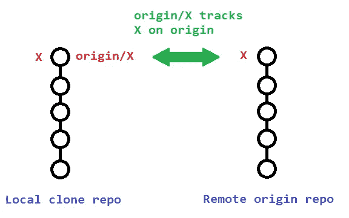
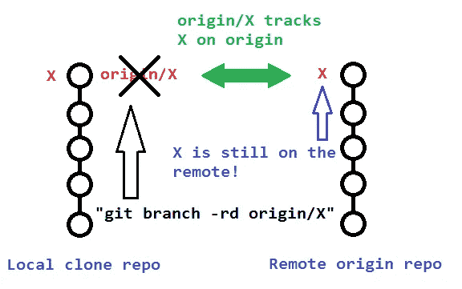
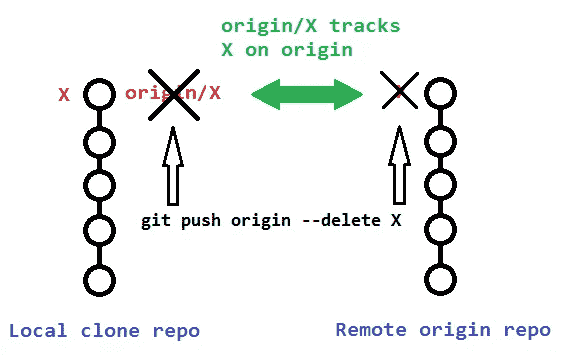

# 如何在本地和远程删除一个 Git 分支？

> 原文：<https://medium.com/analytics-vidhya/how-to-delete-a-git-branch-locally-and-remotely-40ccea01900a?source=collection_archive---------14----------------------->


[https://www . Inc . com/Andrew-Thomas/5-ways-toxic-leaders-destroy-team-morale . html](https://www.inc.com/andrew-thomas/5-ways-toxic-leaders-destroy-team-morale.html)

# **外行人的术语删除分支**

```
$ git push -d <remote_name> <branch_name>
$ git branch -d <branch_name>
```

注意，在大多数情况下，远程名称是`origin`。在这种情况下，您必须像这样使用命令。

```
$ git push -d origin <branch_name>
```

# 删除远程分支

```
git push origin --delete <branch>  # Git version 1.7.0 or newer
git push origin -d <branch>        # Shorter version (Git 1.7.0 or newer)
git push origin :<branch>          # Git versions older than 1.7.0
```

# 删除本地分支

```
git branch --delete <branch>
git branch -d <branch> # Shorter version
git branch -D <branch> # Force-delete un-merged branches
```

`-d`选项是`--delete`的别名，它只删除已经完全合并到其上游分支的分支。您也可以使用`-D`，它是`--delete --force`的别名，删除分支“不管它的合并状态”[Source: `man git-branch` ]
还要注意，如果你当前在你要移除的分支中，`git branch -d branch_name`将会失败。消息以`error: Cannot delete the branch 'branch_name'`开始。如果有，先切换到某个其他分支，比如:`git checkout master`。

# 删除本地远程跟踪分支

```
git branch --delete --remotes <remote>/<branch>
git branch -dr <remote>/<branch> # Shortergit fetch <remote> --prune # Delete multiple obsolete remote-tracking branches
git fetch <remote> -p      # Shorter
```

# 有三个不同的分支要删除！

当您处理本地和远程删除分支时，请记住**涉及三个不同的分支**:

1.  当地分公司`X`。
2.  远程原点分支`X`。
3.  跟踪远程分支`X`的本地远程跟踪分支`origin/X`。



最初的海报使用了:

```
git branch -rd origin/bugfix
```

其中只删除了他的**本地遥控分支** `origin/bugfix`，而没有删除`origin`上的实际遥控分支`bugfix`。



**要删除实际远程分支**，您需要

```
git push origin --delete bugfix
```



# 其他详细信息

以下部分描述了删除远程和远程跟踪分支时要考虑的其他详细信息。

# 推动删除远程分支也会删除远程跟踪分支

请注意，使用`git push` **从命令行删除远程分支`X`也会删除本地远程跟踪分支** `origin/X`，因此没有必要使用`git fetch --prune`或`git fetch -p`删除过时的远程跟踪分支。不过，反正做了也无妨。

您可以通过运行以下命令来验证远程跟踪分支`origin/X`是否也被删除:

```
# View just remote-tracking branches
git branch --remotes
git branch -r# View both strictly local as well as remote-tracking branches
git branch --all
git branch -a
```

# 删除过时的本地远程跟踪分支原点/X

如果您没有从命令行删除您的远程分支`X`(如上)，那么您的本地存储库将仍然包含(现在已经废弃的)远程跟踪分支`origin/X`。例如，如果你直接通过 GitHub 的 web 界面删除一个远程分支，就会发生这种情况。

移除这些过时的远程跟踪分支的典型方法(从 Git 版本 1.6.6 开始)是简单地用`--prune`或更短的`-p`运行`git fetch`。**请注意，这将删除任何远程分支的所有过时的本地远程跟踪分支，这些分支在远程**上不再存在:

```
git fetch origin --prune
git fetch origin -p # Shorter
```

以下是来自 [1.6.6 发行说明](https://github.com/git/git/blob/v2.0.0/Documentation/RelNotes/1.6.6.txt#L162-L166)(重点是我的)的相关引文:

> ***【git fetch】学习了*** `*--all*` *和* `*--multiple*` *选项，可以从多个存储库中运行 fetch，还有* `***--prune***` ***选项可以清除远程跟踪的已经失效的分支。*** *这些使得“git 远程更新”和“git 远程清理”变得不那么必要了(虽然没有计划删除“远程更新”和“远程清理”)。*

# 对于过时的远程跟踪分支的上述自动修剪的替代

或者，除了通过`git fetch -p`、*删除过时的本地远程跟踪分支，您还可以通过手动删除带有`--remote`或`-r`标志的分支来避免额外的网络操作*:

```
git branch --delete --remotes origin/X
git branch -dr origin/X # Shorter
```

# 参考

*   [git-branch(1)手册页](https://jk.gs/git-branch.html)。
*   [git-fetch(1)手册页](https://jk.gs/git-fetch.html)。
*   [Pro Git 3.5 Git 分支—远程分支](https://git-scm.com/book/en/Git-Branching-Remote-Branches)。
*   [git 分支移除(2)](https://stackoverflow.com/questions/2003505/how-do-i-delete-a-git-branch-locally-and-remotely)