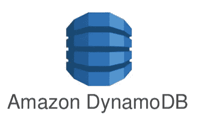

# 如何从 DynamoDB 表中删除庞大的数据？

> 原文：<https://medium.com/analytics-vidhya/how-to-delete-huge-data-from-dynamodb-table-f3be586c011c?source=collection_archive---------0----------------------->

当我的任务是从 AWS DynamoDB 表中删除万亿字节的数据时，我尝试了以下方法。

1)删除现有表并重新创建它

2)更新 TTL(生存时间)列

3)使用删除-项目删除

4)使用批量写入项目删除



在 Amazon DynamoDB 中，表中的每一项都由其主键唯一标识。因此，写入 DynamoDB 表的每一项都必须包含主键。在我的例子中，它是复合主键，其中第一个属性是分区/散列键，第二个属性是排序/范围键。

 [## Satya 的 DBA 博客

### MySQL backup-defaults-file =/usr/local/MySQL/my . CNF-compress-user = backup admin-password-port = 3309 backup…

satya-dba.blogspot.com](http://satya-dba.blogspot.com/) 

# **1)删除现有的表&重新创建它**

如果需要删除所有项目，可以考虑删除并重新创建 DynamoDB 表。

如果要从表中删除所有项目，这是最快最简单的方法，不需要花时间扫描和删除每个项目。

*DeleteTable* 命令/API 删除表格及其所有项目。删除表格可能需要大约 2-4 分钟。

如果您想保留之前的设置，您需要获得模式匹配 *- generate-cli-skeleton* 标志。

```
aws dynamodb delete-table --table-name ***test_data***aws dynamodb create-table --table-name ***test_data*** --attribute-definitions AttributeName=*primary_key*,AttributeType=S AttributeName=*time_stamp*,AttributeType=N --key-schema AttributeName=*primary_key*,KeyType=HASH AttributeName=*time_stamp*,KeyType=RANGE --provisioned-throughput ReadCapacityUnits=1,WriteCapacityUnits=1
```

但是会有**停机**换台。停机时间取决于表删除时间、创建时间以及更改/更新 DynamoDB 表属性的时间。

我在非生产数据库中尝试了这种方法，但是在生产环境中却无法遵循这种停机方法。

如果您可以使用新的表名(这涉及到应用程序代码的更改),那么创建一个全新的表并开始写入该表，稍后您可以删除旧的表。**没有直接重命名** DynamoDB 表的方法。

```
aws dynamodb create-table --table-name ***test_data_new*** --attribute-definitions AttributeName=*primary_key*,AttributeType=S AttributeName=*time_stamp*,AttributeType=N --key-schema AttributeName=*primary_key*,KeyType=HASH AttributeName=*time_stamp*,KeyType=RANGE --provisioned-throughput ReadCapacityUnits=1,WriteCapacityUnits=1aws dynamodb delete-table --table-name ***test_data***
```

# **2)更新 TTL 列以从 DynamoDB 中删除项目**

TTL(生存时间)属性是 DynamoDB 表项的过期时间戳。TTL 属性必须是*数字*数据类型。

在我们的例子中，数据被插入到 DynamoDB 表中，而没有填充 TTL 列。

更改表中项目的 TTL 需要更新每个项目的 TTL 属性值。因此，您必须执行扫描并过滤您想要删除的结果，然后对所有项目执行 *update-item* 以更新 TTL 值。

我们不能使用*批量写入项目*中的更新项目，我们只能使用上传和删除请求。

我尝试用当前/过去的纪元时间格式(例如 1587191489)更新 TTL 列(如果它是零)。纪元时间不应超过 5 年。

纪元时间是自 1970 年 1 月 1 日以来经过的秒数。

为了获得当前的纪元时间，我们可以在任何 UNIX 风格的机器上运行" *date +%s* "命令。

```
aws dynamodb scan --table-name ***test_data*** --projection-expression "*primary_key, time_stamp*" --expression-attribute-names '*{"#ttlive":"ttl"}*' --max-items 1000 --filter-expression "*#ttlive = :ttzero AND time_stamp < :oldest_date*" --expression-attribute-values '*{":ttzero":{"N":"0"}, ":oldest_date":{"S":"2020-02-01"}}*' > $SCAN_OUTPUT_FILEaws dynamodb update-item --table-name ***test_data*** --key file://$SCAN_OUTPUT_FILE --update-expression "*SET #ttlive = :ttvalue*" --condition-expression "*#ttlive = :ttzero*" --expression-attribute-names '*{"#ttlive":"ttl"}*' --expression-attribute-values '*{":ttvalue":{"N":"1587191489"},":ttzero":{"N":"0"}}*'
```

在运行*扫描*操作之前，如果没有足够的 rcu 可用或者不是按需的，您必须增加 rcu(读取容量单位)。

TTL 将当前时间与项目的 TTL 属性中存储的时间进行比较。

DynamoDB 尽最大努力删除过期项，以确保其他数据操作的吞吐量(wcu)可用性。

TTL 到期后，记录将被标记为删除，将在 48 小时内**被删除(根据 AWS)。我观察到这需要更长的时间，甚至超过 15 天，这取决于表的大小&工作量。**

TTL 删除不计入容量单位或请求单位。TTL 删除是免费的。

如果你想减小表的大小或者想删除旧的数据，更新 TTL 是**而不是**推荐的方法。

# **3)使用 delete-item 命令/API 从 DynamoDB 中删除记录**

在大多数 RDBMS 数据库中，删除命令将与接受精确值或模式的条件一起工作，我们可以通过在 where 子句中使用非主键列来运行删除查询。

但是在 NoSQL 数据库中，比如 Dynamo DB，我们必须在删除条件中提供精确的值，并且我们必须传递每一项的主键和范围键值。

> 在 Amazon DynamoDB 中，DeleteItem API 一次删除一个项目。

在 *delete-item* 中，条件删除(使用*条件表达式*参数)仅在满足特定条件时对删除项目有用。

删除项目时，它们会从任何本地辅助索引和全局辅助索引(如果有)中删除。

我正在执行扫描，并从表中过滤项目以删除它们。

```
aws dynamodb scan --table-name "$TABLE_NAME" --projection-expression "*primary_key, time_stamp*" --filter-expression *"time_stamp < :oldest_date" --expression-attribute-values '{":oldest_date":{"S":"2020-02-01"}}*' --max-items 1000 --total-segments "$TOTAL_SEGMENT" --segment "$SEGMENT_NUMBER" > $SCAN_OUTPUT_FILEcat $SCAN_OUTPUT_FILE | jq -r ".Items[] | tojson" | tr '\n' '\0' | xargs -0 -I keyItem aws dynamodb delete-item --table-name "$TABLE_NAME" --key=keyItem
```

单次*扫描*操作最多读取- *最大项目数/限制*指定的最大项目数。

扫描操作按顺序进行，为了在较大的表上获得更快的性能，我们可以通过提供 *Segment* 和 *TotalSegments* 参数来请求并行扫描操作。

*TotalSegments* 表示将同时访问表的工人总数。

*段*表示将由调用工作器/脚本访问的表的单个段。*段*必须大于等于 0，且小于为*总段*提供的值。

我使用分段/分页，分 10 段运行，每段删除 1000 个项目，耗时 20-30 分钟。因此，要删除 10，000 个项目，脚本大约需要 20-30 分钟。

# **4)使用(AWS CLI)批量写入项目来批量删除 DynamoDB 项目**

*BatchWriteItem* 操作在一个或多个表格中放置或删除多个项目。

为了加快处理速度，您可以在一次 *BatchWriteItem* 调用中删除多达 25 个项目，而不是逐个删除项目。

CLI 中的批量写入项目需要一个 *RequestItems* JSON 来指定单个删除请求。

> 通过使用 JQ 实用程序，我们可以将扫描结果页面转换为请求项目格式。

```
aws dynamodb scan --table-name "***test_data***" --projection-expression "*primary_key, time_stamp*" --filter-expression "*time_stamp < :oldest_date" --expression-attribute-values '{":oldest_date":{"S":"2021-04-01"}}*' --max-items 25 --total-segments "$TOTAL_SEGMENT" --segment "$SEGMENT_NUMBER" > $SCAN_OUTPUT_FILEcat $SCAN_OUTPUT_FILE | jq -r ".Items[] | tojson" | awk '{ print "{\"DeleteRequest\": {\"Key\": " $0 " }}," }' | sed '$ s/.$//' | sed '1 i { "***test_data***": [' | sed '$ a ] }' > $INPUT_FILEaws dynamodb batch-write-item --request-items file://$INPUT_FILE
```

在运行 *scan* 命令之前，**增加 rcu**(读取容量单位)，在运行 *batch-write-item* CLI/API 命令*，* **增加 wcu**(写入容量单位)。

我使用了更多的段，这可能会减少每个扫描段的结果集，这将有助于根据段的数量进行等效的并行 *delete-item* 调用。这将增加删除的并行性，并有助于加快从表中删除项目的速度。

*在 *BatchWriteItem* 中提到的 DeleteItem* 操作是原子的。如果操作因任何错误而失败，输出中只会返回失败的操作。

截至 2023 年 3 月， **25** **请求*批写项*中的**是迪纳摩 DB 中的硬限制，不能增加。

显然，我们的记录列表中将有超过 25 条记录需要删除，所以我们必须使用循环来遍历所有记录。

# **使用循环扫描**(针对每个片段):

```
vi scan_dynamo_table.shTOTAL_SEGMENTS=$1
SEGMENT_NUMBER=$2
SCAN_OUTPUT="scan-output-segment${SEGMENT_NUMBER}.json"
SCAN_AGGREGATE="scan-agg-segment${SEGMENT_NUMBER}.json"aws dynamodb scan --table-name "***test_data***" --projection-expression "*primary_key, time_stamp*" --filter-expression "*time_stamp >= :start_date and time_stamp <= :end_date*" --expression-attribute-values '*{":start_date":{"S":"2021-01-01"}, ":end_date":{"S":"2021-03-31"}}*' --max-items "1000" --total-segments "${TOTAL_SEGMENTS}" --segment "${SEGMENT_NUMBER}" > ${SCAN_OUTPUT}NEXT_TOKEN="$(cat ${SCAN_OUTPUT} | jq '.NextToken')"
cat ${SCAN_OUTPUT} | jq -r ".Items[] | tojson" > ${SCAN_AGGREGATE}while [ ! -z "$NEXT_TOKEN" ] && [ ! "$NEXT_TOKEN" == null ]
doaws dynamodb scan --table-name "***test_data***" --projection-expression "*primary_key, time_stamp*" --filter-expression "*time_stamp >= :start_date and time_stamp <= :end_date*" --expression-attribute-values '*{":start_date":{"S":"2021-01-01"}, ":end_date":{"S":"2021-03-31"}}*' --max-items "1000" --total-segments "${TOTAL_SEGMENTS}" --segment "${SEGMENT_NUMBER}" --starting-token "${NEXT_TOKEN}" > ${SCAN_OUTPUT}

NEXT_TOKEN="$(cat ${SCAN_OUTPUT} | jq '.NextToken')"
cat ${SCAN_OUTPUT} | jq -r ".Items[] | tojson" >> ${SCAN_AGGREGATE}done
```

使用 N 个片段进行扫描，符合所需的选择标准，这将生成 N 个文件( *scan-agg-segment*)。json* )，所有需要的记录都被删除。

```
vi run_scan_table.shTOTAL_SEGMENTS=100          # N, total number of segmentsfor SEGMENT in `seq 0 $((${TOTAL_SEGMENTS}-1))`
do
 nohup sh scan_dynamo_table.sh ${TOTAL_SEGMENTS} ${SEGMENT} &
done
```

# **使用循环删除**(针对每段):

然后，您可以运行 N 个*批处理写项目*脚本，如下所示，这些脚本将读取相应的文件(上面生成的),并在循环中一次删除 25 条记录。这里 N 可以是 10、1000 或任何数字(取决于您的服务器)。

```
vi batch_write_item_delete.shSEGMENT_NUMBER=$1
SCAN_AGGREGATE="scan-agg-segment${SEGMENT_NUMBER}.json"
SEGMENT_FILE="delete-segment${SEGMENT_NUMBER}.json"
MAX_ITEMS=25      # maximum number of items batch-write-item acceptsprintf "starting segment - ${SEGMENT_NUMBER} \n" > ${SEGMENT_FILE}until [[ ! -s ${SEGMENT_FILE} ]] ;
doawk "NR>${CNT:=0} && NR<=$((CNT+MAX_ITEMS))" ${SCAN_AGGREGATE} | awk '{ print "{\"DeleteRequest\": {\"Key\": " $0 " }}," }' | sed '$ s/.$//' | sed '1 i { "***test_data***": [' | sed '$ a ] }' > ${SEGMENT_FILE}

aws dynamodb batch-write-item --request-items file://${SEGMENT_FILE}CNT=$((CNT+MAX_ITEMS))done
```

运行上面的删除脚本。

```
vi run_batch_delete.shTOTAL_SEGMENTS=100        # N, total number of segments/files existsfor SEGMENT in `seq 0 $((${TOTAL_SEGMENTS}-1))`
do
 nohup sh batch_write_item_delete.sh ${SEGMENT} &
done
```

通过使用 *delete-item* 命令，使用 100 个片段，脚本能够每分钟删除 2500-2700 个项目(在 c5.4xlarge EC2 机器上)。

通过使用 *batch-write-item* 命令，使用 100 个段，脚本能够每分钟删除 28000-45000 个项目(在 c5.4xlarge EC2 机器上)。

我在 r5 (r5.4xlarge)和 m5 (m5.4xlarge) EC2 机器上尝试了相同的删除操作。

> 使用 m5/r5/c5 实例类型，批量写入项目*帮助我每小时删除超过 500 万条记录。*

# **总结**

**JSON 查询处理器 jq** 非常有用，通过它我们可以播放和格式化 DynamoDB 查询提供的 JSON 输出。

对于预生产数据库或任何非关键的 AWS DynamoDB 表，最好遵循停机方法，在这种情况下，您必须删除现有的表，重新创建一个空白表并开始使用它。

对于生产数据库和关键的 Amazon DynamoDB 表，建议使用 *batch-write-item* 来清除万亿字节的数据。

*批量写项*(带*删除请求*)比*删除项*快 10 到 15 倍。