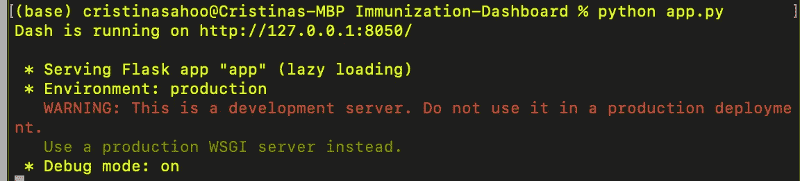
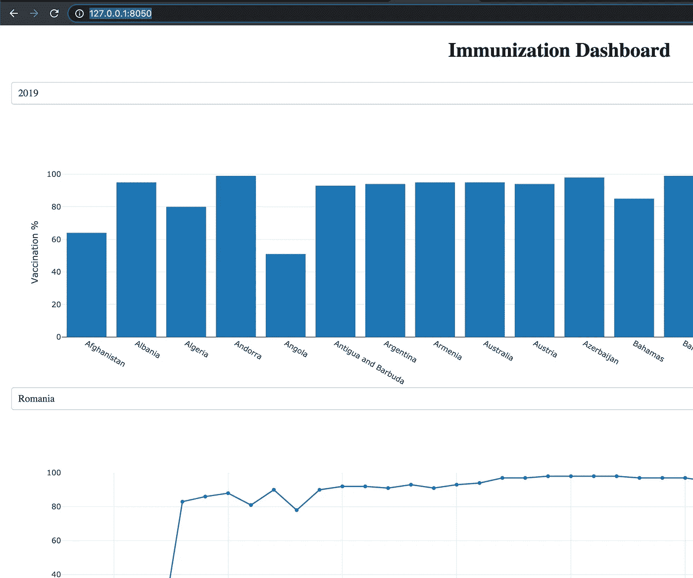
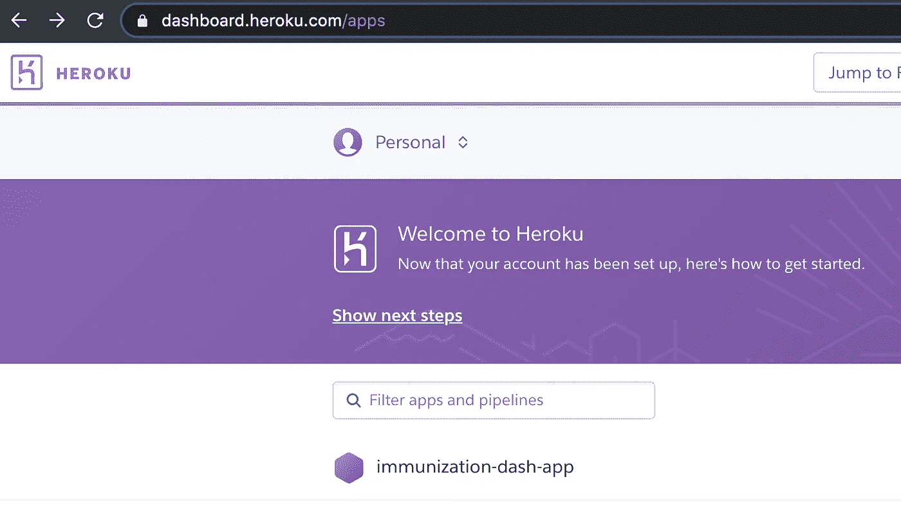
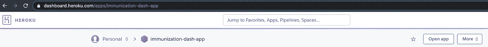
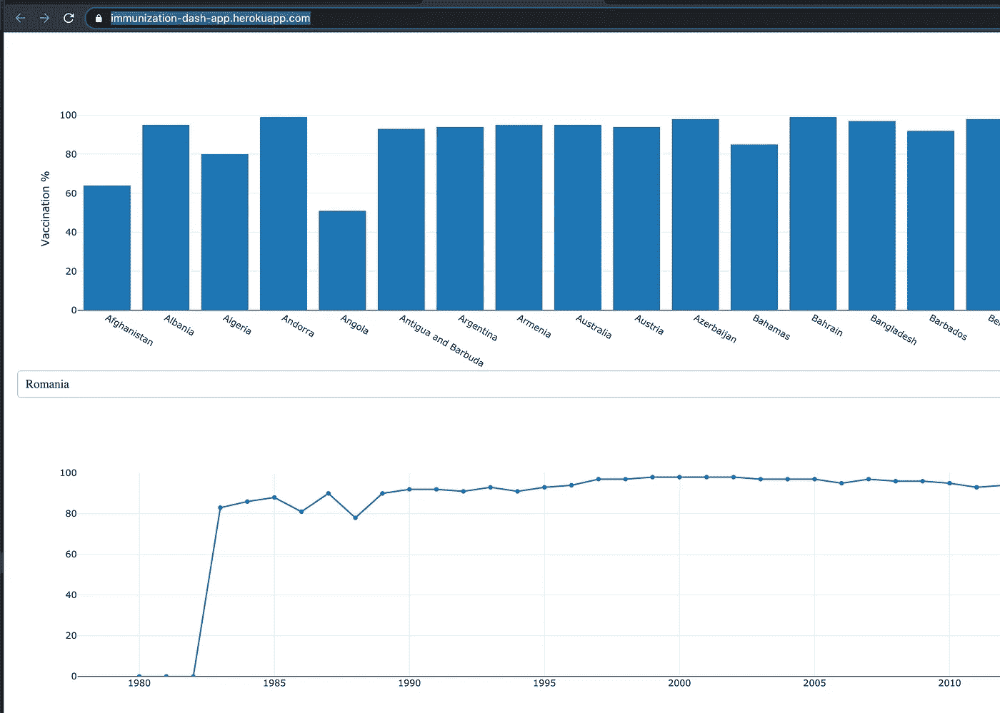

# 如何将仪表板部署到 Heroku

> 原文：<https://medium.com/analytics-vidhya/how-to-deploy-a-dashboard-to-heroku-3b458f321c93?source=collection_archive---------5----------------------->

在本文中，我将通过一个简单的例子向您展示如何将您用 Python 创建的仪表板部署到 Heroku。如果你觉得这篇文章有用，别忘了**鼓掌**！:-)

请准备好以下项目并开始工作:
- Python
- Heroku 帐户-前往 www.heroku.com
-您选择的文本编辑器
-来自世卫组织网站的数据， [WHS8_110.csv](https://apps.who.int/gho/athena/data/GHO/WHS8_110?filter=COUNTRY:*&x-sideaxis=COUNTRY&x-topaxis=GHO;YEAR&profile=crosstable&format=csv)

使用 Plotly 和 Dash 在 Python 中创建仪表板超出了本文的范围。如果您想使用我创建的仪表板，您可以在这里找到代码，欢迎您使用它。请相应贷记:-)。
[https://github . com/CristinaSahoo/Immunization-Dashboard/blob/main/app.py](https://github.com/CristinaSahoo/Immunization-Dashboard/blob/main/app.py)
确保上面下载的数据，即 CSV 文件，与下面创建的 app . py 文件在同一个目录下。

**创建 app.py 文件。**
为此，你可以使用你喜欢的文本编辑器。创建文件并将其保存为 Python 文件后，扩展名为。py，在部署到 Heroku 之前，确保代码在您的计算机上运行没有任何错误。要检查这一点，在**终端**中，将**当前目录设置为包含 app.py 文件**的目录，运行:
**python app.py**
如果您看到如下消息，您就可以开始了。如果没有，请修复 app.py 文件中的错误，然后尝试再次运行它。

Python 脚本 **app.py** 成功运行

**要查看仪表板**，请在浏览器中访问 http://127.0.0.1:8050/

本地计算机上的仪表板

唷！！到目前为止，一切顺利:-)
作为一名初学者，我实际上花了相当长的时间才让这个简单的仪表板工作起来……这就是我的天啊！！反应。继续前进。

**将仪表板部署到 Heroku。**

1.  **在您的本地机器上创建一个新目录**，保存您的 Dashboard app.py 文件、CSV 数据文件和其他 Heroku 相关文件。我把我的目录叫做免疫仪表板。打开一个终端窗口。在**终端**中运行以下命令:
    *$ mkdir Immunization-Dashboard
    $ CD Immunization-Dashboard*
    **将您的 app.py 文件和 WHS8_110.csv 文件**移动或复制到您刚刚在上面创建的目录，Immunization-Dashboard 目录。
2.  用一个空的 repo 初始化你的文件夹并激活一个虚拟环境。在**终端**中，将当前目录设置为 Immunization-Dashboard，运行以下命令:
    *$ git init
    $ virtualenv venv
    $ source venv/bin/activate* 如果成功，您应该会在终端中看到以下内容:
    *(venv) (base)*
    接下来的步骤都发生在同一个目录中。
3.  **创建一个 gitignore 文件**。在**与上面**相同的目录下创建一个. gitignore 文件，Immunization-Dashboard，并添加下面的一行文本:
    *venv
    *。pyc
    。DS_Store
    。环境*
4.  创建一个 requirements.txt 文件。通过在您的**终端**中运行下面的命令来做到这一点:
    *$ pip freeze>requirements.txt*
    我的 requirements . txt 文件看起来是这样的:[https://github . com/CristinaSahoo/Immunization-Dashboard/blob/main/requirements . txt](https://github.com/CristinaSahoo/Immunization-Dashboard/blob/main/requirements.txt)
    **重要！***app . py 文件中导入的每个包在 requirements.txt 文件中都必须有一个对应的行。例如，如果我在 app.py 文件中有“import pandas as pd”，我必须在 requirements.txt 文件中有“pandas==1.1.3”(版本可能不同)。检查以确保 app.py 文件中的所有导入都是如此。*
5.  **创建一个过程文件文件**。在上面同一个目录下创建一个 Procfile，Immunization-Dashboard，添加下面那行文字:
    *web:guni corn app:server*
    我的 Procfile 是这样的:[https://github . com/CristinaSahoo/Immunization-Dashboard/blob/main/proc file](https://github.com/CristinaSahoo/Immunization-Dashboard/blob/main/Procfile)
    **重要！***“web:”后面有空格没问题，但是“app:”后面没有空格。确保 app.py 文件中有这样一行:
    server = app.server*
6.  **检查点！**您在 Immunization-Dashboard 目录中有这些文件/目录吗？
    *app . py
    proc file
    requirements . txt
    venv(目录)
    WHS8_110.csv
    。git
    。gitignore* 查看隐藏文件，如。饭桶还是。gitignore，您需要为您的本地机器启用适当的查看设置。对于我的 MacBook Pro，我在 Finder 中使用了组合 *Command+Shift+Dot* 。
7.  **在这个虚拟环境中安装你的应用的依赖关系**。在**终端**中，保持**与上面**相同的当前目录，运行命令:
    *$ pip install-r requirements . txt*
8.  在 Heroku 上创建您的应用程序。您将需要使用您之前在 Heroku.com 上创建的帐户。在**终端**，运行:
    *$ heroku 创建免疫-dash-app*
9.  **部署到 Heroku** 。在**终端**，运行:
    *$ git add。
    $ git commit-m '…'
    $ git push heroku master
    $ heroku PS:scale web = 1*
10.  **记得更新你的更改**，如果你在改进时做了任何更改，即在 app.py 文件或你在上面创建的目录中的任何其他文件中更改或添加代码。如果你做了修改，在 Heroku app 上运行这个来更新它们:
    *$ git add。
    $ git commit-m '…'
    $ git push heroku master*
11.  **从你的 Heroku 帐户启动应用程序。**进入你的 Heroku 账户，点击应用，然后启动应用。它应该会在您的浏览器中打开一个新的选项卡，您可以在其中查看仪表板并与之交互。我的在这里:[https://immunization-dash-app.herokuapp.com/](https://immunization-dash-app.herokuapp.com/)

Heroku 帐户—现在应该会列出应用程序

Heroku 帐户—点击打开应用程序

**搞定！！如果一切正常，你将能够在另一个浏览器标签或窗口中启动你的应用。它应该看起来像这样。**

如果你觉得这篇文章有用，别忘了给**鼓掌**！我将非常感激。

如果这对你不起作用，我很乐意帮助你，所以不要犹豫，联系我(应该有一个方法来评论或联系作者)。

祝你今天休息愉快。
下次见！