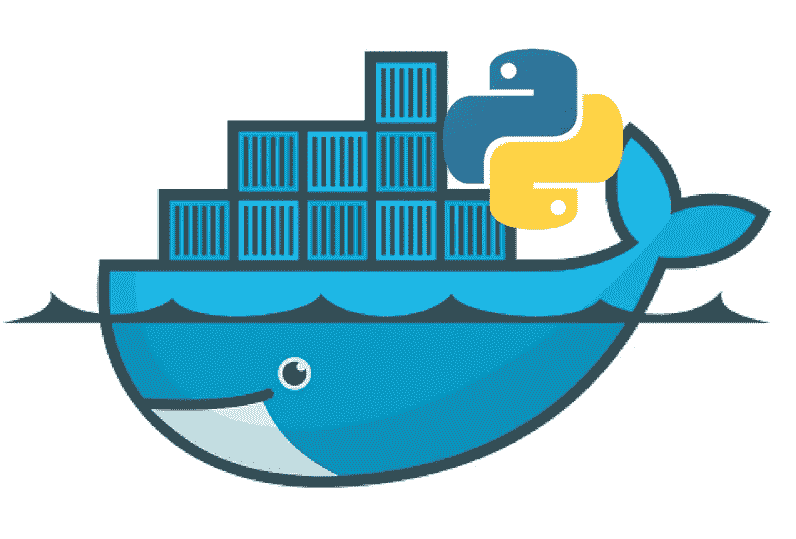
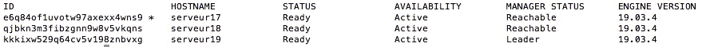
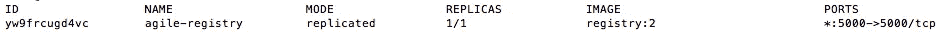
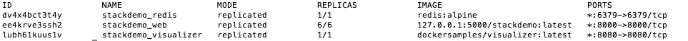
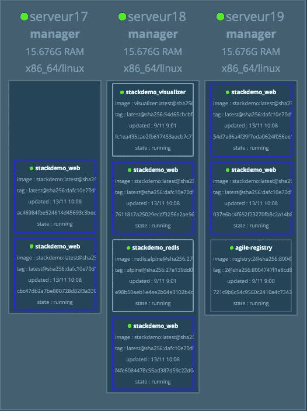
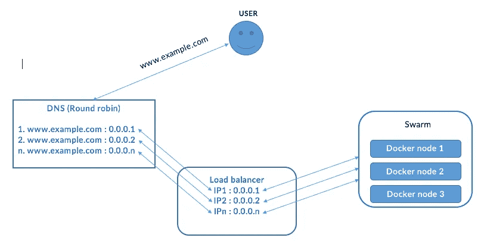

# 如何用 Docker Swarm 部署大规模 Python 应用？

> 原文：<https://medium.com/analytics-vidhya/how-to-deploy-a-python-application-with-docker-swarm-1c9038130b4b?source=collection_archive---------3----------------------->



Docker 容器技术于 2013 年作为开源 Docker 引擎推出。它利用了围绕容器的现有计算概念，特别是在 Linux 世界中，称为 cgroups 和 namespaces 的原语。Docker 的技术是独一无二的，因为它专注于开发人员和系统运营商的要求，将应用程序依赖关系与基础设施分离开来。

Docker swarm 是 Docker 的一个很好的补充。它旨在轻松管理多个主机上的容器调度。

*   要点:**允许用 Docker 将多台主机连接在一起**。
*   相对**简单**。与其他解决方案相比，从 Docker Swarm 开始真的很容易。
*   **高可用性** —集群中有两种节点类型:*主节点*和*工作节点*。一个大师是领袖。如果当前领导者失败，另一个主人将成为领导者。如果工作主机出现故障，所有容器将被重新调度到其他节点。
*   **声明式配置**。您告诉我们您想要什么，需要多少个副本，它们将根据给定的限制自动进行调度。
*   **滚动更新** — Swarm 存储容器的配置。如果您更新配置，容器将成批更新，因此默认情况下服务将始终可用。
*   **内置服务发现和负载均衡** —类似于 Docker-Compose 完成的负载均衡。您可以使用名称引用其他服务，容器存储在哪里并不重要，它们将以循环方式接收请求。
*   **覆盖网络** —如果您从服务中公开一个端口，它将在集群中的任何节点上可用。它确实有助于外部负载平衡。

# 在这篇文章中我们会看到什么？

*   我们将使用 Docker Swarm 形成一个由三台机器组成的集群
*   我们将展示如何启动 docker 注册表
*   我们将标记并构建一个 Python 应用程序映像，然后将它放入我们的注册表中
*   我们将部署一个堆栈并展示一些有用的群命令

# **先决条件:**

—安装了 linus debian 发行版的机器
—每台机器上都安装了 Docker
——机器之间相互监视，可以发送和接收数据包

# 在开始组建蜂群之前，你应该知道些什么？

—在您的群集中，您可以有一台、两台、三台或多台服务器。
—每台机器被称为集群中的一个节点。
—为了利用 swarm 模式的容错特性，Docker 建议您根据您组织的高可用性要求实现奇数个节点
—要建立 swarm，您需要有经理节点/机器和工人节点/机器。

管理器节点处理集群管理任务:

*   维护集群状态
*   调度服务
*   服务群组模式 HTTP API 端点

工作者节点不参与 Raft 分布式状态，不做出调度决策，也不服务于群体模式 HTTP API。

—一个 N 管理器群集最多允许损失(N-1)/2 个管理器。例:一个有三个经理的群体最多能容忍失去一个经理。
—您可以创建一个由一个管理器节点组成的群组，但是您不能拥有一个没有至少一个管理器节点的工作器节点。默认情况下，所有经理也是工人。在单个管理器节点集群中，可以运行 docker service create 这样的命令，调度器将所有任务放在本地引擎上。

# **1-组建机器集群。**

对于这个例子，我使用 3 台机器。

参见下面我的机器角色和 IP(所有三台机器都将成为管理器):
**我的管理器一具有 IP 10.10.25.165 和主机名 serveur17
我的管理器二具有 IP 10.10.25.166 和主机名 serveur18
我的管理器三具有 IP 10.10.25.167 和主机名 serveur19**

***a-在三台服务器上打开三个终端会话和 ssh。***

*ssh root@machine_IP* 并输入密码。

在 1 号航站楼

```
*$ ssh root@10.10.25.165*
```

在 2 号航站楼

```
*$ ssh root@10.10.25.166*
```

在 3 号航站楼

```
*$ ssh root@10.10.25.167*
```

***b-设置您的机器主机***
在 3 台机器上重复此操作:
—在每台服务器上编辑主机文件

```
*$ vim /etc/hosts*
```

—在每台机器的主机文件中添加这 3 行并保存

```
10.10.25.165 dockernode1 
10.10.25.166 dockernode2 
10.10.25.167 dockernode3
```

***c- Ping 它们之间的机器以查看发送的数据包和收到的数据包***
来自 dockernode1 机器(10.10.25.165)，Ping 他人管理器 dockernode2 和 dockernode3

```
$ ping dockernode2 
$ ping dockernode3
```

从 dockernode2 机器(10 . 10 . 25 . 166)ping 其他管理器 dockernode1 和 dockernode3

```
$ ping dockernode1 
$ ping dockernode3
```

从 dockernode3 机器(10 . 10 . 25 . 167)ping 其他管理器 dockernode1 和 dockernode2

```
$ ping dockernode1 
$ ping dockernode3
```

**可能的问题**:如果没有收到数据包，请检查您的防火墙设置。

**d-初始化 docker swarm，让我们组成集群**

*   ***继续在 docker node 1*******机器上初始化我们的蜂群****

```
*$ docker swarm init --advertise-addr 10.10.25.165*
```

> *你会看到以下输出:
> ***Swarm 初始化:当前节点(0knoujuvtkoq1pg3mhjhxsbhn)现在是一个管理器。****
> 
> ****要将一个工人添加到这个群，运行下面的命令:****
> 
> ****docker swarm join—token swm tkn-1–3g 85y 47 bq 6 w7 frwqq 7 GNP xqg 85 klk 02 escd 5n 5 I 180 EO 6 yiwb 1-e 46 NZD j2o H4 YC 62 p 66 rogd j 7h 10 . 10 . 25 . 165:2377****
> 
> ****要向该群组添加管理器，运行“docker swarm join-token manager ”,并按照说明进行操作。****

*在初始化我们的 swarm 之后，总是在 **dockernode1** 机器上，运行这个命令:*

```
*$ docker swarm join-token manager*
```

> **您将会看到以下输出:**
> 
> ****要向这个群添加一个管理器，运行下面的命令:****
> 
> ****docker swarm join—token swm tkn-1–3g 85y 47 bq 6 w7 frwqq 7 GNP xqg 85 klk 02 escd 5n 5 I 180 EO 6 yiwb 1–4 wes 668 cwnowczst 9v 32736g 6 10 . 10 . 25 . 165:2377****

*请从该确认文本中复制输出命令。这个命令将用于将我们的其他服务器添加到集群中*

*   ****上 dockernode2 机器(* 10.10.25.166 *)添加到我们的群****

*要将***docker node 2****机器作为*管理器添加到集群，请在运行以下命令后按照说明操作:*

```
*$ docker swarm join --token SWMTKN-1-3g85y47bq6w7frwqq7gnpxqg85klk02escd5n5i180eo6yiwb1-4wes668cwnawczst9v32736g6 10.10.25.165:2377*
```

> **你会看到下面的输出:**
> 
> ****这个节点作为管理者加入了一个虫群。****

> **输出告诉您 dockernode2 现在是一个经理。**

*   ****上 dockernode3 机器(* 10.10.25.167 *)添加到我们的群****

*要将***docker node 3****机器作为*管理器添加到群中，请在运行该命令后按照说明操作:*

```
*$ docker swarm join --token SWMTKN-1-3g85y47bq6w7frwqq7gnpxqg85klk02escd5n5i180eo6yiwb1-4wes668cwnawczst9v32736g6 10.10.25.165:2377*
```

*输出告诉您该节点现在是一个管理器。*

> **你会看到下面的输出:**
> 
> ****这个节点以管理者的身份加入了虫群。****

> *输出告诉你 dockernode3 现在是一个经理。*

****f-检查节点状态***
$ docker 节点 ls*

> *您将看到以下某种输出:*

**

> *我们的集群已经准备好了…*

# ***2-建立注册表***

*在集群中部署应用程序之前，我们需要将应用程序 docker 映像放在注册表中。*

*注册表是存储和标记图像以备后用的地方。*

*基于 Docker 的工作流的主要组件是图像，它包含运行应用程序所需的一切。作为持续集成的一部分，映像通常是自动创建的，因此每当代码发生变化时，它们都会更新。当图像被构建为在开发人员和机器之间共享时，它们需要被存储在某个地方，这就是容器注册表的用武之地。*

*开发人员可能希望维护他们自己的注册表，用于私有的、公司的图像，或者只用于测试的一次性图像。*

*你可以使用哪个 docker 注册表？*

> **第一种可能*
> 你可以在你的服务器上建立自己的私有注册表。*

*通过这种选择，您应该维护用于构建注册表的服务器，并确保服务不会关闭。*

> **第二种可能性*
> 你可以使用在线服务作为 [Docker Hub Registry](https://hub.docker.com/) 或 [GitLab Container Registry](https://gitlab.com/) 来存储你的 Docker 图片。*

*通过选择这些在线注册服务，您无需维护服务器。这些在线服务也让你有可能建立一个私人或公共注册。*

****b-如何在自己的服务器上创建私有注册表？****

*在我的例子中，我在一台机器(10.10.25.165)上设置了注册表。*

*—将注册表作为服务启动:*

```
*$ docker service create — name agile-registry — publish published=5000,target=5000 registry:2*
```

*   *检查注册表状态*

```
*$ docker service ls*
```

> *您将看到以下某种输出:*

**

****c-如何在 docker Hub 和 Gitlab 上创建注册表？***
在这个例子中，我说的不是在 Hub 或 Docker Gitlab 上创建注册表，而是你有很多处理这个主题的在线教程。*

# *3-让我们构建一个 python 示例应用程序映像*

*我们将在 dockernode1 机器上创建和构建应用程序，并标记注册表*

*—为项目创建一个目录:*

```
*$ mkdir stackdemo
$ cd stackdemo*
```

*—在项目目录中创建名为 app.py 的文件，并将其粘贴到:*

```
*from flask import Flask
   from redis import Redisapp = Flask(__name__)
   redis = Redis(host='redis', port=6379)[@app](http://twitter.com/app).route('/')
   def hello():
       count = redis.incr('hits')
       return 'Hello World! I have been seen {} times.\n'.format(count)if __name__ == "__main__":
       app.run(host="0.0.0.0", port=8000, debug=True)*
```

*—创建一个名为 requirements.txt 的文件，并将这两行粘贴到:*

```
**flask
redis**
```

*—创建一个名为 Dockerfile 的文件，并将其粘贴到:*

```
*FROM python:3.4-alpine
ADD . /code
WORKDIR /code
RUN pip install -r requirements.txt
CMD ["python", "app.py"]*
```

*—创建一个名为 docker-compose-dist-app-registry-build . yml 的文件，并将其粘贴到:*

```
*version: '3'

services:
  web:
    image: 127.0.0.1:5000/stackdemo
    build: .
    ports:
      - "8000:8000"*
```

**web 应用程序的图像是使用上面定义的 Dockerfile 构建的。它还被标记为 127.0.0.1:5000，这是之前创建的注册表的地址。这在将应用程序分发给群体时非常重要。**

*—构建应用程序映像*

```
*$ docker-compose -f docker-compose-dist-app-registry-build.yml build*
```

# *4-在上一步中，我们的应用程序映像已经建立，现在让我们把它放在注册表中。*

*总是在我们的应用程序文件夹中，让我们执行以下命令:*

```
*$ docker-compose -f docker-compose-dist-app-registry-build.yml push*
```

> *您将会看到以下输出:
> Pushing web(127 . 0 . 0 . 1:5000/stack demo:latest)…
> push 引用一个存储库[127 . 0 . 0 . 1:5000/stack demo]
> 5b 5a 49501 a 76:Pushed
> be 44185 ce 609:Pushed
> BD 7330 a 79 BCF:Pushed
> c9fc 143 a 00*

# ****5-让我们在集群上部署堆栈****

*总是在我们的应用程序文件夹中，

—创建一个名为 docker-compose-dist-deploy.yml 的文件，并将其粘贴到:*

```
*version: '3'

services:
  web:
    image: 127.0.0.1:5000/stackdemo
    hostname: '{{.Node.Hostname}}'
    ports:
      - "8000:8000"
    deploy:
      mode: replicated
      replicas: 6
      restart_policy:
        condition: on-failure
  redis:
    image: redis:alpine
    ports:
      - "6379:6379"

  visualizer:
    image: dockersamples/visualizer
    ports:
      - "8080:8080"
    stop_grace_period: 1m30s
    volumes:
      - "/var/run/docker.sock:/var/run/docker.sock"
    deploy:
      placement:
        constraints: [node.role == manager]*
```

*—使用 docker stack deploy 创建堆栈:*

```
*$ docker stack deploy — compose-file docker-compose-dist-deploy.yml stackdemo*
```

> *您将看到以下某种输出:*
> 
> *忽略不支持的选项:构建*
> 
> *创建网络堆栈 demo_default
> 创建服务堆栈 demo_web
> 创建服务堆栈 demo_redis*

*—检查它是否在以下条件下运行:*

```
*$ docker stack services stackdemo*
```

> *您将看到以下某种输出:*

**

*—检查我们的应用是否在我们的节点上运行:
由于 Docker 内置的路由网格，您可以在端口 8000 上访问 swarm 中的任何节点，并路由到应用:*

```
*$ curl [http://10.10.14.165:8000](http://10.10.14.165:8000)*
```

> *输出:*
> 
> *你好世界！我已经被看过 1 次了。*

```
*$ curl [http://10.10.14.166:8000](http://10.10.14.165:8000)*
```

> *输出:*
> 
> *你好世界！我被看过两次。*

```
*$ curl [http://10.10.14.167:8000](http://10.10.14.165:8000)*
```

> *输出:*
> 
> *你好世界！我已经被看过 3 次了。*

*—使用创建的 visualizer 服务来检查节点，并查看您的应用程序副本如何在三台服务器之间共享。*

**

*您可以关闭任何机器来检查您的应用程序在其他可用的机器上是否仍然可用。*

*我关闭了第一个 **10.10.25.165** 服务器，我的应用程序在其他节点上仍然可用，并且继续计数。*

```
*$ curl [http://10.10.14.167:8000](http://10.10.14.167:8000)*
```

> *输出:*
> 
> *你好世界！我已经被看过 4 次了。*

```
*$ curl [http://10.10.14.168:8000](http://10.10.14.168:8000)*
```

> *输出:*
> 
> *你好世界！我已经被看过 5 次了。*

# *6-要关闭堆栈，请使用:*

```
*$ docker stack rm stackdemo*
```

# *7-要删除注册表:*

```
*$ docker service rm registry*
```

# *8-从群中删除节点*

```
*$ docker swarm leave — force*
```

*节点离开了虫群。*

# *如果你想在配置上更进一步*

*下面是我总结用户查询路径的顶层架构:*

**

*我使用以下元素:*

*-一个域名
-至少两个公共 IP
-一个负载平衡器*

***1-我创建了多个 A 类 DNS 记录:***

*[www.example.com](http://www.example.com)= =>公共 IP 1*

*[www.example.com](http://www.example.com)= =>公共 IP 2*

*[www.example.com](http://www.example.com)= =>公共 IP n*

***2-我配置一个负载均衡器:***

*我将我的 n 个公共 IP 地址添加到我的负载平衡器中。此配置取决于您在前面使用的负载平衡器和您的虚拟主机。*

***总结一下，下面的旅程由一个用户提出请求***

*   *用户向域 www.example.com 发送请求*
*   *由于我们已经为具有多个 IP 地址的同一个域注册了多个 DNS 记录，DNS 将根据循环算法选择一个可用的 IP 地址来将请求路由到负载平衡器。由于多个 IP 地址支持域请求，这使得该解决方案在 DNS 级别更加可用。*
*   *负载均衡器监听并将来自这些公共 IP 地址的请求重定向到 Docker swarm。*
*   *Docker swarm 从 Docker 节点中选择将做出响应的可用节点。即使其中一个节点(例如 10.10.25.165)不可用，由于有另外两个 Docker 节点，应用程序也能继续正常运行，不会出现问题。*

*在网络浏览器中，用户只知道域名。因此，即使一些 Docker 节点丢失，应用程序也将继续正常运行。*

*感谢阅读。如有必要，您可以添加评论，留下您的赞赏。我会考虑你的意见来改进这篇文章。*

# *下一步是什么？*

*我将在另一篇文章中展示如何扩展 Redis，以及如何监控我们的堆栈，并在其中一个节点出现故障时自动触发警报(邮件、短信)。*