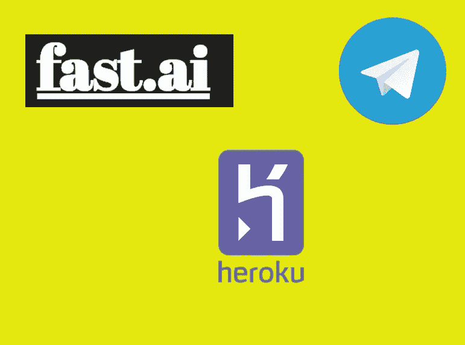
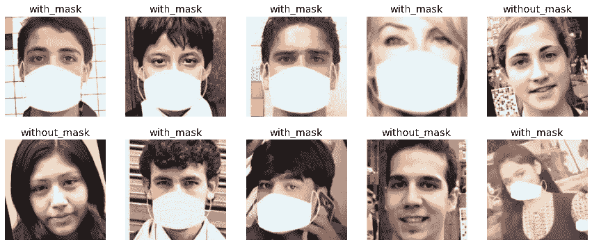
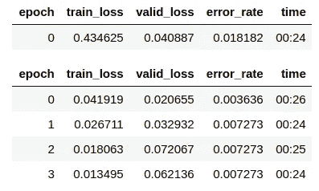
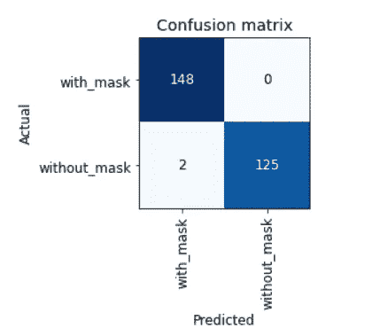
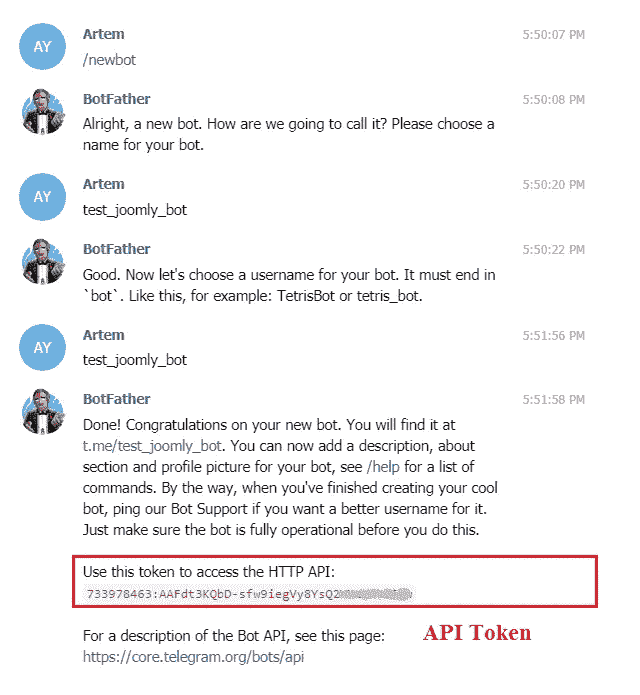
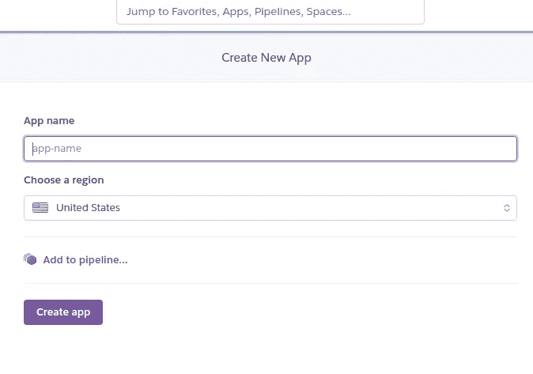

# 如何用 Telegram Bots 在 Android 和 IOS 上部署机器学习模型

> 原文：<https://medium.com/analytics-vidhya/how-to-deploy-machine-learning-models-on-android-and-ios-with-telegram-bots-a6fb16922741?source=collection_archive---------6----------------------->

在这篇博客文章中，我将向您展示如何将您的机器学习模型带到手机上，无论是 Android 还是 IOS，都可以使用 Telegram Bots，并免费将其托管在 heroku 上。



我敢肯定，你已经看到了我的面具检测机器人演示。如果你还没有 [**点击这里**](https://youtu.be/i1-vxmxwqGA) 。我将一步一步地描述你如何在几分钟内完成同样的事情。但首先，我为什么要这样做，这个面具检测机器人如何有用？

# 这个项目的灵感

当我看到优步的这条推文时，我有了这个想法，介绍了他们为司机和乘客提供的面具验证功能:

优步的推特

嗯，我想做同样的事情，重现用户体验，也就是说，在应用程序中拍照，然后有一个遮罩检测响应。

不幸的是，像大多数数据科学家和机器学习工程师一样，我没有移动应用程序创建技能。我想过学习 Flutter，这样我就可以在 IOS 和 Android 上部署，但是，嘿，我已经有一个技能列表要学习了。

我后来发现，你可以在 Telegram 上免费创建机器人，因为 Telegram 可以在所有移动平台上使用，也可以在 windows，mac 和 linux 上使用，那么它可以用来服务于深度学习模型。

那么，这个项目我们需要什么:

*   数据:戴口罩的人和不戴口罩的人的图像
*   模型:我们将使用 Fastai v2 来训练一个利用迁移学习的模型
*   电报账户:显然
*   Heroku 帐户:用于托管

我们开始吧。

# 数据

我不必从头开始构建数据集。我是通过[般若波罗蜜多](https://www.linkedin.com/in/prajna-bhandary-0b03a416a/)找到这个[回购](https://github.com/prajnasb/observations)的。她已经做了这项工作。你可以在实验文件夹中找到数据。690 个戴面具的人的图像在名为“带面具”的文件夹中，686 个不戴面具的人的图像在名为“不带面具”的文件夹中。这就是我们所需要的。让我们训练一个模型

# 使用 Fastai v2 进行模型训练

我最近开始用 [**程序员深度学习**](https://www.amazon.fr/Deep-Learning-Coders-Fastai-Pytorch/dp/1492045527) 的书学习 fastai。所以，这是一个锻炼我技能的机会。另外，使用 fastai v2 学习 Transfert 只需 5 或 6 行代码。但我也可以用 Tensorflow 2.0 来做，得到同样的结果。

让我们安装 [fastai](https://github.com/fastai/fastai) 。建议在康达环境下做。安装 fastbook 并获取一些实用程序文件:

```
conda install -c fastai -c pytorch fastai
pip install -Uqq fastbook
```

打开笔记本，让我们导入所需的所有内容:

```
import fastbook
fastbook.setup_book()
from fastbook import *
from fastai.vision.all import *
```

数据目录的路径:

```
path = Path("../data")
```

是时候创建数据加载器了。就这么简单。数据块将获取图像，使用其中的 20%进行验证，通过获取父目录名获取标签，并将所有图像的大小调整为 128*128*3

```
mask = DataBlock(
    blocks=(ImageBlock, CategoryBlock), 
    get_items=get_image_files, 
    splitter=RandomSplitter(valid_pct=0.2, seed=42),
    get_y=parent_label,
    item_tfms=Resize(128))
```

让我们看看验证集中的一些图像:

```
dls = mask.dataloaders(path)
dls.valid.show_batch(max_n=10, nrows=2)
```



我们的掩模检测数据集的一些图像

我们已经可以看到，一些图像是通过简单地在人们的脸上添加一个面具而产生的。很高兴知道。

我们现在可以添加一些数据扩充步骤，并使用 resnet18 通过 Transfert learning 训练我们的模型:

```
mask = mask.new(
    item_tfms=RandomResizedCrop(224, min_scale=0.5),
    batch_tfms=aug_transforms())
dls = mask.dataloaders(path)learn = cnn_learner(dls, resnet18, metrics=error_rate)
learn.fine_tune(4)
```



培养

就这样，在我的本地机器上，仅仅 2 分钟，我们就有了 99 %的准确率。多神奇啊！让我们来看看混淆矩阵:



混淆矩阵

只有 2 例没有戴口罩的人被误归类为戴口罩。我们可以导出这个模型，并开始为我们的机器人编写代码。

```
learn.export("model.pkl")
```

# 我们模型的电报机器人

这是有趣的部分，而且出乎意料的简单。要在 Telegram 上创建一个机器人，在 Telegram 上搜索**机器人父亲**，发送这个命令: **/newbot** ，它会询问你的机器人的名字和用户名。一旦你完成了这些步骤，你将获得一个**链接**来访问你的机器人，以及一个**令牌**，它将在代码中被用来与机器人交互。

大概是这样的:



僵尸父亲

去你最喜欢的代码编辑器，对我来说是 Pycharm，让我们为这个机器人写脚本。

我们将使用 [**python-telegram-bot 库**](https://github.com/python-telegram-bot/python-telegram-bot) 。安装方式:

```
pip install python-telegram-bot
```

使用 fastai 照常导入库以进行模型加载:

```
import logging
from telegram.ext import Updater, CommandHandler, MessageHandler, Filters
from fastai.vision.all import load_learner
```

所有电报机器人必须为特殊命令**/开始**和**/帮助**定义一个功能。

```
def start(update, context):
    update.message.reply_text(
        "Bot by @kevindegila on Twitter \n\n "
        "EN : Just send me a photo of you and I will tell you if you're wearing a mask 😏 \n"
        "FR : Envoie moi une photo de toi et je te dirai si tu portes un masque 😏"
    )

def help_command(update, context):
    update.message.reply_text('My only purpose is to tell you if you are wearing a mask. Send a photo')
```

如您所见，这些函数将更新和上下文作为输入，并使用**update . message . reply _ text()**函数向机器人发送文本。

Updater 类的一个实例接收用户输入的命令和消息，将它们转发给调度程序，调度程序将消息发送给不同的处理程序:

```
def main():
    updater = Updater(token="token", use_context=True)
    dp = updater.dispatcher dp.add_handler(CommandHandler("start", start))
    dp.add_handler(CommandHandler("help", help_command)) updater.start_polling()
    updater.idle()if __name__ == '__main__':
    main()
```

在这一步，您可以通过运行脚本来运行您的 bot，并为特殊命令发送消息。

让我们添加遮罩检测功能。我们将定义一个函数来加载我们的模型，另一个函数用于接收来自用户的图像，并将这个函数传递给带有图像过滤器的消息处理程序:

```
def load_model():
    global model
    model = load_learner('model/model.pkl')
    print('Model loaded')def detect_mask(update, context):
    user = update.message.from_user
    photo_file = update.message.photo[-1].get_file()
    photo_file.download('user_photo.jpg')

    label = model.predict('user_photo.jpg')[0]
    if label == "with_mask":
        update.message.reply_text(
            "EN: Looks like you are wearing a mask 😷. I hope you don't forget it when going out!😉 \n\n"
            "FR: On dirait que tu portes un masque 😷, J'espère que tu ne l'oublies pas quand tu sors! 😉"
        )
    else:
        update.message.reply_text(
            "EN: Looks like you are not wearing a mask 😷. Please wear one and stay safe 🙄\n\n"
            "FR: On dirait que tu ne portes pas un masque 😷. S'il te plait, va en porter un. Fais attention 🙄"
        )
```

你可以看到我们是如何下载图片并将其传递给我们的模型，并使用**label = model . predict(' user _ photo . jpg ')[0]**获得标签的。我们只是根据预测的标签发送不同的消息。

我们主要功能现在看起来像这样:

```
def main():
    load_model()
    updater = Updater(token="token", use_context=True)
    dp = updater.dispatcher
    dp.add_handler(CommandHandler("start", start))
    dp.add_handler(CommandHandler("help", help_command))

    dp.add_handler(MessageHandler(Filters.photo, detect_mask))

    updater.start_polling()
    updater.idle()
```

这就是我们的机器人。一切都准备好了，它应该可以在你的笔记本电脑上工作。

现在，让我们免费在 heroku 上部署它。

# 在 Heroku 部署电报机器人

如果您还没有帐户，请前往[https://www.heroku.com/](https://www.heroku.com/)注册。第二步是点击**新建**按钮，进入你的【https://dashboard.heroku.com/】T2 创建一个新的应用程序:



heroku 上的应用程序创建

创建应用程序后，您需要在项目文件夹中创建 3 个特殊文件:

*   一个名为 **Procfile** 的文件告诉 Heroku 如何运行你的代码:

```
worker: python main.py
```

*   一个名为 runtime.txt 的文件，告诉 Heroku 安装哪个版本的 Python:

```
python-3.7.0
```

*   一个名为 requirements.txt 的文件，告诉 heroku 安装一些库。这里我们安装了 Pytorch 的 cpu 版本，以避免超过 Heroku 上 500Mb 的 slug 大小。确保将 fastai 设置为与您训练模型时使用的版本相同:

```
python-telegram-bot
-f https://download.pytorch.org/whl/torch_stable.html
fastai==2.0.13
torch==1.6.0+cpu
torchvision==0.7.0+cpu
```

现在，您只需执行以下步骤，就可以托管您的 bot 并随时可用:

*   创建一个 repo 并将所有文件提交给 master
*   编写 **heroku 登录**命令来连接到您的 heroku 帐户
*   将 heroku 添加为远程回购，使用**heroku git:remote-a app _ name**作为您在 heroku 上的应用名称
*   通过使用 **git push heroku master** 将您的代码推送到 Heroku 进行部署

就是这样。您可以通过测试 telegram 并查看带有**heroku logs-tail**的日志来检查一切是否正常。

# 关于伦理的几点思考

创建这样的项目时，有几件事值得考虑:

*   **关于型号**:它能识别所有肤色、所有性别的面膜吗？在部署这种模型之前，您必须检查偏差。
*   **关于 bot** :应该保存用户图片吗？他们同意收集他们的数据了吗？在我的情况下，我没有为这个机器人保存图像。如果我做了，无论如何我都会超过子弹的尺寸。

想了解更多关于人工智能伦理的信息，请查看 fast.ai 的课程:[https://ethics.fast.ai/](https://ethics.fast.ai/)

# 结论

在这个项目中，我们创建了一个**电报机器人**，它可以判断用户的照片上是否戴着**面具**。我们用 **fastai v2** 和杠杆**transfer learning**训练模型。这个机器人是使用 **python-telegram-bot** 库创建的，我们将我们的机器人部署在 **Heroku** 上，这样我们的机器人就可以随时可用。

如果你读到最后，我鼓励你为这篇文章鼓掌并分享它。如果你会法语，可以在我的 [Youtube](https://www.youtube.com/channel/UC5tyoKrTlhBSM9NkQYW1RzA) 频道看 [**视频**](https://youtu.be/i1-vxmxwqGA) 教程，有问题可以加入我的 discord 服务器:[https://discord.gg/sHE5exZ](https://www.youtube.com/redirect?q=https%3A%2F%2Fdiscord.gg%2FsHE5exZ&event=video_description&v=dVJPSWkpBKo&redir_token=QUFFLUhqbG5vT1BkSmxzVVA4SzFGb0JtNkR4M0EyMnI0QXxBQ3Jtc0trcVRMTVdHMHFoS2FoZmRKQzFNSmZhTDMzOUJFQ1dMdHlsTkJ1bV93c3V5WEdEc0FVTjVMS0FVTXl5Zl95dENnREZabUxIN3BBVlZxTzRKWkRyc0tWQTdGUDFyZV8tZWYwM0VoYzhwMXYySGIxUHh1MA%3D%3D)

也欢迎在 twitter 上提出反馈和问题。