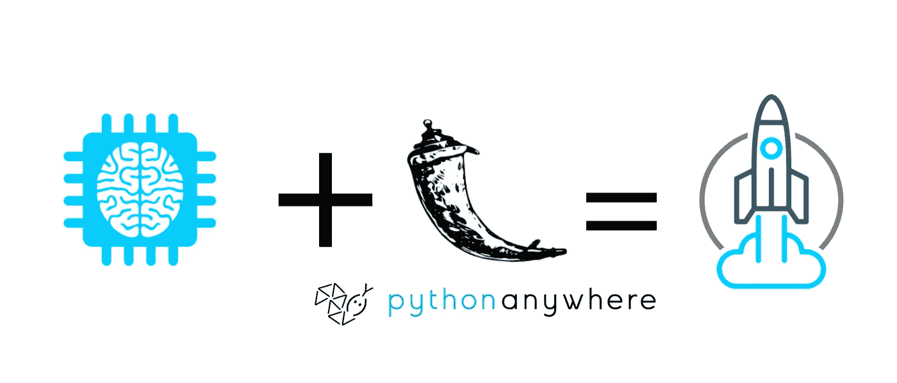
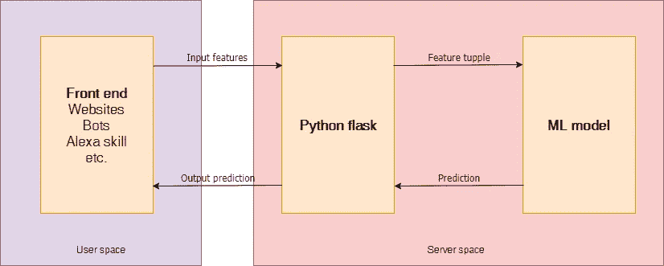
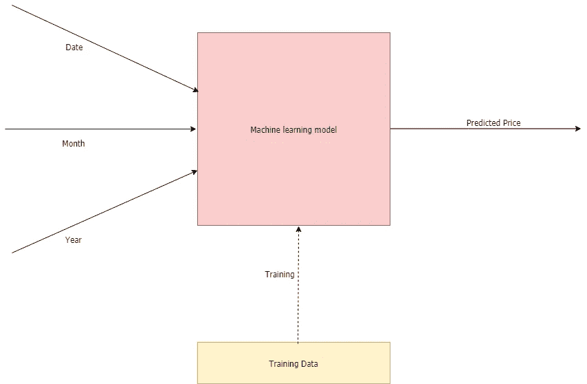
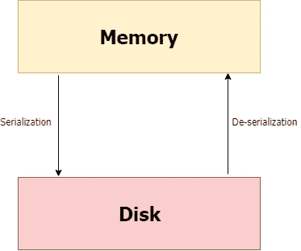
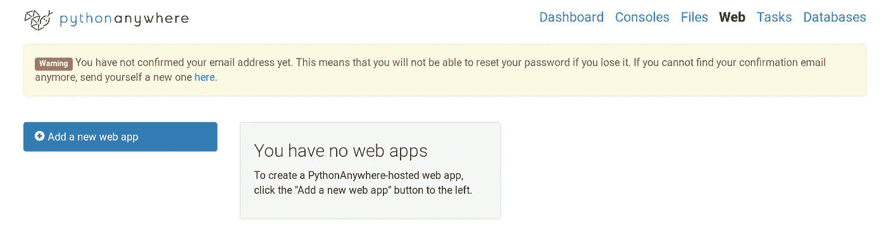
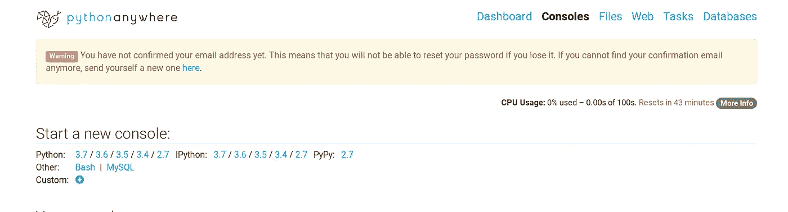
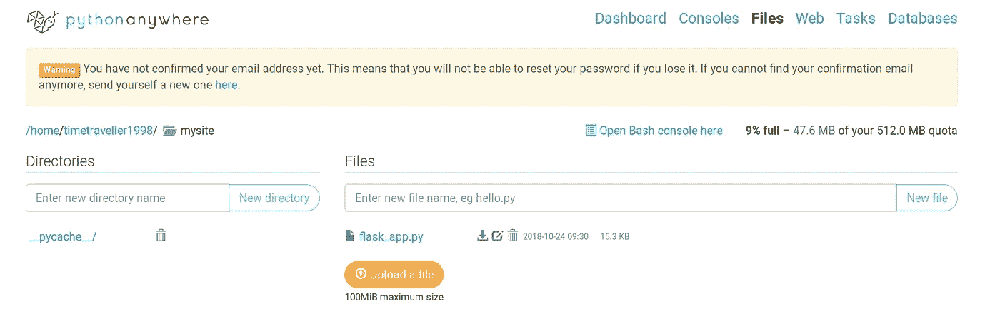
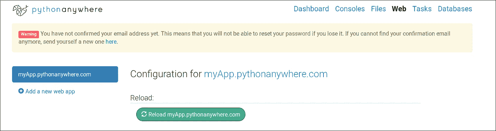
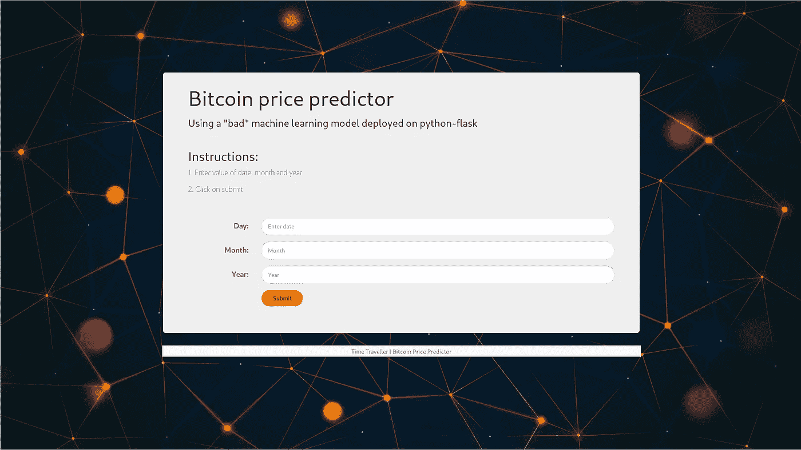

# 免费部署机器学习模型

> 原文：<https://medium.com/analytics-vidhya/how-to-deploy-simple-machine-learning-models-for-free-56cdccc62b8d?source=collection_archive---------0----------------------->



机器学习模型部署

# 介绍

机器学习模型躺在 IPy 笔记本或零散的 python 脚本中是没有好处的。为了改变人们的生活并对世界产生影响，模型需要以一种大众可用的方式部署，而不仅仅是领域专家。为此，模型需要封装在某种 API 之后，其他应用程序可以使用它与模型进行通信。它涉及到相当多的网络开发，人们经常被它吓倒。然而，这并没有那么难。通读这篇文章，自己去发现吧！

这篇文章的目的是在 web 上部署一个机器学习模型作为通用 API，它可以在各种平台上使用，例如:

1.  网站
2.  telegram、slack、discord 等应用程序的机器人
3.  Android/iOS 应用
4.  Alexa skills
5.  允许您通过 HTTP/HTTPS 发送基本的 GET/POST 请求的任何其他平台

> 免费托管 API！

> **除非您的型号使用需要 nvidia GPUs 的 CUDA，否则这种方法是免费的。如果你想使用 CUDA 或任何其他 GPU 密集型库，你需要购买一个带有 nvidia GPU 的服务器。如果你有一台服务器，我会在这篇文章的末尾介绍一些入门指南。*

# 先决条件

读者需要能够创建机器学习模型，训练它们，然后用它们来预测 python 中的结果。这篇文章旨在提供关于将机器学习模型部署到小规模生产中的见解。

下面是将要使用的几个库和资源:

*   [pickle](https://docs.python.org/2/library/pickle.html) :本地 python 库，将 python 对象作为文件保存(序列化)和加载(反序列化)到磁盘上
*   flask:一个基于 python 的易于使用的 web 框架。这里是由[sendex](https://www.youtube.com/channel/UCfzlCWGWYyIQ0aLC5w48gBQ)制作的[文档](http://flask.pocoo.org/docs/1.0/)和一系列好的[视频教程](https://www.youtube.com/watch?v=Lv1fv-HmkQo&list=PLQVvvaa0QuDc_owjTbIY4rbgXOFkUYOUB)
*   [pythonanywhere](https://www.pythonanywhere.com/) :一个免费使用的教育网站，允许托管 python flask，并提供完整的 python 开发环境。

# **环境设置**

确保使用 python 3+

pip 安装以下软件包:

1.  flask(我们的 python-web 框架)
2.  flask_cors:用于 cors 标题
3.  jsonify:使用 flask 返回 JSON 文件
4.  根据需要的其他学习图书馆，如 numpy、pandas、sklearn 等

`pip install flask flask_cors jsonify numpy pandas`

# 数据流

下面是用户和服务器空间之间数据流的图示。



API 数据流

下面是需要做的事情的总结:

1.  使用 Jupyter 笔记本训练模型
2.  将训练好的模型对象保存为 pickle 文件(序列化)
3.  创建一个 flask 环境，该环境将具有一个 API 端点，该端点将封装我们训练好的模型，并使它能够通过 HTTP/HTTPS 上的 GET 请求接收输入(特性),然后在反序列化先前序列化的模型后返回输出
4.  将 flask 脚本和训练好的模型一起上传到 [pythonanywhere](https://www.pythonanywhere.com/)
5.  通过网站、bot、android 应用程序或任何其他能够发送 HTTP/HTTPS 请求的应用程序向托管的 flask 脚本发出请求

# 机器学习模型

这篇文章的目的是部署一个模型，而不是创建它。让我们假设我们有一个模型，它接受日期作为输入，并预测比特币的价格。该模型已经根据历史价格数据进行了训练。



模型数据流

> 如果你有兴趣了解这个模型，你可以参考我的 [github 库](https://github.com/TimeTraveller-San/crypto_predictor)。虽然，小心！使用机器学习永远无法预测比特币的价格，这只是巩固这一点的一次失败的尝试(也是一次非常愚蠢的尝试)。这个模型的功效不是这篇博文所关心的，所以现在让我们只讨论这个模型。**序列化和反序列化模型**

# 泡菜

一个名为 pickle 的模块帮助在 python 中执行序列化和反序列化。

**序列化**

简而言之，序列化是一种在磁盘上编写 python 对象的方法，该对象可以传输到任何地方，稍后可以由 python 脚本反序列化(读取)回来。



序列化、反序列化

这是如何做到的:

运行上述代码后，会创建一个名为“ **mlp_nn.pkl** 的文件，该文件是经过训练的模型，可以传输到任何地方，并在反序列化后使用，如下所示:

**反序列化**

# 烧瓶设置

让我们首先在本地主机上设置 flask 服务器，然后在 pythonanywhere 上免费部署它。

**在本地主机上设置 flask-app:**

确保烧瓶已安装。`pip install flask`

以下脚本在本地主机和默认端口(5000)上启动 flask 服务器，使[成为 URL:http://127 . 0 . 0 . 1](http://127.0.0.1:5000/):5000/

> 只需在浏览器上粘贴[http://127 . 0 . 0 . 1](http://127.0.0.1:5000/):5000/，按回车键即可看到服务器工作。

15

*   **App 路线**

**app.route** decorator 用于指定 flask app 在 web 上的路径。

**“/”**简单来说就是“ [http://127.0.0.1:5000/](http://127.0.0.1:5000/) 的家

**"/price/"** 表示[http://127 . 0 . 0 . 1:5000/price/](http://127.0.0.1:5000/)

*   **自变量**

参数可以通过这些路径传递，如下所示:

[http://127 . 0 . 0 . 1:5000/price/？日期=12 &月=3 &年=2019](http://127.0.0.1:5000/price/?date=12&month=3&year=2019)

一般模板如下所示:

[https://[首页]/[路线]/？[var](https://[HOME]/[ROUTE]/?[var)1 _ name]=[var 1 _ value]&[[var](https://[HOME]/[ROUTE]/?[var)2 _ name]=[var 2 _ value]

这些参数在 flask 脚本中解析如下:

1.  **request . args . get(' date ')**将返回 12
2.  **request.args.get('月')**将返回 3
3.  **request . args . get(' year ')**将返回 2019

> 当你在浏览器中输入 url 时，它会通过 HTTP/HTTPS 向指定的 URL 发送一个 GET 请求。

> 在我们的例子中，我们向 flask 服务器发送了一个带有日期、月份和年份参数的 GET 请求，以获取我们模型的预测。

*   **jsonify**

**flask . jsonify()***函数将返回一个 python 字典作为 JSON。JSON 格式可以被认为是一个 python 字典，可以嵌套任意次并通过 web 传递。这是组织应用程序间共享数据的好方法。在处理 web APIs 时，总是建议使用 JSON 格式。*

*   ***CORS***

***flask_cors** 包用于修复 AJAX 调用使用的 cors 头，使跨源 AJAX 成为可能。*

> *旅游你可以在这里阅读更多关于 CORS 的信息，或者直接使用它。你不能忽略它，因为如果没有正确的 CORS 头文件，我们的 API 将不能被其他任何外部应用程序使用。我个人与 CORS 错误做了很多斗争，并且不得不阅读 flask 和一些 web 开发文档来提出这个简单的解决方案。如果你有一个更好的方法来处理 CORS 头文件，请在回复中告诉我。*

# *预测功能*

*上面的代码在 my_bitcoin_predictor 类中有一个 predict 函数，需要稍微解释一下*

*预测函数可以接受输入特征并输出模型的预测。这是使用 python flask 在 web 上实际部署的函数。现在，不再通过 python 脚本或 IPy 笔记本从相同的环境中接收输入要素，而是通过 web 上的 flask 等 web 服务器接收要素，并返回预测结果。*

> *为了简单起见，我跳过了 **my_bitcoin_predictor** 类的很多部分，只写重要的部分。*

# *文件结构*

*一个简单的文件结构如下所示:*

```
*Bitcoin predictor
 |
 +-- flask_app.py
 |    
 +-- predictor.py
 |
 +-- mlp_nn.pkl
 | 
 +-- data
 |  |  
 |  +-- bitcoin_price_historical_data.csv*
```

> *我还没有谈到模型由历史数据训练的部分*

*名为`Bitcoin predictor`的文件夹是需要上传到 pythonanywhere 上的文件夹*

# *托管 flask 应用*

*本地主机上托管的 flask 应用程序不能与其他人共享，因为它是“本地”的。按照几个简单的步骤将脚本托管到一个名为 pythonanywhere 的免费 python 托管网站:*

***第一步。注册一个新账户**。*

*现在，让我们坚持免费帐户。你可以购买更好的主机方案来满足更多样化和更复杂的需求。(在这个网站上有一个为新用户准备的不错的游览，会对你有所帮助)*

***第二步。添加新的网络应用***

*选择 flask 和您想要的任何 python 版本。为了这个教程，我将使用最新的 Python 3.7。创建 web 应用程序后，您将获得一个指向 flask 端点的 URL。默认情况下，它会显示一条消息“您好，来自 Flask！”。您的端点看起来像这样:`[username].pythonanywhere.com`*

**

*添加新的 web 应用*

***第三步。安装依赖关系***

*您的 ML 模型必须使用各种外部库，如 sklearn、numpy、pandas 等。将它们全部安装在您的 pythonanywhere 环境中。为此，打开一个新的 bash 控制台并使用 pip 安装库。确保使用`user` 选项安装带 pip 的库，因为我们没有超级用户权限。烧瓶已经安装，不需要再次安装。*

*`pip install --user flask_cors numpy pandas`*

**

*安装依赖项*

***第四步。** **上传文件***

*在默认文件夹— /mysite/中，您需要上传完整的文件夹。您可以使用网站上的 files 页面或者通过使用 wget 命令下载文件来使用 bash 控制台。*

**

*上传文件*

***第五步。** **重新加载 web app***

*您的端点现在将充当 API 来促进其他应用程序。*

**

*重新加载 web 应用程序*

# *前端应用示例*

> *你需要了解基本的 HTML、CSS 和 JavaScript。*

**

*一个示例网站*

*据观察，许多机器学习爱好者不喜欢 web 开发，这就是为什么我创建了一个简单的模板，可以用来通过 HTML 表单接收输入功能，并向 API 发出请求以获取结果。即使你不精通 HTML-CSS-JavaScript，你也可以很容易地编辑这个模板。*

*这里是同样的 [GitHub 库](https://github.com/TimeTraveller-San/ML-frontend-template)。*

*对于讨论中的示例，编辑后的 JavaScript 模板如下所示:*

*在线托管这个网站，我们就大功告成了！任何地方的任何人都可以使用该网站提交特征，并从位于后端的各种数据层下的 ML 模型中获得预测结果。*

> ***我更喜欢在 GitHub 上上传我的网站，然后用* [*netlify*](https://www.netlify.com/) *让它直播。全部免费！**

# ***在个人服务器上托管***

*pythonanywhere 仅用于教育目的，缺少 GPU。对于严重依赖 CUDA 和基于 GPU 的计算的复杂深度学习模型，需要更强的服务器。Flask 在一个新的服务器上从头开始运行，使用一个像 nginx 这样的 web 服务器后面的 [WSGI](https://en.wikipedia.org/wiki/Web_Server_Gateway_Interface) 服务器，比如 [gunicorn](https://gunicorn.org/) 。也可以使用类似[主管](http://supervisord.org/)的过程控制系统。*

> *所有这些都需要一些 web 开发知识，写这些会让这篇文章太冗长。这个[网页](http://alexandersimoes.com/hints/2015/10/28/deploying-flask-with-nginx-gunicorn-supervisor-virtualenv-on-ubuntu.html)帮助我第一次在我的服务器上设置 flask。真的很简单，写的非常好。*
> 
> *你也可以参考我的[图像分类模型](https://github.com/TimeTraveller-San/deep_learning_otae_detector)，它使用 CUDA，托管在本地主机上。它展示了如何使用 flask 处理图像文件并将其传递给模型。我将很快写一个完整的帖子专门讨论这个问题。*

# *结论*

*托管和共享机器学习模型真的很容易。依靠机器学习模型后端创建 android 应用程序、聊天机器人和更多应用程序现在可以非常容易地创建。*

*感谢阅读。如果我犯了什么错误，或者有些事情可以做得更好，请在回复中告诉我。*