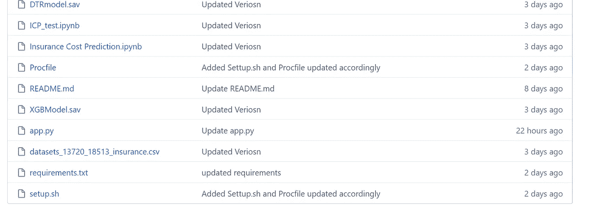
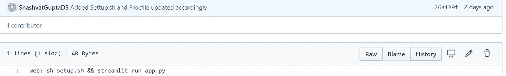
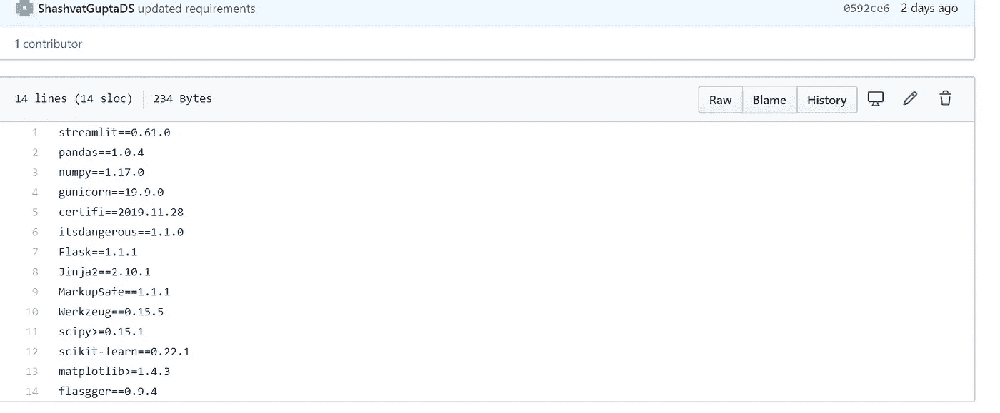
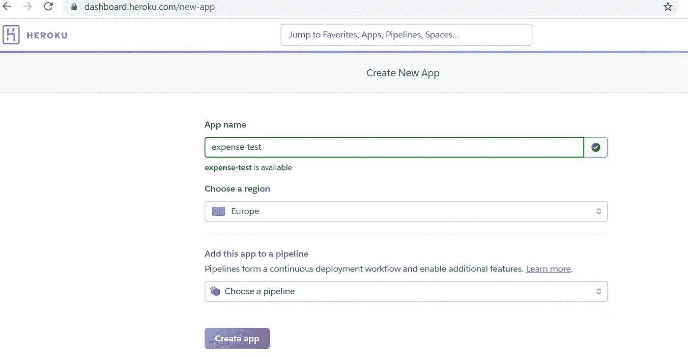
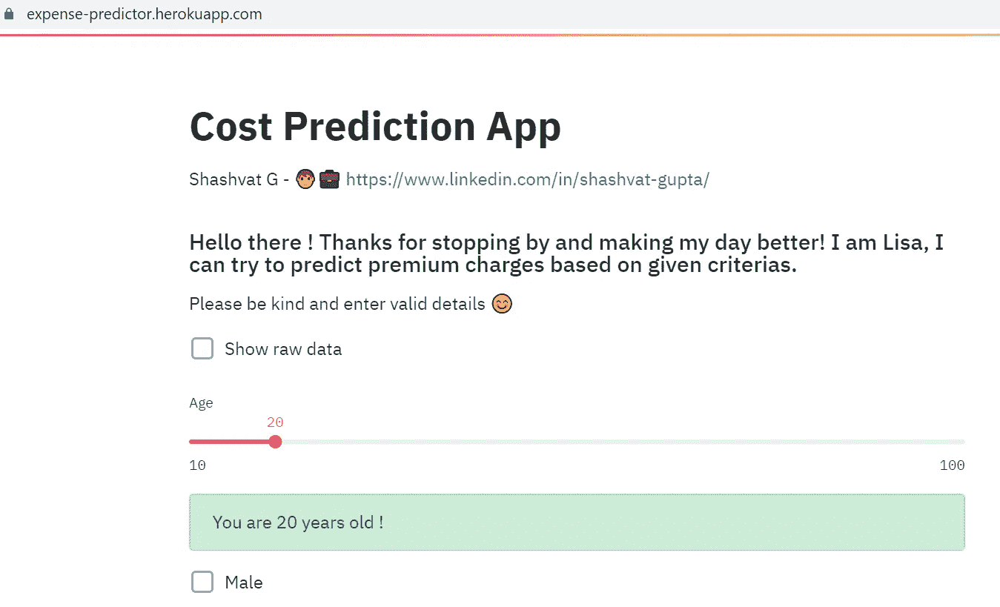

# 如何在 Heroku 上部署 Streamlit Web App

> 原文：<https://medium.com/analytics-vidhya/how-to-deploy-streamlit-web-app-on-heroku-1235d827f1f?source=collection_archive---------10----------------------->

## 在云上部署您的 ML 模型

## 使用 Heroku 在云上快速部署您的 Web 应用程序

H [eroku](https://www.heroku.com/) 是一款快速易用的平台即服务(PaaS)软件，可以方便地部署网络应用程序，任何人都可以通过 URL 访问它。换句话说，这将使您能够将应用程序从本地机器转移到云中。在本教程中，我们将讨论在 Heroku 上部署基于 Streamlit (Python)的应用程序的步骤。Heroku 被选中部署主要是因为当你[注册一个新账户](https://signup.heroku.com/)时，它提供免费的资源小时。

> 在我们进一步深入之前，一些先决条件是一个有效的 streamlit 应用程序和一些云的基础知识。然而，即使您不熟悉任何云技术，您仍然可以在 web 上部署您的应用程序。真的就这么简单！

让我们开门见山，不要再浪费时间了。你需要一个主机作为你的应用程序的占位符，还需要一些安装文件，这些文件对于 Heroku 检测和运行你的应用程序是必不可少的，就像你在本地访问一样。我已经使用 GitHub 组装了应用程序所需的所有文件。以下是截图:

将所有相关文件添加到您的应用程序存储库中。

基本上，Heroku 需要这三个文件来检测我们的 streamlit 应用程序和运行时要执行的指令。这些措施如下:

***1。*进程文件(Proc file)**

***2。需求文件(requirements.txt)***

***3。设置文件(setup.sh)***

重要的是要注意，用于设置的和 shell 文件对于部署是必需的，否则您的应用程序可能会失败。

ProcFile

Proc 文件包含关于如何使用安装外壳文件运行应用程序的信息，并使 Heroku 能够检测应用程序文件。

下一步是添加一个需求文件，它只是一个依赖项列表和应用程序平稳运行所需的版本。在这种情况下，需求文件包含以下库:

依赖项及其各自版本的列表(如果适用)

值得一提的是，确保不要添加两次库或不兼容的版本。这可能会在构建阶段产生问题。

现在我们已经准备好了文件，我们可以在 Heroku 上部署我们的应用程序了。

前往 [Heroku](https://dashboard.heroku.com/) 仪表板，创建一个帐户开始使用。快速提示:Heroku 在创建您的帐户时不会向您收取费用，也不需要帐户详细信息，甚至部署也是免费的。他们只在你需要额外设施的情况下才收费，比如，度量标准或者你是一家企业。下一步，一旦你有了一个帐户，创建一个新的应用程序，并命名你的应用程序和你想操作的地区。您可以选择添加一个管道来形成一个连续的部署工作流，并启用其他功能。

新应用程序创建

完成后，您将被重定向到添加部署方法。因为我的 Github repo 上已经有了这个应用程序的所有相关文件，所以我们可以直接链接一个 repo 并部署它。

部署选项

或者，您可以使用 Heroku git 命令行界面将更改直接推送到 Heroku，而不是先推送到 Github，然后在 Heroku 上部署。但是，如果您是 Github 的粉丝并且不想使用 Heroku CLI，那么您可以通过在 Heroku 上启用自动部署特性来节省一个步骤。

只要您单击 Deploy 分支，它就会检测您的应用程序，运行安装 shell 文件，并下载所有依赖项。这三个步骤成功完成后，Heroku 就会生成你的网址，然后嘣！，你可以走了！使用 URL 进行测试，并将其发送给其他人来测试您的应用程序。这是最终部署在网络上的 streamlit web 应用程序:

D 别忘了查看优秀的[文档](https://devcenter.heroku.com/)，以防你陷入困境或者需要部署用其他语言构建的应用，比如 Ruby、Java、Node.js

# **结论**

我很想在下面的评论中听到你对 Streamlit、Heroku 和机器学习以及模型部署的想法。

如果你觉得这很有用，并且知道任何你认为会从中受益的人，请随时发送给他们。