# 如何轻松地将您的机器学习模型部署到云中。

> 原文：<https://medium.com/analytics-vidhya/how-to-deploy-your-machine-learning-model-in-the-cloud-87d3451a466d?source=collection_archive---------6----------------------->


图片来源:[https://wallpaperaccess.com](https://wallpaperaccess.com/)

在中间件公司和创业公司中，人们希望数据科学家做从数据预处理到模型生产的所有事情。因此，如果你是一个初级的 ML 工程师，想开发一个产品，或者对部署他们的模型感兴趣，那么你来对地方了。

在继续之前，我将使用亚马逊 AWS 免费 EC2 服务来启动一个实例，你需要有一个有效的借记卡或信用卡来创建一个 AWS 帐户。

*让我们开始吧！！。*

# 总体而言，我们将采取以下措施:

1.为我们的模型编写推理代码。
2。使用 Flask 创建简单的 web API。
3。用 Docker 容器化应用程序。
4。在 EC2 实例上运行 Docker 容器。

如果你以前从未听过这些术语，没关系。我试着详细解释它们，这至少是一个好的开始。

在这篇文章中，我使用推特上的数据将这条推特归类为与灾难相关的推特。请找到数据集[链接](https://www.kaggle.com/c/nlp-getting-started/data)。

## 最终结果:

使用样本输入进行检查。

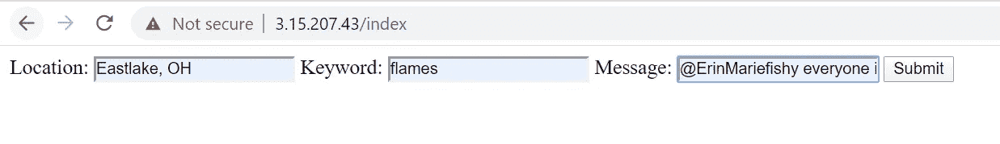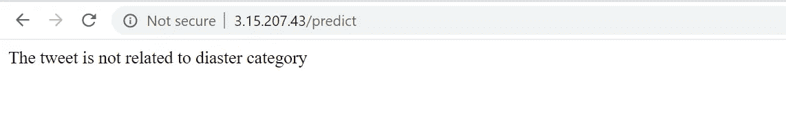

图:结果

看到结果是一个好主意，我们将从用户那里获得 3 个输入，并预测推文是否与灾难有关。请注意 IP 地址是全球运行的，可以从任何地方访问。

# 1.构建机器学习模型:

让我们首先建立一个简单的机器学习模型，我选择这个数据集是为了理解编写推理代码的重要性。

显示训练我们的模型所需的所有库

在这里，我导入了我们的模型所需的一些库。

要素的矢量化

为了简单起见，我用空值填充缺失的值。现在在数据中，我们有两个分类特征和一个文本特征。因此，我在分类特征上安装了一个简单的计数矢量器，在文本数据上安装了 TFIDF 矢量器。

为 XGBoost 算法定型

我正在堆叠所有的特性，并在我们的模型上安装一个简单的 XGBoost 算法。

如果不进行预处理和超参数调整，我们只能获得 72%的准确率。 ***目前，我们的目标不是打造超模，而是部署训练有素的模特。*** 因此我现在不打算改进这个模型。

推断所需的 Pickle 文件

让我们保存这些文件，因为推断需要这些文件

推理代码

因此，给定 pickle 文件，我们可以加载 pickle 文件，并通过调用 predict 函数预测模型的输出，如上所示，

# 2.建筑烧瓶 API:

## 创建简单的 API:

在开始构建您的 API 之前，让我向您展示一个 Flask 如何工作的例子。

简单烧瓶代码

这里我们在端口 3000 上创建我们的服务器，它监听我们的 HTML 请求。如果我们收到任何对我们家乡路线的请求，我们将返回消息“Hello World！”。

现在转到您选择的任何命令行，将目录切换到当前项目并键入

```
python app.py.
```

您应该看到一个服务器正在启动。

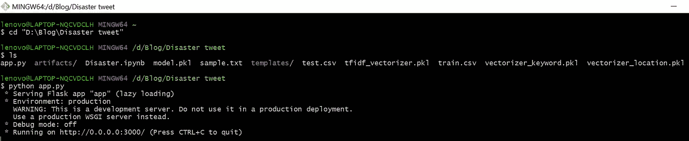

控制台输出

现在转到您的浏览器，键入以下 IP 地址:localhost:3000，您将得到“Hello World！”的输出

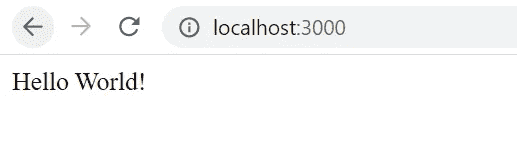

本地主机上的浏览器:3000

## 创建一个简单的 HTML 表单来发送 post 请求表单数据:

制作一个简单的 HTML 表单，可以包含三个输入字段:位置、关键字、消息和提交按钮。当提交表单时，它会向'/predict' route 发出 post 请求。

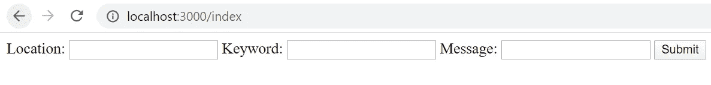

图 5:带有三个字段位置、关键字和消息的 HTML 文件，带有一个表单提交按钮

图 5:制作样本表单的 HTML 代码

## 创建应用程序路线

1.  当用户转到 localhost:8080/index 时，他应该被重定向到表单页面
2.  当表单提交后，我们应该能够得到表单页面的数据。

创建两个文件夹工件和模板，将 index.html 文件放在模板中，将所有 pickle 文件放在工件文件夹中，并在同一个 app.py 文件中创建两条路径索引和预测。

当我们转到 localhost:8080/index 时，我们将加载我们已经创建的 index.html 文件。

> render_template 在 templates 文件夹中查找 HTML 文件，因此创建 templates 文件夹很重要。

## 创建一个可以从表单页面获取输入并做出预测的函数

注意:在我们的 HTML 中，表单发布到'/predict' route。默认情况下，Flask 中的每个路由都有一个“get”方法。因此，我们必须在函数装饰器中声明，我们正在侦听'/predict' route 上的 post 请求。

完整的烧瓶 API 代码

这是我们最后的 Flask Web API 代码，我们正在加载我们的模型被训练的 pickle 文件。对每个要素应用变换方法，然后将所有要素叠加在一起。现在，给定查询点的数据，我们将根据之前训练的模型对该点进行预测。将 0.5 作为阈值，我们将根据预测值返回一条简单的消息。

让我们运行我们的服务器去命令行并运行你的 python 代码

```
python app.py
```

现在转到您的浏览器，键入 URL localhost:8080/index，键入您想要的任何内容，然后单击 submit，您将获得结果。

图 5:检查模型行为的示例输入，将示例数据插入到相应的字段中，然后单击 submit

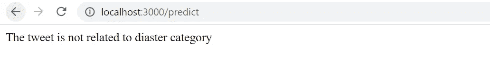

图:最终结果

现在的问题是它只能从我们的本地系统访问。如果有人想运行预测，他/她应该到你家，运行服务器，输入输入，得到结果，然后返回…这是难以想象的，所以我们将通过将这些代码部署到云中来解决这个问题，这样任何地方的任何人都可以访问这个页面。

# 3.创建 Dockerfile 文件

## docker 是什么？

我们在本地系统上运行我们的模型，本地系统有一些操作系统、内存、硬盘和一堆正在运行的可执行文件。我们用自己的系统看电影，回复邮件，创建自己的服务器。

> 但是，如果我们只是想推出一个服务器，我们需要我们的整个本地系统。要运行我们的模型，我们几乎不需要 200MB 或更少的内存。最近你会得到专门用于运行我们服务器的 200 兆内存系统吗？。
> 
> 如果你正在尝试构建一个 python2.7 支持的机器学习模型，而你的 python 版本是 3.0 以上，你将如何处理这种情况？ **Docker 帮助我们非常容易地做到这一点。**

在我们的示例中，我们只需要安装 python、pip 库(Flask、XGBoost、Sklearn 库等)。想象一下，有一个盒子，里面正好有这些软件库，足以让我们运行我们的模型。Docker 帮助我们创建这些盒子，这些盒子被称为容器。我们可以创建任意多的盒子，并且可以在任何系统中同时运行。

足够的理论让我们创建我们的第一个 docker 文件。在当前项目目录中创建一个同名文件‘docker file’和测试文件 requirements.txt。

Docker 文件来封装我们需要的应用程序和代码。

我们顺利运行模型所需的库。

这是我们的 Docker 文件的样子，我们总共有 9 个步骤

*   从 Docker 存储库中获取 Python 3.5 包。
*   设置维护者名称。
*   设置用户名— root
*   在文件夹应用程序中创建工作目录。
*   将当前目录中的所有文件添加到 docker 容器中。(圆点表示每个文件)。
*   构建我们的 python3 顺利工作所需的环境。
*   运行 pip 安装<library name="" inside="" requirements.txt=""></library>
*   入口点:所以当我们运行 docker 容器时(我们将在一段时间内完成),它将运行下面的命令“python app.py ”,所以当这个命令运行时，它将启动 Flask API 代码，并将为我们启动一个服务。

# 3.创建并登录到 EC2 实例。

*   登录 AWS 控制台，搜索 EC2 服务:

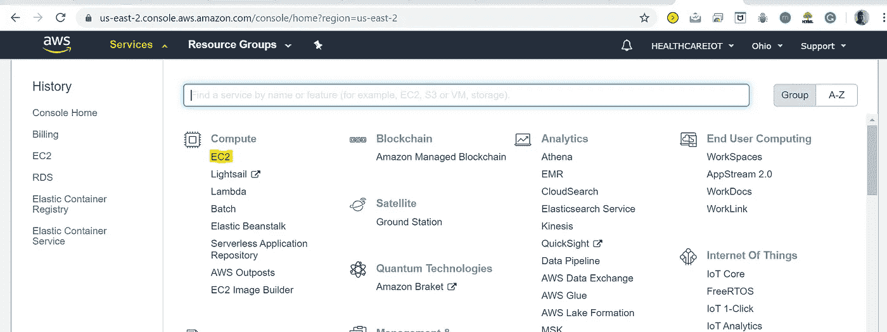

图:AWS 控制台。突出 EC2 服务

*   创建启动实例，您应该会看到下面的屏幕:

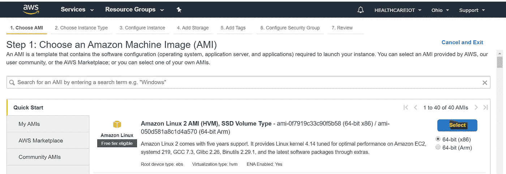

图:亚马逊 Linux 2 实例

*   选择符合免费层条件的实例(Amazon Linux 2 ),这样就不会产生不必要的费用。

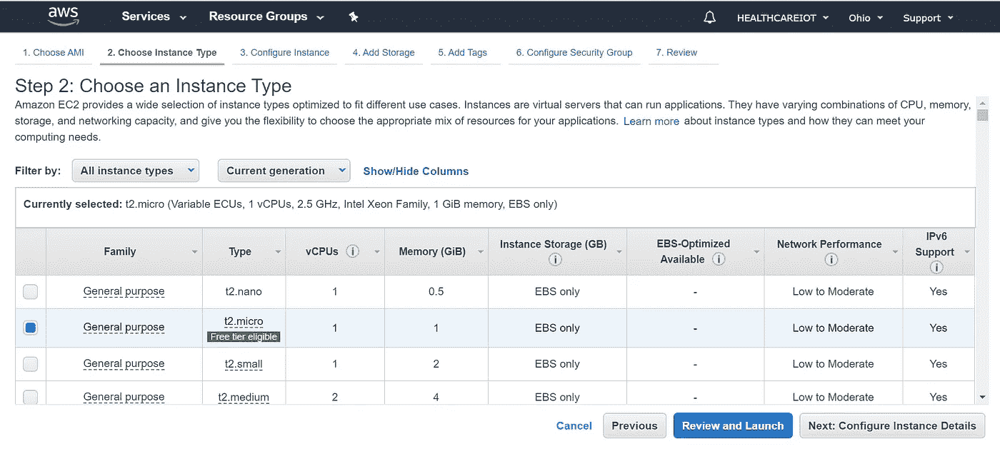

图:实例类型:t2.micro

*   单击通用 t2.micro，然后单击查看和启动，然后启动。

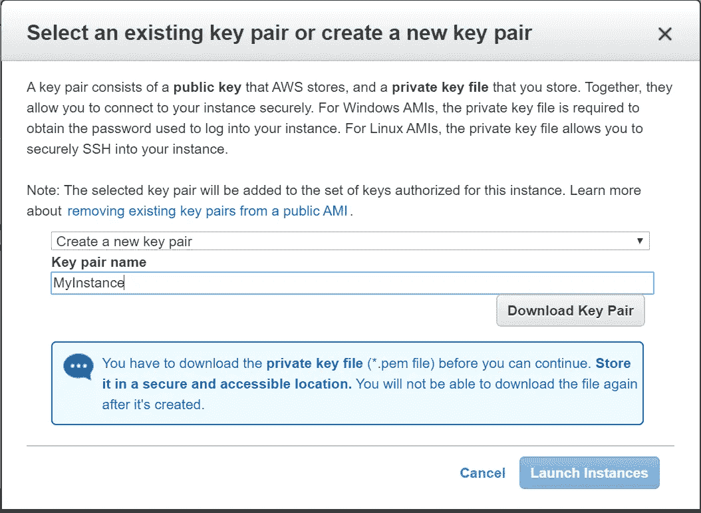

图:密钥对窗口。

*   选择创建新的密钥对，并给出一个密钥对名称。单击下载密钥对。密钥对文件(MyInstance.pem)将在内部加密一个私有密码。这个文件是我们以后登录 EC2 实例所必需的。单击启动实例，您应该会看到下面的屏幕。

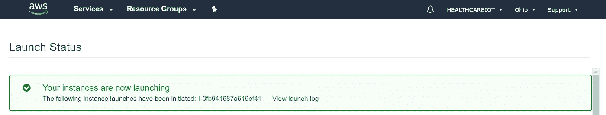

图:实例启动确认

*   单击实例 ID(在我的例子中是 [i-0fb941687a619ef41](https://us-east-2.console.aws.amazon.com/ec2/v2/home?region=us-east-2#Instances:search=i-0fb941687a619ef41;sort=instanceId) )。

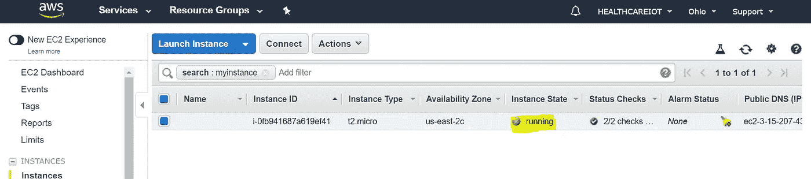

图 3:当实例准备好使用时，实例状态将变为运行中。

*   我们必须为实例配置安全组。安全组告诉哪些用户可以访问哪个系统，目前我们希望世界上的每个人都能看到我们的模型。所以我们会通过增加一些规则让它对世界开放。
*   单击左侧菜单栏上的安全组。

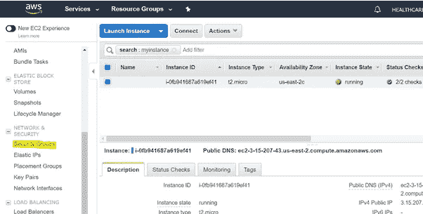

图:显示左侧菜单中的安全组。

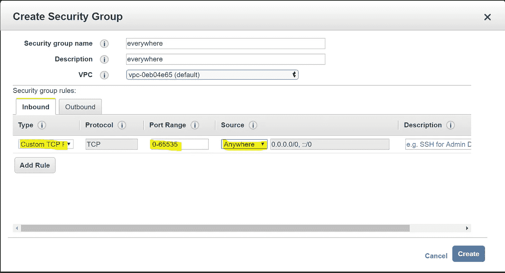

图:安全组的入站规则

*   给出任何描述和名称。点击入站->添加规则
*   类型:自定义 TCP，端口范围:0–65535，源任意位置，然后单击创建。

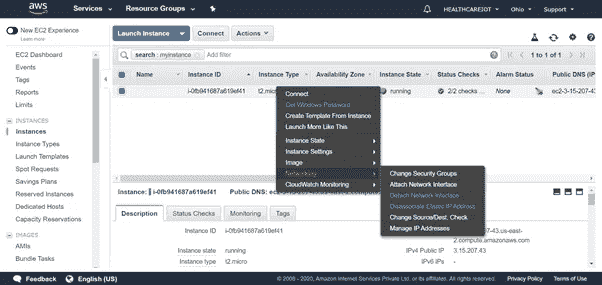

图:更改当前实例的安全组。

*   选择实例右键->单击网络->更改安全组，然后选择您创建的安全组。

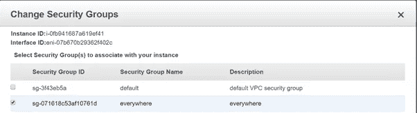

图:选择适当的安全组。

*   现在实例已经配置好了，我们需要登录实例并创建 docker 映像。
*   单击 Connect to the instance，您将看到一个 ssh 命令，复制 ssh 命令。

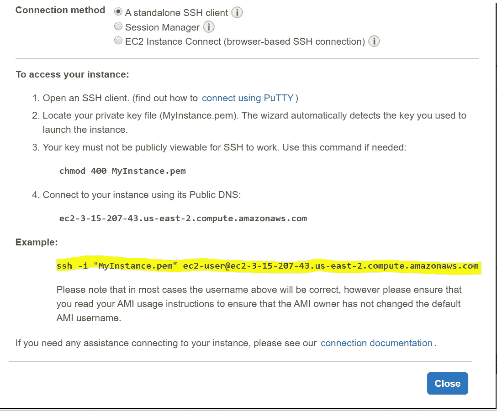

图 5:SSH 命令，我们将使用它来登录我们的 AWS。

*   打开任何终端并运行下面的代码，确保您位于。pem 文件存在，您已经下载了该文件。

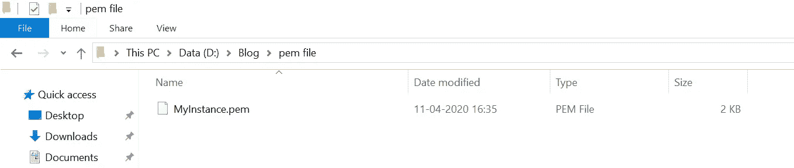

图:MyInstance.pem 文件位于 D-drive 的文件夹中

*   将终端的目录更改为目录，并运行您复制的命令。

```
cd '<Your directory>'
ssh -i "<Name>.pem" ec2-user@<Host IP address>
```

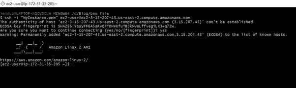

图:成功登录。

*   如果您可以看到上面的屏幕，那么您已经成功登录。

# 4.创建 Docker 容器并运行它:

为了简单起见，我复制了 GitHub 中的代码，并将它克隆到当前的 amazon 实例框中。

在此之前，您需要在该实例中安装 git:

```
sudo yum install git
```

Sudo 提供安装 git 的管理员权限。YUM 是一个用于 Linux 操作系统的包管理工具。

```
git clone [https://github.com/GowthamChowta/Disaster_tweet.git](https://github.com/GowthamChowta/Disaster_tweet.git)
```

它会要求您提供 git 凭证，请输入您的电子邮件和密码。如果您不想这样做，您可以使用 SCP(安全复制)将您的文件从本地实例复制到 Linux 系统，方法是使用以下命令。

```
scp -r -i "myinstance.pem" ./Disaster\ tweet ec2-user@ec2-3-15-207-43.us-east-2.compute.amazonaws.com​ :~/
```

完成上述步骤后，您应该会在 Linux 实例中看到您的文件夹。键入 ls，您应该会看到一个文件夹 Disaster_tweet。(LS-列出目录)

```
$ ls
#output: Disaster_tweet
```

现在让我们安装 docker(-y 标志表示在安装过程中对所有的是/否问题都回答是)。

```
sudo yum install -y docker
```

*   启动 docker 服务

```
sudo service docker start
```

*   码头信息

```
docker info
```

*   当您运行上面的命令时，您会得到一个错误，提示您需要管理员权限来运行代码。每次在 docker 命令中添加 SUDO 都很烦人，让我们给 docker SUDO 特权吧。

```
sudo usermod -a -G docker $USER
```

*usermod* 将帮助我们给予当前用户组的 docker*sudo*权限，这意味着你不必每次在 docker 行上运行 docker 命令时都键入 sudo。

```
docker info
```

现在，如果你已经成功安装了 docker，你会看到很多关于 Docker 当前版本和你拥有的容器数量的信息。注意:如果以上仍然不起作用，请从实例中注销并登录。

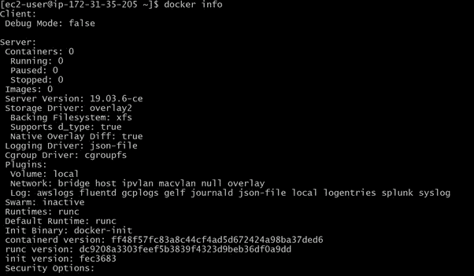

图:Docker 信息输出。我们目前有 0 个容器。

*   将目录切换到 Disaster_tweet 文件夹，并键入 ls 以查看所有文件

```
cd Disaster_tweet/
ls
```

您的输出应该类似于:

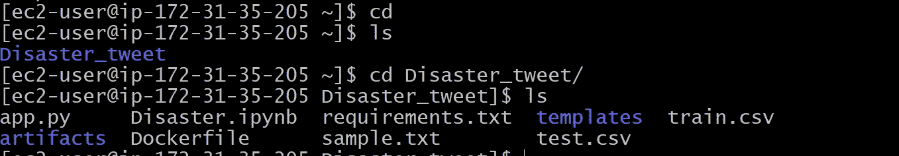

让我们使用下面的代码构建我们的第一个容器:

```
docker build -t disasterapp .
```

我们正在构建一个 docker 容器，-t 标志将帮助我们将这个容器的名称设置为 diasterapp。让我们希望我们的应用程序不会是灾难:)。

> 注意有圆点(。)在命令行代码的末尾。

这将用我们当前目录中的所有文件构建一个 docker 容器，首先，它查找 Dockerfile 并运行 Dockerfile 中的代码。它有 9 个步骤，我们在上面讨论过，它将依次执行它们。如果成功，你会在最后得到一条消息说成功构建。

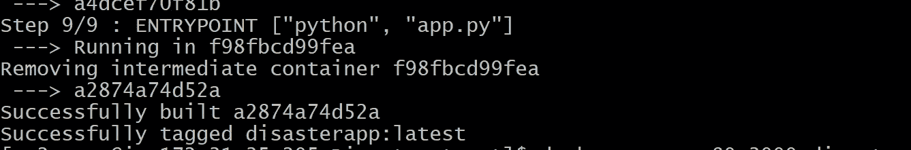

图:Docker 应用程序成功构建

是时候运行我们的 docker 容器了:

```
docker run -p 80:3000 disasterapp
```

这里 p 代表端口，这里我们将虚拟机的端口 80 与 docker 的端口 3000 链接起来。

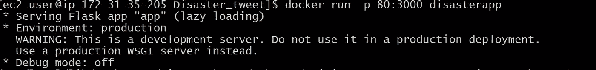

在 docker 的 3000 端口上运行的 Flask 服务器。

您将会看到一条类似的消息，与我们之前在本地系统中看到的一样。

## 结果:

我们完成了！！祝贺您，让我们检查一下输出:

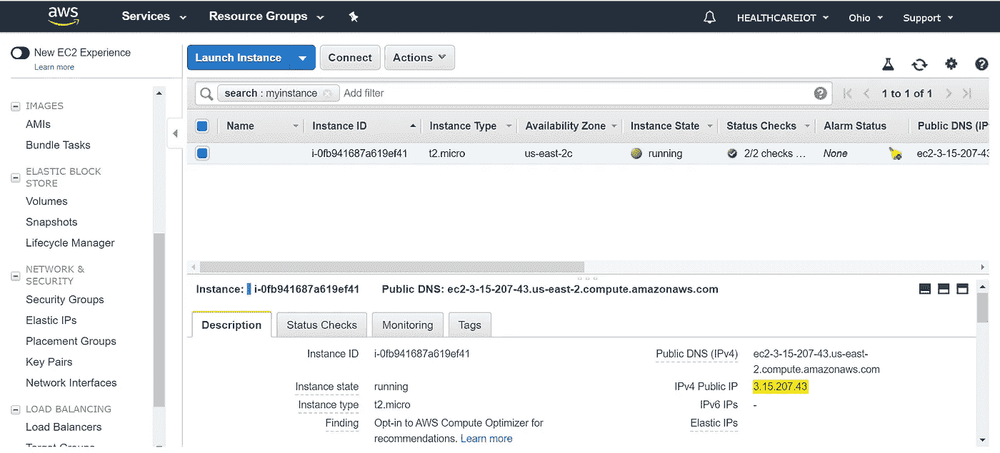

EC2 实例公共 IPV4 地址。

转到您的实例，复制 IPV4 公共地址并在浏览器中键入。

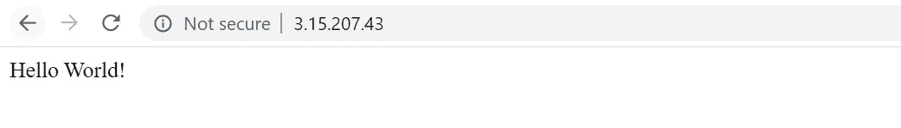

回家路线(/)

使用样本输入进行检查。


索引路线(/index)


我们的预测函数在云实例上的输出。

你可以在这个 GitHub [链接](https://github.com/GowthamChowta/Disaster_tweet)中找到完整的代码。你也可以在 [LinkedIn](https://www.linkedin.com/in/gauthamchowta/) 上和我联系。

## 参考资料:

1.  [应用人工智能课程](https://www.appliedaicourse.com/)
2.  Linux 学院 AWS。

乐意帮忙！！。