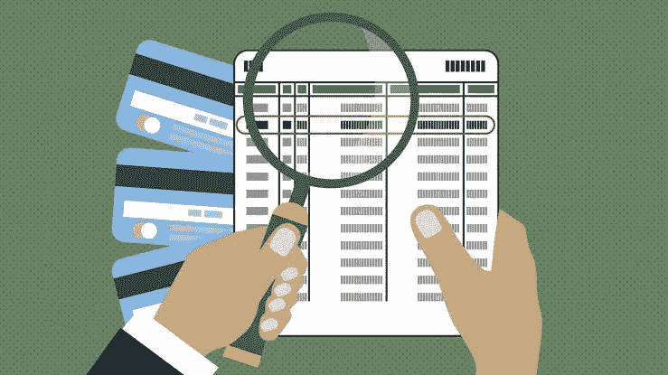

# 大学申请如何检测造假？？(微软数据科学面试问题)

> 原文：<https://medium.com/analytics-vidhya/how-to-detect-fraud-in-college-application-microsoft-data-science-interview-question-743502782778?source=collection_archive---------16----------------------->

检测大学申请中的欺诈是一个需要解决的有趣问题。

回答这个问题需要很多领域的专业知识，因为每种欺诈技术都是不同的，所以相同的模式不会对不同的欺诈起作用。

首先我们需要明白的是，面试官并不是想问你你会选择哪种模式，你会用哪种标准来评估。他只是想让你看看你是如何处理问题的。

所以首先我们可以假设或者我们可以问面试官是哪所大学，你可以标记你的城市，城镇，是否有任何过去的委员会处理这些欺诈案件。

**这里到底什么是欺诈？**

所以基本上一个人可以想出一个假的证书或者一个假的标记单或者一些配额证书。

**如何接近？**

1.  看看像是有没有一个人太擅长学习像 4 个 cgpa，一个连续第一等。
2.  第二件事是剽窃，这意味着这些欺诈者被认为是懒惰的，所以他们从谷歌复制准确的单词，只是复制过去，所以我们可以做的是，我们可以简单地下载谷歌 Api，检查信息是否被复制。
3.  我们可以与为组织工作多年处理这些欺诈的人交谈，他们实际上可以给我们洞察力，以便我们可以进行功能工程并提出新功能。
4.  我们需要看到每一个可能的欺诈，并想出它的特征，因为我们在这里没有一个标记的数据，所以我们不能看到它的召回值(我们从实际数据中遗漏了一些东西)

**我们如何建立一个模型？**

我们假设我们没有标记数据，所以我们的模型将是无监督的，我们需要检测异常值。

为了检查准确性，必须将模型结果发送给人工欺诈检测，假设在 1000 个中，模型检测到 50 个欺诈，当 50 个发送给人工欺诈时，45 个实际上是欺诈，我们获得了 90%的准确性，但没有召回值(我们不知道是否遗漏了 50 个以外的欺诈)

如果我们有一个标记数据，那么这将是一个简单的二进制分类问题。我们可以应用简单的逻辑回归或支持向量或 XG Boost 或 GBDT 或甚至多项式感知器模型，并查看它们的召回和精度值。

感谢阅读，享受机器学习。

# 尼舍什·戈吉亚

*   ***如果你喜欢这个，*** [***跟我来这里***](/@nishesh.kumar) ***了解更多***
*   ***对通敌感兴趣？下面就来连线一下***[***insta gram***](https://www.instagram.com/nishesh_gogia/)