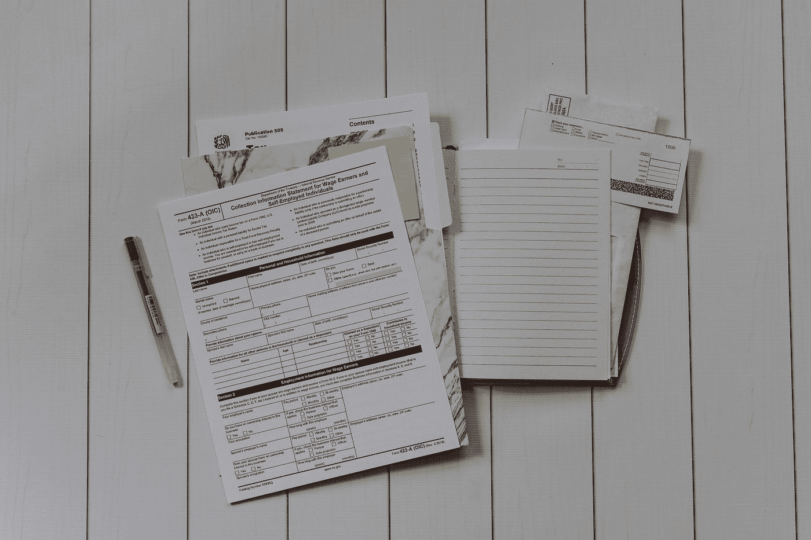
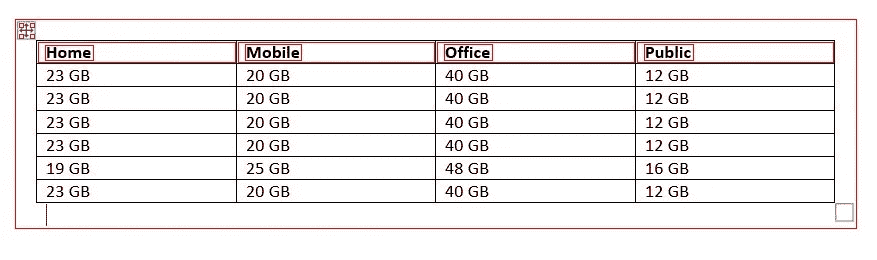

# 如何使用 OpenCV 和 Python 检测图像中的表格

> 原文：<https://medium.com/analytics-vidhya/how-to-detect-tables-in-images-using-opencv-and-python-6a0f15e560c3?source=collection_archive---------2----------------------->



凯利·西克玛在 [Unsplash](https://unsplash.com?utm_source=medium&utm_medium=referral) 上的照片

# OpenCV 是什么？

OpenCV(开源计算机视觉库)是一个开源的计算机视觉和机器学习软件库。OpenCV 提供了有效的方法和函数来轻松地进行图像处理和操作。库中有超过 2500 种优化算法，提供最先进的计算机视觉。OpenCV 可以用于检测图像和视频中的对象，也可以用于人脸检测。其他应用包括手势识别、增强现实、运动跟踪、图像分割等等。OpenCV 可以成为自动驾驶汽车的视觉核心。

最初是用 C++编写的，现在 OpenCV 提供了 Python、C++、Matlab 和 Java 的各种接口，并在包括 Linux、Windows、MacOS 和 Android 在内的所有平台上得到支持。它甚至可以用于像 Raspberry Pi 这样的嵌入式系统，以构建无人机中的对象检测模块。

# 从图像中检测表格

在日常应用中，我们会遇到许多需要从扫描图像中提取表格信息的用例。工业应用包括从扫描的发票中提取表格信息，以计算费用和价格信息，以及来自包含表格的其他数字化介质的数据。OpenCV 用于将表格分割成不同的部分，如标题、列、表格等。检测表和相应的头将是我们在这个故事中的主要焦点。那么，
我们开始吧。

首先，我们需要导入任务所需的库，如 OpenCV、numpy 和 matplotlib。

```
import cv2
import numpy as np
import matplotlib.pyplot as plt
```

然后，我们将使用 Opencv 的 imread()函数从磁盘中读取包含表格数据的图像文件。 **im1** 用于检测轮廓，我们在未接触的图像 **im 上绘制轮廓。**

```
file = r’table.jpg’im1 = cv2.imread(file, 0)
im = cv2.imread(file)
```

接下来，我们对图像应用逆二进制阈值。在此方法中，我们将最小阈值设置为 180，最大阈值设置为 255。二进制阈值将任何高于 180 的像素值转换为 255，低于 180 的像素值转换为 0。THRESH_BINARY_INV 是二进制阈值的倒数。

```
ret,thresh_value = cv2.threshold(im1,180,255,cv2.THRESH_BINARY_INV)
```

然后，我们将设置一个大小为(5，5)的内核，并用它来执行图像膨胀。我们可以根据需要和要求调整内核大小和迭代次数。

```
kernel = np.ones((5,5),np.uint8)
dilated_value = cv2.dilate(thresh_value,kernel,iterations = 1)
```

我们将使用 OpenCV 和 findContours 找到周围的轮廓。

```
contours, hierarchy = cv2.findContours(dilated_value,cv2.RETR_TREE,cv2.CHAIN_APPROX_SIMPLE)
```

轮廓被检测并保存在*轮廓*变量后，我们在图像上绘制轮廓。请注意，我们正在原始图像 **im** 上绘制轮廓，该图像到目前为止未被修改，也未对其进行任何操作。

```
cordinates = []
for cnt in contours:
 x,y,w,h = cv2.boundingRect(cnt)
 cordinates.append((x,y,w,h))
 #bounding the images
 if y< 50:

 cv2.rectangle(im,(x,y),(x+w,y+h),(0,0,255),1)
```

我们使用 matplotlib 显示图像，然后使用 opencv 的 imwrite 函数存储在我们的磁盘上。

```
plt.imshow(im)
cv2.namedWindow(‘detecttable’, cv2.WINDOW_NORMAL)
cv2.imwrite(‘detecttable.jpg’,im)
```

下面是输出图像的示例截图。



表格边界检测

这是完整的代码。

希望你喜欢这篇文章。谢谢你，祝你愉快。