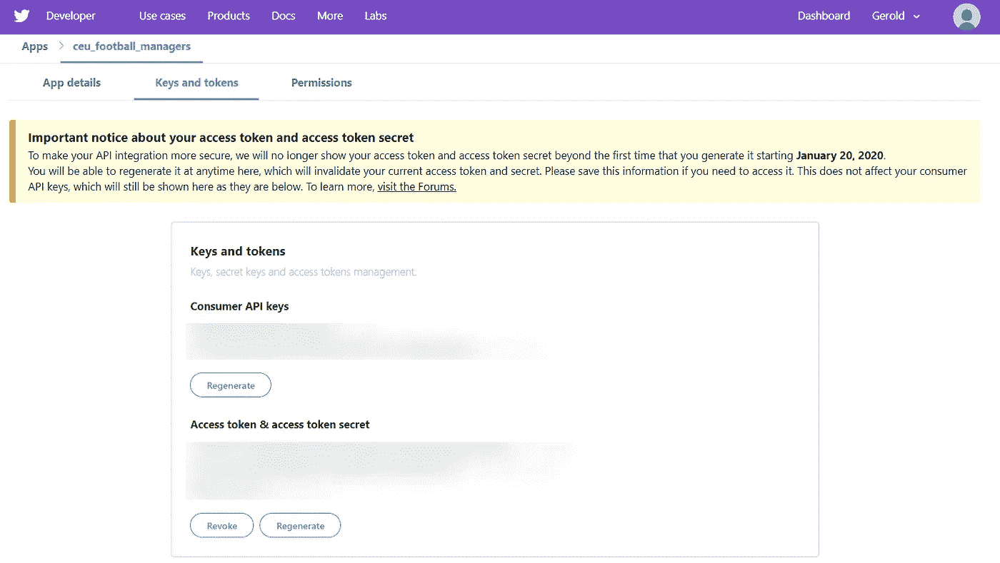
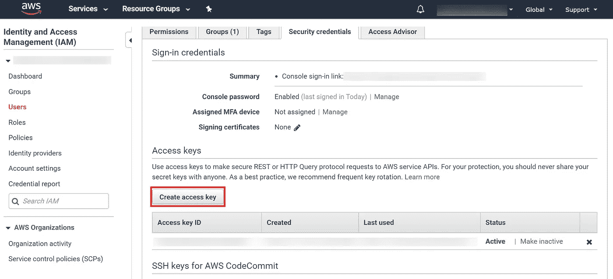
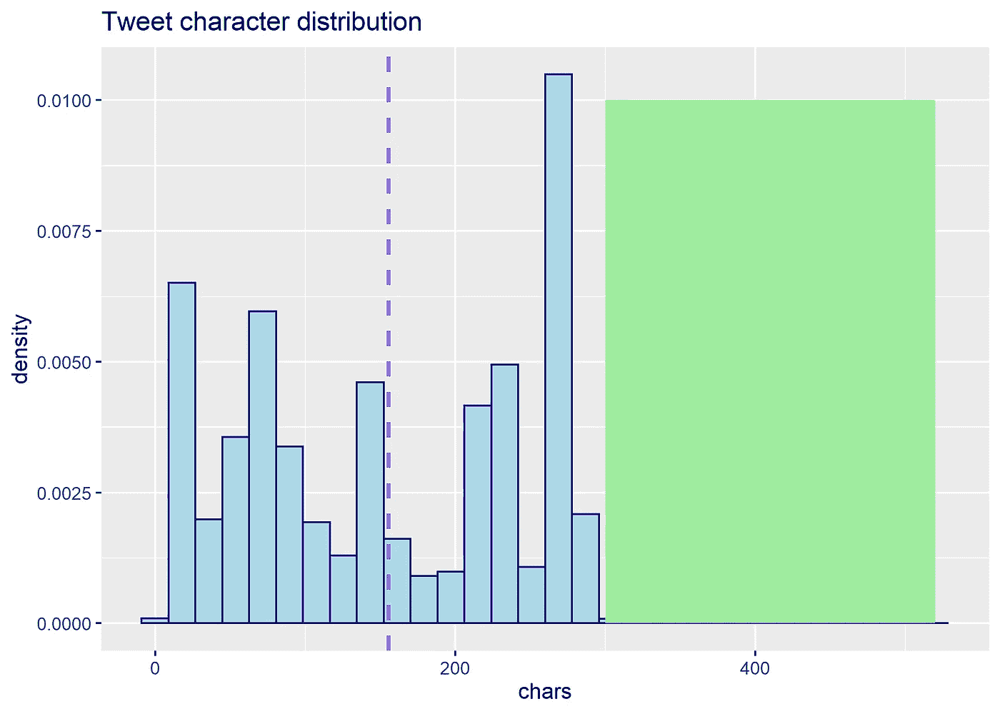
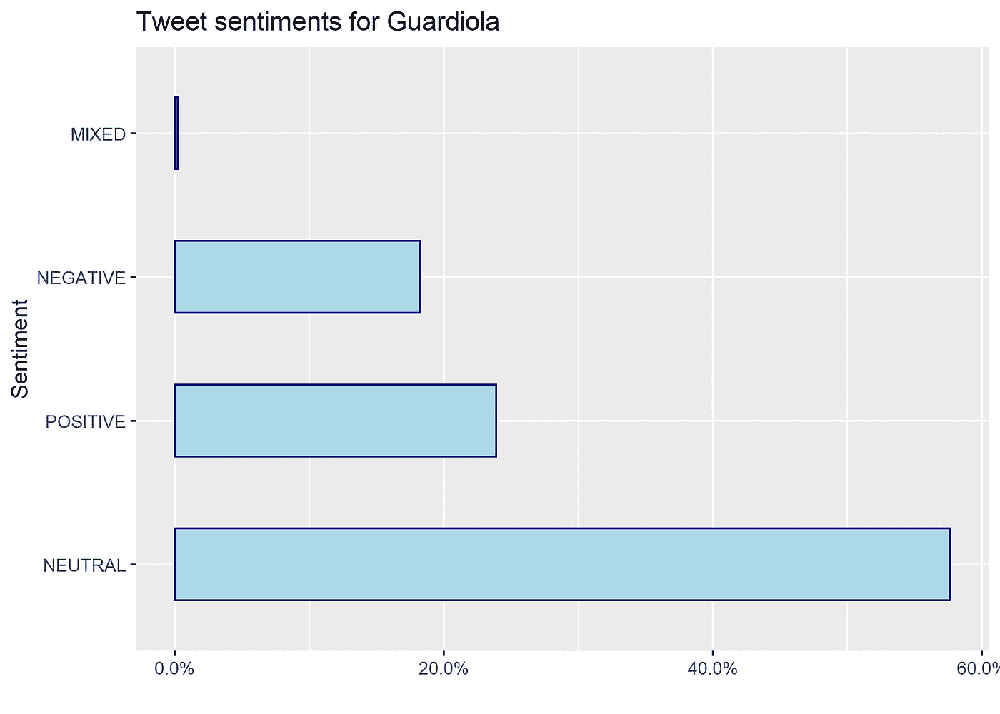
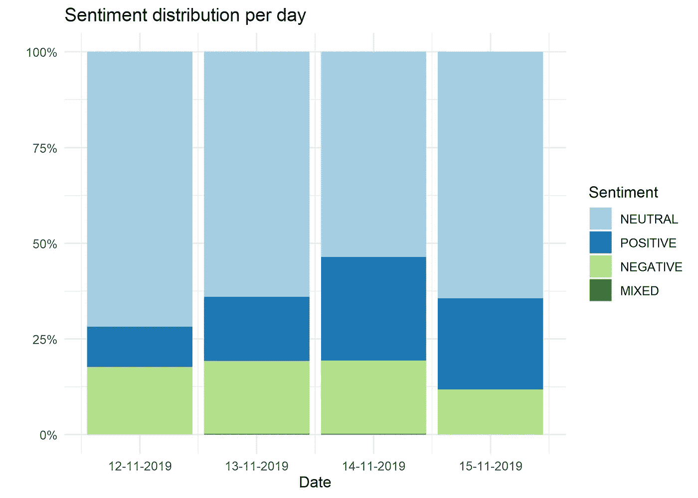

# 如何在 R 中用 Amazon understand 检测 tweet 情绪

> 原文：<https://medium.com/analytics-vidhya/how-to-detect-tweet-sentiment-with-amazon-comprehend-in-r-526a3d496e0d?source=collection_archive---------7----------------------->

# 目录

1.  *简介*
2.  *抓取 twitter 并在 R 中使用亚马逊理解*
3.  *情绪分析*
4.  *结论*

[Lidya Nada](https://unsplash.com/@lidyanada?utm_source=medium&utm_medium=referral) 在 [Unsplash](https://unsplash.com?utm_source=medium&utm_medium=referral) 上拍摄的照片

# 介绍

这篇文章是作为一个大学项目的一部分而写的，因为这是我第一篇关于媒体的文章，所以如果能得到各种反馈，我将不胜荣幸。我还想强调一个事实，你将要阅读的内容是相当技术性的，重点不是分析本身，而是你如何建立一个框架来轻松地进行情绪分析。说了这么多，让我们想出一个可以应用这个框架的用例。

假设你是英国一家著名足球俱乐部的老板，你想了解球迷对俱乐部经理的看法。你如何在你自己的**上以一种既省时又划算的方式完成这件事？通过一些基本的编码技巧和一个只有 5 美元的 Amazon Web Services 帐户，您可以很好地了解 fan 对经理表现的满意度趋势。**

事不宜迟，让我们开始推特情绪分析吧！我这篇文章的代码可以在这里找到: [github](https://github.com/geroldcsendes/tweet_sentiment) 。

# *抓取 Twitter 并在 R 中使用 Amazon understand*

为了使用 Twitter 的 API 来抓取推文，你需要有一个 Twitter 帐户，并在这里创建一个 Twitter 应用程序。我花了大约 40 分钟设置应用程序，因为有一堆表格要填写，但我最终只在几分钟内收到了我的应用程序的许可。顺便说一下，这篇文章很好地总结了如何做到这一点。

一旦您完成了这些，您应该会在您的开发人员仪表板上看到类似的内容(为了安全起见，我只是模糊了我的密钥和令牌:

Twitter 开发者仪表板

你可以用来使用 Twitter 的 API 的 R 包之一是 **rtweet** 。您可以使用您的凭证在 rtweet 中创建令牌，代码如下:

在 rtweet 中创建一个令牌:[链接](https://gist.github.com/geroldcsendes/8de3658fd95a19a9bf726b2d606e1d6f)

好了，现在我们可以用 r 与 Twitter 交流了。下一步是设置访问 Amazon understand。你显然需要一个 AWS 账户，所以如果你还没有，是时候创建一个了。不会超过 10 分钟。一旦你有了一个帐户，Amazon 的身份和访问管理(IAM)控制台上必须生成一个访问密钥，用于与 API 的安全通信。在仪表板上，您可能会看到非常相似的内容。创建一个访问键，并将其保存到 R 项目的位置。

亚马逊 IAM 仪表板

r 用领悟的包是 **aws .领悟**。为了能够从 R 中使用 understand，我们需要提供 AWS . understand 的访问密钥。如果你想更详细地了解它是如何工作的，请查看[github 页面。](https://github.com/cloudyr/aws.signature/)

设置领悟:[链接](https://gist.github.com/geroldcsendes/ce4a1ef0beb27fde45042a1c667b272c)

好了，我们已经设置了在足球推特上进行情感分析所需的一切。我们开始工作吧！

# 情感分析

对于我的情感分析，我将只分析英语的推文，尽管在撰写本文时 Amazon understand 支持 5 种其他语言。我想在国家层面上进一步限制推文的地理位置，因为我认为球迷对居住在祖国的俱乐部有更大的影响力。原来，尽管 Twitter API 提供了一些地理数据，但这些数据填充得很差。因此，我决定保留所有的英文微博。

你应该注意到 Twitter 对请求 tweets 有一些限制。目前，支持的推文历史是 7 天，所以如果他想分析特定未来事件的推文或当意外发生时快速行动，他应该提前计划。Twitter 也限制了你可以提出的请求，但我没有找到任何关于这方面的信息。我所知道的是，我能够在 30 分钟内发出 36000 个请求，所以 twitter 看起来并不太受限制。

作为我的分析对象，我选择了曼城主教练佩普瓜迪奥拉。曼城 1 比 3 输给利物浦，确保利物浦在英超联赛中领先 8 分。我想知道足球迷们对这次失败的反应。这个游戏是在做这个分析之前 5 天，所以我是准时的。

## 获取和清理推文

要从 Twitter API 获取 tweet，只需使用 rtweet 的 *search_tweets()* 函数。您将看到 twitter 在一个包含 90 列的数据框架中提供数据，您还可以获得更多数据。查看 rtweets [文档](https://rtweet.info/index.html)了解更多可能性。

文本栏包含来自用户的推文。推文通常包含 URL 和表情符号，我认为通过删除它们，我们可以帮助亚马逊理解并更好地猜测推文的情感。顺便说一下，仅仅通过分析表情符号可能比通过文本更容易发现情绪。我没有发现任何信息表明 understand 是否可以使用表情符号进行情感检测。只对表情符号进行情感分析，并将其结果与理解进行比较，这可能真的很令人兴奋。

因此，让我们在当前的分析中去掉这些表情符号。我得出的结论是，R 的 base enc2native 函数最适合将带有表情符号的推文转换为 UTF 编码标准，而不会丢失任何其他信息。我把这个代码片段和最相关的步骤放在一起，但是你可以在我的 github 上找到完整的代码。

实际上，rtweet 有一个名为 *plain_tweets()* 的函数，它应该应用与我相同的清理技术，但我发现它的性能比我的方法差。

我们现在已经完成了数据清理，但是在开始向 Amazon 发送情感请求之前，最好先做一个成本估算。亚马逊理解是合理定价，但我们不想最终支付超过我们的预算，由于一些错误。为此，我创建了一个估算作业成本的函数。

亚马逊每 100 个字符收费 0.0001 美元，每个请求最低收费 0.0003 美元(这意味着你为 100 和 300 个字符的推文支付相同的费用)。我的数据集包含 17，997 个观察值，整个数据集估计需要 5.2 美元。

值得一提的是，尽管 Amazon intensive 似乎不是一个昂贵的解决方案，但它仍然没有为推特情绪检测提供最佳价格。当删除表情符号和网址时，推文包含的字符比 300 个少得多。为了说明这一点，我为我的数据集添加了一个字符分布图。

平均推文长度为 157 个字符，只有 0.3%的推文超过 300 个字符，但大约 24%的推文超过 250 个字符。我们可能会担心这个数量的字符是否足以表达感情。为了让你知道 157 个字符有多少，我加了一条这么长的推文:

["@](http://twitter.com/VeskoTrajkovic) <迷离 _ 用户>是一个非常好的经理，毫无疑问，但他总是有最好的团队任他调遣。克洛普让一般的球队变成了优秀的球队。”

我们不一定需要更长的推文来检测情绪，甚至可能像“布·瓜迪奥拉”或“GTF·瓜迪奥拉”这样的短推文倾向于消极或积极，而长推文则是中性的。无论如何，我不是自然语言处理的专家，只是想给我的分析提供一些背景。

> 因此，尽管从《理解》杂志上获取更短文本的观点可能在经济上不划算，但它应该还是可行的。

## 检测情绪

当使用 Amazon understand 时，我们得到的结果是 4 种情绪的概率得分，最有可能的情绪将在“情绪”栏中标出。考虑到这一点，我们可以定义一个函数来提取 tweet 列，将其发送到 Amazon，并将返回的数据帧横向合并到“base”中。

就是这样！我们现在有了一个包含推文和他们观点的数据框架。是时候看看人们在输掉大赛后对佩普瓜迪奥拉的看法了。

首先，我想看看我的数据集的日期范围。原来，推文落在 2019 年 12 月 11 日和 2019 年 15 月 11 日(写这篇文章的时间)之间。这是相当不幸的，因为我希望在比赛当天(10.11)发推文，因为我期待球迷在最激烈的时候会更加严厉，然后逐渐变得更加理解。在进行分析之后，我才意识到，可以为 Twitter API 传递一个‘until’参数，该 API 返回给定日期之前的推文。你可以在这里找到更多关于这个[的信息。](https://developer.twitter.com/en/docs/tweets/search/api-reference/get-search-tweets)

无论如何，正如我已经表达过的，这篇文章的目的只是展示一个框架，并不一定要进行无错误的分析。记住这一点，让我们来看看推特情绪的相对频率。如你所见，57%的人持中立态度，23%的人持积极态度，18%的人持消极态度。带有复杂情绪的推文可以忽略。

如前所述，在比赛结束后，看看推特情绪如何演变可能是有意义的。如果我们看看下面的图表，我们可以看到中性情绪减少的模式，这是由于积极情绪增加，而消极情绪保持不变。所以可能正如我所怀疑的，球迷在输掉一场重要比赛后变得越来越理解，这就是为什么积极的推文相对于消极的有所增加。

# 结论

在本文中，我演示了如何在 R 中使用 Amazon 的 understand 来检测 tweet 情绪。建立这个框架非常容易，你可以通过应用同样的方法来分析人们对特定事件的看法。我认为这是一种省时省钱的快速情绪分析方法。问题是 Amazon understand 是否能很好地满足我们的需求。在不久的将来，我计划将亚马逊理解情绪预测与表情符号进行比较，看看它们之间的关系，然后最好就此写一篇文章。