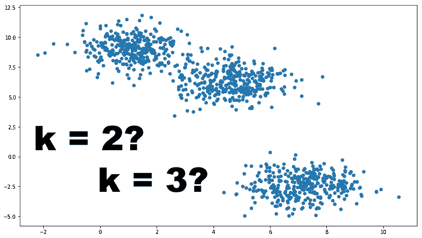
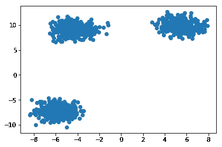
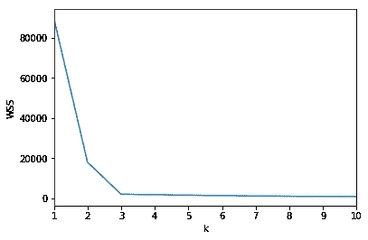
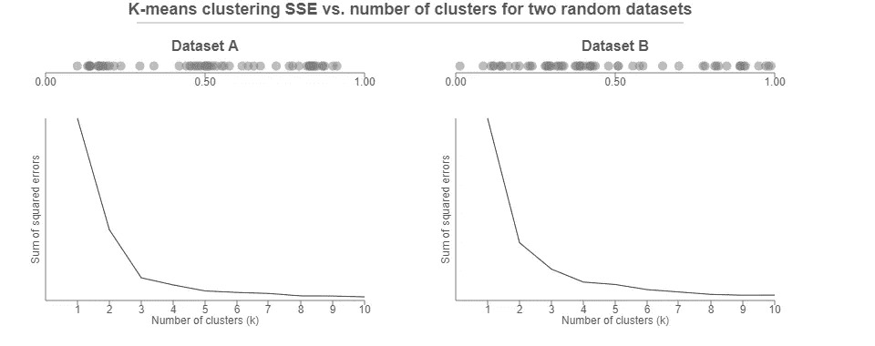
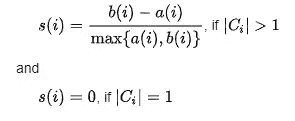
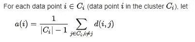
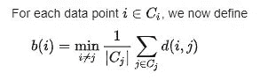
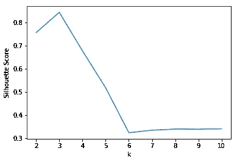
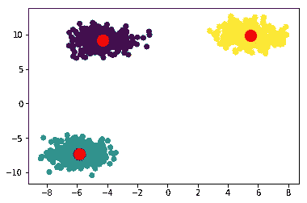

# 如何确定 K-Means 的最优 K？

> 原文：<https://medium.com/analytics-vidhya/how-to-determine-the-optimal-k-for-k-means-708505d204eb?source=collection_archive---------0----------------------->

# 介绍

K-Means 算法无需介绍。它很简单，也许是最常用的聚类算法。

k-means 背后的基本思想包括定义 k 个聚类，使得总的**类内变化(或误差)最小**。

*我鼓励您在继续学习之前查看以下文章，以深入了解不同的聚类方法:*

*   [*聚类介绍和不同的聚类方法*](https://www.analyticsvidhya.com/blog/2016/11/an-introduction-to-clustering-and-different-methods-of-clustering/)
*   [*层次聚类初学者指南以及如何在 Python 中执行层次聚类*](https://www.analyticsvidhya.com/blog/2019/05/beginners-guide-hierarchical-clustering/)

聚类中心是其所在聚类的代表。每个点与其聚类中心之间的平方距离就是所需的变化量。k-means 聚类的目的是找到这 k 个聚类及其中心，同时减少总误差。

相当优雅的算法。但是有一个问题。你如何决定集群的数量？

在本文中，我将详细解释在 k-Means 中找到这个神秘的 k 的两种有用的方法。

这些方法是:

1.  **手肘法**
2.  **剪影法**

我们将使用下面代码生成的数据集来说明这两种方法:

这是数据的图形外观:

显然，数据集有 3 个聚类。我们将在这个数据集上验证我们的两种方法。

# 肘法

这可能是最广为人知的确定最佳聚类数的方法。*在做法上也有点幼稚。*

> 对于**不同的 k** 值，计算**误差平方和**的组内误差(WSS ),选择 WSS 最先开始减小的 k。在 WSS 对 k 的曲线图中，这可以被视为一个**弯头。**

类内误差平方和听起来有点复杂。让我们来分解一下:

*   每个点的平方误差是该点与其表示(即其预测聚类中心)的距离的平方。
*   WSS 分数是所有点的这些平方误差的总和。
*   可以使用任何距离度量，如欧几里德距离或曼哈顿距离。

让我们使用 Python 中的 ***sklearn*** 库和我们自己的函数来实现这一点，以计算 k 的一系列值的 WSS

对于我们的数据集，我们获得了以下 WSS 对钾的曲线图。

不出所料，**剧情在 k = 3 时看起来像一只胳膊有一个清晰的肘关节** **。**

不幸的是，我们并不总是有如此清晰的聚类数据。这意味着肘部可能不清晰和尖锐。

资料来源:bl.ocks.org/

对于数据集 A，肘部在 k = 3 处是清晰的。然而，对于数据集 b，这种选择是不明确的。我们可以选择 k 为 3 或 4。

在这种模棱两可的情况下，我们可以使用剪影法。

# 剪影法

> 轮廓值衡量一个点与其自己的聚类(内聚)相比与其他聚类(分离)的相似程度。
> 
> 来源:维基百科

轮廓值的范围在+1 和-1 之间。**高值是期望的**,并且指示该点被放置在正确的聚类中。如果许多点具有负的轮廓值，这可能表明我们创建了太多或太少的簇。

每个数据点 ***i*** 的轮廓值 ***s(i)*** 定义如下:

来源:维基百科

***注*** :如果 ***i*** 是簇中唯一的点，则 s(i)被定义为等于零。这是为了防止集群的数量随着许多单点集群而显著增加。

这里， ***a(i)*** 是点 ***i*** 与其自身聚类的相似性的度量。它被测量为 ***i*** 到集群中其他点的平均距离。

来源:维基百科

同样， ***b(i)*** 是 ***i*** 与其他聚类中的点的相异度的度量。

来源:维基百科

***d(i，j)*** 是点 ***i*** 和 ***j*** 之间的距离。通常，**欧几里德距离**被用作距离度量。

使用 ***sklearn*** 库的度量模块，可以在 Python 中轻松计算出剪影分数。

我之前提到过，高轮廓分数是可取的。轮廓分数在最优 k 处达到其 ***全局最大值。理想情况下，这应该在轮廓值对 k 图中显示为峰值。***

这是我们自己的数据集的曲线图:

在 k = 3 处有一个清晰的峰值。因此，它是最佳的。

最后，数据可以最优地*聚类成 3 个簇，如下所示。*

**

# *结束注释*

*肘方法更多的是一个决策规则，而侧影是一个用于聚类时验证的度量。因此，它可以与肘法结合使用。*

*因此，在寻找最佳 k 值时，肘法和剪影法并不是相互替代的方法。相反，它们是为了做出更有信心的决策而一起使用的工具。*