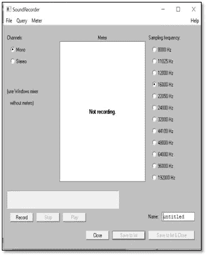

# 如何开发僧伽罗语语音语料库

> 原文：<https://medium.com/analytics-vidhya/how-to-develop-a-speech-corpus-for-sinhala-5e2c320003f9?source=collection_archive---------13----------------------->


随着技术的进步，语音识别系统发挥了重要作用。为了开发一个语音识别系统，我们可以使用各种方法，包括动态时间弯曲(DTW)，隐马尔可夫模型(HMM)，语音识别工具包，如 CMU 斯芬克斯等。虽然有许多方法，但我们可以认为深度神经网络(DNN)模型是最有效和最流行的方法。为了训练深度神经网络(DNN)模型，我们需要一个语音语料库。语音语料库是语音数据及其相应文本转录的集合。这篇文章将向你解释，如何从头开始为僧伽罗语开发一个语音语料库🙂。

主要有两种不同的方法可用于开发语音语料库，即收集现有的语音数据并手动将其转换成相应的文本，以及设计文本语料库并通过读取收集的文本来记录音频。当有足够数量的现有语音数据可用时，可以使用第一种方法。如果你想从头开始开发一个语音语料库，那么你必须采用第二种方法。所以我们先来讨论一下如何设计文本语料库。

我们需要识别哪些语句必须包含在语音语料库中。然后把它们列出来。例如，我们可以将这些陈述视为:

1.  මේකේ ගාන කීයද

2\. මේක පන්සීයේ කොලයක්ද කියන්න

3\. මේ නෝට්ටුවේ අගය කීයද

之后，我们可以确定哪些独特的词包含在这些陈述中，如මේකේ、ගාන、කීයද、මේක、පන්සීයේ等。我们将为这些独特的单词开发语音语料库，语音识别系统将能够预测由这些单词组成的句子的转录。现在我们必须通过阅读每个单词来记录音频。

有两种类型的语音识别系统，即与说话者相关的系统和与说话者无关的系统。如果你想开发一个依赖于说话者的系统，那么你可以让有限数量的参与者参与进来进行记录。另一方面，如果你想开发一个与说话者无关的系统，那么你需要让许多不同的参与者参与进来。

**使用 Praat 录制音频**

为了录制音频，我们使用了一个名为“Praat”的软件。你可以从这里下载 Praat for windows:http://www.fon.hum.uva.nl/praat/download_win.html

安装软件后，我们可以开始记录。当你打开 Praat 时，你需要进入新记录单声道声音。这将打开一个窗口，您需要更改所需的采样频率。通常是 16000 赫兹。还要确保该通道是单声道通道。保存录制的音频时，请使用“.wav”格式。



使用 Praat 录制音频

**整理音频 Wav 文件**

有各种方法来组织一个语音语料库。在这里，我使用的方法是首先由用户组织它们，然后由被记录的单词组织它们。你可以给用户唯一的 id，也可以给单词一些唯一的 id。可以首先根据用户 ID 来组织文件夹，然后在每个用户文件夹中，我们可以根据单词 ID 为每个单词组织不同的文件夹。id 可以用来命名音频 Wav 文件。例如，用户可以有像 01、02…这样的 id，而单词可以有像 104、105…这样的 id。命名音频 Wav 文件时，您可以遵循 01_104_1.wav 这样的结构。您可以通过同一用户多次朗读同一单词来录制音频。然后就成了 01_104_1.wav，01_104_2.wav，…从总数据集来看，2/3 可以被分配为训练数据集，1/3 可以被分配为验证数据集。

**创建 train_corpus.json 和 validation_corpus.json**

在通过记录音频创建语音语料库之后，我们需要通过相应地组织这些音频的文本转录来创建文本语料库。为了完成这项任务，可以使用不同类型的文件格式。这里我使用 JSON 格式来创建训练和验证文本语料库。对于我正在使用的方法，要创建 JSON 文件，我们首先需要在每个包含音频文件 ID 和音频文件转录的文件夹中包含一个. txt 文件。之后，我们可以使用如下的 python 代码段来创建。json 文件。

```
labels = []
durations = []
keys = []
for group in os.listdir(data_directory):
    if group.startswith('.'):
        continue
    speaker_path = os.path.join(data_directory, group)
    for speaker in os.listdir(speaker_path):
        if speaker.startswith('.'):
            continue
        labels_file = os.path.join(speaker_path, speaker,
                                   '{}-{}.trans.txt'
                                   .format(group, speaker))
        for line in open(labels_file):
            split = line.strip().split()
            file_id = split[0]
            label = ' '.join(split[1:]).lower()
            audio_file = os.path.join(speaker_path, speaker,
                                      file_id) + '.wav'
            print(audio_file)
            audio = wave.open(audio_file)
            duration = float(audio.getnframes()) / audio.getframerate()
            audio.close()
            keys.append(audio_file)
            durations.append(duration)
            labels.append(label)
with open(output_file, 'w') as out_file:
    for i in range(len(keys)):
        line = json.dumps({'key': keys[i], 'duration': durations[i],
                          'text': labels[i]})
        out_file.write(line + '\n')
```

按照这些步骤，你可以有一个僧伽罗语的语音语料库。通过使用这些步骤，你不仅可以为任何语言开发一个语音语料库。

开发语音语料库后，我们需要确定我们将使用什么作为神经网络模型输入层的输入。我们将使用提取的特征向量作为输入，而不是原始音频波形。在下一篇文章中，我将向您解释两种原始音频波形的特征表示技术。然后，让我们讨论使用 MFCC 从波形文件中提取特征😀。