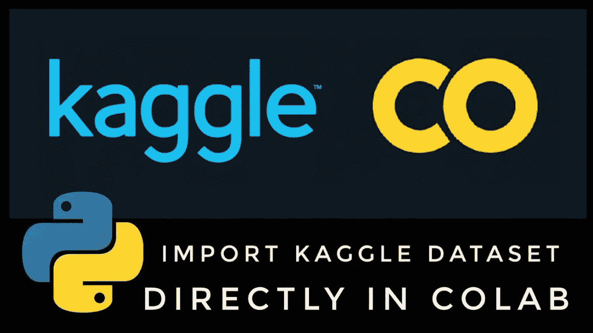
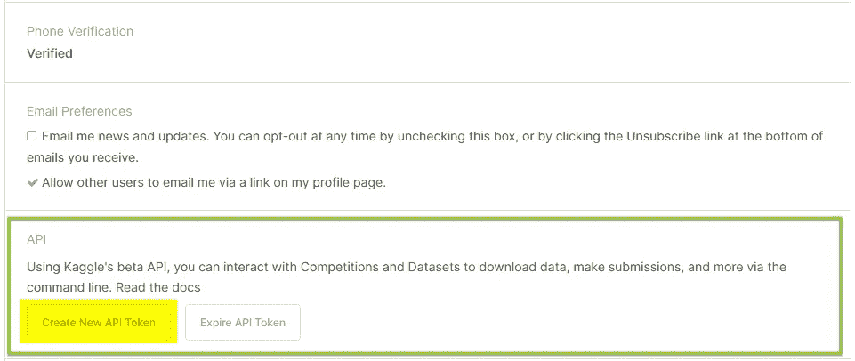
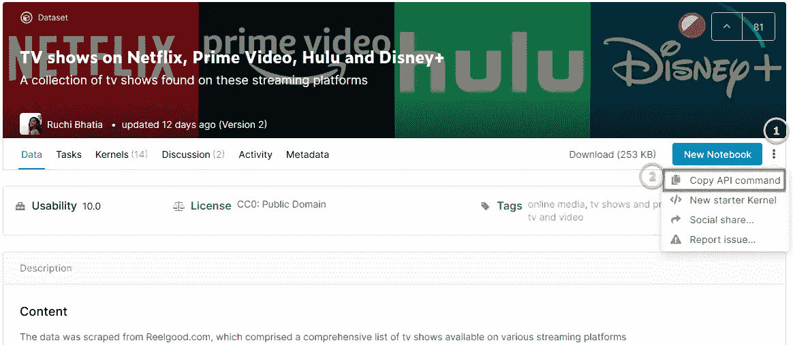

# 如何将 Kaggle 数据集直接下载到 Google Drive

> 原文：<https://medium.com/analytics-vidhya/how-to-directly-download-kaggle-dataset-to-google-drive-aa06175712e2?source=collection_archive---------1----------------------->



Kaggle 是数据科学家最有用的网站之一。它包含了大量的数据来使用这个项目。就拿深度学习或者 AI 来说，这些都需要相当认真的处理。许多人倾向于使用 Google Colab 进行模型训练，因为 GPU 是免费的。Colab 的一个缺点是退出笔记本时不再保留模型(除非你是专业用户)。解决方法是将工作区移到 Google Drive，因为离开笔记本后可以保存所有信息。

有时候，下载和上传很费时间。今天的主题是如何将 Kaggle 数据集直接下载到 Google Drive。一切都会在云上！

## 安装

首先，我们需要两个帐户，即 Kaggle 和谷歌。转到 Kaggle 网站，打开“我的帐户”,向下滚动到 API。点击**创建新的 API 令牌**



Web 浏览器会要求您下载名为`kaggle.json`的 json 文件。该文件包含用户名和密钥，将用于配置谷歌 Colab 环境。

## 科拉布

转到 Google Colab，首先不要忘记安装 Google Drive。否则，你的数据无论如何都会丢失。在本教程中，我们将为编码配置环境创建新的笔记本。您可以将目录更改为驱动器中的某个文件夹，但请记住数据集将被下载到该目录。

这可能看起来有点不同，因为本教程不需要任何上传文件到谷歌驱动器。我在使用上传 json 文件和配置方法时遇到了许多问题。相反，我们直接使用了 json 文件中的信息和 Google Drive 中的配置，如下图所示。

*** *重要说明以上代码区分大小写。它应该完全一样。****

## Kaggle API

我们现在准备使用 Kaggle API。要使用它，请转到我们需要的链接，并在页面右侧的某处找到**【三个点】**。然后，选择**复制 API 命令** *(参见下图)。*



回到谷歌 Colab 笔记本。插入新的单元格，并在开头键入`!`，后跟 API 命令*(参考下面的示例代码)*。

```
Downloading tv-shows-on-netflix-prime-video-hulu-and-disney.zip to /content/drive/My Drive/Colab Notebooks/.kaggle
0% 0.00/88.0k [00:00<?, ?B/s] 100% 88.0k/88.0k [00:00<00:00, 12.2MB/s]
```

数据集将被下载到您的 Google Drive *(您当前工作目录的任何位置)*。

## 结论

总的来说，当你想同时使用 Kaggle 数据集和 Google Colab 时，这是一个很好的实践。如果你对此有任何疑问，我们可以通过 LinkedIn 继续对话。你可以在下面找到我的 LinkedIn。

 [## sasiwut chaiyade cha-EY 高级顾问| LinkedIn

### Sasiwut 是泰国 EY 公司从事绩效改进(PI)的高级顾问。目前，主要重点是…

www.linkedin.com](https://www.linkedin.com/in/sasiwut-chaiyadecha/) 

下次见！