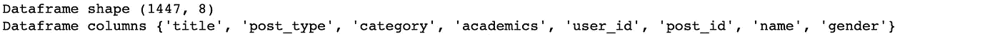
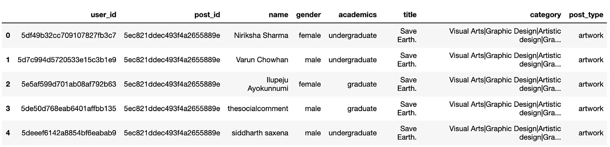
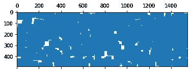
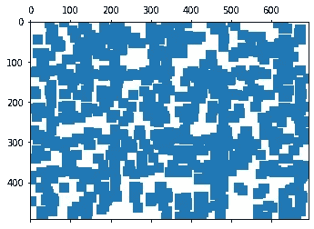
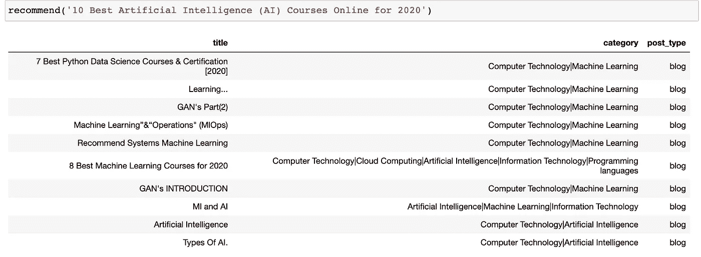

# 如何使用 TF-IDF 进行基于内容的过滤？

> 原文：<https://medium.com/analytics-vidhya/how-to-do-a-content-based-filtering-using-tf-idf-f623487ed0fd?source=collection_archive---------5----------------------->


卡米洛·希门尼斯在 [Unsplash](https://unsplash.com/s/photos/social-media?utm_source=unsplash&utm_medium=referral&utm_content=creditCopyText) 上拍摄的照片

*基于内容的过滤是关于从内容中提取知识。*

在基于内容的推荐系统中，使用关键字来描述项目，并且建立用户简档来指示该用户喜欢的项目类型。换句话说，这些算法试图推荐与用户过去喜欢的(或现在正在检查的)项目相似的项目。

*   基于用户以前进行的交互创建用户配置文件。
*   基于内容创建内容分析器。在某种程度上，它为每个项目创建了一个配置文件。
*   通过比较不同项目配置文件中的用户配置文件，为用户检索项目

# **TF-IDF**

*   代表*术语频率和逆文档频率*
*   这是两个矩阵，它们紧密相关，在给定大量文档的情况下，搜索并计算出给定单词与文档的相关性，例如，维基百科的每篇文章都可能有一个与之相关联的 **TF** 。对于出现在该文档中的每个单词，web 上的每个页面都可以有与之相关联的词频。
*   所有的 **TF** 的意思是一个给定的单词在一个给定的文档中出现的频率，所以在一个网页的一篇维基百科文章中，一个给定的单词在那个文档中有多常见，那个单词在那个文档中所有单词中出现的比率是多少，就是这样。TF 只是测量一个单词在文档中出现的频率。频繁出现的单词可能对文档的含义很重要。
*   DF 是一个单词在一整套文档中出现的频率，也就是说，在维基百科或每个网页中出现的频率。这告诉我们一些无论什么话题都会出现的常用词，比如“a”、“the”、“and”等等。
    具有高 **TF** 和 **DF** 的单词可能都不是衡量单词与文档相关性的重要指标。

> 因此，一个单词与一个文档的相关性度量可能是: **TF/DF**

或者:术语频率*逆文档频率

也就是说，单词在文档中出现的频率，而不是它在任何地方出现的频率。这给了你一个衡量这个单词对这个文档有多重要和独特的标准。

*   我们实际上使用 IDF 的日志，因为词频呈指数分布。这给了我们一个更好的单词总体流行度的权重。
*   TF-IDF 假设文档只是一个“单词包”
*   将文档解析成一个单词包可能是大部分工作
*   为了提高效率，可以将单词表示为哈希值(数字)
*   同义词呢？各种时态？缩写？拼写错误？
*   大规模做到这一点才是最难的部分！

基于用户的社交媒体活动，应用 TF-IDF 为用户查找相似的帖子

数据集描述-



```
from sklearn.feature_extraction.text import TfidfVectorizer, CountVectorizertf = TfidfVectorizer(analyzer=’word’, ngram_range=(1, 2), min_df=0, stop_words=’english’)
```

这里，TfidfVectorizer 用于将原始文档创建为 TF-IDF 特征矩阵。ngram_range=(1，2)意味着我只想要一元词和二元词，min_df=0 意味着在特征向量中取词，即使它的频率只有 1。

```
import matplotlib.pylab as plt
import scipy.sparse as sparse
tf_matrix1 = tf.fit_transform(df_posts[‘title’])
plt.spy(tf_matrix1)
```



```
tf_matrix2 = tf.fit_transform(df_posts[‘category’])
plt.spy(tf_matrix2)
```



```
from sklearn.metrics.pairwise import linear_kernel
csm1 = linear_kernel(tf_matrix1, tf_matrix1)
csm2 = linear_kernel(tf_matrix2, tf_matrix2)
csm_tf = (csm1 + csm2)/3
```

这里 linear_kernel 计算矩阵中每个点到矩阵中每隔一个点的余弦距离

```
def cleanData(x):
 if isinstance(x, list):
 return str.lower(x)
 else:
 if isinstance(x, str):
 return str.lower(x)
 else:
 return ‘’

def combine(x):
 # new columns for algo application and to prevent affecting the original data 
 return x[‘title1’] + ‘ ‘ + x[‘category1’]features = [‘title’, ‘category’]for feature in features:
 df_posts[feature + ‘1’] = df_posts[feature].apply(cleanData)df_posts[‘merged’] = df_posts.apply(combine, axis=1)count = CountVectorizer(stop_words=’english’)
count_matrix = count.fit_transform(df_posts[‘merged’])
csm_count = cosine_similarity(count_matrix, count_matrix)
# delete the new columns as processing is done on the merged column
df_posts.drop(columns=[‘title1’, ‘category1’, ‘merged’], inplace=True)
df_posts.drop(columns=’post_id’, inplace=True)def recommend(post, csm=(csm_tf + csm_count)/2): # choosing this csm as it covers both aspects
 idx = indices[post]
 score_series = list(enumerate(csm[idx]))
 score_series = sorted(score_series, key=lambda x: x[1], reverse=True)
 score_series = score_series[1:11] # not recommending the original post itself, starting from 1
 post_indices = [i[0] for i in score_series]
 return df_posts.loc[post_indices].style.hide_index()
```



推荐功能根据你要搜索的文章标题给你相似的文章。

**链接到代码**

[https://github . com/ankurdhuriya/Content-Based-Recommendation-System](https://github.com/ankurdhuriya/Content-Based-Recommendation-System)