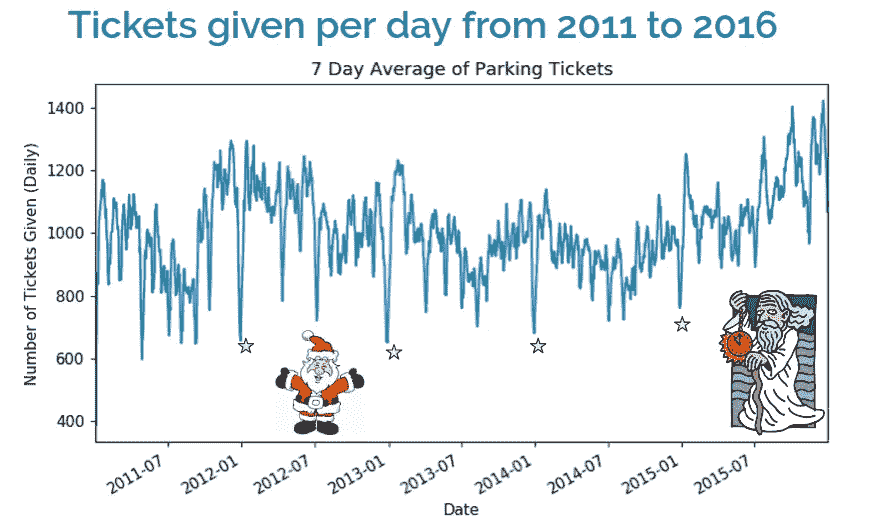

# 如何做一个实际有用的数据科学项目

> 原文：<https://medium.com/analytics-vidhya/how-to-do-a-data-science-project-that-is-actually-useful-ba28a4360a4?source=collection_archive---------14----------------------->

比如在温哥华避免停车罚单！

# 你知道温哥华最有钱的消防栓在哪里吗？

最富有的消防栓位于西 40 大道 2115 号[。从 2011 年到 2018 年，它收取了 8.5 万美元的停车罚单。从下面的谷歌街景图可以看到，消防栓很受欢迎。](https://bit.ly/2nt7P7n)

西 40 大道 2115 号的消防栓

我最近在 7 Gate Academy 的强化机器学习训练营中花了 2 个月时间探索和应用数据科学概念。

对于训练营的最后一个项目，我的搭档[科黑](https://www.linkedin.com/in/koheisuzuki/)和[我](https://www.linkedin.com/in/parampaulnahal/)创造了[Ticket-Dodger.com](https://ticket-dodger.com)，一个帮助你避免在温哥华停车罚单的解决方案。

跟随我们的旅程！

*免责声明:本项目不鼓励您违法停车。它的创建是为了帮助这座城市及其居民了解门票是如何发行的。避免罚单的最好办法就是停车交钱！*

# 你能从这篇文章中期待什么

这篇文章将向你概述我们在创造逃票者的过程中的尝试、失败和成功。

旅程

# 概观

我们想确定在温哥华停车时收到罚单的可能性。温哥华市有一个[开放数据门户](https://opendata.vancouver.ca/pages/home/)，其中包含许多关于这座城市的有趣数据集。

我们很幸运地找到了从 2010 年到 2018 年发行的所有门票的数据集。每张罚单上都有车辆停放的街区街道、签发日期和详细的违章记录(地方法规、部门、状态)。

我们的初始售票数据样本

看起来我们已经准备好了。温哥华这么繁华的城市 8 年的门票就是一大堆数据！只要把它扔进一个机器学习算法，然后嘣:我们是数据英雄！

# 熟悉数据和我们的目标

对数据集的进一步检查让我们意识到，要交付一个有意义的产品，还需要做更多的工作。我们认识到我们必须解决 4 个问题:

**问题 1:** 我们没有任何办法把**的街道相互联系起来。**

**我们可以看到一条街有多少张停车罚单，但完整的故事需要更多的背景。如果有一个每条街道共享的度量标准来规范我们的比较，将会很有帮助。**

****问题 2:** 我们想要某一天的某个 ***时间*** 的一张票的可能性。**

**我们只是没有数据。这是一个问题，因为领域知识告诉我们，驾驶和停车模式会在一天中发生变化。例如，工作日上班和下班的交通。**

****问题 3:** 这怎么会是温哥华居民的 ***有用工具*** ？**

***我们希望心中有一个真正有用的最终产品来指导我们的数据科学之旅。***

****问题 4:** 远程工作流和通信**

***在不同的地点工作，确定我们团队的可用性并确保富有成效的沟通非常重要。***

# **问题 1-比较街道**

****

**数据集向我们展示了什么**

**如果你看一下上面的街道，你可以看到街道 A 有 5 张票，街道 B 有 3 张票。乍一看，你可能会认为 A 街的风险比 b 街高。**

****

**决定风险的因素还有很多。**

**看到交通量叠加在图像上后，你的回答是一样的吗？票量没变，但是我们可以看到 A 街比 b 街用的多很多。**

## **寻找正确的衡量标准**

**定义风险的问题变得有点模糊。我们可以看到，绝对罚单的数量可能不会转化为司机的绝对风险。**

**我们如何解释这一点？**

*   **我们应该算出街上有多少停车位吗？**
*   **我们应该拿着写字板上街，数一数不付钱的司机吗？**
*   **我们应该使用道路利用率指标吗？**
*   **什么是道路利用率？**

**有许多方法可以解决这个问题。理想情况下，温哥华会提供一个数据集，告诉你一个停车位的使用频率。西雅图就是这样做的，我很确定付费电话也会有这些信息。**

**但是我们仍然不知道到底有多少人没有为停车付费，因为没有他们的记录。**

> **我们有很多鱼，但是没有河。**

**最终，确定在大街上买票的确切可能性将被证明是一项非常困难的任务。**

**相反，我们使用交通量来定义道路利用率。这很棒，因为我们现在可以确定相对于街道交通流量的风险。**

**有了这个指标，我们可以比较不同街道的风险。**

## **获取流量计数**

****

**我们找到了一个数据库来获取流量计数！嗯…差不多了。**

**VanMap 在交互式地图上叠加城市信息。当您单击某条街道时，您可以看到该街道进行交通流量测量的所有时间。**

**这些统计从 2004 年到 2013 年不等。每小时和每天记录测量值。**

****

**温哥华街道及其交通计数**

**正如你在上面看到的，还有几条街道不见了。没有其他公共 API 可以轻松提供这些信息。这就是我们所能做的一切，但我们很高兴拥有它。**

**事实上，这些数据并不是一个容易下载的数据集，但这并没有阻止我们。我们所要做的就是复制发送到他们服务器的[请求](https://requests.kennethreitz.org/en/master/), Python 很乐意为我们检索信息。干得好 Python。**

# **问题 2——时间永远不够**

**我们的原始数据集为我们提供了出票日期。这很有用，因为我们可以测试像假期和星期几这样的事情如何影响我们的停车罚单风险。**

## **看假期**

****

**圣诞节和新年前夕从来没有一个交通执法者。放心，你可以自由停车。**

**我们偶然发现了这一点，当时我们特意查找圣诞节，看看有多少张停车罚单被开出。因为没有出票，所以没有这些日期的数据或行。**

****

**呵呵呵:我们的数据子集突出了冬季假期**

**经验教训:在处理时间序列数据时，为每个日期创建一个新的索引，这样就可以找到这些缺口。**

**为了好玩，让我们看看更多的节日。下图是我们 2013 年的数据样本。我们可以看到，在大多数情况下，假期往往有一个较低数额的停车罚单。**

****

**给出的门票与日期**

**但是，出于某种原因，斋月有所上升。我们将把这归因于那些*相关性并不意味着因果关系*的事情之一。**

## **得到我们想要的**

**有每张停车罚单的日期都很好。但是罚单执法者需要吃饭、睡觉和洗澡。他们有固定的班次。**

**我们*缺少*这个信息。**

**我们毫不退缩，提交了一份[信息自由请求](https://vancouver.ca/your-government/make-a-freedom-of-information-request.aspx)以获得出票的 ***时间*** 。目前正在进行中。但幸运的是，在搜索旧的 FOI 请求时，我们发现了一个在 2016 年 9 月[提出的类似请求。这剔除了我们最近 2 年的数据，但展望未来，我们将跟进当前的 FOI 请求。](https://vancouver.ca/files/cov/2016-292-release.pdf)**

**现在，我们进去了！**

## **时间绝对是一个因素**

**这个数据就像打开了闸门。我们的分辨率从几天增加到了几分钟！**

****

**某一天在温哥华的停车罚单**

**上面的动画显示了 2016 年温哥华某一天随着时间的推移而开出的停车罚单。每开一张停车罚单，蓝线就会变深。**

**一大早耶鲁镇就有很多执法行动。伦敦西区直到下午都没什么活动。**

**你也可以通过[优步的 Kepler.gl](https://kepler.gl/) 点击查看 2015 年 1 月[的更新动画。播放控件位于页面的左下方。如果你把速度降低到 0.1x，你可以看到停车罚单在温哥华是如何“呼吸”的。你也可以看到执法者的走向，尤其是在百老汇。](https://ticket-dodger.com/jan_2015_parking_tickets_vancouver.html)**

**我们还汇总了发行的门票数量，以了解平均每天的情况。罚单执法在上午 9 点左右开始，下午 3 点达到高峰，下午 5 点半有一个间歇。然后，晚上 8 点又有一次上涨。**

****

**前 5 条街道一天的出票数量**

## **让我们回顾一下我们所拥有的**

****

**有时间的数据集比只有日期的原始数据集有更少的条目。时间对我们来说更有价值，这就是为什么我们可以接受更少的数据。**

****

**到目前为止，这篇文章是关于我们的探索阶段的。我们首先确定了我们对该领域的了解:**

1.  **不同的街道有不同的特点，很难进行一对一的比较。**
2.  **风险因工作日和法定假日而异。**
3.  **风险因一天中的不同时间而异。**

**之后，我们花了大量时间从一堆不同的来源寻找数据，以便*开始*解决这些问题。产品开发有一个明确的开端是很重要的。令人生畏的障碍和新的信息将*总是*出现。**

**一旦我们对自己开始回答问题的能力感到满意，我们就继续前进。**

# **问题 3——制造有用的工具**

# **机器学习**

****

**现在我们有了数据，我们必须用它做一些有用的事情。这是我们的方法:**

1.  **清理数据**
2.  **创建目标变量**
3.  **培训模型**

## **清理数据**

**我们有三个不同的数据集需要合并。最大的障碍是确保每个数据集中的街道名称和街区遵循相同的格式。**

**不幸的是，每个数据集都有自己的街道拼写方法。有时，同一个数据集对同一条街道有不同的拼写方式。**

**比如:西八街，西八街，西八街都是同一条街！**

**温哥华的开放数据门户再次伸出援手。有一个数据集包含所有街道名称的主列表。我们使用这个主列表作为街道的基本事实。**

**匹配相似的街道名称对人类来说很容易。对于一台电脑来说，没那么容易。然而，一些非常聪明的人想出了一个解决这个问题的好办法。我们发现了一个非常酷的 python 库，叫做 [fuzzywuzzy](https://github.com/seatgeek/fuzzywuzzy) 。**

**Fuzzywuzzy 比较两个字符串(*单词*)并对它们的相似性评分。它做得非常好，一次匹配了 80%的街道。**

****

***像老板一样模糊的字符串匹配。***

**200~左右的主要街道留给我手动修复。这很无聊，所以我创造了一个有趣的工具，把它变成了一个“游戏”**

****

**一个非常好玩的“游戏”**

**第二个最大的障碍是将我们的流量计数数据集转换成有用的格式。这几乎和我做的游戏一样有趣。**

*   **街道块之间缺少交通计数测量，因此我们必须填充这些块。**
*   **一些街道也有有限的条目，或 2004 年的旧条目。在这种情况下，我们不得不推断我们认为合理的流量增长会是什么样子。**

**清理后，我们可以使用街区和街道作为键将不同的数据集连接在一起。**

## **创建目标变量**

**目标变量是你试图预测的东西。在我们的例子中，我们希望预测收到停车罚单的风险。**

**你还记得在文章的开头，我们谈到了 A 街和 B 街吗？我们从这个例子中得到的启示是，开出的罚单的绝对数量并不一定意味着更高的风险。**

**这就是为什么我们使用流量计数作为分母。我们想捕捉这种直觉。这也给了我们一个比较繁忙和安静街道门票风险的好方法。**

**我们的流程:**

1.  **我们用一段时间内的停车罚单数量除以同一时期街道上的交通量。**
2.  **我们将该输出阈值化为**低**、**中**、**高**，并将该问题作为分类问题来处理。**

**我们没有足够的数据来产生获得门票的绝对可能性，但我们有足够的数据来帮助用户决定风险是否值得。**

## **迭代构建目标变量**

**为了取得小的成功，我们迭代地构建了我们的目标变量。我们开始考虑买一整条街的票的风险，随着项目的继续，我们提高了分辨率。**

****

**起初，我们只承担整条街的风险。**

****

**然后我们有了街道上每个街区的风险。**

****

**然后，我们有每小时街道上每个街区的风险**

****

**请记住，相对风险取决于街道的利用率。**

## **用户体验**

**在我们开始培训之前，让我们把用户带回焦点。**

**准确的低风险对我们来说更重要。例如，如果你停车时期望风险低，结果却得到了一张罚单，这比你进去时期望得到一张罚单却没有得到更糟糕！**

## **跟踪我们的模型**

**我们在谷歌电子表格中创建了一个模型动物园。这是我们记录模型性能的地方。我们跟踪诸如我们训练的模型、框架、输入、创建日期、参数等等。**

**跟踪我们的模型是至关重要的，因为我们的目标变量是动态的。我确信还有更好的解决方案，但是对于两个人的团队来说，这已经足够了。**

## **我们如何训练我们的模型**

**我们模型的输入结果是停车票的街区、街道、小时、日期和月份。然后，我们开始了这样的机器学习:**

1.  **我们创建了简单的模型，并用小的数据子集训练它们。这是为了看看一个模型是否真的能够从我们的数据中学习。**
2.  **我们通过增加层次和复杂性来建立更复杂的模型，希望获得更好的准确性。**
3.  **然后，我们比较模型的结果，选出优胜者**
4.  **最后，我们对获胜者进行了微调，尽可能得到最好的模型。**

**训练了以下模型:**

*   **逻辑回归，KNN — *scikit-learn***
*   **神经网络— *keras***
*   **XGBoost — *XGBoost***

**我们的赢家是神经网络和 XGBoost。**

**我们绘制了学习曲线，并没有出现过拟合或欠拟合数据的问题。因此，我们可以适当地比较它们的性能。查看[这篇文章](https://machinelearningmastery.com/learning-curves-for-diagnosing-machine-learning-model-performance/)了解更多关于解释学习曲线的信息。**

****

**神经网络和 XGBoost 的学习曲线**

**然后我们用 Hyperas 库为我们的神经网络模型和 Optuna 库为我们的 XGBoost 模型调整它们的超参数。**

**XGBoost 最终以 91.9%的准确率和 28ms 的惊人推断时间胜出。**

****

## **评估我们的模型**

**主观评价这种模式很难。**

**我们能说的最好的是，我们在确定获得罚单的低风险方面做得相当好。我们不能保证零票。**

**然而，我们确实找到了一个停车罚单执法者，并询问了他的意见。他怀疑地看着我们，然后告诉我们，500 街区的西八大街是买票最危险的街道之一。**

****

**我们的模型对西第八大街的预测**

**很好的工作模式。干得好。**

# **网络应用**

****

**好了，现在我们有了一个工作模型。我们可以预测得到一张票的风险。**

**太好了！我们所要做的就是要求我们的用户拿出他们的 jupyter 笔记本，开始用 json 和 gps 坐标说话。#人类**

**或者——我们创建一个 web 应用程序！**

> **一边读一边检查:[Ticket-Dodger.com](https://ticket-dodger.com/)**

## **MVP 标准**

****

**对于我们的 MVP，我们想创建一个在移动和桌面上工作的最小化的 web 应用程序。**

**理想情况下，当你打开应用程序时，它会让开，只告诉你你的风险。**

**在获取你当前的位置和时间后，它会在地图上高亮显示街道和当前的风险等级。**

***拉伸:*如果某条街道上的风险较高，让应用程序向用户显示最近的风险较低的街道。**

## ****进场****

**首先也是最重要的，使用你已经熟悉的工具来建造这个该死的东西！**

**你不需要去学习最新的酷家伙 2019 前端 javascript 框架来实现这一点。有时候普通的 JS 和 HTML 就足够了。**

****

**对于大多数数据科学人士来说，我们在 Python 和 Jupyter 笔记本上相当自在。因此，我们使用 [IPYwidgets](https://ipywidgets.readthedocs.io/en/latest/) 在 Jupyter 笔记本中原型化了所有的函数和地图。**

**使用 IPYwidgets，您可以模拟一个 GUI 来获取笔记本中的输入。我们使用的地图库是[fleet . js](https://leafletjs.com/)，也有一个 [IPYwidget](https://github.com/jupyter-widgets/ipyleaflet) 用于它。**

**我们不想依赖外部 API 调用来完成像将 GPS 坐标匹配到街区和街道这样的小事，所以我们只是在内部构建了一个匹配引擎。**

****

**在我们对功能感到满意之后，我们将原型翻译成生产代码。我们使用[烧瓶](http://flask.palletsprojects.com/en/1.1.x/)作为 Gunicorn 后面的后端，NGinx 用于[数字海洋](https://m.do.co/c/51ba85450c7a)水滴。**

**我们所做的就是获取 GPS 坐标和时间，通过模型运行它，并返回结果。**

***保持简单。***

**在客户端，我们使用 Javascript 和 HTML，部署在 Github 页面上。**

***PS: VSCode 有一个超级有用的扩展叫做*[*Live Server*](https://github.com/ritwickdey/vscode-live-server)*它会在你编辑的时候在浏览器中更新你的站点。***

## **前途一片光明！**

**当接触到机器学习时，很难不忘乎所以。我们对我们的 MVP 非常满意，但也对许多不同的技术感到兴奋，这些技术可以有趣地应用到 Ticket-Dodger 中。**

****

**未来可能的改进**

# **问题 4 —远程协同工作**

****

**这个问题原来并不是那么大的问题，但还是要做好规划。我住在阿伯茨福德，科黑住在温哥华。在课外时间，我们会远程工作，所以建立一个系统是很重要的。**

**如果没有建立我们的系统，我觉得我们大部分的交流应该是:“到目前为止我们最好的模式是什么？它在哪里？在你发的邮件里？还是懈怠？还是信使？”**

## **项目管理**

**我们以敏捷的方式工作，使用 Trello 来管理我们的产品积压和冲刺。在将任何事情标记为完成之前，我们确保按照我们为自己设定的标准来审查彼此的工作。**

**哦，当然，还有用于代码修改的 Github。**

## **数据仓库**

**我们需要一个灵活的数据仓库，因为我们要存储不同类型的文件和数据。例如，我们的个人和共享笔记本、开发和生产模型、地面实况原始数据和净化数据等。**

**我们使用数字海洋空间，因为数字海洋是我们当时最熟悉的。数字海洋空间与亚马逊 S3 有相同的 API，所以我们可以使用 boto3。**

**我们在 boto3 的基础上构建了一个非常简单的 UX 层，这样我们就可以通过编程来更新彼此的工作，并过滤最新的更改。**

## ****每日会议****

**我们每天早上开每日例会。当我们有课的时候，我们很早就来一起工作。如果我们没有课，我们会临时安排面对面的聚会。**

**我们拥有无缝管理项目*和*数据的工具和流程。**

**正因为如此，我们的沟通有很多解决大问题的带宽。**

# **结论**

****

**在一篇关于数据科学和机器学习的文章中，只有大约 12%的内容是关于训练机器学习模型的。花在这个项目上的大部分时间都没有解决技术问题。**

**大部分时间都花在了理解领域、提出问题以及寻找/清理回答这些问题所需的数据上。**

**我们从一开始就知道，我们希望有一个 web 应用程序作为最终产品。对最终结果应该是什么样子有一个粗略的想法引导着我们，帮助我们远离兔子洞。**

**迭代地构建*一切*允许我们在整个项目中庆祝小胜利。更重要的是，每一次我们前进，我们都学到了新的东西。敏捷让我们能够快速尝试事情，如果新的信息告诉我们应该以不同的方式做事，我们也能做出相应的调整。**

## **承认**

*   **我想对 7 Gate Ventures[为我们所有的导师创建他们的机器学习训练营课程&表示深深的感谢。](https://7gate.vc/)**
*   **非常感谢我的搭档铃木光平！( [linkedin](https://www.linkedin.com/in/koheisuzuki/) )**

## **关于我**

*   **来自算法交易的背景，我加入了 7 Gate Academy 的机器学习训练营来挑战自己。我一直喜欢用数据来讲故事。这个训练营让我发展了完成数据科学项目的技能，从研究的最开始到部署后的迭代改进。**
*   **我正在积极寻找数据科学和 ML 的机会。如果您对我如何帮助贵公司实现其数据驱动的使命感兴趣，[让我们连线](https://www.linkedin.com/in/parampaulnahal/)！**