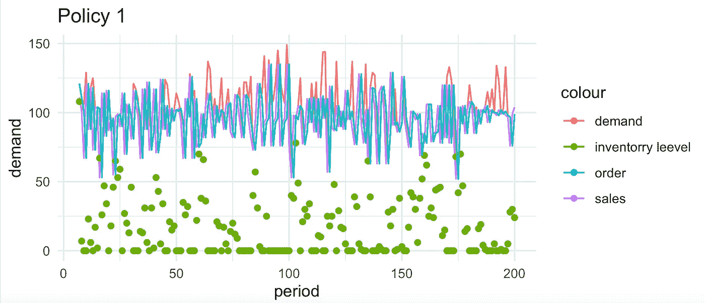
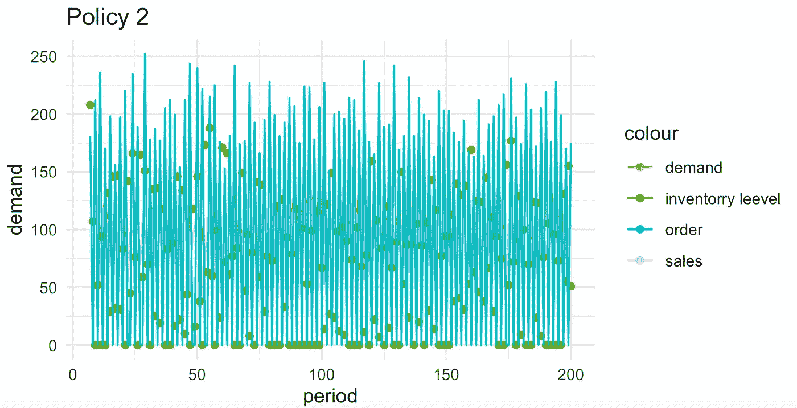
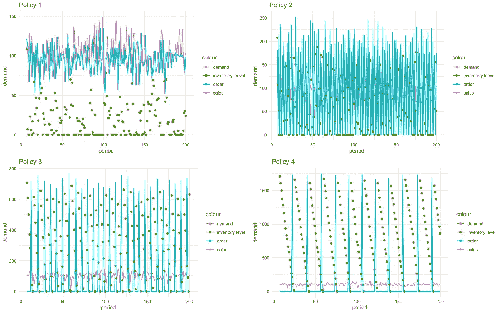
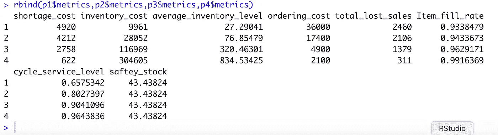

# 如何一步完成最小-最大策略

> 原文：<https://medium.com/analytics-vidhya/how-to-do-a-min-max-policy-in-one-step-6f61097dfa6c?source=collection_archive---------24----------------------->

## 供应链数据科学系列:第 3 集。

## 使用清单化。

库存系统在供应链中得到了广泛的研究和应用。我们可以认为它们是供应网络的脉络。除了顾客对品牌和产品本身质量的认知，在需要时提供关键产品是任何实体供应链系统成功的关键一步。

然而，在某些情况下，供应过多的库存会导致产品过时或亏本销售。这就是为什么我们专注于制定正确的库存政策，在来自客户的需求和库存系统中拥有此类产品的物流成本之间取得平衡，我们问自己两个问题；订购多少以及订购的频率。这两个问题由以下五个部分回答:

1-再订购点，如果库存系统是基于事件的。

2-订购数量。

3-如果清单系统是基于时间的，审评期。

4-安全库存水平。

5-库存状况，即我们的库存、我们已订购的产品和在途产品减去积压产品(如果有)。

模拟通过尝试不同的订购数量、再订购点、安全库存水平和订单时间来帮助回答这两个问题。让我们为一种需求有一点变化的产品制定一个库存策略。我们将在 r 中使用 inventorize 包。

```
demand<- rnorm(365,100,20)
leadtime= 3
mean=100
sd= 20
csl=0.9
```

让我们讨论代码片段中的那些组件:

*   交付周期是从订购到交付所需的时间。
*   平均值是产品的平均日需求量。
*   Sd 是每日需求的标准差。
*   Csl 是周期服务水平，这意味着我们需要在 90%的时间里完全满足我们的需求。
*   物料满足率是从总需求中满足的总量，它是非常重要的指标之一，通常高于周期服务水平。

我们将尝试(最小，最大)策略，这意味着每当我们达到最小，我们订购最多。因为 Min 由服务水平、标准偏差和平均值设置。我们将尝试 Max 的不同变体。对于正态分布的最小-最大需求，我们将使用“sim_minmax_normal”。

```
p1<-inventorize::sim_minmax_normal(demand,mean = mean(demand),sd=sd(demand),
                 service_level = 0.90,inventory_cost = 1,shortage_cost = 2,
                 leadtime = 3,Max = 400,ordering_cost = 100) p2<-inventorize::sim_minmax_normal(demand,mean = mean(demand),sd=sd(demand),
                                   service_level = 0.90,inventory_cost = 1,shortage_cost = 2,
                                   leadtime = 3,Max = 700, ordering_cost = 100) p3<-inventorize::sim_minmax_normal(demand,mean = mean(demand),sd=sd(demand),
                                   service_level = 0.90,inventory_cost = 1,shortage_cost = 2,
                                   leadtime = 3,Max = 1000,ordering_cost = 100) p4<-inventorize::sim_minmax_normal(demand,mean = mean(demand),sd=sd(demand),
                                   service_level = 0.90,inventory_cost = 1,shortage_cost = 2,
                                   leadtime = 3,Max = 2000,ordering_cost = 100)
```

让我们看看第一个策略是如何执行的:



在最大 400，似乎我们每天都在订购，以跟上需求，我们也失去了一些天的销售。然而，我们可以说这一政策非常有活力，几乎遵循了一种及时的方法，并有点倾斜。政策二呢？



政策 2 中的需求似乎比政策 1 中的需求中断得更多。另外，请注意较高的库存水平。我们来比较一下一个情节中的四个。



我们可以有把握地说，策略 1 和策略 4 都处于极端，让我们看看它们的度量标准；

```
rbind(p1$metrics,p2$metrics,p3$metrics,p4$metrics)
```



你觉得哪个更好，我很想听听你的想法。顺便说一下，我们没有改变服务级别。我将把这件事交给你。

感谢您的阅读！

我是一名供应链顾问和培训师，为零售商开发算法。我喜欢教书，也喜欢为企业增加价值。

领英:[https://www.linkedin.com/in/haythamomar/](https://www.linkedin.com/in/haythamomar/)

网址:【www.rescaleanalytics.com T3