# 如何使用 TensorFlow 对自定义数据集进行影像分类

> 原文：<https://medium.com/analytics-vidhya/how-to-do-image-classification-on-custom-dataset-using-tensorflow-52309666498e?source=collection_archive---------0----------------------->

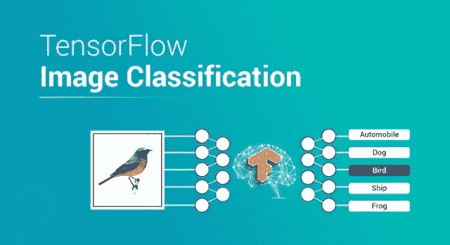

图像分类基本上是给系统一些属于一组固定类别的图像，然后期望系统将这些图像放入它们各自的类别。

在我以前的文章中，我已经向您展示了如何从图像分类开始。所以如果你还没有读过，你应该看看:[https://medium . com/@ rkt 10952/new-ABCD-of-machine-learning-C5 BF 9 EBA 75 BF](/@rkt10952/new-abcd-of-machine-learning-c5bf9eba75bf)

在本文中，我将使用我们自己的数据集进行图像分类。我将为您提供本文中使用的完整代码和其他所需文件，以便您可以亲自动手操作。
GitHub 链接:[https://GitHub . com/aryan 109/medium/tree/master/Custom _ Image _ class ification](https://github.com/aryan109/medium/tree/master/Custom_Image_Classification)

我请求您在执行代码时阅读这篇文章，这样您就可以理解代码的每一行。

# 正在准备数据集

我们从准备数据集开始，因为这是解决任何机器学习问题的第一步，你应该正确地做它。
我们将使用 Keras 中 **ImageDataGenerator** 类中的 *flow_from_directory* 方法。为了使用它，我们需要把我们的数据放在预定义的目录结构中，如下所示

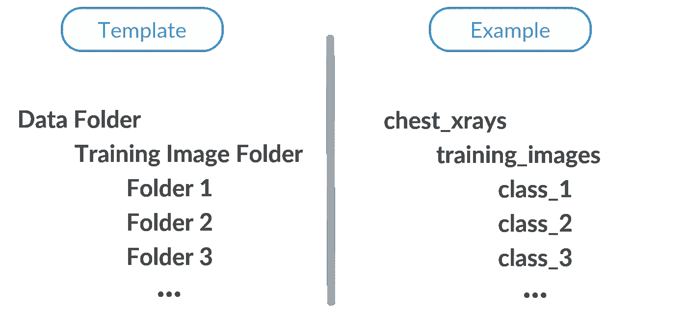

我们只需要把图片放到各自的文件夹中，就可以开始了。

# 正在加载数据集

当我们准备数据集时，我们需要加载它。因为我们在这里使用协同实验室，所以我们需要将数据加载到协同实验室工作区。我们首先需要将数据文件夹上传到 Google Drive。然后，我们需要在我们的工作区中安装驱动器，为此我们将使用以下代码:

```
from google.colab import drivedrive.mount(‘/content/drive’)
```

当我们执行这段代码时，将会生成一个链接，并会出现一个要求验证码的框！！！。现在，该做什么…？


布鲁斯·马尔斯在 [Unsplash](https://unsplash.com?utm_source=medium&utm_medium=referral) 上拍摄的照片

不要担心，只要点击认证框上方的链接，就会出现一个页面，登录到您的谷歌帐户。当您输入凭据并登录时。允许 Google Drive 文件流访问您的帐户，然后将生成验证码，只需复制该代码并粘贴到框中。

恭喜🎉你已经完成了最难的部分，接下来就很简单了。

现在，就像这样进入上传的数据集文件夹:-

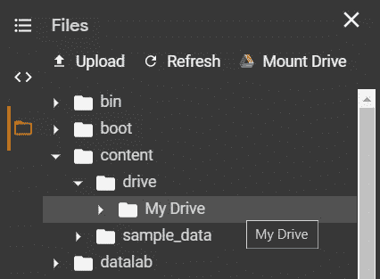

然后右键单击文件夹，并单击复制路径。

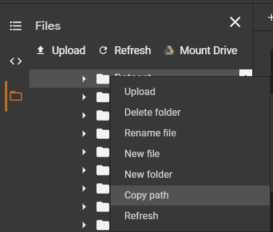

现在将数据根设置为复制的路径。

```
data_root = (“<Copied path>”)
```

它看起来会像

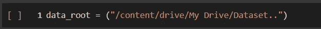

执行此单元格。

# 创建培训和验证数据

正如我之前告诉你的，我们将使用 **ImageDataGenerator** 将数据加载到模型中，让我们看看如何做。

第一组图像形状

```
IMAGE_SHAPE = (224, 224) # (height, width) in no. of pixels
```

设置培训数据目录

```
TRAINING_DATA_DIR = str(data_root)
```

重新缩放图像并将数据分成训练和验证。

```
datagen_kwargs = dict(rescale=1./255, validation_split=.20)
```

创建列车 _ 发电机和有效 _ 发电机

```
valid_datagen = tf.keras.preprocessing.image.ImageDataGenerator(**datagen_kwargs)valid_generator = valid_datagen.flow_from_directory(TRAINING_DATA_DIR,subset=”validation”,shuffle=True,target_size=IMAGE_SHAPE)train_datagen = tf.keras.preprocessing.image.ImageDataGenerator(**datagen_kwargs)train_generator = train_datagen.flow_from_directory(TRAINING_DATA_DIR,subset=”training”,shuffle=True,target_size=IMAGE_SHAPE)
```

当您执行单元格时，它将显示如下输出

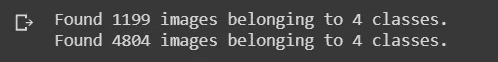

第一行是验证数据，第二行是训练数据。

# 可视化数据

让我们浏览一下 train_generator 中的图像和标签

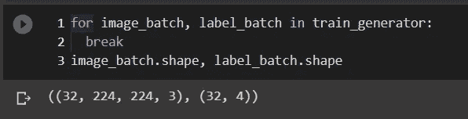

默认的批量大小是 32，这在大多数情况下是合适的。

(32，244，244，3)表示在一批图像中包括 32 个图像，244，244 是图像的高度和宽度，3 是 RGB 三个颜色通道。

label_batch shape is (32，4)表示有 32 个标签和 4 个，因为标签是一种热编码格式。

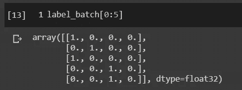

label_batch 中的前 5 个元素

让我们看看哪些指数代表哪些标签

```
print (train_generator.class_indices)
```

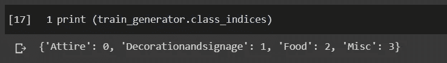

现在，我们将所有标签写入一个文本文件。

```
labels = ‘\n’.join(sorted(train_generator.class_indices.keys()))
with open(‘labels.txt’, ‘w’) as f:
 f.write(labels)
!cat labels.txt
```

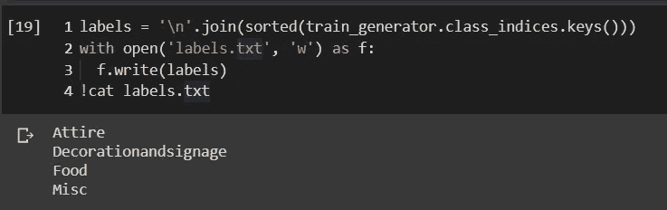

# 创建分类模型

在这里，我将向您展示迁移学习的一瞥，不要担心，我将为迁移学习创建一个单独的教程。

我们将使用 **TensorFlow hub** 来加载预训练的模型。

```
model = tf.keras.Sequential([
 hub.KerasLayer(“[https://tfhub.dev/google/tf2-preview/mobilenet_v2/feature_vector/4](https://tfhub.dev/google/tf2-preview/mobilenet_v2/feature_vector/4)", 
 output_shape=[1280],
 trainable=False),
 tf.keras.layers.Dropout(0.4),
 tf.keras.layers.Dense(train_generator.num_classes, activation=’softmax’)
])
model.build([None, 224, 224, 3])model.summary()
```

这个模型有它自己的一些独特的特性，
1)即使你的数据集有不同数量的类，这个代码也能工作。
2)由于我们使用迁移学习，即使你的数据集很小，它也会产生很好的结果。
3)这种模式易于在移动设备或类似 Raspberry pi 的设备上部署。(请不要担心，我将在另一篇文章中单独介绍这一点，敬请关注😉).

这段代码的输出如下所示:

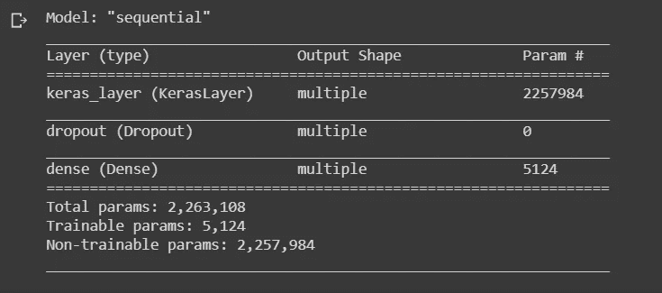

# 火车模型

在训练之前，我们需要编译模型，操作系统，让我们编译

```
optimizer = tf.keras.optimizers.Adam(lr=1e-3)
model.compile(
 optimizer=optimizer,
 loss=’categorical_crossentropy’,
 metrics=[‘acc’])
```

现在我们可以训练了

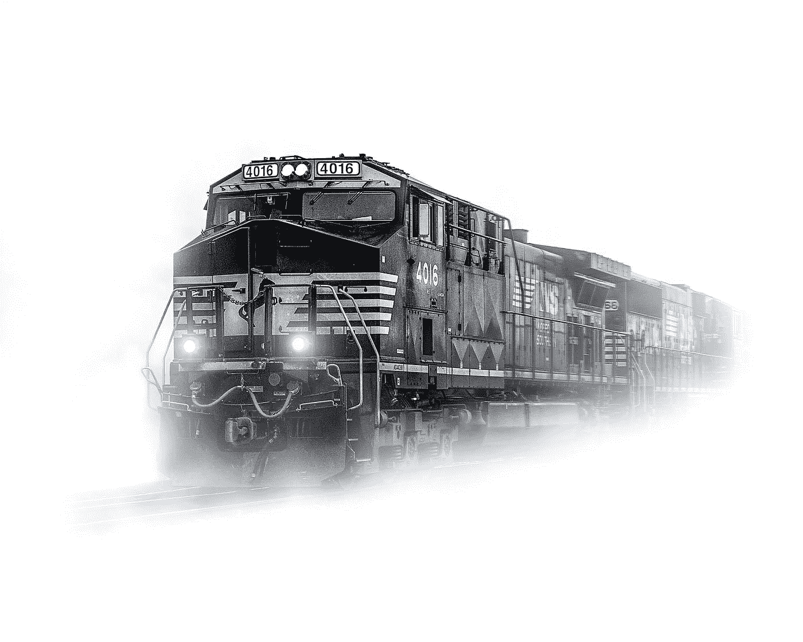

布莱恩·苏曼在 Unsplash 的照片

开玩笑的😂让我们进行真正的训练

```
steps_per_epoch = np.ceil(train_generator.samples/train_generator.batch_size)
val_steps_per_epoch = np.ceil(valid_generator.samples/valid_generator.batch_size)hist = model.fit(
 train_generator, 
 epochs=100,
 verbose=1,
 steps_per_epoch=steps_per_epoch,
 validation_data=valid_generator,
 validation_steps=val_steps_per_epoch).history
```

> 这段代码将为模型训练 100 个时期。
> **警告**:训练需要时间，所以要有耐心..


[法希·马林](https://unsplash.com/@fachymarin?utm_source=medium&utm_medium=referral)在 [Unsplash](https://unsplash.com?utm_source=medium&utm_medium=referral) 上拍摄的照片

## 恭喜🙌您已经成功训练了您的模型

现在让我们看看我们的模型有多好。

```
final_loss, final_accuracy = model.evaluate(valid_generator, steps = val_steps_per_epoch)
print(“Final loss: {:.2f}”.format(final_loss))
print(“Final accuracy: {:.2f}%”.format(final_accuracy * 100))
```

好看吗？如果不能尝试训练更多的纪元，那就看看神奇的🧝‍♀️.吧

# 绘制一些图表

这些图表将帮助你了解训练做得有多好。

```
plt.figure()
plt.ylabel(“Loss (training and validation)”)
plt.xlabel(“Training Steps”)
plt.ylim([0,50])
plt.plot(hist[“loss”])
plt.plot(hist[“val_loss”])plt.figure()
plt.ylabel(“Accuracy (training and validation)”)
plt.xlabel(“Training Steps”)
plt.ylim([0,1])
plt.plot(hist[“acc”])
plt.plot(hist[“val_acc”])
```

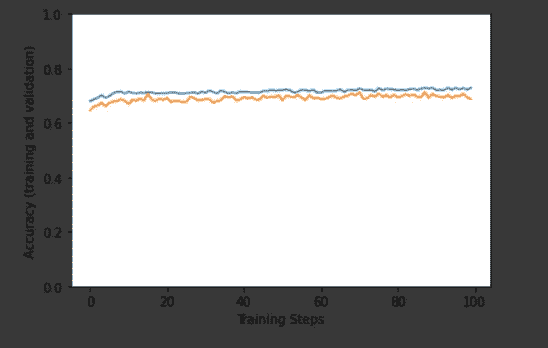

该图看起来会像这样，橙色线表示验证准确性，蓝色线表示训练准确性。

# 检查模型的性能

```
tf_model_predictions = model.predict(val_image_batch)
print(“Prediction results shape:”, tf_model_predictions.shape)plt.figure(figsize=(10,9))
plt.subplots_adjust(hspace=0.5)
for n in range((len(predicted_labels)-2)):
 plt.subplot(6,5,n+1)
 plt.imshow(val_image_batch[n])
 color = “green” if predicted_ids[n] == true_label_ids[n] else “red”
 plt.title(predicted_labels[n].title(), color=color)
 plt.axis(‘off’)
_ = plt.suptitle(“Model predictions (green: correct, red: incorrect)”)
```

将通过预测向您展示模型的训练效果。

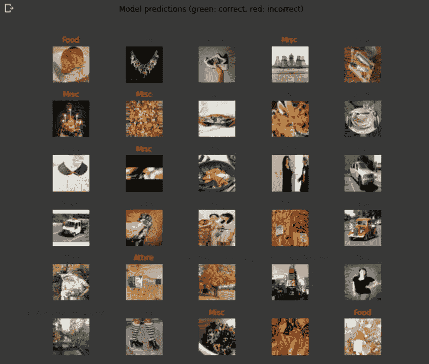

由模型完成的预测

> 谢谢你的耐心和阅读这篇文章。请分享您的反馈和建议。我保证很快会有更多的文章，希望你会喜欢。


由[霍华德·里明顿](https://unsplash.com/@howier?utm_source=medium&utm_medium=referral)在 [Unsplash](https://unsplash.com?utm_source=medium&utm_medium=referral) 上拍摄的照片