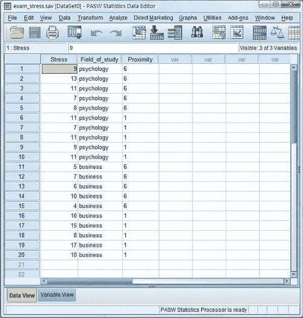
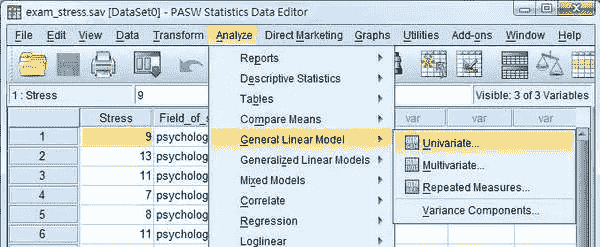
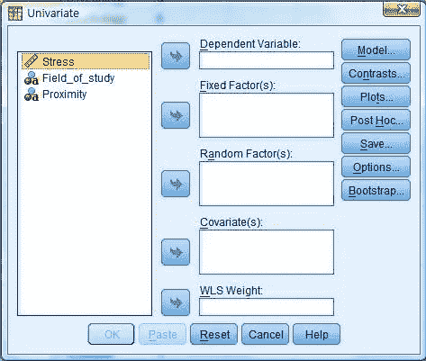
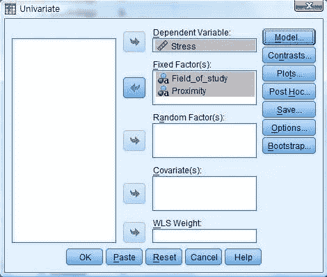
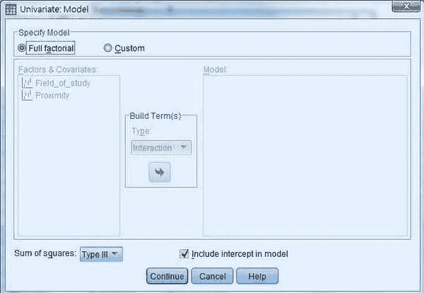
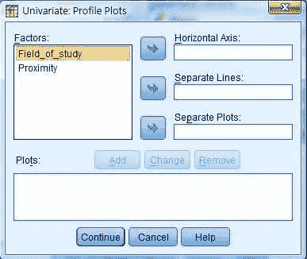
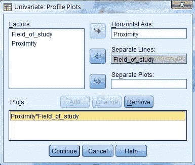
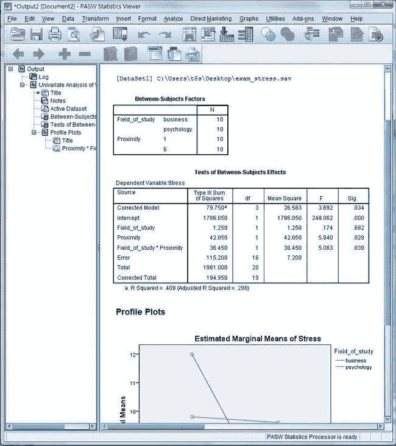
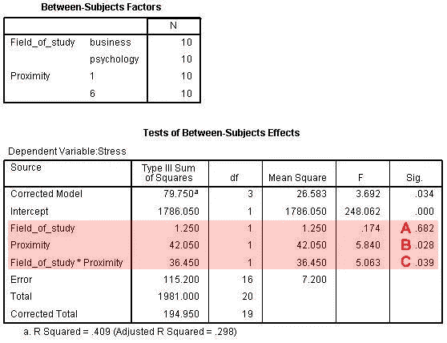

# 如何用 SPSS 进行双向因子方差分析

> 原文：<https://medium.com/analytics-vidhya/how-to-do-two-way-factorial-anova-using-spss-de5b0b183895?source=collection_archive---------1----------------------->

一步一步的指导如何使用 SPSS 的双向因子方差分析来评估两个不同因素对因变量的影响。

我们什么时候做双向因子方差分析？
当我们想要研究两个独立分类变量对因变量的影响时，我们运行双向因子方差分析。在双向因子方差分析中，我们可以检验每个自变量的主效应。我们还可以测试一个因变量对因变量的影响在另一个自变量的所有水平上是否相同，也就是说，自变量之间是否存在任何交互作用。

**示例场景**
一位统计学课程的教授对临近期末考试(5 周后，1 周)对心理学和商科学生压力水平的影响很感兴趣。他在一份标准化问卷上测量了他们感受到的压力水平。在这种情况下，压力是因变量，而接近度和学生的学习领域是自变量。

在这个例子中，我们有三组假设。

*   假设 1
*   零假设:临近期末考试对学生的压力水平没有影响。
*   替代假设:临近期末考试对学生的压力水平有影响。
*   假设 2
*   零假设:心理学学生和商科学生的压力水平是一样的。
*   替代假设:心理学学生和商科学生的压力水平是不一样的。
*   假设 3
*   零假设:学生的学习领域和期末考试的临近程度之间没有交互作用。也就是说，临近期末考试对心理学学生和商科学生的影响是一样的。
*   替代假设:学生的学习领域和期末考试的临近程度之间存在相互作用。也就是说，临近期末考试对心理学学生和商科学生的影响是不同的。

在数据中，第一栏是压力分数，第二栏是学习领域，第三栏是临近期末考试。数据集可以在这里[获得。](http://www.maths-statistics-tutor.com/dataset/exam_stress.sav)

**第一步**
选择“分析- >一般线性模型- >单变量”。

一个新窗口弹出。

三个变量“压力”、“研究领域”和“接近度”将显示在左边的列表中。

**第二步**
选择“压力”作为“因变量”，选择“研究领域”和“接近度”作为“固定因素”。

现在点击右边的“模型”。一个新窗口弹出。确保选中顶部的“全因子”框。点击“继续”。窗户将被关上。

在双向因子方差分析中，交互作用图对于解释交互作用非常有用。在这种情况下，交互图将帮助我们解释学习领域和临近期末考试的综合影响。我们可以通过点击右边的“图”来获得这些图。一个新窗口弹出。

选择“接近度”作为“横轴”，选择“研究领域”作为“分隔线”。事实上，变量以哪种方式绘制并不重要；你应该自己判断哪种方式会产生最合理的情节。点击“添加”，然后点击“继续”

然后车窗将会关闭。现在在原来的窗口中点击“确定”。

**第三步**
结果现在弹出在“输出”窗口中。

**第四步**
我们现在可以解读结果了。

根据第二个表中的 A，研究领域的主效应的 p 值为 0.682，因此研究领域的效应不显著。我们可以得出结论，一般来说，心理学学生和商科学生的压力水平是一样的。从 B 开始，接近度的 p 值为 0.028；因此，我们可以得出结论，邻近的主要影响是显著的。从 C 开始，相互作用的 p 值为 0.039；交互作用是显著的，我们可以得出结论，对于心理学学生和商科学生来说，邻近对压力水平的影响是不一样的。下面的互动图表明，随着期末考试的临近，商科学生的压力水平大幅上升，但心理学学生的压力水平却保持不变。

选择合适的统计测试来解决你的研究问题是一门艺术，需要多年的时间来完善。有了多年的经验，我可以照顾你研究中所有的统计方面，你可以把更多的时间投入到你的实质性研究问题上。

***一旦你决定使用*** [***我的服务***](https://www.fiverr.com/miris_labs/do-statistical-data-analysis-and-modeling-using-spss-r-excel) ***，你就可以期待最高程度的投入，顺利完成你的学业。***

如有疑问，请随时[联系我们](https://www.fiverr.com/miris_labs/do-statistical-data-analysis-and-modeling-using-spss-r-excel)。我相信我能帮你解决你的问题:)

直到下一个，有一个伟大的一天！