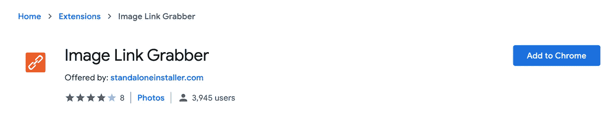
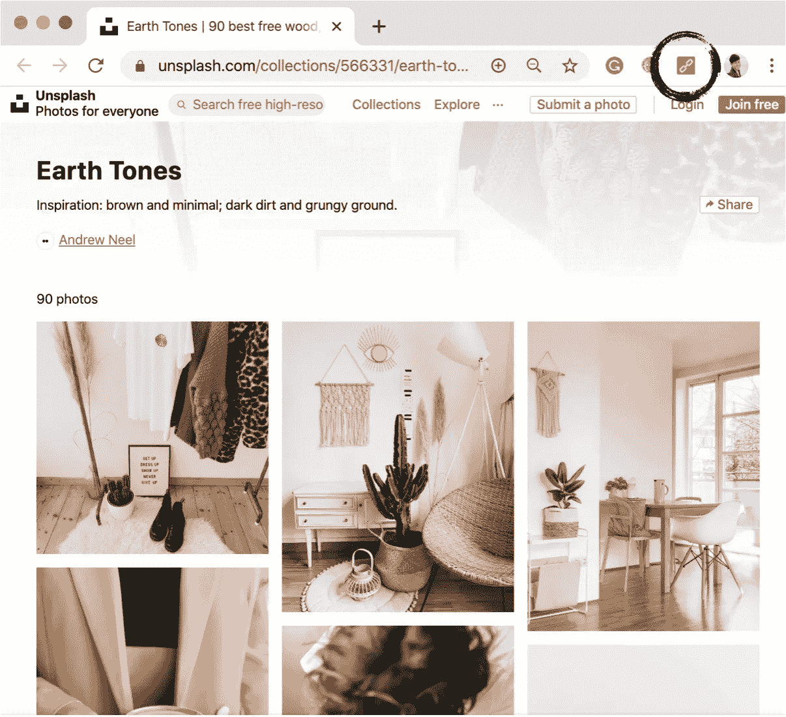
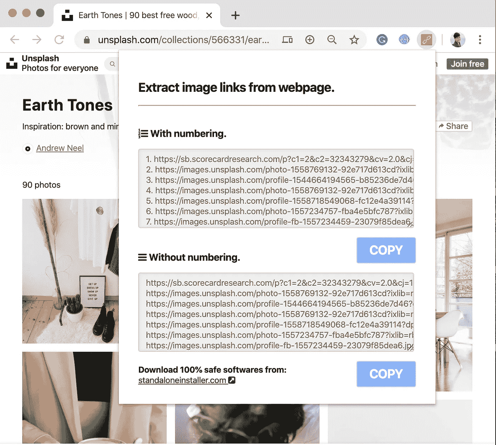

# 使用 Python 中的“多线程”从 Unsplash 下载 images agiler。

> 原文：<https://medium.com/analytics-vidhya/how-to-download-images-faster-using-multithreading-in-python-a31110468770?source=collection_archive---------7----------------------->

## 快速入门教程

## 指南:从 Unsplash 下载图片的最快方法。

传统上，我们通过点击每个文件来下载文件，但是如果我们需要越来越多的文件呢？我们可能期望编程可以帮助我们。在这篇文章中，从上一个关于"[多线程](/@hanniballiang/how-to-start-multithreading-in-python-in-just-5-minutes-fe1f28d7aa56)的主题中延伸出这个想法，并使用实际的实例来给你带来更多关于何时使用它的直觉。从“图像”开始会更容易，因为它是我们每天面对的最常见的文件。

# 概念简介

让我们把从 Unsplash 下载图像作为我们今天的任务，这个想法可以扩展到所有类型的文件下载，并在下一段中研究细节。以下是步骤。

1.  从网页上抓取图片网址。
2.  用多线程通过 URL 下载。
3.  使用和不使用多线程。

如果你之前不知道**多线程在 python** 中是怎么用的，推荐你看一下[我之前的文章](/@hanniballiang/how-to-start-multithreading-in-python-in-just-5-minutes-fe1f28d7aa56#c4c2-98d0c9a84364)。


Unsplash 是致力于分享开源图片的最好的图片网站。

# 抓取图像 URL

URL 是一个网址，您可以在浏览器的地址栏中找到它。每当你下载一个图像，你通过 URL 抓取一个网络资源，并把它添加到我们的计算机上。

为了获取这些 URL，我们使用 chrome extension 的一个工具来简化它。在浏览器上搜索“[图片链接抓取器](https://www.google.com/search?q=Image+Link+Grabber&rlz=1C5CHFA_enTW867TW870&oq=Image+Link+Grabber&aqs=chrome..69i57j0j69i60l2.284j0j7&sourceid=chrome&ie=UTF-8)”，点击第一个结果，你将进入如下页面。



在你添加到 Chrome 之后，现在让我们进入一个类似 [Unsplash](https://unsplash.com/collections/566331/earth-tones) 的图片网站，点击浏览器右上角的橙色按钮。



[https://unsplash.com/collections/566331/earth-tones](https://unsplash.com/collections/566331/earth-tones)



单击底部的复制按钮复制这些 URL，然后继续下一部分。

# 多线程下载

创建一个名为“url_list.txt”的文本文件并粘贴你得到的所有 url，在同一个文件夹中创建另一个 python 文件。我们将通过 python 遍历每个 URL。

在这段代码中，我们打开名为“url_list.txt”的文件，其中包含 url，并循环遍历每一行以创建一个列表。接下来，把每个元素放在函数里面在线下载，然后我们可以在同一个文件夹里面找到这些图片。提到`time.perf_counter()`是用于计算下载过程的持续时间。

```
#The output should be
Finished in 65.83849721899999 seconds
```

如果您运行代码，您会注意到完成任务需要相当长的时间，这似乎是不明智的。幸运的是，应用多线程是可能的，而且太容易想象了。

每当调用该函数时，就去创建线程，然后代码就会变成这种形式。

```
#The output should be
Finished in 2.5736677319999997 seconds
```

输出是可预期的，但令人震惊。试着把这种方法运用到其他案例中，希望这能帮你得到一些思路。

# 应用

在很多情况下，我们随时随地下载文件。

*   机器学习开发人员:你可能需要从网络上获取数据，以创建数据集来训练模型。
*   电影剪辑师:你可能会经常从音频网站上收集素材。
*   艺术家:做研究的时候你可能需要很多照片。

# 资源

这种方式并不局限于抓取网址，但我认为使用 Chrome 扩展可能是我所知道的最简单的一种。以下是不同的方法，获得相同的网址，但更复杂的新手:

*   [Algorithmia](https://algorithmia.com/blog/fast-way-scrape-image-urls-webpages)
*   [美丽的风景](https://hackersandslackers.com/scraping-urls-with-beautifulsoup/)