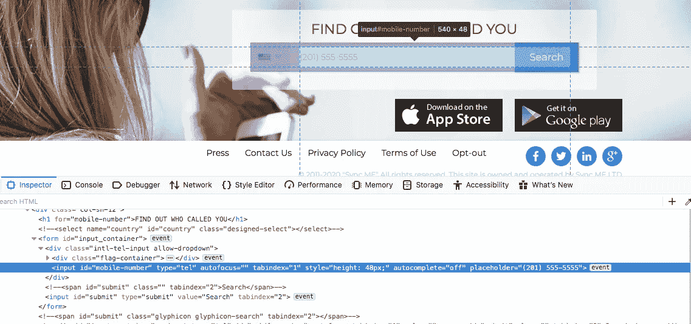
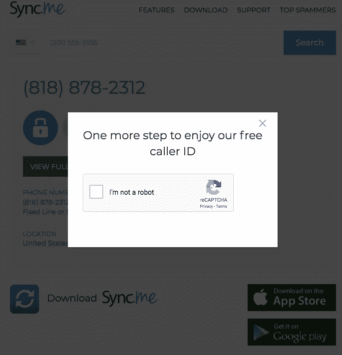
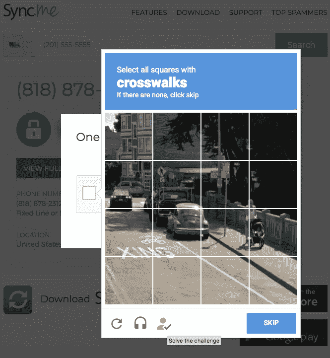
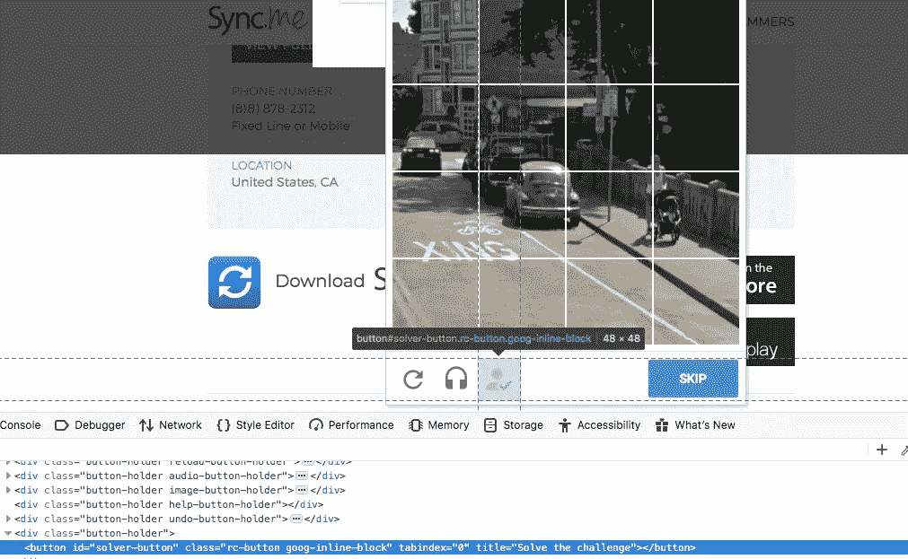
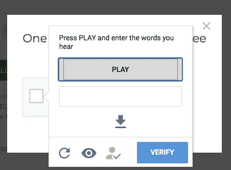

# 如何绕过硒 reCaptcha V2？

> 原文：<https://medium.com/analytics-vidhya/how-to-easily-bypass-recaptchav2-with-selenium-7f7a9a44fa9e?source=collection_archive---------0----------------------->

*(更新日期:5 月 23 日。直到本教程中使用的工具的版本改变，一些方法不工作，所以我尝试用一个新的工作代码来更新这个解决方案。*

它在 [Github](https://github.com/teal33t/captcha_bypass) 上，你可以阅读代码，了解它是如何工作的。

在本教程中，我将描述如何绕过 re-captcha v2(带挑战和互动评分)，用 [Sync.me](http://sync.me) 网站测试以收集电话号码。

我们将使用 Python (unittest)、Selenium 和 [Buster Captcha Solver](https://github.com/dessant/buster) 。

首先，很高兴知道 Google reCaptcha V3 根据与网站的交互对每个请求进行评分。每个请求的分数在 0 到 1 之间，0 代表机器人，1 代表非常可能的交互。

在本教程中，我们将设置一个 Selenium bot 来完成 V2 挑战和评分，然后从 Sync.me 的电话号码中收集人们的姓名

Python unittest 是一个运行测试的工具；事实上，Selenium 是一个为应用程序编写测试的标准工具，这里我们有一个简单的框架来运行测试，还有`tearDown`用于在 bot 完成后自动关闭它，这是我们的默认框架:

使用 unittest 的主要结果是因为它的断言方法，您可以轻松地一步一步跟踪您的 bot。

好了，现在我们要用硒了，先导入我们需要的东西:

我更喜欢的网络驱动是 Gecko，你需要在你的系统上安装 Gecko。正如您所知，对于每个 web 驱动程序，您都应该设置它的配置文件和功能，因此我们需要创建一个设置方法，如下所示:

`[setUp()](https://docs.python.org/3/library/unittest.html#unittest.TestCase.setUp)`和`[tearDown()](https://docs.python.org/3/library/unittest.html#unittest.TestCase.tearDown)`方法允许你定义在 unittest 的每个测试方法之前和之后执行的指令。

现在我们来看看其他方法，`setUpOptions`:

无头浏览意味着你不想运行带有图形用户界面的浏览器。

正如我所说，这是一个简单的验证码求解器，你不需要知道验证码求解算法，所以第三方帮助我们，巴斯特！

Buster 是一个使用音频识别的验证码求解器，您可以将它用作您的 web 浏览器扩展，请看:

 [## dessant/buster

### 巴斯特的持续发展得益于令人敬畏的支持者的支持。如果你想加入…

github.com](https://github.com/dessant/buster) 

现在，让我们为使用 buster 的 gecko 设置一个配置文件，这意味着您的浏览器将在其初始化时加载扩展。

然后，在我们的下一步，我们需要启用[木偶](https://firefox-source-docs.mozilla.org/testing/marionette/Intro.html)。

但是什么是木偶呢？Mozilla 对此有何评价？

> 牵线木偶是 Mozilla 的 Gecko 引擎的自动化驱动程序。它可以远程控制 Gecko 平台的 UI 或内部 JavaScript，比如 Firefox。它可以控制 chrome(即菜单和功能)或内容(在浏览上下文中加载的网页)，提供高级别的控制和复制用户操作的能力。除了在浏览器上执行操作，Marionette 还可以读取 DOM 的属性。
> 
> 牵线木偶是 Firefox 附带的新驱动程序。这个驱动程序有自己的协议，与 Selenium/WebDriver 协议不直接兼容。
> 
> **Gecko 驱动程序**(以前称为 wires)是实现 Selenium/WebDriver 协议的应用服务器。它翻译 Selenium 命令并将它们转发给**木偶驱动程序。**
> 
> [https://stack overflow . com/questions/43272919/difference-between-web driver-Firefox-marionette-web driver-gecko-driver](https://stackoverflow.com/questions/43272919/difference-between-webdriver-firefox-marionette-webdriver-gecko-driver)
> 
> 如需了解更多信息，请访问它的文档，[https://Firefox-source-docs . Mozilla . org/testing/marionette/intro . html](https://firefox-source-docs.mozilla.org/testing/marionette/Intro.html)

如果您想要设置代理，您需要为驱动程序启用它的功能，所以让我们这样做:

我们准备好了，让我们进入主要功能:

在我们的代码上调用`[unittest.main()](https://docs.python.org/3/library/unittest.html#unittest.TestCase.setUp)`之后，`test_run`方法是主函数。`driver.get`将尝试加载 [https://sync.me](https://sync.me) 。

现在，让我们找到电话的输入:

我们可以使用 XML 或 CSS 选择器来定位电话号码输入，下面是 [Selenium locator 的方法](https://selenium-python.readthedocs.io/locating-elements.html):

> 按标识查找元素
> 
> 按名称查找元素
> 
> 通过 xpath 查找元素
> 
> 通过链接文本查找元素
> 
> 查找元素部分链接文本
> 
> 按标签名查找元素
> 
> 按类名查找元素
> 
> 通过 css 选择器查找元素
> 
> 按名称查找元素
> 
> 通过 xpath 查找元素
> 
> 通过链接文本查找元素
> 
> 查找元素部分链接文本
> 
> 按标签名查找元素
> 
> 按类名查找元素
> 
> 通过 css 选择器查找元素

我使用 Xpath 检查输入并向其发送数字:

等待随机秒提供一些有效的互动，并告诉应用程序等待提交定位器 20 秒超时，并点击它:

提交后，我们将在结果页面上看到 reCaptcha:

在点击复选框之前，让我们模拟类似人类的鼠标交互，以便与页面进行更有效的交互，对于这个问题，我们使用 [B 样条](https://en.wikipedia.org/wiki/B-spline)函数生成向量，并用它来执行鼠标移动。

> B-spline 是一个关于给定的[次](https://en.wikipedia.org/wiki/Degree_of_a_polynomial)、[光滑度](https://en.wikipedia.org/wiki/Smooth_function)和[域](https://en.wikipedia.org/wiki/Domain_(mathematics))划分具有最小[支持度](https://en.wikipedia.org/wiki/Support_(mathematics))的函数。

所以，因为验证码是在一个新的框架上打开的，我们需要告诉驱动程序和开关，然后找到`recaptcha-anchor`可以为我们提供一个位置，开始我们的类人鼠标运动:

下一步是点击复选框，等待并再次做类似人类的鼠标移动。

在这一步，您将看到需要解决的挑战，因为我们正在使用 Buster，您可以看到音频验证码求解器的按钮:

是的，就是它，如果我们找到锚就能找到它的 ID。

但是为了得到更多的分数，首先我们需要点击音频按钮:

并赶上新帧:

在新框架上，只需点击解算器按钮，就像这样:

并返回到主框架:

是的，你的机器人绕过了验证码。

了解有关以下内容的更多信息:

 [## teal 33t/验证码 _bypass

### 谷歌验证码旁路，使用 Selenium，Geckodriver 和 Buster - teal33t/captcha_bypass

github.com](https://github.com/teal33t/captcha_bypass)