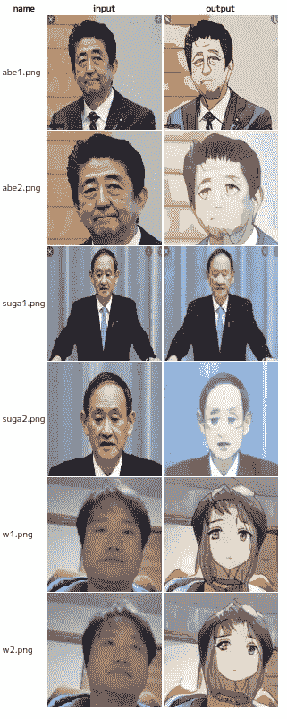
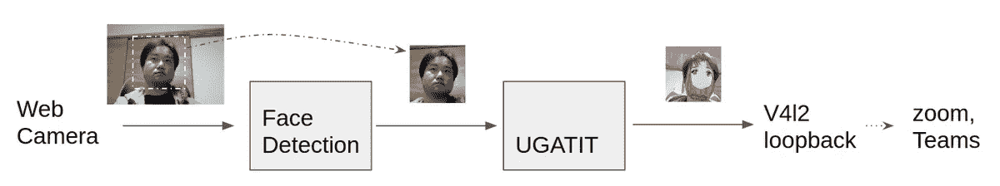

# 如何编辑视频聊天，团队，缩放的图像流。第三部分转化为动漫

> 原文：<https://medium.com/analytics-vidhya/how-to-edit-the-image-stream-for-video-chat-teams-zoom-part-3-convert-to-anime-84a6788819d2?source=collection_archive---------10----------------------->

这篇文章也可以在这里找到。(日文)
[https://cloud . flext . co . jp/entry/2020/04/02/114756 # f-459 f23 DC](https://cloud.flect.co.jp/entry/2020/04/02/114756#f-459f23dc)

在我以前的文章中，我向你展示了如何处理你的团队和变焦相机图像。在这些帖子中，我们向您展示了一个检测微笑和情绪(面部表情)并显示笑脸符号的演示。

[](/@dannadori/how-to-edit-the-image-stream-for-video-chat-teams-zoom-part-2-emotion-analysis-by-tensorflow-819563f17dfe) [## 如何编辑视频聊天，团队，缩放的图像流。第二部分 Tensorflow 情感分析

### 这篇文章也可以在这里找到。(日语)https://cloud.flect.co.jp/entry/2020/04/01/201158

medium.com](/@dannadori/how-to-edit-the-image-stream-for-video-chat-teams-zoom-part-2-emotion-analysis-by-tensorflow-819563f17dfe) [](/@dannadori/how-to-edit-the-image-stream-for-video-chat-teams-zoom-3acb58669f26) [## 如何编辑视频聊天、团队、缩放的图像流

### 这篇原创文章也可以在这里找到。https://cloud.flect.co.jp/entry/2020/03/31/162537

medium.com](/@dannadori/how-to-edit-the-image-stream-for-video-chat-teams-zoom-3acb58669f26) 

这一次，我将它扩展了一点，并尝试将一个图像转换成动画风格的显示，这就是它。首先，我要给你一个剧透，我认为由于滞后，很难使用 CPU 实时转换成动漫风格的图像。(我没有在 GPU 上试过，看是不是更好。)

->我试过 GPU！https://www.youtube.com/watch?v=Rw2DcUk4k-Y
T4&feature = youtu . be


*   左上角:CPU 英特尔 4770
*   右上:CPU 英特尔 9900KF
*   左下方:采用 GPU 2080ti 的英特尔 9900 KF CPU
*   右下角:CPU 英特尔 9900KF，GPU 2080ti，skip_frame=3

让我们快速浏览一下。

# 动漫风格图像转换

我相信你们中的许多人可能听说过它，因为它是大约半年前由新闻媒体报道的。一种将照片转换成动漫风格的方法可以在下面的页面找到。

[https://github.com/taki0112/UGATIT](https://github.com/taki0112/UGATIT:embed:cite)

与简单的 image2image 风格转换不同，这款 UGATIT 基于使用生成器和鉴别器的所谓 GAN 技术，并通过添加原始的 AdaLIN 功能，似乎能够应对形状的变化。

*在我们的工作中，我们提出了一种自适应层实例归一化(AdaLIN)函数，以自适应地选择 In 和 LN 之间的适当比率。通过 AdaLIN，我们的注意力引导模型可以灵活地控制形状和纹理的变化量。*

有关更多信息，请参见本文([https://arxiv.org/abs/1907.10830](https://arxiv.org/abs/1907.10830))和评论文章。

如果你使用上一页的训练好的模型，你可以看到它在实际转换中的样子。



如果被摄对象比较远，好像转换的不太好。此外，一个上了年纪的男人似乎不能很好地处理这件事。训练中使用的数据集也公布在上面的页面中，但似乎偏向于年轻女性，所以可能是这个原因。(我还没那么老…这样说是不是很过分…？)

# 实施概述

如上所述，看起来图像应该靠近主体(人的脸)(≒the 的脸占据了屏幕的大部分)。这一次，我尝试使用我在以前的文章中介绍的人脸检测功能来识别人脸的位置，然后我剪切出人脸的位置，并应用 UGATIT 进行转换。



有关实现的更多信息，请参考下面提到的存储库。

# 环境建设

看一下[之前的文章](https://cloud.flect.co.jp/entry/2020/03/31/162537)准备一个 v4l2loopback，一个面部识别的模型等等。

另外，和以前一样，请从下面的存储库中克隆脚本并安装必要的模块。

```
$ git clone [https://github.com/dannadori/WebCamHooker.git](https://github.com/dannadori/WebCamHooker.git)
$ cd WebCamHooker/
$ pip3 install -r requirements.txt
```

# 部署 UGATIT 训练模型

UGATIT 官方提供了 Tensorflow 和 PyTorch 版本的源代码，但唯一经过训练的模型似乎是 Tensorflow 版本。请得到这个并且扩展它。

注意，正常的 Windows 和 Linux zip 解压工具似乎都失败了，并且在问题中有一个报告说 7zip 在使用 Windows 时工作良好。此外，它似乎不会在 Mac 上引起任何问题。对于 Linux，解决方案是未知的…(截止到 2020 年 4 月 2 日)

这里是正常运行的模型的哈希值(md5sum)。(大概是因为这是最大的绊脚石吧。)

```
$ find . -type f |xargs -I{} md5sum {}
43a47eb34ad056427457b1f8452e3f79 . /UGATIT.model-1000000.data-00000-of-00001
388e18fe2d6cedab8b1dbaefdddab4da . /UGATIT.model-1000000.meta
a0835353525ecf78c4b6b33b0b2ab2b75c . /UGATIT.model-1000000.index
f8c38782b22e3c4c61d4937316cd3493 . /checkpoint 
```

这些文件存储在从上述 git 克隆的文件夹中的‘uga tit/check point’中。如果是这样的话，还可以。

```
$ ls UGATIT/checkpoint/ -1
UGATIT.model-1000000.data-00000-of-00001
UGATIT.model-1000000.index
UGATIT.model-1000000.meta
checkpoint 
```

# 我们开个视频会议吧！

执行过程如下。增加了一个选项。

input _ video _ num 应该是实际的网络摄像机设备号。对于/dev/video0，输入一个尾随的 0。
-output _ video _ dev 必须是虚拟网络摄像机设备的设备文件。
- anime_mode 应该是真的。

另外，请使用 ctrl+c 终止。

```
$ python3 webcamhooker.py --input_video_num 0 --output_video_dev /dev/video2 --anime_mode True
```

当执行上述命令时，ffmpeg 开始运行，视频被传送到虚拟摄像机设备。

和之前一样，当你开视频会议的时候，你应该会在视频设备列表中看到一个叫“dummy~~”的东西，所以选择它。


这是一个团队的例子。原始图像也显示在屏幕右上方的划像区。它被转换成比我想象中更动漫的风格。但是，它很重，当它是一台有点旧的 PC 时，它是每秒 1 帧这样的水平(Intel(R)Core(TM)i7–4770 CPU @ 3.40 GHz，32G RAM)。可能很难正常操作。我想最终在 GPU 上尝试一下。

[](https://www.buymeacoffee.com/wokad)

我很渴！！

# 最后。

长时间在家办公，可能很难随便交流，但我觉得把这种趣味性带到视频会议上来活跃一下谈话气氛是个不错的主意。我相信你可以做得更多，所以请尝试一下。