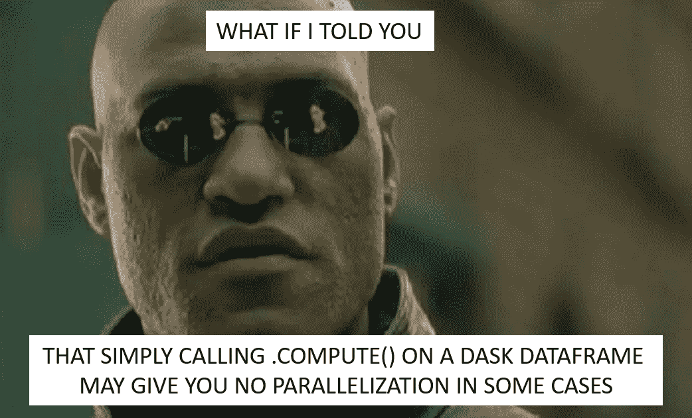

# 如何在单台机器上高效并行化 Dask 数据帧计算

> 原文：<https://medium.com/analytics-vidhya/how-to-efficiently-parallelize-dask-dataframe-computation-on-a-single-machine-1f10b5b02177?source=collection_archive---------1----------------------->

线程、进程、集群——何时选择什么

在[之前的故事](/@sanghviyash7/7455d66a5bc5?source=friends_link&sk=676094a1bbd8cfac98fe6faec85d6dbe)中，我们深入研究了 dask 数据帧。我们看到他们有多懒，只有在被迫的时候才会使用`.compute()`方法来执行计算。否则，它们只是生成要执行的计算的任务图。然而，`.compute()`是否…