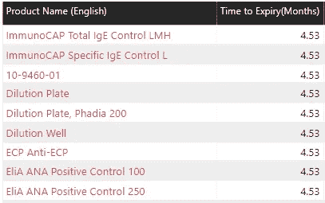
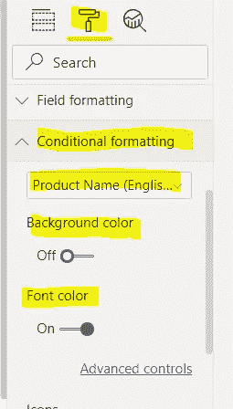
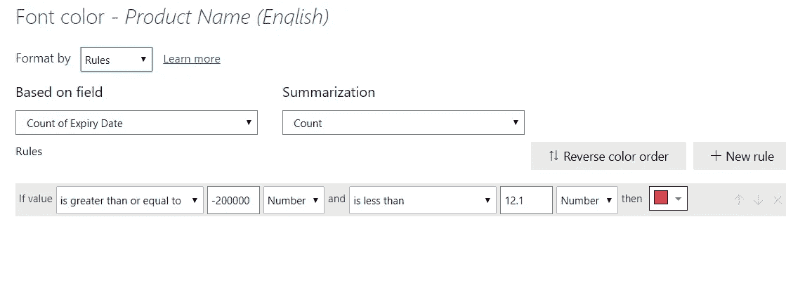
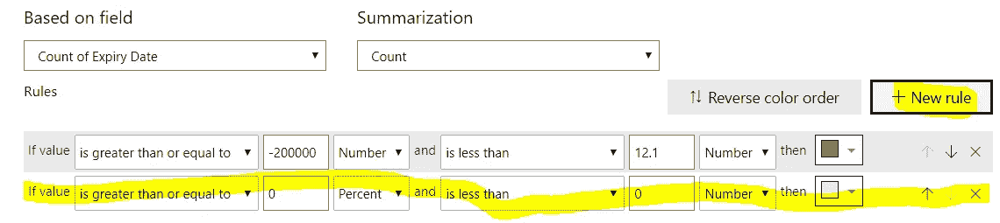

# 如何根据您设置的条件在 Power BI 中强调数据

> 原文：<https://medium.com/analytics-vidhya/how-to-emphasize-data-in-power-bi-according-to-the-conditions-you-set-165024bb95c7?source=collection_archive---------22----------------------->

在数据可视化世界中，我们所有人都试图使用图表、形状和颜色来使数据更具可读性。在 Power BI 中，我们可以在特殊情况下使用颜色数据来强调我们想要关注的点。

丰富多彩地强调

# 定义条件

对于这个可视化，我们需要做的第一件事是定义条件。从设置开始，我们可以决定使用前颜色或背景颜色来呈现可视化。选择条件格式，选择要显示的数据，并选择前色或背景色作为主题。

点击高级控制，我们可以接触到控制面板。在该面板中，我们可以按规则、值或其他选择格式。如果我们使用值格式，它将根据特定列中的值显示颜色。如果我们使用规则，那么我们可能需要设置规则，这就像我们在 excel 中所做的一样。规则由 AND/OR 条件构成，边界由值或百分比设置。

选择我们想要强调的字段，并阐明我们使用“计数”或“非重复计数”作为计算基础的方法。这是一个非常简单的技巧，可以根据条件用不同的颜色显示数据。这也有助于观众以一种简单的方式阅读你的数据，并在短时间内理解你的观点。

同时，你可以设置第二个规则，使一个更复杂的有条件地强调你主要关注的数字。请注意，规则中只有逻辑“和”，您需要根据限制调整您的数字。例如，您想用红色显示那些小于 12 的数据，但是您发现在您的数据集中有许多负数据，您需要考虑这些数据。因此，我们使用逻辑来显示大于-20，000 且小于 12 的数据，我们可以考虑数据集的特征并实现我们的预期。

空白值也可用于条件目的。例如，我们想用红色标记所有的空白值，我们可以将这两个条件都设置为“是空白的”,并使用 and 来连接它们。尝试将不同的规则结合起来，你就能以一种非常有效的方式让你的表格向利益相关者展示信息。不要错过这个功能，以改善您的数据可视化。

