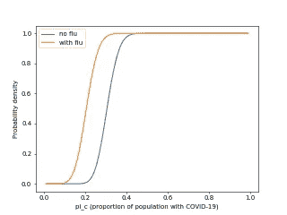
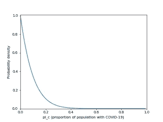
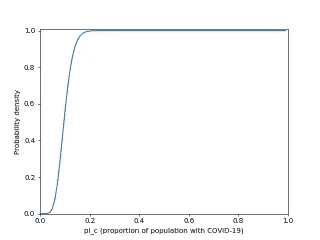
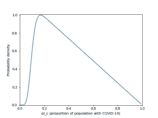
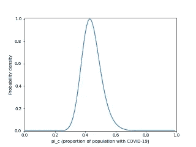
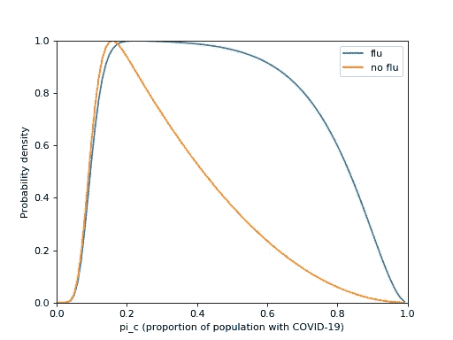
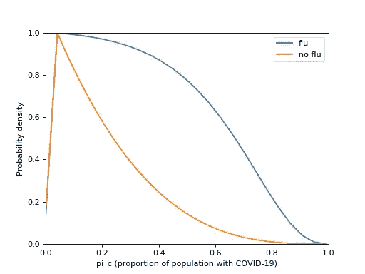

# 如何估计新冠肺炎病例的真实数量

> 原文：<https://medium.com/analytics-vidhya/how-to-estimate-the-true-number-of-covid-19-cases-63838529a4cc?source=collection_archive---------14----------------------->

随着测试在美国的增加，我们开始面临的一个主要问题是:**我们如何使用这些测试的结果来估计感染新冠肺炎病毒的人口的实际比例**？由于几个原因，这些信息是至关重要的，其中最紧迫的原因是确定在未来几天和几周内需要提供的 ICU 床位数。本文提出了一个简单但强大的贝叶斯模型，用于估计人群中受感染个体的比例，仅给定(1)实施的测试数量，(2)阳性测试结果的数量，以及(3)可进行测试的人群规模。

**免责声明:**这篇文章的目的是开发一个简单但可扩展的模型，在给定这三条信息的情况下，获得受感染个体比例的估计值。这意味着，根据定义，将会有简化的假设，其中许多可以通过以相当直接的方式扩展模型来放松。我们发布了用于生成所有结果的代码，希望人们可以在这个模型的基础上加入更现实的、数据驱动的假设。

# 简单的例子

让我们用一个简单的例子来说明这个问题的重要性。为了简化计算，假设纽约市有 1000 人接受了新冠肺炎病毒检测，其中 100 人呈阳性。这能告诉我们城市中受感染个体的真实比例是多少？我们是否可以说，根据这一有限的样本，预计受感染的个人比例是该市人口的 10%?这取决于这些人是如何被测试的。如果 1000 个人被随机拦在街上，并且城市的所有人都可以平等地使用测试设施，那么 10%是一个合理的估计。然而，这与我们现在的情况相去甚远。

由于检测的短缺，美国的每个城市只允许对那些表现出新冠肺炎症状的人进行**检测，也就是说，检测不是随机进行的。但是并不是每一个有新冠肺炎症状的人都有这种病毒——事实上，新冠肺炎的症状实际上与流感的症状相同。此外，并不是每个有症状的人都要接受检测。但是，尽管有这些复杂因素，我们还能希望估计出新冠肺炎患者的比例吗？总而言之，我们必须纳入模型的关键约束如下:**

*   测试只对有症状的人进行
*   新冠肺炎和流感的症状是一样的
*   不是每个有症状的人都接受新冠肺炎测试

# 仅仅是检测次数就能告诉我们一些关于新冠肺炎感染率的信息吗？

为了有助于在本文后面逐步建立一个更复杂的模型，让我们假设我们只知道两件事:

*   进行新冠肺炎试验的次数
*   参加测试的人口规模

换句话说，我们知道进行了多少次检测，但不知道这些检测是否对新冠肺炎呈阳性。在不知道有多少新冠肺炎病毒检测结果呈阳性的情况下，希望估计新冠肺炎病毒携带者的比例似乎有些荒谬。如果这些测试是随机进行的，那就有可能了。然而，正如我们之前所说的，这些测试只针对出现流感样症状的人，这些症状至少部分归因于新冠肺炎。现在让我们假设一下，这些类似流感的症状可能**只**是由新冠肺炎引起的，而不是其他疾病。假设有 1000 人可以进行这些测试，其中 100 人进行了新冠肺炎测试。这能告诉我们关于新冠肺炎人口比例的任何信息吗？答案是肯定的——它告诉我们**至少有 10%的人口患有新冠肺炎。在不知道哪些测试是阳性的情况下，我们已经可以获得一条非常有用的信息——感染率的下限！**

让我们更进一步。我们知道，流感样症状并不一定意味着一个人患有新冠肺炎。这也可能意味着他们只是得了流感。让我们做一个简单的假设，流感样症状只能归因于新冠肺炎或流感。由于在一年中的任何给定时间，患流感人口的比例是历史上经过充分研究的统计数据，并且没有理由认为现在与以前有任何不同，我们可以在我们的模型中使用这些信息。例如，如果我们假设在任何给定时间都有 10%的人口患有流感(仅作为一个例子)，我们之前对新冠肺炎比例下限的估计会如何变化。也许你可以自己解决这个问题，但让我们现在开始着手建立我们的模型，正式纳入流感感染的预期比例，并进行后验推断，以找到答案。然后，这个模型将允许我们在以后合并观察到的测试结果(除了观察到的测试数量之外)，而结果不再能够用纸和笔获得。

# 模型 1:忽略测试结果

如果我们假设流感样症状只能来自新冠肺炎或流感，我们希望对以下概率分布进行建模:

三个变量*症状*(个人是否有类似流感的症状？)、*流感*(个人有没有流感)和 *covid* (个人有没有新冠肺炎)是二元变量。我们可以灵活地将概率分配给这种分布，例如，根据观察在任一种疾病出现症状的可能性的历史数据。由于这篇文章的目的是为了说明模型，我们将进一步简化假设，并说如果个人患有**流感或**新冠肺炎，他将有 100%的概率出现流感样症状，本质上使上述分布具有确定性。这并没有失去任何一般性，因为这种概率分布可以很容易地扩展到模拟更多的疾病及其各自诱发症状的可能性。请告诉我们，写下包含每种疾病病史的联合分布:

注意，从现在开始，为了简洁起见，我们将使用缩写 *s* (症状)*、f* (流感)*、c* (新冠肺炎)。在上述模型*中，p_f* 和 *p_c* 分别代表流感和新冠肺炎的先验概率参数(即，它们对各自的伯努利分布进行参数化)。请注意，这些概率对应于患有这些潜在疾病的人群的预期比例，因此我们可以这样解释它们。上述模型中的一个关键假设是，患流感的概率和新冠肺炎是独立的。在实践中，这可能不完全正确，因为例如，易于感染的人或老年人可能更有可能同时感染这两种疾病。这种依赖性也可以合并到模型中，但是在我们的例子中会被忽略。

**注意:**区分**感染**疾病(如流感或新冠肺炎病毒)的概率和从人群中随机抽取的人已经**患病的概率是很重要的。这些通常不会相同。在我们的模型中，我们对后者感兴趣。**

请注意，如果我们在上述模型中执行后验推断，我们的后验将有效地成为这些比例的点估计，因为 *f* 和 *c* 都是伯努利分布的二元变量。由于我们还希望直观显示估计人口比例的不确定性，我们还将包括新冠肺炎人口比例的先验信息:

新冠肺炎感染者比例的先验分布是一个[0，1]区间上的连续分布。由于感染流感的比例( *p_f* ) 是可以从历史数据中估计出来的，我们以这个比例的点估计为条件(我们在本文后面对 *p_f* 进行粗略估计)。同时，我们可以将新冠肺炎的比例设定为基本上无信息的先验。请注意，根据似然函数，有多种方法来指定无信息先验，但为了说明，我们将简单地使用[0，1]区间上的均匀分布，它指定新冠肺炎的所有比例都是同等可能的。

为了简化联合分布，让我们将二元变量 *flu* 和 *covid* 边缘化。这样做可以得到以下分布:

为了便于说明，上述联合分布是针对出现症状的情况进行评估的( *s=1* )。结果非常直观——当个人患有流感或新冠肺炎时，症状就会出现。

**后验新冠肺炎病例的比例超过**

如果对个体进行随机测试，并且我们观察到被测试者中的哪一个有症状，我们将可以安全地使用我们之前导出的似然函数(症状的似然性)对我们的观察结果(独立同分布)进行独立同分布假设:

然而，如前所述，我们不能对个体进行 i.i.d .假设，因为那些接受测试的人不是随机选择的；只有那些有症状的人才会接受测试。因此，我们要做的是对测试次数形成一个似然，并使用观察到的测试次数来获得新冠肺炎在总体中所占比例的后验概率。

请记住，只有当个体出现症状时，才会进行测试。在理想世界中，可以进行无限的测试，在一个群体中完成的测试数量就是那些表现出症状的人的数量。在我们目前的情况下，情况远非如此，因为测试的数量有限。这意味着如果进行 100 次测试，人群中有症状的人数至少是 100。但是很可能有 200 或 300 或更多的人有这些症状却从未被检测过。这意味着，当我们观察给定数量的人群测试时，我们实际上是在观察人群中症状数量的下限。我们可以用二项式分布的边际来形式化这个问题( *k =头数=症状数，N =试验次数=人口规模:*)

其中 *N_s* 是有症状的人数(随机变量)， *N_t* 是实施(观察)的测试次数， *N_p* 是可以进行测试的人口数量。我们现在可以对患有新冠肺炎的人口比例进行后验推断:

为了使得到的后验概率易于可视化，让我们假设可以访问测试的人口是 100 人( *N_p* = 100)，管理的测试数量是 30 ( *N_t* = 30)。首先，让我们将患流感的人数比例设为 0 ( *p_f =* 0.0)。在进行推断后，后验概率超过新冠肺炎个体的比例如下:

后验密度

以上密度告诉我们，患有新冠肺炎的人口比例**至少是 30%** 。这当然是有意义的，因为我们的模型假设症状只能由新冠肺炎或流感引起，患流感的人口比例为 0.0。由于只有具有症状的个体接受测试，并且在 100 人中进行了 30 次测试，这意味着至少 30%的人患有新冠肺炎。我们不需要看后面就知道会是什么结果。

现在让我们假设，在任何给定的时间，10%的人口患有流感( *p_f =* 0.10)。再次进行后验推断，我们得到以下后验超过新冠肺炎个体的比例:

后验密度

也许正如所料，我们看到，当我们假设 10%的人口患有流感时，验后法现在告诉我们，新冠肺炎患者的预期比例至少为 20%(低于 30%)。这又一次是直觉和预期的——因为我们不能再期望每个检测的人都有新冠肺炎，因为检测是在一个人患有流感或新冠肺炎时进行的。注意，正如所料，后验概率没有告诉我们任何关于新冠肺炎病例比例上限的信息；为此，我们需要知道那些测试的结果。

# 模型 2:整合测试结果

我们现在想要扩展上面的模型来包含测试结果。我们需要补充的是一个人测试呈阳性的可能性。新冠肺炎检测呈阳性的可能性只取决于他们是否感染了新冠肺炎病毒。我们可以用下面的概率来表示:

其中⊕是一个二进制随机变量，当这个人的新冠肺炎测试呈阳性时，它等于 1，否则等于 0。这个模型可以结合测试的敏感性和特异性。然而，在不失一般性的情况下，为了简化对模型的说明，我们将确定性地对此进行建模:如果个体感染了新冠肺炎病毒，则测试为阳性，如果他们没有感染，则测试为阴性。

当我们将阳性测试的可能性合并到上面的联合可能性中时，我们得到以下结果:

和以前一样，我们可以通过对二元变量 *f* 和 *c* 进行积分来简化上述过程。边缘化后，最终的联合分布如下:

这种分布模拟了一个人有症状(或无症状)且新冠肺炎检测呈阳性(或检测呈阴性)的概率。注意，上面的分布有一个非常直观的解释:

*   出现**症状**且新冠肺炎检测**为阴性**的概率是个人在患流感时**没有**感染新冠肺炎的概率
*   出现**症状**且新冠肺炎检测**呈阳性**的概率是个人患有流感或同时患有流感和新冠肺炎的概率。
*   没有症状的概率是个人既没有流感，也没有新冠肺炎病毒的概率。

由于我们仅有的观察值是测试数量和阳性测试结果数量的总数，我们需要推导出这些数量的分布，以使合并这些观察值变得简单明了。我们可以将上述联合分布解释为这 4 个互斥结果的分类分布。因此，我们可以使用多项式分布来模拟这些结果的总计数:

为了使表达式更具可读性和可解释性，我们进行了以下变量替换:

其中 *N_* ⊕是出现症状和感染新冠肺炎的总人数(我们不知道这个数字，因为不是所有人都接受了检测)， *N* _⊖是出现症状和没有感染新冠肺炎的总人数(同样，我们也不知道这个数字)， *N_s* 是出现症状的总人数(即， ⊕+_⊖=*n _ s*)(我们也不知道这一点，因为不是所有有症状的人都参加测试)和 *N_p* 是可以参加测试的人口数量(包括那些没有参加测试的人)。 这允许我们重新表达我们的多项式分布如下:

回想一下，我们实际上既不知道 *N_* ⊕， *N* _⊖，也不知道 *N_s* ，因为我们没有测试人群中所有有症状的个体。然而，我们确实知道一些关于这些计数的信息，即*n _*⊕+*n*_⊖=*n _ s>n _ t*其中 recall *N_t* 是在总体中进行的测试的总数。因此 *N_t* 和 *N_p* 是我们的例子*中仅有的观察变量。*与我们之前的简单模型一样，我们可以通过多项式分布的边际来表达这一观察结果:

其中 *N_t、* ⊕和 *N* _ *t* ,⊖分别为被观察的**新冠肺炎阳性和阴性的总人数。我们可以使用这个观察似然，结合 *p_c* (新冠肺炎人口比例)的先验分布，获得 *p_c* 的后验概率:**

**注:**由于我们有兴趣估计截至目前感染新冠肺炎**的个体比例，因此获得这些测试的时间窗口必须足够短，以确保一些被测试者还没有时间康复，这一点至关重要。如果获得这些计数的时间窗口太长，所获得的人群感染比例的估计将不再准确地反映现在感染的比例，因为许多被测试的人将已经康复。由于测试是最近开始的(大约两周前)，这在流感和新冠肺炎的潜伏期和恢复期的范围内，我们可以认为感染比例的估计值接近此时的真实比例。**

**注:**重要的是，我们也没有对测试进行期间病毒在人群中传播的速度进行建模。这也可以纳入模型。

# 模拟

**实施注意事项:**由于问题是低维的，我们使用简单的求积进行推理。虽然在某些情况下仍然很慢，但其优点是推断准确。

为了说明模型的一般行为，考虑极端或接近极端的状态是有用的。下面我们给出了一些有趣的新冠肺炎检验体系中的模型后验概率的例子。

**示例 1:少量测试，全部为阴性**

假设在一个 100 人的群体中，有 10 个人接受了新冠肺炎测试，所有人的 T42 测试都是阴性的。让我们还假设流感在一般人群中非常罕见，即 *p_f* 非常小。这种状态的后验概率如下:

这是意料之中的:由于只对有症状的人进行检测，而新冠肺炎检测结果全部为阴性，因此新冠肺炎病例在人群中的后验概率较低。

现在，如果流感在人群中更加普遍会发生什么？将 *p_f* 的值增加到 20%,我们得到以下新冠肺炎感染比例的后验概率:

乍一看，这似乎很不直观。该模型现在认为新冠肺炎更有可能出现在人群中，尽管事实上流感现在更加普遍，尽管事实上所有的新冠肺炎测试都是阴性！这是怎么回事？

这又归结到一个事实，即个体不是随机测试的。在大量存在流感的人群中，那些有症状的人(以及那些被检测的人)更有可能患流感，而不是新冠肺炎。因此，这些测试提供的有关新冠肺炎的信息少得多，导致新冠肺炎流行率估计值的差异较大。

**例 2:少数检测结果为阳性**

现在假设在 100 人中，有 10 个人接受了新冠肺炎测试，所有人的 T4 测试都呈阳性。让我们再次假设流感在一般人群中非常罕见，即 *p_f* 非常小。由于只有有症状的人接受测试(而且流感很罕见)，我们预计至少有 10%的人感染了新冠肺炎病毒。

请注意，除此之外我们不能说什么，因为有症状的个体数量可能大于进行测试的数量。这种政体中的后验反映了这种直觉:

请注意，当您第一次查看测试结果并看到所有测试结果实际上都是正面的(如本例所示)时，这可能看起来并不完全直观。人们可能会认为后验概率应该反映这一点，类似于前一个例子中所有测试都是阴性的情况，后验概率在 0 附近达到峰值。为什么不对称？为什么这个后验概率不是在 100%的人群患有新冠肺炎时达到峰值，而是在所有测试结果都为阴性时达到峰值？

观察到的不对称性再次归结为这样一个事实，即个体不是随机测试的。由于测试只对有症状的人进行(在我们的第一个例子中，流感被认为是罕见的)，接受测试的人很可能患有新冠肺炎。但是由于在第一个例子中每个测试结果都是阴性的，尽管那些被测试的人很可能患有新冠肺炎，该模型使用该信息作为一个强信号来正确地更新其信念，即新冠肺炎肯定是罕见的。

另一方面，如在这个例子中，当模型观察到那些被测试者，所有被测试者对新冠肺炎呈阳性时，这些观察结果已经与先前的一致，并且除了说明至少 10%的人口必须患有新冠肺炎之外，不能用于更新模型的信念。

**示例 3:少量测试，混合阳性+阴性**

现在让我们扩展前面的例子，在 10 个已经呈阳性的病例中引入一个阴性测试。后路在下面:

后验概率现在正确地解释了患有新冠肺炎的人口比例不再是 100%的事实。增加一个阴性测试(10 个阳性，总共 2 个阴性):

请注意，正如预期的那样，后部现在对新冠肺炎的较高比例施加较小的质量。

这可能又显得有些不直观。只看测试结果(10 个阳性，2 个阴性)，我们可能会预计人口中新冠肺炎感染的估计比例在 80%左右。然而，上述后验众数约为 20%，这是一个非常大的差距。这怎么可能呢？

在我们开始讨论之前，让我们看下一个例子，在这个例子中，测试的数量增加了，而阳性测试与阴性测试的比例保持大致相同。我们将在下一个例子中回到这个问题。

**例子 4:许多测试，混合阳性+阴性**

假设在 100 次测试中，80 次是阳性，20 次是阴性。阳性测试的比例为 80%，与上例大致相同。请注意，在下面的后视图中，模式现在正好是 80%。

现在假设在 100 次测试中，40 次是阳性，10 次是阴性。阳性检测的比例也是 80%。后路在下面:

请注意，该模式现在约为 40%。

尽管阳性和阴性检测结果的比例保持不变，但估计患有新冠肺炎的人口比例在 20%至 80%之间，我们如何解释这一事实？

这又一次归结到一个事实，即考试不是随机进行的。例如，如果测试是随机进行的，那么我们确实期望被测试者中观察到的阳性新冠肺炎测试分数是人群中新冠肺炎病毒真实比例的无偏估计。然而，当只对有症状的人进行检测时，我们预计在被检测者中发现阳性新冠肺炎病例的可能性会更高。这意味着，当检测次数少于人口规模时，相对于整个人口而言，新冠肺炎阳性病例在被检测者中的比例将会过高。因此，考虑到这一点的模型(我们的模型确实考虑到了这一点)所产生的后验估计值将会得出新冠肺炎病例在人口中所占比例低于仅在接受测试的人群中所占比例的估计值。

如果流感在人群中更加流行，会发生什么？让我们回到之前的例子，在 100 人中，有 8 人测试呈阳性，2 人测试呈阴性。除了流感非常罕见的情况(我们在前面的例子中举例说明)，让我们考虑流感现在占人口 10%的情况:

橙色曲线是之前流感罕见的结果。蓝色曲线是后验假设流感是 10%的人口，但具有相同数量的测试结果:8 个阳性和 2 个阴性。这告诉我们什么？

当我们知道流感非常罕见时，我们预计每个接受检测的人基本上都已经感染了新冠肺炎。因此，该模型预计，在接受测试的人群样本中，新冠肺炎的比例会非常高。这意味着，即使观察到两个负值，也会给模型一个强烈的信号，表明新冠肺炎一定很罕见。这就是为什么后部非常尖锐，并在新冠肺炎的 20%左右达到顶峰。现在，当我们知道流感实际上相当流行时，该模型不再能确定那些被测试的人是因为新冠肺炎而被测试的；许多接受测试的人现在接受测试，因为他们患有流感。因此，该模型对新冠肺炎比例的估计变得非常不可信，这反映在后验方差较高。

# 纽约市新冠肺炎案例研究

现在，让我们使用来自纽约市的真实世界测试数据，尝试运行该模型的后验推断。但首先，声明如下:

**免责声明:**虽然我们将使用真实的统计数据来统计接受检测的人数和新冠肺炎阳性检测的人数，但出于说明的目的，还有其他一些近似的参数。这些因素包括:人口中流感病例的比例、新冠肺炎测试(或多种测试，因为有几种测试)的特异性/敏感性、出现新冠肺炎感染症状的可能性、接受测试的人口规模(我们将使用纽约市的人口作为近似值)以及可能存在的其他因素。然而，当试图在实践中部署该模型时，这些并不是交易破坏者，因为有获得这些参数的更准确版本的方法。

CDC 报告称，在美国，流感每年导致大约 900 万到 4500 万人患病[1]。这个范围可以通过先验纳入我们的模型，但由于我们当前的模型依赖于流感病例比例的点估计，我们将使用 2500 万作为这个点估计。然而，我们对一年的病例总数不感兴趣。我们的模型需要知道在新冠肺炎测试进行期间感染流感的一小部分人口。为简单起见，让我们假设大部分新冠肺炎病毒测试发生在过去的一个月，并以 2500 万/12 个月的时间来估算这段时间内的流感病例总数，按美国人口进行标准化(这给出了 *pi_f* = 0.6%)。

为了比较，我们还将假设流感很少发生来进行推断(将 *pi_f* 设置为接近 0)。下面是得到的两个后验分布:

正如我们所看到的，对流感在人群中的流行进行建模会对后验概率产生重大影响。当模拟流感时，为什么新冠肺炎的更高比例上有更多质量的原因与我们在上面的示例 1 中给出的原因相同。当模型预计更多的人在开始时被检测为阴性时，新冠肺炎检测结果为阴性的信息较少，因为流感，而不是新冠肺炎病毒，现在可以导致一些人接受检测。

现在让我们试着回答这个关键问题:**关于新冠肺炎在人口中的比例，我们能说些什么？**下面我们计算后验概率的累积分布函数(CDF ),它给出了新冠肺炎患者的比例低于某个阈值的概率。

从上面的 CDF 中，我们可以看到，在 95%的置信度下，我们可以得出结论，小于或等于大约 74%的人口(可以进行这些测试)患有新冠肺炎。但是，请记住，只有当我们对模型及其参数有信心时，这种信心才成立，正如我们前面所说，这些参数主要是为了说明模型的行为而进行的粗略估计和近似。这一结论并不意味着作为可信的实际估计，而是作为一个例子，说明如果模型参数化准确，如何得出这一结论。

# 怎样做才能让模型更确定？

不幸的是，上述估计过于宽泛，无法提供太多信息。这是一个有趣的问题，想象如果测试次数增加后验概率会如何变化。当然，我们无法知道当测试次数增加时，阳性测试结果的比例会是多少。然而，仅仅为了说明其效果，我们可以做一个简单的假设，即阳性测试结果的比例保持不变。如果测试次数增加三倍，后验概率如下:

这再次说明了由测试的非随机管理导致的结果的不直观性，并强调了建模的重要性。即使阳性检测结果的比例保持不变，将检测次数增加两倍也会导致对新冠肺炎感染比例的估计大约是之前估计的一半！

另一种减少后验方差的方法是在人群中进行一定数量的**随机测试**。为什么只对有症状的人进行检测的最初原因是因为只有有限数量的检测，并且这些检测必须有效地分配，以便可以快速识别新冠肺炎患者。然而，即使进行少量的随机测试，也有可能实际上显著提高我们对新冠肺炎流行程度的估计质量，从而在帮助规划应对措施的后勤工作时提供更多信息。这甚至可以在**群体水平**进行，在那里来自多个个体的样本被混合在一起——这最小化了测试的数量，同时仍然有可能达到人群水平的患病率的估计。

**重要提示:**你可以观察到在新冠肺炎比例约为 5%的分布中出现一个模式。这不是一个真正的模式，而是一个具有稀疏支持网格的人工制品，在该网格上执行推理(沿着[0，1]区间的 25 个点)。这种稀疏网格的原因是在群体较大的情况下推断时间较长(因为必须在较大的支持上进行求积)，如本例所示。推理时间可以通过基于 MCMC 的推理或通过各种后验概率的近似来提高，这两种方法都超出了我们的探索范围。为了加快推断速度，我们将观察到的计数(人口和阳性/阴性测试结果的数量)放大了 3，000 倍。这具有使后验不那么“尖锐”的效果，但是总体上保持了分布的一般形状。我们希望对探索这个模型感兴趣的人可以为这个模型开发更有效的推理算法，这样它就可以在不缩减输入的情况下运行。

# 结论

我们此次探索背后的主要目标是提出一个简单而实用的模型，仅依赖于管理测试的统计数据以及流感流行的统计数据，该模型可用于帮助理解整个人群中新冠肺炎感染的规模。这里的主要要点应该是，估计这个比例并不简单，而且结果通常也不直观，所以在对测试过程建模时必须小心。主要目的是引入一个实用的模型，而不是获得对新冠肺炎感染现状的准确估计。要在实践中使用它，需要用以下更精确的估计值对模型进行参数化:

*   在新冠肺炎病毒检测期间，导致流感样症状的流感发病率和其他疾病的比例
*   能够进行测试的人群规模
*   新冠肺炎试验的敏感性和特异性

请注意，该模型可以很容易地扩展到包括流感以外的其他疾病，只要我们可以依赖于他们在人群中的倾向估计。给定上述的精确估计，该模型可以应用于广泛的人群，从局部地区，到州，到整个国家。

我们真诚地希望这一模型能够对那些肩负着动员必要资源(如 ICU 床位)以应对危机并最终最大限度地减少不必要死亡的关键任务的人有用，至少作为一个额外的参考点。

# 密码

[https://github . com/igorlabutov/贝叶斯-模型-新冠肺炎-比例](https://github.com/igorlabutov/bayesian-model-covid-19-proportion)

# 联系我们

如果您有任何问题或意见，请联系我们:

*   **伊戈尔·拉布托夫**:伊戈尔.拉布托夫@莱尔.艾
*   **毕善阳:**毕善阳@laer.ai

我们期待您的反馈。

