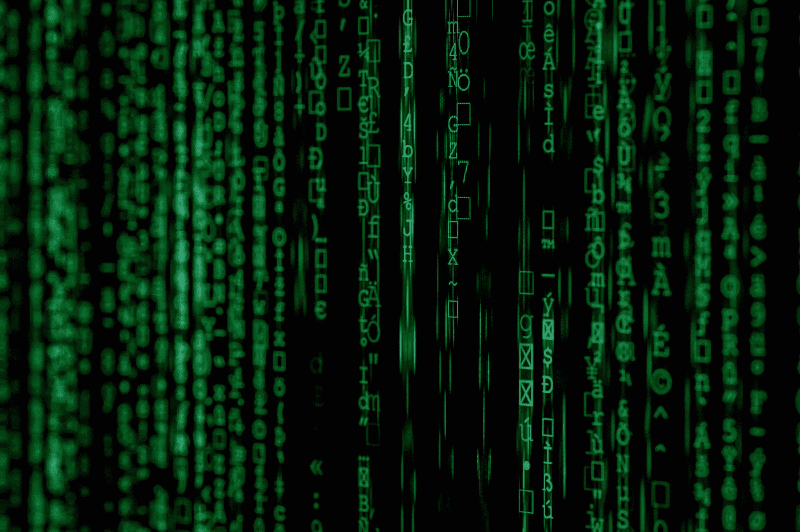

# 如何通过机器学习挖掘原始数据获取有用信息

> 原文：<https://medium.com/analytics-vidhya/how-to-explore-raw-data-to-get-useful-information-by-machine-learning-2ba1d87c89bd?source=collection_archive---------18----------------------->

一些有用的数据探索技巧和诀窍

首先从各种来源收集原始数据，原始数据可以在互联网上找到，只需收集并输入你的系统。

在您的系统中设置原始数据后，在应用任何操作之前，请始终对原始数据进行分析，并尝试在您的脑海中使**完整的管道**首尾相连，然后继续前进。

每个数据科学家将面临的第一个挑战是杂乱的数据。杂乱数据是指格式不正确且包含缺失值的数据。所以首要任务是处理这些**缺失值**，有各种方法来处理这些缺失值。**方法:1**

处理完缺失数据后，下一个挑战是关于异常值的。**异常值**是我们的数据集中存在的一些异常数据，因此我们也需要将其移除，这是一个名为特征工程的领域。

**特征工程** - >这是一项研究如何让我们的整个数据集更有用，而没有任何离群值。因此，有各种类型的技术来消除离群值。我们可以用**均值和标准差法、z-score 法等去除异常值。**

完成前面的所有步骤后，我们的数据将变得更加清晰，这完全取决于个人的技能。

**可视化** - >这是以图形方式理解数据的最佳方式，python 中有许多库，例如 **matplotlib 和 seaborn。**

现在，在分析了所有数据之后，我们的数据已经为**机器学习**做好了准备。

在开始使用机器学习算法之前，我们必须将我们的数据集分成**训练测试**，以便我们可以在训练中使用数据集的一部分，其余部分将用于测试我们的模型。python 中有多种分割数据集的方法。

拆分数据后，您可以使用 python 中的 Sklearn 模块来加载机器学习算法。在加载算法之前，我们需要了解我们的**输出**是**回归**类型还是**分类**类型。

如果您的输出是回归类型，则使用**线性回归**等。

如果您的输出是分类类型，则使用**逻辑回归**、**随机森林、**等。

决定之后，你可以用交叉验证技术验证你的模型，然后决定你的最终模型。

确定最终模型后，您可以将训练数据放入模型中进行训练。

然后你可以**预测**并检查**的准确性**。你可以借助**混淆矩阵**来检查你的模型的工作情况。

***所以这是一个端到端数据分析、数据可视化、训练数据，以及用机器学习算法进行预测的例子。***

**你如何看待机器学习技术在数据科学领域的应用？？**